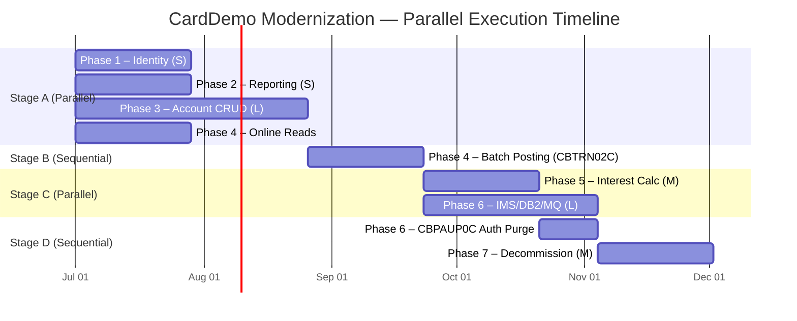

# CardDemo COBOL-to-Java Cutover Plan

> **Modernization Strategy:** Strangler Fig — incrementally replace COBOL/CICS modules with Spring Boot microservices, routing traffic through Spring Cloud Gateway until the mainframe is fully retired.
>
> **Target Stack:** Spring Boot 3 · React · PostgreSQL · Spring Cloud Gateway · Kafka · Spring Batch

---

## Table of Contents

- [1. Executive Summary](#1-executive-summary)
- [2. Phase Definitions](#2-phase-definitions)
  - [Phase 1 — Identity & Access Management](#phase-1--identity--access-management)
  - [Phase 2 — Reporting & Statements](#phase-2--reporting--statements)
  - [Phase 3 — Account & Customer CRUD](#phase-3--account--customer-crud)
  - [Phase 4 — Transaction Processing](#phase-4--transaction-processing)
  - [Phase 5 — Interest Calculation & Billing Batch](#phase-5--interest-calculation--billing-batch)
  - [Phase 6 — IMS/DB2/MQ Components](#phase-6--imsdb2mq-components)
  - [Phase 7 — Decommission Legacy](#phase-7--decommission-legacy)
- [3. T-Shirt Size Estimates](#3-t-shirt-size-estimates)
- [4. Phase Parallelism & Sequencing](#4-phase-parallelism--sequencing)
  - [4.1 Parallel Group 1](#41-parallel-group-1)
  - [4.2 Sequential Critical Path](#42-sequential-critical-path)
  - [4.3 Conditional Parallelism](#43-conditional-parallelism)
  - [4.4 Net Timeline Compression](#44-net-timeline-compression)
  - [4.5 Recommended Execution Timeline (Gantt)](#45-recommended-execution-timeline-gantt)
  - [4.6 Phase Dependency Table](#46-phase-dependency-table)
- [5. Rollback Strategy](#5-rollback-strategy)
- [6. Success Criteria](#6-success-criteria)

---

## 1. Executive Summary

The CardDemo mainframe application comprises **31 COBOL programs** (17 online CICS, 14 batch), **30+ copybooks**, and **7 VSAM datasets**. This plan decomposes the migration into seven phases, each targeting a bounded context. Phases are ordered by coupling — low-risk, isolated services first; high-complexity, tightly-coupled batch last.

Key metrics:
- **Total COBOL LOC:** ~25,000
- **Programs migrated:** 31
- **VSAM datasets replaced:** 7 (USRSEC, ACCTFILE, CUSTFILE, CARDFILE, XREFFILE, TRANSACT, TCATBALF)
- **Estimated duration:** 10–14 sprints (with parallelism: 7–9 sprints)

---

## 2. Phase Definitions

### Phase 1 — Identity & Access Management

| Attribute | Detail |
|-----------|--------|
| **Scope** | User authentication and user CRUD |
| **COBOL Programs** | `COSGN00C`, `COUSR00C`, `COUSR01C`, `COUSR02C`, `COUSR03C` |
| **VSAM Dataset** | `USRSEC` (record layout `CSUSR01Y`, 80 bytes) |
| **Target Service** | User Service (Spring Security + JWT) |
| **Data Migration** | USRSEC → `users` table; passwords hashed with bcrypt |
| **Key Risk** | Session model change: CICS pseudo-conversational → stateless JWT |
| **Exit Criteria** | All user management screens functional in React; JWT auth validated end-to-end |

### Phase 2 — Reporting & Statements

| Attribute | Detail |
|-----------|--------|
| **Scope** | Batch statement generation and online report viewing |
| **COBOL Programs** | `CORPT00C` (online reports), `CBSTM03A` / `CBSTM03B` (batch statement generation) |
| **VSAM Datasets** | Read-only from `ACCTFILE`, `CUSTFILE`, `TRANSACT` |
| **Target Service** | Reporting Service (Spring Batch + PDF generation) |
| **Data Migration** | No owned datasets — reads from Account/Transaction services via API |
| **Key Risk** | Report format parity (EBCDIC fixed-width → PDF/CSV) |
| **Exit Criteria** | Statement generation produces identical output; report screens functional |

### Phase 3 — Account & Customer CRUD

| Attribute | Detail |
|-----------|--------|
| **Scope** | Account viewing, updating; customer data management |
| **COBOL Programs** | `COACTVWC` (view), `COACTUPC` (update — 4,236 LOC, highest complexity), `CBACT01C` (batch account file read), `CBACT02C` (batch account processing), `CBACT03C` (batch account output), `CBCUS01C` (batch customer processing) |
| **VSAM Datasets** | `ACCTFILE` (`CVACT01Y`, 300 bytes), `CUSTFILE` (`CVCUS01Y`, 500 bytes) |
| **Target Service** | Account Service (Spring Boot CRUD + Spring Batch) |
| **Data Migration** | ACCTFILE → `accounts` table; CUSTFILE → `customers` table |
| **Key Risk** | `COACTUPC` complexity (4,236 LOC); VSAM alternate index usage via `XREFFILE` |
| **Exit Criteria** | Account Balance API operational; account/customer CRUD parity verified |

### Phase 4 — Transaction Processing

| Attribute | Detail |
|-----------|--------|
| **Scope** | Online transaction views and batch transaction posting |
| **COBOL Programs** | `COTRN00C` (list transactions), `COTRN01C` (view detail), `COTRN02C` (add transaction), `COBIL00C` (bill payment), `CBTRN01C` (batch transaction read), `CBTRN02C` (batch transaction posting — writes `TCATBALF`), `CBTRN03C` (batch transaction output) |
| **VSAM Datasets** | `TRANSACT` (`CVTRA05Y`, 350 bytes), `TCATBALF` (transaction category balance file) |
| **Target Service** | Transaction Service + Billing Service (Spring Boot + Spring Batch) |
| **Data Migration** | TRANSACT → `transactions` table; TCATBALF → `transaction_category_balances` table |
| **Key Risk** | `CBTRN02C` batch posting writes `TRAN-CAT-BAL-RECORD` to `TCATBALF` — downstream dependency for Phase 5 |
| **Exit Criteria** | Online transaction screens functional; batch posting validated with balance reconciliation |

### Phase 5 — Interest Calculation & Billing Batch

| Attribute | Detail |
|-----------|--------|
| **Scope** | Interest calculation batch cycle |
| **COBOL Programs** | `CBACT04C` (interest calculation — reads `TCATBALF` sequentially, resets `CYC-CREDIT`/`CYC-DEBIT` at lines 353–354) |
| **VSAM Datasets** | Reads `TCATBALF`, writes `ACCTFILE` (interest posting) |
| **Target Service** | Account Service — Spring Batch interest calculation job |
| **Data Migration** | Business rules extracted from `CBACT04C`; disclosure group rates from `DISCGRP` |
| **Key Risk** | TCATBALF coupling — `CBTRN02C` writes `TRAN-CAT-BAL-RECORD`, `CBACT04C` reads it sequentially; cycle-reset zeroes `CYC-CREDIT`/`CYC-DEBIT` |
| **Exit Criteria** | Interest calculation produces identical results for test account portfolio; cycle reset verified |

### Phase 6 — IMS/DB2/MQ Components

| Attribute | Detail |
|-----------|--------|
| **Scope** | Authorization storage, fraud analytics, expired auth purge, MQ messaging |
| **COBOL Programs** | `CBPAUP0C` (expired authorization purge — adjusts available credit, writes `ACCTFILE`), IMS HIDAM authorization storage modules, DB2 `AUTHFRDS` fraud analytics, MQ queue integration |
| **Target Infrastructure** | PostgreSQL (replacing IMS HIDAM + DB2), Kafka (replacing MQ) |
| **Data Migration** | IMS segments → PostgreSQL tables; DB2 AUTHFRDS → PostgreSQL; MQ queues → Kafka topics |
| **Key Risk** | `CBPAUP0C` adjusts available credit and writes `ACCTFILE` — must wait for Account Balance API ownership from Phase 5 |
| **Exit Criteria** | Authorization lifecycle (create/query/purge) functional; fraud analytics queries migrated; MQ message flows replaced with Kafka |

### Phase 7 — Decommission Legacy

| Attribute | Detail |
|-----------|--------|
| **Scope** | Final cutover, mainframe decommission |
| **Activities** | Gateway routing flipped 100% to new services; CICS region shutdown; VSAM datasets archived; batch JCL retired; monitoring cutover |
| **Key Risk** | Undiscovered inter-system dependencies; data archival completeness |
| **Exit Criteria** | Zero traffic to mainframe for 30 days; all batch cycles running on Spring Batch; disaster recovery tested |

---

## 3. T-Shirt Size Estimates

| Phase | Description | Programs | Complexity | T-Shirt Size | Sprint Estimate |
|-------|------------|----------|------------|-------------|----------------|
| **1** | Identity & Access Management | 5 | Low | **S** | 1–2 sprints |
| **2** | Reporting & Statements | 3 | Low–Medium | **S** | 1–2 sprints |
| **3** | Account & Customer CRUD | 6 | High | **L** | 3–4 sprints |
| **4** | Transaction Processing | 7 | High | **XL** | 3–4 sprints |
| **5** | Interest Calculation & Billing Batch | 1 (+rules) | Medium | **M** | 2 sprints |
| **6** | IMS/DB2/MQ Components | 3+ | Medium–High | **L** | 2–3 sprints |
| **7** | Decommission Legacy | — | Medium | **M** | 1–2 sprints |

**Sizing key:**
- **S** (Small): ≤2 sprints, ≤5 programs, well-isolated data
- **M** (Medium): 2 sprints, moderate coupling or complex business rules
- **L** (Large): 3–4 sprints, cross-dataset dependencies or high-LOC programs
- **XL** (Extra-Large): 3–4 sprints, batch + online + cross-phase data coupling

---

## 4. Phase Parallelism & Sequencing

Not all seven phases must run sequentially. Careful analysis of data ownership, write coupling, and API dependencies reveals significant opportunities for parallel execution.

### 4.1 Parallel Group 1

These phases have **no shared writes** and can all start immediately:

| Phase | Rationale |
|-------|-----------|
| **Phase 1** (Identity) | `USRSEC` is isolated — no other phase reads or writes this dataset |
| **Phase 2** (Reporting) | Read-only access to `ACCTFILE`, `CUSTFILE`, `TRANSACT` — no write coupling |
| **Phase 3** (Account CRUD) | Wraps CICS reads and updates for `ACCTFILE`/`CUSTFILE`, but doesn't take `ACCTFILE` ownership away from batch yet |
| **Phase 4** online reads (`COTRN00C`/`COTRN01C`) | Transaction listing and detail views have no write coupling to other phases |

### 4.2 Sequential Critical Path

These dependencies **cannot** be parallelized:

1. **Phase 4 batch posting** (`CBTRN02C` rewrite) **DEPENDS ON** Phase 3 Account Balance API
   - `CBTRN02C` updates account balances during transaction posting; the new service must call the Account Balance API (delivered in Phase 3) rather than directly writing VSAM records.

2. **Phase 5** (`CBACT04C` interest calculation) **DEPENDS ON** Phase 4 batch being validated
   - **TCATBALF coupling:** `CBTRN02C` writes `TRAN-CAT-BAL-RECORD` to the transaction category balance file; `CBACT04C` reads these records sequentially to compute interest.
   - **Cycle-reset dependency:** `CBACT04C` zeroes `CYC-CREDIT`/`CYC-DEBIT` at lines 353–354 after interest posting. This reset must happen after all transactions for the cycle have been posted by `CBTRN02C`.
   - Both programs must agree on the new data model before Phase 5 can be validated.

3. **Phase 7** (Decommission) **DEPENDS ON** all phases complete
   - Cannot retire the mainframe until every service is live and all batch cycles are validated on the new platform.

### 4.3 Conditional Parallelism

| Component | Can Overlap With | Condition |
|-----------|-----------------|-----------|
| **Phase 6** IMS/DB2/MQ (authorization storage, fraud analytics) | Phase 5 | Uses independent data stores: IMS HIDAM segments, DB2 `AUTHFRDS` table, MQ queues — no write contention with `ACCTFILE` or `TCATBALF` |
| **Phase 6** `CBPAUP0C` (expired auth purge) | **Must wait for Phase 5** | `CBPAUP0C` adjusts available credit and writes `ACCTFILE`; must wait until Phase 5 establishes Account Balance API ownership to avoid dual-write conflicts |

### 4.4 Net Timeline Compression

Seven sequential phases compress to approximately **4 serial stages**:

| Stage | Phases | Type | Duration Estimate |
|-------|--------|------|-------------------|
| **Stage A** | Phases 1 + 2 + 3 + Phase 4 online reads | Parallel | 3–4 sprints (gated by Phase 3, the longest) |
| **Stage B** | Phase 4 batch posting (`CBTRN02C`) | Sequential | 2 sprints (requires Phase 3 Account API) |
| **Stage C** | Phase 5 + Phase 6 IMS/DB2/MQ work | Parallel | 2–3 sprints |
| **Stage D** | Phase 6 `CBPAUP0C` + Phase 7 decommission | Sequential | 2–3 sprints |

**Critical path reduction: ~30–35% vs. fully sequential execution**

- Fully sequential: 13–19 sprints
- With parallelism: ~9–12 sprints
- Savings: 4–7 sprints

### 4.5 Recommended Execution Timeline (Gantt)

### 4.6 Phase Dependency Table

| Phase | Can Start After | Can Run In Parallel With | Hard Blocker |
|-------|----------------|--------------------------|--------------|
| **Phase 1** — Identity | Project kickoff | Phases 2, 3, 4 (online reads) | None |
| **Phase 2** — Reporting | Project kickoff | Phases 1, 3, 4 (online reads) | None |
| **Phase 3** — Account CRUD | Project kickoff | Phases 1, 2, 4 (online reads) | None |
| **Phase 4** — Online Reads | Project kickoff | Phases 1, 2, 3 | None |
| **Phase 4** — Batch Posting | Phase 3 Account Balance API | Phase 4 online reads (if still in progress) | Phase 3 must deliver Account Balance API |
| **Phase 5** — Interest Calc | Phase 4 batch posting validated | Phase 6 IMS/DB2/MQ (non-CBPAUP0C) | Phase 4 `CBTRN02C` must be validated (TCATBALF data model) |
| **Phase 6** — IMS/DB2/MQ | Phase 4 batch posting validated | Phase 5 | None (independent data stores) |
| **Phase 6** — `CBPAUP0C` | Phase 5 completes | None | Phase 5 must establish Account Balance API ownership |
| **Phase 7** — Decommission | All phases complete | None | All phases 1–6 must be validated in production |

---

## 5. Rollback Strategy

Each phase uses the **strangler fig** pattern, meaning the legacy mainframe continues running in parallel until the new service is validated. Rollback at any phase:

| Scenario | Action |
|----------|--------|
| Service fails validation | Re-route gateway traffic back to CICS/batch for the affected bounded context |
| Data inconsistency detected | Halt dual-write sync; restore from last VSAM backup; replay missed transactions |
| Batch cycle discrepancy | Run legacy JCL batch in parallel for one additional cycle; compare outputs |
| Full rollback | Gateway routes 100% traffic to mainframe; new services remain deployed but idle |

---

## 6. Success Criteria

| Criterion | Measurement |
|-----------|-------------|
| **Functional parity** | 100% of COBOL program functions available in Java services |
| **Data integrity** | Zero data loss during migration; reconciliation reports clean for 3 consecutive batch cycles |
| **Performance** | Response times within 10% of mainframe baseline for online transactions |
| **Batch SLA** | Nightly batch window completes within existing SLA (typically 4-hour window) |
| **Zero downtime cutover** | Gateway routing switch with <1 minute of read-only mode |
| **Audit compliance** | Full traceability from COBOL source to Java service for each program |
