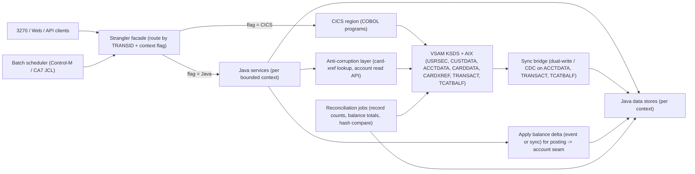

# CUTOVER_PLAN.md — CardDemo COBOL/CICS to Java Phased Cutover

Companion to `MODERNIZATION_BLUEPRINT.md` (target architecture), `DOMAIN_DECOMPOSITION.md` (bounded contexts) and `RISK_REGISTER.md` (risk IDs). Bounded-context names, program lists and file names are the shared ground-truth used by all four documents. Phase gates are cumulative: a phase cannot start until the previous phase has passed its acceptance criteria and has been in steady state for one full batch cycle (daily `POSTTRAN` + monthly `INTCALC`/`CREASTMT` where relevant).

## 1. Strangler-facade architecture

Every online transaction ID (CC00, CM00, CA00 ...) and every batch job entry point is fronted by a routing facade. Per-context feature flags decide whether a request is served by CICS or Java. During coexistence the VSAM master files remain the system of record until the owning context's phase completes; Java-side stores are kept in step by dual-write or CDC, and read APIs behind an anti-corruption layer (ACL) shield Java code from VSAM record layouts.


```mermaid
flowchart LR
  U["3270 / Web / API clients"] --> F["Strangler facade (route by TRANSID + context flag)"]
  F -->|"flag = CICS"| C["CICS region (COBOL programs)"]
  F -->|"flag = Java"| J["Java services (per bounded context)"]
  C --> V["VSAM KSDS + AIX (USRSEC, CUSTDATA, ACCTDATA, CARDDATA, CARDXREF, TRANSACT, TCATBALF)"]
  J --> P["Java data stores (per context)"]
  V --> S["Sync bridge (dual-write / CDC on ACCTDATA, TRANSACT, TCATBALF)"]
  S --> P
  J --> A["Anti-corruption layer (card-xref lookup, account read API)"]
  A --> V
  J --> E["Apply balance delta (event or sync) for posting -> account seam"]
  E --> P
  B["Batch scheduler (Control-M / CA7 JCL)"] --> F
  R["Reconciliation jobs (record counts, balance totals, hash compare)"] --> V
  R --> P
```

Routing granularity is per TRANSID for online and per JCL step (`EXEC PGM=`) for batch. Rollback for any phase is a flag flip back to CICS followed by the reconciliation steps listed for that phase.

## 2. Phase sequence

| Phase | Bounded context(s) | Value | Risk | Why here |
|:--|:--|:--|:--|:--|
| 0 | Foundations: facade, sync bridge, shared kernel (COCOM01Y, COMEN01C, date utils CSUTLDPY/CSUTLDWY/CSDAT01Y/CODATECN/CSUTLDTC, CSMSG01Y/CSMSG02Y, CSSETATY, CSSTRPFY, CSLKPCDY, COTTL01Y) | Enabler | Low | No business logic moves; harness proves routing and reconciliation |
| 1 | Security/Identity & Access | High (every session starts at COSGN00C) | Lowest | Single file USRSEC, no cross-domain writes, CRUD only |
| 2 | Customer | Medium | Low | CBCUS01C is a read/print batch over CUSTDATA; online reads via COACTVWC arrive with Phase 3 |
| 3 | Account Management + Card Management (read APIs first, then updates) | High | Medium | Read paths (COACTVWC, COCRDLIC, COCRDSLC, CBACT01C/02C/03C) first; COACTUPC/COCRDUPC after |
| 4 | Transactions + Bill Payment (posting and the Account-balance seam) | Highest | Highest | CBTRN02C non-atomic TCATBALF + ACCTFILE + TRANSACT update; COBIL00C cross-domain pay-in-full |
| 5 | Interest/Statements/Reporting | High | High | CBACT04C rewrites ACCTFILE; CBSTM03A ALTER/GO TO; consumers of Phase 4 stores |
| 6 | Data Export/Import + Optional/extension contexts | Low | Medium | CBEXPORT/CBIMPORT need every store migrated; Authorization (IMS/DB2/MQ), Transaction Type Mgmt (DB2), MQ inquiry |

## 3. Phase detail

### Phase 0 — Foundations (no business cutover)

| Item | Content |
|:--|:--|
| Programs | None migrated. Java equivalents of the shared kernel are built and unit-tested against COBOL outputs: COCOM01Y commarea mapping, COMEN01C menu routing, CSUTLDPY/CSUTLDWY/CSDAT01Y/CODATECN/CSUTLDTC date handling (only 19xx/20xx centuries valid, CSUTLDPY.cpy line 68), CSMSG01Y/CSMSG02Y messages |
| Data stores | None changed. CDC/dual-write plumbing installed on ACCTDATA, TRANSACT, TCATBALF (initially mirror-only, no consumers) |
| Bridges | Strangler facade with all flags = CICS; commarea (COCOM01Y) translation so a Java screen can hand off to a CICS program and back; reconciliation job framework |
| Rollback | Remove facade from the routing path; CICS untouched |
| Acceptance | Facade adds < 20 ms p95 to any TRANSID; 100% of TRANSIDs route correctly in pass-through mode for 5 business days; CDC lag on ACCTDATA < 5 s p99; date-utility parity suite (valid/invalid dates, leap years, century edges) 100% green |

### Phase 1 — Security/Identity & Access

| Item | Content |
|:--|:--|
| Programs | COSGN00C (CC00 signon), COUSR00C/01C/02C/03C (user list/add/update/delete), COADM01C (admin menu); copybooks CSUSR01Y, COADM02Y, COMEN02Y |
| Data stores | USRSEC (VSAM KSDS `AWS.M2.CARDDEMO.USRSEC.VSAM.KSDS`, loaded by DUSRSECJ.jcl) -> Java identity store. USRSEC is read by CICS only via the six programs above (verified `DATASET(WS-USRSEC-FILE)` in COSGN00C, COUSR00C-03C; COADM01C and COMEN01C declare the literal but issue no file I/O) |
| Bridges | Dual-write from the Java user service back to USRSEC for as long as any CICS program may still sign a user on (i.e., until the CICS signon path is decommissioned at end of phase). Session context: Java signon populates the COCOM01Y commarea (CDEMO-USER-ID, CDEMO-USER-TYPE) so COMEN01C/COADM01C menus in CICS keep working when Java routes onward to not-yet-migrated screens |
| Rollback | Flip CC00/CU00-CU03/CA00 flags to CICS; replay Java-side user changes since cutover into USRSEC from the dual-write log; verify record count and per-record hash |
| Acceptance | Functional parity: signon success/failure/lockout messages identical across a full user fixture (admin + regular, unknown user, wrong password); user CRUD screens produce identical USRSEC records byte-for-byte. Data reconciliation: USRSEC vs Java store record count equal and 0 hash mismatches, nightly for 10 business days. Performance: signon p95 <= CICS baseline + 10%. Security: passwords never written in plaintext outside USRSEC (which is legacy behaviour flagged in `RISK_REGISTER.md`) |

### Phase 2 — Customer

| Item | Content |
|:--|:--|
| Programs | CBCUS01C (READCUST.jcl STEP05, sequential read of CUSTDATA); copybooks CVCUS01Y, CUSTREC |
| Data stores | CUSTDATA (`AWS.M2.CARDDEMO.CUSTDATA.VSAM.KSDS`) -> Java customer store. Writers stay in CICS until Phase 3 (COACTUPC `REWRITE FILE(LIT-CUSTFILENAME)` line 4086) |
| Bridges | CDC from CUSTDATA into the Java customer store (one-directional; CICS remains writer). Customer read API behind the ACL for consumption by Phases 3-5 (COACTVWC, COCRDSLC, COCRDUPC, CBTRN01C, CBSTM03B, CBEXPORT all read CUSTFILE/CUSTDAT) |
| Rollback | Re-point READCUST to `EXEC PGM=CBCUS01C`; disable the read API; nothing to reconcile because CICS remained the writer |
| Acceptance | Java CBCUS01C output equals COBOL output via the `test-harness` comparison CLI (0 diffs over full CUSTDATA); read API returns identical fields for 100% sampled keys; CDC lag < 5 s p99 |

### Phase 3 — Account Management + Card Management

| Item | Content |
|:--|:--|
| Programs | Step 3a (read): COACTVWC (account view), COCRDLIC (card list), COCRDSLC (card detail), CBACT01C/CBACT02C/CBACT03C (READACCT/READCARD/READXREF JCL). Step 3b (update): COACTUPC (account + customer update, 4236 lines, cross-field edits from line 1664), COCRDUPC (card update). Copybooks CVACT01Y, CVACT02Y, CVACT03Y, CVCRD01Y |
| Data stores | ACCTDATA (`ACCTDAT`), CARDDATA (`CARDDAT`, AIX `CARDAIX`), CARDXREF (`CCXREF`, AIX `CXACAIX`). Also CUSTDATA writes (COACTUPC line 4086) move here, completing Phase 2 |
| Bridges | Card-xref lookup API (CVACT03Y layout, card -> account/customer) and account read API behind the ACL. **Bidirectional** sync on ACCTDATA is mandatory during this phase: Java owns online account updates (COACTUPC) while CICS batch CBTRN02C 2800 and CBACT04C 1050 still `REWRITE` ACCTFILE until Phases 4-5. Design: Java writes go to the Java store and are dual-written to ACCTDATA inside the same request; CICS batch writes are CDC'd back. Conflicts are avoided by a batch-window lock: the facade rejects online account updates while POSTTRAN/INTCALC hold ACCTFILE, exactly as CICS does today when the batch job has the KSDS allocated |
| Rollback | Flip CAVW/CCLI/CCDL/CAUP/CCUP flags to CICS; ACCTDATA/CARDDATA/CUSTDATA are already current through dual-write, so rollback is verify-only (count + hash reconciliation) |
| Acceptance | Functional parity: COACTUPC edit matrix (typed edits, cross-field edits lines 1664-1705, old-vs-new change detection) replayed from a recorded fixture with identical accept/reject and message outcomes; COCRDLIC paging/filter parity. Data reconciliation: ACCTDATA/CARDDATA/CARDXREF vs Java stores 0 mismatches nightly for 10 business days including two POSTTRAN runs. Performance: account view p95 <= baseline + 10%; batch reads via harness within 1.5x COBOL elapsed |

### Phase 4 — Transactions + Bill Payment (the posting -> account seam)

| Item | Content |
|:--|:--|
| Programs | Online: COTRN00C (list), COTRN01C (view), COTRN02C (add; reads CCXREF/CXACAIX, ACCTDAT, writes TRANSACT), COBIL00C (bill pay; reads CXACAIX, REWRITEs ACCTDAT line 379, WRITEs TRANSACT line 512). Batch: CBTRN01C (DALYTRAN validation), CBTRN02C (POSTTRAN.jcl STEP15), CBTRN03C (TRANREPT). Copybooks CVTRA05Y, CVTRA06Y, CVTRA01Y, CVTRA03Y, CVTRA04Y, CVTRA02Y |
| Data stores | TRANSACT (`TRANFILE`/`TRANSACT` DD), DALYTRAN, DALYREJS (GDG), TCATBALF, ACCTDATA (balance fields only), TRANTYPE, TRANCATG |
| Bridges | (a) Card-xref lookup API from Phase 3. (b) "Apply balance delta" command on the Account context, invoked by Java posting for each accepted transaction with an idempotency key = TRAN-ID; implemented synchronously (same DB transaction when both contexts share a database, otherwise outbox event with at-least-once delivery and idempotent consumer). (c) Dual-write TRANSACT and TCATBALF from Java back to VSAM while CBACT04C (Phase 5) and CBSTM03B/CORPT00C still read them. (d) DALYTRAN stays a file interface; Java posting reads the same `AWS.M2.CARDDEMO.DALYTRAN.PS` |
| Rollback | Re-point POSTTRAN STEP15 to `EXEC PGM=CBTRN02C` and flip CT00/CT01/CT02/CB00 flags. Reconcile: TRANSACT record count and sum(TRAN-AMT), TCATBALF per-key balances, ACCTDATA ACCT-CURR-BAL / CYC-CREDIT / CYC-DEBIT per account, DALYREJS reason-code histogram; any drift is replayed from the Java posting ledger (append-only) into VSAM |
| Acceptance | Functional parity: full DALYTRAN fixture posted by COBOL and Java yields identical TRANSACT, TCATBALF, ACCTDATA and DALYREJS (reason codes 100/101/102/103/109) via the harness — 0 diffs for 5 consecutive daily cycles. Data reconciliation: sum of balances across ACCTDATA equals sum of posted TRAN-AMT deltas every cycle (closing the loop the COBOL program never checks). Performance: Java posting throughput >= COBOL for the production-size DALYTRAN within the batch window; COTRN02C add p95 <= baseline + 10% |

#### Coexistence design decision — the non-atomic CBTRN02C multi-file update

Verified behaviour (app/cbl/CBTRN02C.cbl): `2000-POST-TRANSACTION` (line 424) performs, in order, `2700-UPDATE-TCATBAL` (line 467; `WRITE` line 510 or `REWRITE` line 528 on TCATBALF), `2800-UPDATE-ACCOUNT-REC` (line 545; `REWRITE FD-ACCTFILE-REC` line 554, on `INVALID KEY` sets reason 109 lines 556-558) and `2900-WRITE-TRANSACTION-FILE` (`WRITE FD-TRANFILE-REC` line 564). There is no unit of work: a failure after 2700 leaves TCATBALF updated with no account change and no TRANSACT record; a 109 in 2800 still falls through to 2900 and writes the transaction. Validation (`1500-VALIDATE-TRAN`, lines 370-420) sets reason 100 (xref not found, 385), 101 (account not found, 397), 102 (over limit, 407-412) and 103 (expired, 414-419) before any file is touched.

Decision: **do not reproduce the non-atomicity.** The Java posting service treats one DALYTRAN record as one atomic unit of work (TCATBALF delta + account balance delta + TRANSACT insert commit or roll back together), and the 109 path becomes a reject instead of a partial post. This is a deliberate parity break and is recorded in `RISK_REGISTER.md`; the harness comparison is configured to expect it. Consequences for coexistence:

1. While CICS still owns ACCTDATA reads for Phase 5 programs, Java dual-writes ACCTDATA, TCATBALF and TRANSACT to VSAM **after** its own commit, from the outbox, in the same 2700 -> 2800 -> 2900 order so that a mid-flight failure leaves VSAM in a state the COBOL programs already tolerate. Because outbox delivery is at-least-once and a VSAM write cannot be committed atomically with a checkpoint, no step may be an additive delta: the projection REWRITEs TCATBALF and ACCTDATA records with the **absolute** post-commit values from the Java ledger (TRAN-CAT-BAL, ACCT-CURR-BAL, ACCT-CURR-CYC-CREDIT/DEBIT), and the TRANSACT `WRITE` is idempotent by primary key (duplicate key = already applied). Re-applying any step after a crash therefore converges to the same VSAM state. Steps are still applied in 2700 -> 2800 -> 2900 order with a per-(TRAN-ID, target) checkpoint to bound retries, and absolute-value projection is safe because CICS writers of these fields (CBACT04C 1050) run only inside the Phase 3 batch-window lock. Daily reconciliation compares TCATBALF per key and ACCTDATA per account against the ledger and flags any residual drift.
2. Reruns: COBOL POSTTRAN cannot be safely rerun after a partial failure (TCATBALF would be double-counted). Java posting is idempotent on TRAN-ID, so a rerun is the standard recovery, and the operations runbook changes accordingly.
3. Reconciliation must be able to detect the legacy inconsistency in historical data (TCATBALF total != sum of TRANSACT by account/type/cat) and report it as pre-existing, not as migration drift. A one-off baseline of these deltas is captured before Phase 4 cutover.
4. `COBIL00C` follows the same rule: `REWRITE ACCTDAT` (line 379) and `WRITE TRANSACT` (line 512) are one unit of work in Java, invoked through the same "apply balance delta" command.

### Phase 5 — Interest/Statements/Reporting

| Item | Content |
|:--|:--|
| Programs | CBACT04C (INTCALC.jcl STEP15), CBSTM03A + CBSTM03B (CREASTMT.JCL STEP040), CBTRN03C (TRANREPT, moved here if not already done in Phase 4), CORPT00C (report request via TDQ/JCL submit); copybooks COSTM01, CVTRA07Y, CVTRA02Y (DISCGRP) |
| Data stores | Reads TCATBALF, CARDXREF (+ AIX path), ACCTDATA, DISCGRP, TRANSACT/TRXFL; writes TRANSACT (interest transactions, SYSTRAN GDG), STATEMNT.PS / STATEMNT.HTML. CBACT04C `REWRITE` of ACCTFILE (1050-UPDATE-ACCOUNT, line 356) is the last CICS/batch writer of ACCTDATA; when it migrates, Java becomes sole writer, but the Java -> ACCTDATA dual-write stays on until the last CICS **reader** of ACCTDAT (COPAUS0C, COPAUA0C, COACCT01 in Phase 6) has migrated or been redirected to the account read API |
| Bridges | Interest posting uses a dedicated, idempotent (key = account + cycle) "close cycle" command on the Account context: it adds the account's total interest to ACCT-CURR-BAL **and** resets ACCT-CURR-CYC-CREDIT / ACCT-CURR-CYC-DEBIT to zero in one unit of work (CBACT04C 1050-UPDATE-ACCOUNT lines 352-354), and writes the type '01' / category '05' interest transactions (lines 482-483). The Phase 4 balance-delta command alone is insufficient because it never resets the cycle totals. Statement generation consumes the read APIs (customer, account, xref, transactions) instead of CBSTM03B's direct file reads. DISCGRP becomes a Java reference table; the silent fall-back to `DEFAULT` group on status '23' (lines 419-438) is preserved but logged as a warning |
| Rollback | Re-point INTCALC/CREASTMT steps to COBOL programs; because interest is monthly, rollback before the next cycle needs no data repair; after a Java cycle, reconcile ACCTDATA balances and SYSTRAN transaction counts, reverse the Java interest transactions if the COBOL cycle must be rerun |
| Acceptance | Functional parity: interest for a full TCATBALF fixture identical to the cent (`(TRAN-CAT-BAL * DIS-INT-RATE) / 1200`, line 465; COMP-3 rounding reproduced with `BigDecimal` scale 2, RoundingMode matching COBOL truncation); control-break by WS-LAST-ACCT-NUM / WS-FIRST-TIME (lines 194-221) reproduced including the last-account flush; `1400-COMPUTE-FEES` remains a no-op (line 518-519) and is tracked as a product decision. After the Java cycle, ACCT-CURR-CYC-CREDIT and ACCT-CURR-CYC-DEBIT are zero for every processed account and the next POSTTRAN over-limit check (CBTRN02C 407-412) yields the same accept/reject set as COBOL. Statements: STATEMNT.PS and .HTML byte-identical for the fixture after whitespace normalisation. Performance: INTCALC elapsed <= COBOL baseline |

### Phase 6 — Data Export/Import and optional/extension contexts

| Item | Content |
|:--|:--|
| Programs | CBEXPORT / CBIMPORT (CBEXPORT.jcl STEP02; copybook CVEXPORT, polymorphic record over CUSTDATA/ACCTDATA/CARDXREF/TRANSACT/CARDDATA). Authorization: COPAUS0C, COPAUS1C, COPAUA0C, CBPAUP0C (IMS/DB2/MQ). Transaction Type Mgmt: COTRTUPC, COTRTLIC, COBTUPDT (DB2). MQ inquiry: CODATE01, COACCT01 |
| Data stores | EXPORT.DATA sequential file; IMS PAUTHDB, DB2 authorization and transaction-type tables, MQ queues |
| Bridges | Export/import re-implemented as Java bulk jobs against the migrated stores; a compatibility writer keeps producing the CVEXPORT layout while any downstream branch still imports it. Optional contexts are DB2/IMS/MQ-based for their own data and are migrated store-by-store with JDBC/MQ adapters, but COPAUS0C (line 870), COPAUA0C (line 526) and COACCT01 (line 397) read ACCTDAT via CICS; Java -> ACCTDATA dual-write (Phases 3-5) remains active until **every** program in the `DATASET('ACCTDAT')` inventory (re-run before the gate, see Sources) has been cut over or redirected to the account read API — the list above is the current inventory, not the gate itself |
| Rollback | Re-point JCL steps; optional contexts have independent flags; ACCTDATA is still current through dual-write, so rollback is verify-only |
| Acceptance | Round-trip export -> import over the full estate yields 0 diffs; optional-module screens pass the same parity harness used in Phases 1-5; authorization decisions (COPAUA0C/COPAUS0C fixture) match against balances read through the API vs. ACCTDAT for 100% of sampled accounts. Only after this gate is ACCTDATA dual-write switched off |

## 4. Cross-phase controls

| Control | Rule |
|:--|:--|
| Freeze windows | No phase flip during month-end (INTCALC/CREASTMT) or while POSTTRAN is running |
| Reconciliation | Nightly per-file count + hash + business-total checks; results retained for audit; any mismatch blocks the next phase gate |
| Observability | Facade emits routing decision, latency and outcome per TRANSID/step; sync bridge emits lag and dead-letter counts |
| Decommission | A CICS program is removed only after its phase has passed 30 days in steady state and its VSAM file has no remaining readers (verified against the `DATASET(...)`/`ASSIGN TO` inventory below, including `app/app-*/cbl`). A VSAM sync bridge is switched off only when the file has no remaining CICS readers or writers, never merely because the last writer migrated |

## Sources / How this was derived

Files and line ranges inspected:

- `app/cbl/CBTRN02C.cbl` lines 29-57 (SELECT/ASSIGN: DALYTRAN, TRANFILE, XREFFILE, DALYREJS, ACCTFILE, TCATBALF), 181-215 (validation loop), 370-420 (1500-VALIDATE-TRAN, reason codes 100/101/102/103), 424-445 (2000-POST-TRANSACTION), 467-528 (2700-UPDATE-TCATBAL WRITE/REWRITE), 545-564 (2800-UPDATE-ACCOUNT-REC REWRITE, reason 109; 2900 WRITE).
- `app/cbl/CBACT04C.cbl` lines 28-53 (SELECT/ASSIGN), 167-170, 194-221 (control break), 350-356 (1050-UPDATE-ACCOUNT: ADD interest, reset CYC-CREDIT/CYC-DEBIT, REWRITE), 415-455 (DEFAULT group fallback), 465 (interest formula), 482-483 ('01'/'05'), 500 (WRITE), 518-519 (1400-COMPUTE-FEES stub).
- `app/cbl/CBSTM03A.CBL` lines 26-35 (header), 39-40 (SELECT), CALL 'CBSTM03B' at 351/377/401; `app/cbl/CBSTM03B.CBL` lines 31-49 (SELECT TRNXFILE, XREFFILE, CUSTFILE, ACCTFILE).
- `app/cbl/COACTUPC.cbl` lines 574-582 (file literals ACCTDAT, CUSTDAT, CARDDAT, CARDAIX, CXACAIX), 1660-1705 (cross-field edits), 4066 and 4086 (REWRITE ACCTDAT / CUSTDAT).
- `app/cbl/COBIL00C.cbl` lines 40-42, 233, 379 (REWRITE), 510-512 (WRITE TRANSACT). `app/cbl/COTRN02C.cbl` lines 39-42. `app/cbl/COSGN00C.cbl`, `COUSR00C-03C`, `COADM01C`, `COMEN01C` line 39 (USRSEC literal).
- `app/app-authorization-ims-db2-mq/cbl/COPAUS0C.cbl` line 870, `COPAUA0C.cbl` line 526 and `app/app-vsam-mq/cbl/COACCT01.cbl` line 397 (`DATASET(ACCTDAT)` reads from optional modules; CODATE01 declares the literal but issues no ACCTDAT I/O). `app/cpy/CSUTLDPY.cpy` line 68 (century rule). `app/jcl/POSTTRAN.jcl`, `INTCALC.jcl`, `CREASTMT.JCL`, `READACCT/READCARD/READXREF/READCUST.jcl`, `CBEXPORT.jcl`, `DUSRSECJ.jcl`, `TRANBKP.jcl`, `COMBTRAN.jcl` (EXEC PGM= and DSN= mappings). `README.md` lines 269-326 and 348-351.

Verification commands:

```
rg -n "^\s+COPY\s+\w+" app/cbl -o                       # COPY statements per program
rg -n "ASSIGN TO" app/cbl                                # batch SELECT/ASSIGN clauses
rg -n "DATASET\s*\(|FILE\s*\(" app/cbl                   # CICS file I/O targets
rg -n "VALUE\s+'(USRSEC|CUSTDAT|ACCTDAT|CARDDAT|CXACAIX|CCXREF|TRANSACT|CARDAIX)" app/cbl app/app-*/cbl
rg -n "EXEC PGM=|DSN=" app/jcl                           # JCL step -> program and DD -> dataset
rg -c "ALTER|GO TO" app/cbl/CBSTM03A.CBL                 # 19 occurrences
```

Discrepancies versus the shared ground-truth (ground-truth names retained above):

1. Optional modules live under `app/app-authorization-ims-db2-mq/`, `app/app-transaction-type-db2/`, `app/app-vsam-mq/` (not at repository root). The authorization module also contains COPAUS2C, PAUDBLOD, PAUDBUNL, DBUNLDGS, which the ground-truth omits.
2. `app/cbl/` holds 31 source files, not 30: COBSWAIT.cbl (batch wait utility) and CSUTLDTC.cbl (date utility, listed in the shared kernel) are the extras.
3. File-name aliases: the same VSAM datasets are referenced under several DD/CICS names. ACCTDATA = `ACCTFILE` (batch) / `ACCTDAT` (CICS); CARDXREF = `XREFFILE` (CBTRN01C/02C, CBACT03C/04C, CBSTM03B, CBEXPORT) / `CARDXREF` (CBTRN03C) / `CCXREF` + AIX `CXACAIX` (CICS); TRANSACT = `TRANFILE` (CBTRN01C/02C/03C) / `TRANSACT` (CBACT04C output, CBEXPORT, CICS); CUSTDATA = `CUSTFILE` / `CUSTDAT`; CARDDATA = `CARDFILE` / `CARDDAT` + AIX `CARDAIX`.
4. COACTUPC is 4236 lines, not "~1800+"; the cross-field edits do start at line 1664 as stated.
5. CBTRN02C's posting sequence has a third paragraph, `2900-WRITE-TRANSACTION-FILE` (line 564), in addition to 2700/2800; the interest formula in CBACT04C is at line 465 (ground-truth ~462).
6. COTRN02C (online add) also reads ACCTDAT and CCXREF/CXACAIX, and COBIL00C REWRITEs ACCTDAT; both are online writers/readers of Account data, so they are sequenced in Phase 4 with the batch posting seam rather than earlier.
7. COADM01C and COMEN01C declare the `USRSEC` literal but issue no CICS file command against it; only COSGN00C and COUSR00C-03C actually read/write USRSEC.
