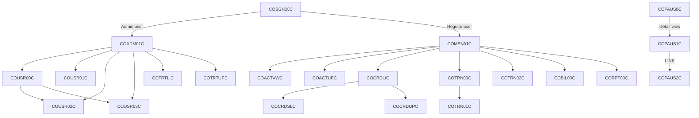
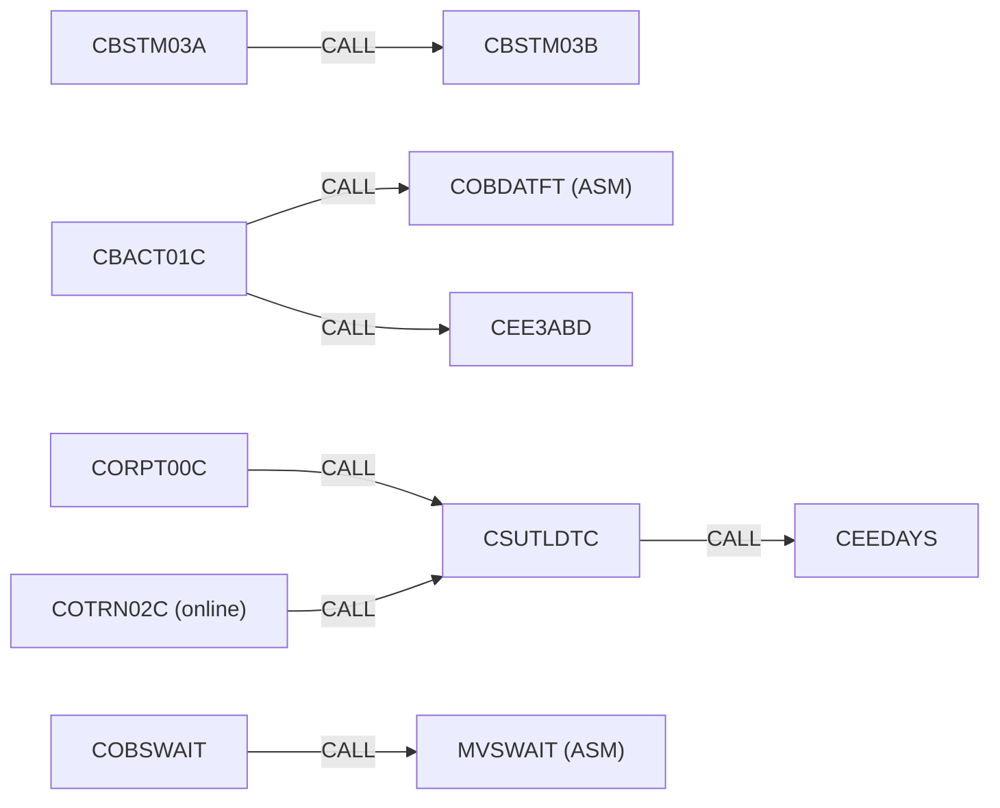
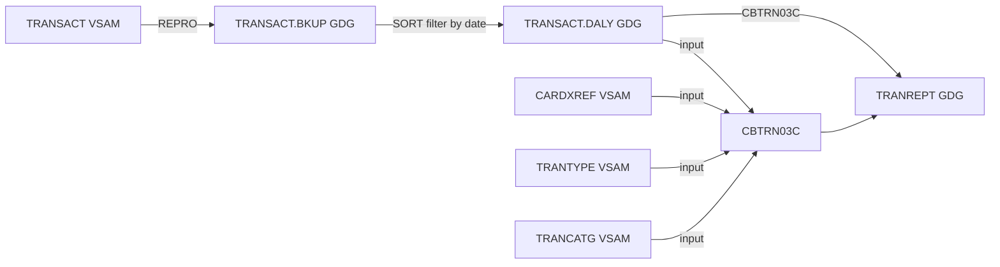
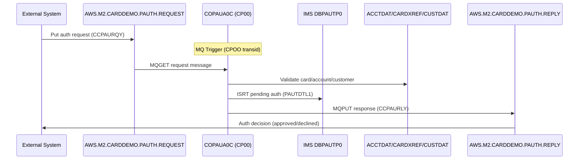
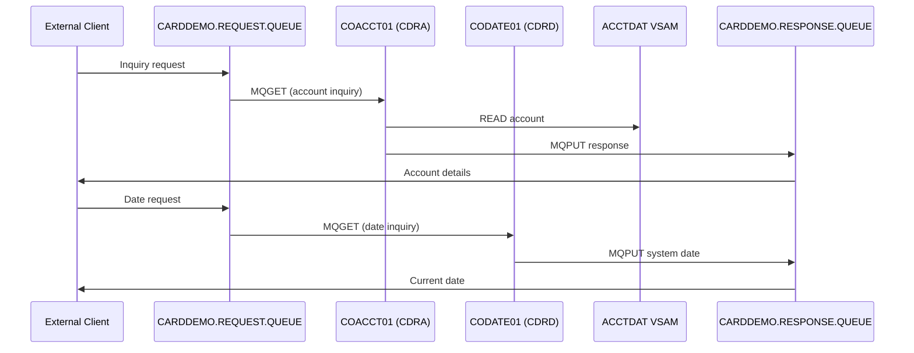
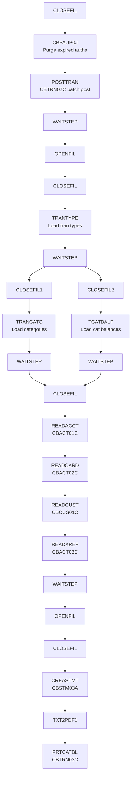
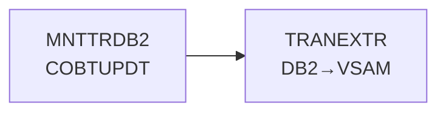

# Dependency Map — CardDemo Legacy COBOL System

> Complete mapping of program call graphs, dataset lineage, message flows, and batch pipelines.

---

## Section A: Online Program Call Graph (XCTL/LINK)

### Detailed XCTL/LINK Relationships

| Source Program | Target Program | Mechanism | Condition |
|---------------|---------------|-----------|-----------|
| COSGN00C | COADM01C | XCTL | User type = Admin |
| COSGN00C | COMEN01C | XCTL | User type = Regular |
| COMEN01C | COACTVWC | XCTL | Menu option 1 |
| COMEN01C | COACTUPC | XCTL | Menu option 2 |
| COMEN01C | COCRDLIC | XCTL | Menu option 3 |
| COMEN01C | COTRN00C | XCTL | Menu option 4 |
| COMEN01C | COTRN02C | XCTL | Menu option 5 |
| COMEN01C | COBIL00C | XCTL | Menu option 6 |
| COMEN01C | CORPT00C | XCTL | Menu option 7 |
| COADM01C | COUSR00C | XCTL | Admin option 1 |
| COADM01C | COUSR01C | XCTL | Admin option 2 |
| COADM01C | COUSR02C | XCTL | Admin option 3 |
| COADM01C | COUSR03C | XCTL | Admin option 4 |
| COADM01C | COTRTLIC | XCTL | Admin option 5 |
| COADM01C | COTRTUPC | XCTL | Admin option 6 |
| COUSR00C | COUSR02C | XCTL | Select user for update |
| COUSR00C | COUSR03C | XCTL | Select user for delete |
| COCRDLIC | COCRDSLC | XCTL | View card detail |
| COCRDLIC | COCRDUPC | XCTL | Update card |
| COACTUPC | COCRDUPC | XCTL | Update card from account |
| COTRN00C | COTRN01C | XCTL | View transaction detail |
| COPAUS0C | COPAUS1C | XCTL | View authorization detail |
| COPAUS1C | COPAUS2C | LINK | Mark as fraud (called, returns) |

---

## Section B: Batch CALL Graph

| Caller | Callee | Purpose |
|--------|--------|---------|
| CBSTM03A | CBSTM03B | Statement file processing (called 13 times for different record types) |
| CBACT01C | COBDATFT (ASM) | Date format conversion (YYYYMMDD ↔ YYYY-MM-DD) |
| CBACT01C | CEE3ABD | Abnormal termination handler |
| CORPT00C | CSUTLDTC | Date utility (Gregorian ↔ Julian) for report date params |
| COTRN02C (online) | CSUTLDTC | Date utility for transaction timestamp validation |
| COBSWAIT | MVSWAIT (ASM) | MVS WAIT timer for batch pauses between steps |
| CSUTLDTC | CEEDAYS | LE date-to-Lilian conversion service |
| All batch programs | CEE3ABD | Abnormal termination on unrecoverable errors |

---

## Section C: Dataset Lineage

### VSAM Datasets (from CSD and JCL)

| Dataset (DSN) | CICS File | DD Name(s) | Programs Reading | Programs Writing | JCL Define/Load |
|---------------|-----------|-----------|------------------|-----------------|-----------------|
| AWS.M2.CARDDEMO.ACCTDATA.VSAM.KSDS | ACCTDAT | ACCTFILE, ACCTVSAM | CBACT01C, CBTRN01C, CBTRN02C, CBACT04C, CBEXPORT, CBSTM03B, COACTUPC, COACTVWC, COBIL00C, COPAUS0C | CBIMPORT, COACTUPC | ACCTFILE.jcl |
| AWS.M2.CARDDEMO.CARDDATA.VSAM.KSDS | CARDDAT | CARDFILE | CBACT02C, CBTRN01C, CBTRN02C, CBEXPORT, COCRDLIC, COCRDSLC, COCRDUPC | CBIMPORT, COCRDUPC | CARDFILE.jcl |
| AWS.M2.CARDDEMO.CARDXREF.VSAM.KSDS | CCXREF | XREFFILE | CBACT03C, CBTRN01C, CBTRN02C, CBTRN03C, CBEXPORT, CBSTM03B, COTRN02C, COACTUPC, COACTVWC, COPAUS0C | CBIMPORT | XREFFILE.jcl |
| AWS.M2.CARDDEMO.CARDXREF.VSAM.AIX.PATH | CXACAIX | CXACAIX | COACTUPC, COACTVWC, COBIL00C, COTRN02C, COPAUS0C | — | XREFFILE.jcl (AIX) |
| AWS.M2.CARDDEMO.CUSTDATA.VSAM.KSDS | CUSTDAT | CUSTFILE | CBCUS01C, CBTRN01C, CBTRN02C, CBEXPORT, CBSTM03B, COCRDSLC, COCRDUPC, COACTUPC, COACTVWC, COPAUS0C | CBIMPORT | CUSTFILE.jcl |
| AWS.M2.CARDDEMO.TRANSACT.VSAM.KSDS | TRANSACT | TRANFILE | CBTRN01C, CBTRN02C, CBTRN03C, COTRN00C, COTRN01C, COTRN02C, COBIL00C, CORPT00C | CBTRN01C, CBTRN02C, COTRN02C, COBIL00C | TRANFILE.jcl |
| AWS.M2.CARDDEMO.USRSEC.VSAM.KSDS | USRSEC | USRSEC | COSGN00C, COUSR00C, COUSR01C, COUSR02C, COUSR03C | COUSR01C, COUSR02C, COUSR03C | DUSRSECJ.jcl |
| AWS.M2.CARDDEMO.DALYTRAN.PS | — | DALYTRAN | CBTRN01C, CBTRN02C, CBACT04C | (external feed) | — |
| AWS.M2.CARDDEMO.TCATBALF.PS | — | TCATBALF | CBTRN02C, CBACT04C | CBTRN02C | TCATBALF.jcl |
| AWS.M2.CARDDEMO.DISCGRP.PS | — | DISCGRP | CBACT04C | (external load) | DISCGRP.jcl |
| AWS.M2.CARDDEMO.TRANTYPE.VSAM.KSDS | — | TRANTYPE | CBTRN03C | TRANEXTR.jcl | TRANTYPE.jcl |
| AWS.M2.CARDDEMO.TRANCATG.VSAM.KSDS | — | TRANCATG | CBTRN03C | — | TRANCATG.jcl |

### Sequential/GDG Datasets

| Dataset Pattern | Purpose | Producer | Consumer |
|----------------|---------|----------|----------|
| AWS.M2.CARDDEMO.TRANSACT.BKUP(+1) | Transaction backup (GDG) | TRANBKP.jcl (REPROC) | TRANREPT.prc (SORT input) |
| AWS.M2.CARDDEMO.TRANSACT.DALY(+1) | Filtered daily transactions (GDG) | TRANREPT.prc (SORT) | CBTRN03C (report) |
| AWS.M2.CARDDEMO.TRANREPT(+1) | Transaction report output (GDG) | CBTRN03C | TXT2PDF1 |
| AWS.M2.CARDDEMO.DALYREJS | Daily transaction rejects | CBTRN02C | COMBTRAN.jcl |
| AWS.M2.CARDDEMO.EXPORT.DATA.PS | Full entity export | CBEXPORT | CBIMPORT |

### TRANREPT.prc Pipeline

---

## Section D: IMS Database Lineage

### Database Definitions

| DBD Name | Access Method | Dataset | Segments |
|----------|--------------|---------|----------|
| DBPAUTP0 | HIDAM/VSAM | DDPAUTP0 (OEM.IMS.IMSP.PAUTHDB) | PAUTSUM0 (root, key=ACCNTID), PAUTDTL1 (child, key=PAUT9CTS) |
| DBPAUTX0 | INDEX/VSAM | DDPAUTX0 (OEM.IMS.IMSP.PAUTHDBX) | PAUTINDX (secondary index for DBPAUTP0) |
| PADFLDBD | GSAM/BSAM | GSAM flat file | Sequential output for unload |
| PASFLDBD | GSAM/BSAM | GSAM flat file | Sequential output for unload |

### PSB Definitions

| PSB Name | Programs | PCBs |
|----------|----------|------|
| PSBPAUTB | CBPAUP0C, COPAUA0C | PAUT-PCB (DBPAUTP0 full access) |
| PSBPAUTL | COPAUS0C, COPAUS1C | PAUT-PCB (DBPAUTP0 read-only) |
| PAUTBUNL | PAUDBUNL | PAUT-PCB + GSAM PCB |
| DLIGSAMP | DBUNLDGS | GSAM PCB |

### IMS Access Patterns

| Program | DL/I Calls | Purpose |
|---------|-----------|---------|
| COPAUA0C | GU, ISRT | Get unique by account, insert new auth detail |
| COPAUS0C | GU, GN | Get summary, navigate details |
| COPAUS1C | GU, GNP | Get specific detail under parent |
| COPAUS2C | GU, REPL | Get detail, replace with fraud flag |
| CBPAUP0C | GN, GNP, DLET, CHKP | Sequential scan, delete expired, checkpoint |
| PAUDBLOD | ISRT | Bulk insert from flat file |
| PAUDBUNL | GN, GNP | Sequential unload to flat file |
| DBUNLDGS | GN | GSAM sequential unload |

---

## Section E: MQ Message Flow

### Authorization Module (CICS/IMS/MQ)

**Queue Names:**
- Request: `AWS.M2.CARDDEMO.PAUTH.REQUEST`
- Reply: `AWS.M2.CARDDEMO.PAUTH.REPLY`

### VSAM-MQ Module (Account/Date Inquiry)

**Queue Names:**
- Request: `CARDDEMO.REQUEST.QUEUE`
- Response: `CARDDEMO.RESPONSE.QUEUE`

---

## Section F: End-to-End Batch Pipeline

### 1. DAILY — Transaction Backup (Control-M: DAILY-TransactionBackup)

**Purpose:** Backup transaction VSAM to GDG before daily processing.

### 2. DAILY — Main Processing Chain (CA-7)

### 3. WEEKLY — Transaction Types DB Refresh (Control-M: WEEKLY-TransactionTypesDBRefresh)

**Purpose:** Batch update transaction types in DB2, then extract to VSAM for online access.

### 4. WEEKLY — Disclosure Groups Refresh (Control-M: WEEKLY-DisclosureGroupsRefresh)

### 5. MONTHLY — Interest Calculation (Control-M: MONTHLY-InterestCalculation)

**Purpose:** Calculate interest on outstanding balances (CBACT04C), combine daily rejects back into main transaction file.

---

## Summary: Technology Integration Points

| Integration | Programs | Direction |
|-------------|----------|-----------|
| CICS ↔ VSAM | All CO* programs | Read/Write via DATASET |
| CICS ↔ IMS | COPAUA0C, COPAUS0C, COPAUS1C, COPAUS2C | DL/I calls within CICS |
| CICS ↔ DB2 | COPAUS2C, COTRTLIC, COTRTUPC | EXEC SQL within CICS |
| CICS ↔ MQ | COPAUA0C, COACCT01, CODATE01 | MQGET/MQPUT within CICS |
| Batch ↔ VSAM | All CB* programs | SELECT...ASSIGN TO DD |
| Batch ↔ IMS | CBPAUP0C, PAUDBLOD, PAUDBUNL, DBUNLDGS | DL/I via BMP region |
| Batch ↔ DB2 | COBTUPDT | EXEC SQL in batch |
| Batch ↔ ASM | CBACT01C→COBDATFT, COBSWAIT→MVSWAIT | CALL linkage |
