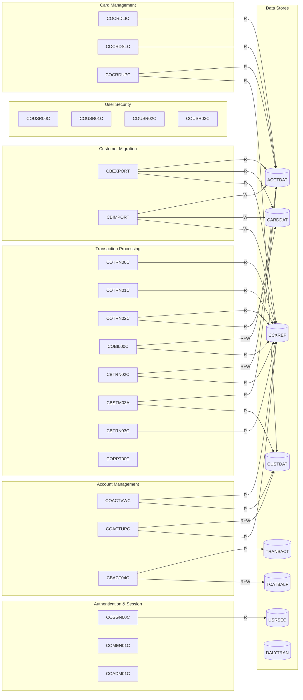

# CardDemo Domain Decomposition

This document captures the bounded context analysis for the CardDemo COBOL application, identifying 9 domains (7 core + 2 extension modules) with their program inventories, owned data stores, cross-domain data dependencies, and BMS artifacts.

---

## 1. Authentication & Session Management

### Description

Handles user sign-on, main menu navigation, and admin menu dispatch. Acts as the entry point for all CICS sessions and manages session state via the COMMAREA.

### Program Inventory

| Program | Type | File Path | Tran ID | Function |
|:--------|:-----|:----------|:--------|:---------|
| COSGN00C | CICS | `app/cbl/COSGN00C.cbl` | CC00 | Signon Screen |
| COMEN01C | CICS | `app/cbl/COMEN01C.cbl` | CM00 | Main Menu |
| COADM01C | CICS | `app/cbl/COADM01C.cbl` | CA00 | Admin Menu |

### Owned Data Stores

| VSAM File | Copybook | Description |
|:----------|:---------|:------------|
| USRSEC | CSUSR01Y | User security credentials (read for authentication) |

### Cross-Domain Data Dependencies

| Program | Foreign File | Access | Purpose |
|:--------|:-------------|:-------|:--------|
| COSGN00C | USRSEC | R | Validate user credentials at sign-on |

### BMS Maps & Copybooks

- **Maps:** COSGN00, COMEN01, COADM01
- **BMS Copybooks:** COSGN00.bms, COMEN01.bms, COADM01.bms
- **Data Copybooks:** COMEN02Y (menu options)

---

## 2. Account Management

### Description

Provides online account viewing and updating, plus batch programs for account-related processing (customer data build, interest calculation, and account file refreshes).

### Program Inventory

| Program | Type | File Path | Tran ID | Function |
|:--------|:-----|:----------|:--------|:---------|
| COACTVWC | CICS | `app/cbl/COACTVWC.cbl` | CAVW | Account View |
| COACTUPC | CICS | `app/cbl/COACTUPC.cbl` | CAUP | Account Update |
| CBACT01C | Batch | `app/cbl/CBACT01C.cbl` | -- | Account file processing |
| CBACT02C | Batch | `app/cbl/CBACT02C.cbl` | -- | Account file processing |
| CBACT03C | Batch | `app/cbl/CBACT03C.cbl` | -- | Account file processing |
| CBACT04C | Batch | `app/cbl/CBACT04C.cbl` | -- | Interest calculation (INTCALC job) |

### Owned Data Stores

| VSAM File | Copybook | Description |
|:----------|:---------|:------------|
| ACCTDAT | CVACT01Y | Account master (300-byte records) |

### Cross-Domain Data Dependencies

| Program | Foreign File | Access | Purpose |
|:--------|:-------------|:-------|:--------|
| COACTVWC | CARDAIX | R | Look up cards for account display |
| COACTVWC | CCXREF | R | Cross-reference card to account |
| COACTVWC | CUSTDAT | R | Display customer name on account view |
| COACTUPC | CUSTDAT | R+W | Read and update customer data alongside account |
| COACTUPC | CARDAIX | R | Card listing for the account |
| COACTUPC | CCXREF | R | Cross-reference lookup |
| CBACT04C | TRANSACT | R | Read transactions for interest calculation |
| CBACT04C | TCATBALF | R+W | Read/update category balances |
| CBACT04C | DISCGRP | R | Read disclosure group rates |
| CBACT04C | TRANCATG | R | Read transaction categories |

### BMS Maps & Copybooks

- **Maps:** COACTVW, COACTUP
- **BMS Copybooks:** COACTVW.bms, COACTUP.bms
- **Data Copybooks:** CVACT01Y, CVACT02Y, CVACT03Y

---

## 3. Credit Card Management

### Description

Manages the credit card lifecycle: listing, searching, viewing details, and updating card records. Owns the card data files and the card-to-account cross-reference.

### Program Inventory

| Program | Type | File Path | Tran ID | Function |
|:--------|:-----|:----------|:--------|:---------|
| COCRDLIC | CICS | `app/cbl/COCRDLIC.cbl` | CCLI | Credit Card List |
| COCRDSLC | CICS | `app/cbl/COCRDSLC.cbl` | CCDL | Credit Card View/Search |
| COCRDUPC | CICS | `app/cbl/COCRDUPC.cbl` | CCUP | Credit Card Update |

### Owned Data Stores

| VSAM File | Copybook | Description |
|:----------|:---------|:------------|
| CARDDAT | CVACT02Y | Credit card master (150-byte records) |
| CARDAIX | CVACT02Y | Card-by-account alternate index path |
| CCXREF | CVACT03Y | Card-to-account cross-reference |
| CXACAIX | CVACT03Y | Cross-ref by account alternate index |

### Cross-Domain Data Dependencies

| Program | Foreign File | Access | Purpose |
|:--------|:-------------|:-------|:--------|
| COCRDLIC | ACCTDAT | R | Display account info alongside card list |
| COCRDSLC | ACCTDAT | R | Show account details for selected card |
| COCRDUPC | ACCTDAT | R | Validate account for card update |
| COCRDUPC | CUSTDAT | R | Validate customer for card update |

### BMS Maps & Copybooks

- **Maps:** COCRDLI, COCRDSL, COCRDUP
- **BMS Copybooks:** COCRDLI.bms, COCRDSL.bms, COCRDUP.bms
- **Data Copybooks:** CVACT02Y, CVACT03Y, CVCRD01Y

---

## 4. Transaction Processing

### Description

The largest domain, handling online transaction listing/viewing/adding, bill payment, batch transaction posting, statement generation, and reporting. This is the first strangler fig extraction candidate.

### Program Inventory

| Program | Type | File Path | Tran ID | Function |
|:--------|:-----|:----------|:--------|:---------|
| COTRN00C | CICS | `app/cbl/COTRN00C.cbl` | CT00 | Transaction List |
| COTRN01C | CICS | `app/cbl/COTRN01C.cbl` | CT01 | Transaction View |
| COTRN02C | CICS | `app/cbl/COTRN02C.cbl` | CT02 | Transaction Add |
| CORPT00C | CICS | `app/cbl/CORPT00C.cbl` | CR00 | Transaction Reports |
| COBIL00C | CICS | `app/cbl/COBIL00C.cbl` | CB00 | Bill Payment |
| CBTRN01C | Batch | `app/cbl/CBTRN01C.cbl` | -- | Transaction file processing |
| CBTRN02C | Batch | `app/cbl/CBTRN02C.cbl` | -- | Daily transaction posting (POSTTRAN) |
| CBTRN03C | Batch | `app/cbl/CBTRN03C.cbl` | -- | Transaction report generation (TRANREPT) |
| CBSTM03A | Batch | `app/cbl/CBSTM03A.CBL` | -- | Statement generation (CREASTMT) |
| CBSTM03B | Batch | `app/cbl/CBSTM03B.CBL` | -- | Statement generation sub-program |

### Owned Data Stores

| VSAM File | Copybook | Description |
|:----------|:---------|:------------|
| TRANSACT | CVTRA05Y | Online transaction log |
| DALYTRAN | CVTRA06Y | Daily transaction feed |
| DALYREJS | CVTRA06Y | Daily rejected transactions |
| TCATBALF | CVTRA01Y | Transaction category balance |
| DISCGRP | CVTRA02Y | Disclosure groups |
| TRANTYPE | CVTRA03Y | Transaction types |
| TRANCATG | CVTRA04Y | Transaction categories |

### Cross-Domain Data Dependencies

| Program | Foreign File | Access | Purpose |
|:--------|:-------------|:-------|:--------|
| COTRN00C | CCXREF | R | Map card numbers to accounts for transaction list |
| COTRN01C | CCXREF | R | Card-to-account lookup for transaction view |
| COTRN02C | CCXREF | R | Validate card number before adding transaction |
| COTRN02C | CARDDAT | R | Verify card is active |
| COBIL00C | ACCTDAT | R+W | Read account, update balance after payment |
| COBIL00C | CCXREF | R | Card-to-account resolution |
| CBTRN02C (batch) | ACCTDAT | R+W | Update account balances during posting |
| CBTRN02C (batch) | CCXREF | R | Card-to-account resolution |
| CBSTM03A | ACCTDAT | R | Account data for statement header |
| CBSTM03A | CUSTDAT | R | Customer data for statement address |
| CBTRN03C | CCXREF | R | Card-to-account resolution for report |

### BMS Maps & Copybooks

- **Maps:** COTRN00, COTRN01, COTRN02, CORPT00, COBIL00
- **BMS Copybooks:** COTRN00.bms, COTRN01.bms, COTRN02.bms, CORPT00.bms, COBIL00.bms
- **Data Copybooks:** CVTRA01Y-CVTRA07Y, COSTM01

---

## 5. User Security Administration

### Description

Manages user accounts for CardDemo: listing, adding, updating, and deleting user credentials. Admin-only access.

### Program Inventory

| Program | Type | File Path | Tran ID | Function |
|:--------|:-----|:----------|:--------|:---------|
| COUSR00C | CICS | `app/cbl/COUSR00C.cbl` | CU00 | List Users |
| COUSR01C | CICS | `app/cbl/COUSR01C.cbl` | CU01 | Add User |
| COUSR02C | CICS | `app/cbl/COUSR02C.cbl` | CU02 | Update User |
| COUSR03C | CICS | `app/cbl/COUSR03C.cbl` | CU03 | Delete User |

### Owned Data Stores

| VSAM File | Copybook | Description |
|:----------|:---------|:------------|
| USRSEC | CSUSR01Y | User security records |

### Cross-Domain Data Dependencies

None -- User Security is self-contained with no foreign file access.

### BMS Maps & Copybooks

- **Maps:** COUSR00, COUSR01, COUSR02, COUSR03
- **BMS Copybooks:** COUSR00.bms, COUSR01.bms, COUSR02.bms, COUSR03.bms

---

## 6. Customer Management & Data Migration

### Description

Handles customer record maintenance and provides batch export/import capabilities for customer data migration between systems.

### Program Inventory

| Program | Type | File Path | Tran ID | Function |
|:--------|:-----|:----------|:--------|:---------|
| CBCUS01C | Batch | `app/cbl/CBCUS01C.cbl` | -- | Customer data processing |
| CBEXPORT | Batch | `app/cbl/CBEXPORT.cbl` | -- | Export customer data |
| CBIMPORT | Batch | `app/cbl/CBIMPORT.cbl` | -- | Import customer data |

### Owned Data Stores

| VSAM File | Copybook | Description |
|:----------|:---------|:------------|
| CUSTDAT | CVCUS01Y | Customer master (500-byte records) |

### Cross-Domain Data Dependencies

| Program | Foreign File | Access | Purpose |
|:--------|:-------------|:-------|:--------|
| CBEXPORT | ACCTDAT | R | Export account data alongside customer |
| CBEXPORT | CARDDAT | R | Export card data alongside customer |
| CBEXPORT | CCXREF | R | Cross-reference for export |
| CBIMPORT | ACCTDAT | W | Import account records |
| CBIMPORT | CARDDAT | W | Import card records |
| CBIMPORT | CCXREF | W | Import cross-reference records |

### BMS Maps & Copybooks

- **Maps:** None (batch only)
- **Data Copybooks:** CVCUS01Y, CVEXPORT, CUSTREC

---

## 7. Credit Card Authorization Extension (IMS/DB2/MQ)

### Description

Optional module that processes real-time credit card authorization requests via MQ, stores authorization history in IMS hierarchical DB, and tracks fraud cases in DB2. Requires IMS DB, DB2, and MQ infrastructure.

### Program Inventory

| Program | Type | File Path | Tran ID | Function |
|:--------|:-----|:----------|:--------|:---------|
| COPAUA0C | CICS | `app/app-authorization-ims-db2-mq/cbl/COPAUA0C.cbl` | CP00 | Process Authorization Requests (MQ trigger) |
| COPAUS0C | CICS | `app/app-authorization-ims-db2-mq/cbl/COPAUS0C.cbl` | CPVS | Pending Authorization Summary |
| COPAUS1C | CICS | `app/app-authorization-ims-db2-mq/cbl/COPAUS1C.cbl` | CPVD | Pending Authorization Details |
| COPAUS2C | CICS | `app/app-authorization-ims-db2-mq/cbl/COPAUS2C.cbl` | -- | Authorization sub-program |
| CBPAUP0C | Batch | `app/app-authorization-ims-db2-mq/cbl/CBPAUP0C.cbl` | -- | Purge Expired Authorizations (CBPAUP0J) |
| DBUNLDGS | Batch | `app/app-authorization-ims-db2-mq/cbl/DBUNLDGS.CBL` | -- | IMS DB unload utility |
| PAUDBLOD | Batch | `app/app-authorization-ims-db2-mq/cbl/PAUDBLOD.CBL` | -- | IMS DB load utility |
| PAUDBUNL | Batch | `app/app-authorization-ims-db2-mq/cbl/PAUDBUNL.CBL` | -- | IMS DB unload utility |

### Owned Data Stores

| Store | Type | Description |
|:------|:-----|:------------|
| DBPAUTP0 | IMS HIDAM | Primary authorization database |
| DBPAUTX0 | IMS HIDAM Index | Authorization index |
| AUTHFRDS | DB2 Table | Fraud tracking records |

### Cross-Domain Data Dependencies

| Program | Foreign File | Access | Purpose |
|:--------|:-------------|:-------|:--------|
| COPAUA0C | ACCTDAT | R | Retrieve account for authorization validation |
| COPAUA0C | CCXREF | R | Card-to-account lookup |
| COPAUA0C | CUSTDAT | R | Retrieve customer for authorization |
| COPAUS0C | ACCTDAT | R | Account summary display |
| COPAUS0C | CCXREF | R | Card-to-account lookup |

### BMS Maps & Copybooks

- **Maps:** COPAU00, COPAU01
- **BMS Copybooks:** COPAU00.bms, COPAU01.bms
- **Data Copybooks:** CCPAUERY, CCPAURLY, CCPAURQY, CIPAUDTY, CIPAUSMY, IMSFUNCS, PADFLPCB, PASFLPCB, PAUTBPCB

---

## 8. Transaction Type Management Extension (DB2)

### Description

Optional module that maintains transaction type reference data in DB2 tables with online CICS screens and batch maintenance. Demonstrates embedded static SQL patterns.

### Program Inventory

| Program | Type | File Path | Tran ID | Function |
|:--------|:-----|:----------|:--------|:---------|
| COTRTLIC | CICS | `app/app-transaction-type-db2/cbl/COTRTLIC.cbl` | CTLI | Tran Type list/update/delete |
| COTRTUPC | CICS | `app/app-transaction-type-db2/cbl/COTRTUPC.cbl` | CTTU | Tran Type add/edit |
| COBTUPDT | Batch | `app/app-transaction-type-db2/cbl/COBTUPDT.cbl` | -- | Batch transaction type maintenance (MNTTRDB2) |

### Owned Data Stores

| Store | Type | Description |
|:------|:-----|:------------|
| CARDDEMO.TRANSACTION_TYPE | DB2 Table | Transaction type codes and descriptions |
| CARDDEMO.TRANSACTION_TYPE_CATEGORY | DB2 Table | Transaction category codes |

### Cross-Domain Data Dependencies

None -- this extension is self-contained within DB2.

### BMS Maps & Copybooks

- **Maps:** COTRTLI, COTRTUP
- **BMS Copybooks:** COTRTLI.bms, COTRTUP.bms
- **Data Copybooks:** CSDB2RPY, CSDB2RWY

---

## 9. Account Inquiry via MQ Extension (VSAM-MQ)

### Description

Optional module providing system date inquiry and account detail retrieval through MQ request/response patterns. Demonstrates asynchronous processing integration.

### Program Inventory

| Program | Type | File Path | Tran ID | Function |
|:--------|:-----|:----------|:--------|:---------|
| CODATE01 | CICS | `app/app-vsam-mq/cbl/CODATE01.cbl` | CDRD | System Date Inquiry via MQ |
| COACCT01 | CICS | `app/app-vsam-mq/cbl/COACCT01.cbl` | CDRA | Account Details Inquiry via MQ |

### Owned Data Stores

None -- reads from ACCTDAT owned by Account Management.

### Cross-Domain Data Dependencies

| Program | Foreign File | Access | Purpose |
|:--------|:-------------|:-------|:--------|
| COACCT01 | ACCTDAT | R | Retrieve account details for MQ response |

### BMS Maps & Copybooks

- **Maps:** None (MQ-driven, no BMS screens)
- **Data Copybooks:** None specific; uses CVACT01Y from Account Management

---

## Data Coupling Matrix

The following grid shows which programs access which VSAM files. Access types: **R** = Read, **W** = Write, **R+W** = Read and Write, **B** = Browse.

| Program | ACCTDAT | CARDDAT | CARDAIX | CCXREF | CXACAIX | CUSTDAT | TRANSACT | USRSEC | DALYTRAN | TCATBALF | DISCGRP | TRANTYPE | TRANCATG |
|:--------|:-------:|:-------:|:-------:|:------:|:-------:|:-------:|:--------:|:------:|:--------:|:--------:|:-------:|:--------:|:--------:|
| **COSGN00C** | | | | | | | | R | | | | | |
| **COMEN01C** | | | | | | | | | | | | | |
| **COADM01C** | | | | | | | | | | | | | |
| **COACTVWC** | R | | R | R | | R | | | | | | | |
| **COACTUPC** | R+W | | R | R | | R+W | | | | | | | |
| **COCRDLIC** | R | B | | | | | | | | | | | |
| **COCRDSLC** | R | R | | R | | | | | | | | | |
| **COCRDUPC** | R | R+W | | R | | R | | | | | | | |
| **COTRN00C** | | | | R | | | B | | | | | | |
| **COTRN01C** | | | | R | | | R | | | | | | |
| **COTRN02C** | | R | | R | | | W | | | | | | |
| **CORPT00C** | | | | | | | R | | | | | | |
| **COBIL00C** | R+W | | | R | | | W | | | | | | |
| **COUSR00C** | | | | | | | | R+B | | | | | |
| **COUSR01C** | | | | | | | | W | | | | | |
| **COUSR02C** | | | | | | | | R+W | | | | | |
| **COUSR03C** | | | | | | | | R+W | | | | | |
| **CBACT04C** | R+W | | | | | | R | | | R+W | R | | R |
| **CBTRN02C** | R+W | | | R | | | | | R | R+W | | R | R |
| **CBTRN03C** | | | | R | | | R | | | | | | |
| **CBSTM03A** | R | | | | | R | R | | | | | | |
| **CBCUS01C** | | | | | | R+W | | | | | | | |
| **CBEXPORT** | R | R | | R | | R | | | | | | | |
| **CBIMPORT** | W | W | | W | | W | | | | | | | |
| **COPAUA0C** | R | | | R | | R | | | | | | | |
| **COPAUS0C** | R | | | R | | | | | | | | | |
| **COACCT01** | R | | | | | | | | | | | | |

---

## Dependency Graph

---

## Shared / Cross-Cutting Artifacts

The following copybooks and utility programs are used across multiple domains and must be addressed as part of any migration.

### Shared Copybooks

| Copybook | Used By Domains | Purpose |
|:---------|:----------------|:--------|
| COCOM01Y | All online (1-5, 7-9) | COMMAREA session state structure |
| COTTL01Y | All online (1-5, 7-8) | Standard screen title line |
| CSDAT01Y | All online (1-5, 7-8) | Date working storage fields |
| CSMSG01Y | All online (1-5, 7-8) | Standard message area line 1 |
| CSMSG02Y | All online (1-5, 7-8) | Standard message area line 2 |
| CSUSR01Y | 1 (Auth), 5 (User Sec) | User security record layout |
| CSSETATY | All online (1-5, 7-8) | Set attribute byte utility |
| CSSTRPFY | Most online (2-4, 7) | String-to-PIC field utility |
| CODATECN | Most online + batch | Date conversion condition names |
| CSLKPCDY | Several online | Lookup code utility |
| CSUTLDPY | Programs calling CSUTLDTC | Date utility parameters |
| CSUTLDWY | Programs calling CSUTLDTC | Date utility working storage |
| CVACT03Y | 2, 3, 4, 6, 7 | CCXREF record layout (cross-domain) |

### Shared Utility Programs

| Program | Used By | Purpose |
|:--------|:--------|:--------|
| CSUTLDTC | All domains with date processing | Date arithmetic and formatting |
| COBSWAIT | Batch scheduling | Timer control for wait steps |
