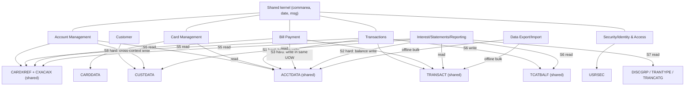

# CardDemo Domain Decomposition

Empirically derived bounded contexts for the CardDemo COBOL/CICS/VSAM monolith, the shared data
that couples them, and the extraction seams a Java modernization must cut. Everything below was
verified against the source (COPY statements, `SELECT ... ASSIGN TO`, `EXEC CICS ... DATASET/FILE`,
JCL `EXEC PGM=` and DD cards); see "Sources / How this was derived" for commands, line ranges and
discrepancies.

Companion documents: `MODERNIZATION_BLUEPRINT.md` (target architecture), `CUTOVER_PLAN.md`
(sequencing), `RISK_REGISTER.md` (risk detail). Context names, program lists and file names are
identical across all four.

## 1. Bounded contexts

| # | Bounded context | Programs | Domain copybooks | Data files | Candidate microservice / module |
|:--|:----------------|:---------|:-----------------|:-----------|:--------------------------------|
| 1 | Security/Identity & Access | COSGN00C, COUSR00C, COUSR01C, COUSR02C, COUSR03C, COADM01C | CSUSR01Y, COADM02Y, COMEN02Y | USRSEC | `identity-service` (auth + user admin; replace with IdP + user API) |
| 2 | Customer | CBCUS01C | CVCUS01Y, CUSTREC | CUSTDATA | `customer-service` |
| 3 | Account Management | COACTVWC, COACTUPC, CBACT01C, CBACT03C | CVACT01Y, CVACT03Y (card xref) | ACCTDATA, CARDXREF | `account-service` (owns account master + card cross-reference) |
| 4 | Card Management | COCRDLIC, COCRDSLC, COCRDUPC, CBACT02C | CVACT02Y, CVCRD01Y | CARDDATA | `card-service` |
| 5 | Transactions | COTRN00C, COTRN01C, COTRN02C, CBTRN01C, CBTRN02C, CBTRN03C | CVTRA05Y (TRANSACT KSDS), CVTRA06Y (DALYTRAN), CVTRA01Y (TCATBALF), CVTRA03Y (types), CVTRA04Y (categories), CVTRA02Y (disclosure groups) | TRANSACT, DALYTRAN, DALYREJS, TCATBALF, TRANTYPE, TRANCATG | `transaction-service` + `posting-batch` (ledger + daily posting) |
| 6 | Bill Payment | COBIL00C | (reuses CVACT01Y, CVACT03Y, CVTRA05Y) | TRANSACT, ACCTDATA, CARDXREF (via CXACAIX) | `billpay-service` (orchestrator, owns no master data) |
| 7 | Interest/Statements/Reporting | CBACT04C (interest), CBSTM03A, CBSTM03B (statements), CORPT00C, CBTRN03C | COSTM01, CVTRA07Y | reads TCATBALF, DISCGRP, CARDXREF, ACCTDATA, TRANSACT, CUSTDATA; writes SYSTRAN, STMTFILE/HTMLFILE, TRANREPT | `interest-batch`, `statement-batch`, `reporting-service` |
| 8 | Data Export/Import | CBEXPORT, CBIMPORT | CVEXPORT | EXPFILE (+ all masters read/written) | `migration-tooling` (not a runtime service) |
| 9 | Shared kernel (NOT a domain) | COMEN01C (menu nav), CSUTLDTC | COCOM01Y (commarea), CSUTLDPY, CSUTLDWY, CSDAT01Y, CODATECN, CSMSG01Y, CSMSG02Y, CSSETATY, CSSTRPFY, CSLKPCDY, COTTL01Y | — | shared library (`carddemo-common`) + UI/session layer |
| 10 | Optional/extension contexts | Authorization: COPAUS0C, COPAUS1C, COPAUA0C, CBPAUP0C (IMS/DB2/MQ); Transaction Type Mgmt: COTRTUPC, COTRTLIC, COBTUPDT (DB2); MQ inquiry: CODATE01, COACCT01 | module-local | IMS PA DB, DB2 tran-type tables, MQ queues | `authorization-service`, `transaction-type-service`, MQ adapters (out of first-wave scope) |

CBSTM03A owns only STMTFILE/HTMLFILE; all master-data reads for statements happen in the called
subroutine CBSTM03B (TRNXFILE, XREFFILE, CUSTFILE, ACCTFILE), so the statement context spans the
pair and cannot be split between them.

## 2. Program ↔ domain copybook matrix

Domain (record-layout) copybooks only; BMS map copybooks, `DFHAID`/`DFHBMSCA` and shared-kernel
copybooks are omitted (they are near-universal and carry no domain ownership).

| Program | CVCUS01Y / CUSTREC | CVACT01Y | CVACT02Y | CVACT03Y | CVCRD01Y | CVTRA01Y | CVTRA02Y | CVTRA03Y | CVTRA04Y | CVTRA05Y | CVTRA06Y | CVTRA07Y | CSUSR01Y | CVEXPORT | COSTM01 |
|:--------|:--:|:--:|:--:|:--:|:--:|:--:|:--:|:--:|:--:|:--:|:--:|:--:|:--:|:--:|:--:|
| COSGN00C |  |  |  |  |  |  |  |  |  |  |  |  | x |  |  |
| COUSR00C/01C/02C/03C |  |  |  |  |  |  |  |  |  |  |  |  | x |  |  |
| COADM01C |  |  |  |  |  |  |  |  |  |  |  |  | x |  |  |
| COMEN01C |  |  |  |  |  |  |  |  |  |  |  |  | x |  |  |
| CBCUS01C | x |  |  |  |  |  |  |  |  |  |  |  |  |  |  |
| COACTVWC | x | x | x | x | x |  |  |  |  |  |  |  | x |  |  |
| COACTUPC | x | x |  | x | x |  |  |  |  |  |  |  | x |  |  |
| CBACT01C |  | x |  |  |  |  |  |  |  |  |  |  |  |  |  |
| CBACT03C |  |  |  | x |  |  |  |  |  |  |  |  |  |  |  |
| COCRDLIC |  |  | x |  | x |  |  |  |  |  |  |  | x |  |  |
| COCRDSLC | x |  | x |  | x |  |  |  |  |  |  |  | x |  |  |
| COCRDUPC | x |  | x |  | x |  |  |  |  |  |  |  | x |  |  |
| CBACT02C |  |  | x |  |  |  |  |  |  |  |  |  |  |  |  |
| COTRN00C |  |  |  |  |  |  |  |  |  | x |  |  |  |  |  |
| COTRN01C |  |  |  |  |  |  |  |  |  | x |  |  |  |  |  |
| COTRN02C |  | x |  | x |  |  |  |  |  | x |  |  |  |  |  |
| CBTRN01C | x | x | x | x |  |  |  |  |  | x | x |  |  |  |  |
| CBTRN02C |  | x |  | x |  | x |  |  |  | x | x |  |  |  |  |
| CBTRN03C |  |  |  | x |  |  |  | x | x | x |  | x |  |  |  |
| COBIL00C |  | x |  | x |  |  |  |  |  | x |  |  |  |  |  |
| CBACT04C |  | x |  | x |  | x | x |  |  | x |  |  |  |  |  |
| CBSTM03A | x (CUSTREC) | x |  | x |  |  |  |  |  |  |  |  |  |  | x |
| CBSTM03B | (inline FDs — no COPY) |  |  |  |  |  |  |  |  |  |  |  |  |  |  |
| CORPT00C |  |  |  |  |  |  |  |  |  | x |  |  |  |  |  |
| CBEXPORT | x | x | x | x |  |  |  |  |  | x |  |  |  | x |  |
| CBIMPORT | x | x | x | x |  |  |  |  |  | x |  |  |  | x |  |

Copybook fan-out (contexts touching each): CVACT01Y and CVACT03Y are read by 5 contexts each
(Account, Transactions, Bill Payment, Interest/Statements, Export/Import) — the two structural
coupling points. CVTRA05Y is read by 4. Everything else is single- or two-context.

## 3. JCL jobs grouped by executed program

Only jobs whose `EXEC PGM=` names an application program are business logic; the rest are
IDCAMS/SORT/IEBGENER/IEFBR14/SDSF data-plane jobs (`DELETE`/`DEFINE CLUSTER`/REPRO) that a Java
target replaces with schema migrations and seed loads, not code.

| Job | Program | Datasets by DD | Context |
|:----|:--------|:---------------|:--------|
| POSTTRAN | CBTRN02C | in DALYTRAN(PS), XREFFILE(CARDXREF KSDS); upd TRANFILE(TRANSACT KSDS), ACCTFILE(ACCTDATA), TCATBALF; out DALYREJS(GDG) | Transactions (cross-context write) |
| INTCALC | CBACT04C `PARM='2022071800'` | in TCATBALF, XREFFILE, XREFFIL1(CARDXREF AIX PATH), DISCGRP; upd ACCTFILE; out TRANSACT DD → `AWS.M2.CARDDEMO.SYSTRAN(+1)` (GDG, sequential) | Interest (cross-context write) |
| CREASTMT | CBSTM03A (after SORT + IDCAMS REPRO into TRXFL KSDS) | in TRNXFILE(TRXFL), XREFFILE, ACCTFILE, CUSTFILE; out STMTFILE, HTMLFILE | Statements |
| TRANREPT | CBTRN03C (after SORT) | in TRANFILE, CARDXREF, TRANTYPE, TRANCATG, DATEPARM; out TRANREPT(GDG) | Reporting |
| READACCT | CBACT01C | in ACCTFILE; out OUTFILE/ARRYFILE/VBRCFILE (PSCOMP/ARRYPS/VBPS) | Account (extract) |
| READCARD | CBACT02C | in CARDFILE | Card (extract) |
| READXREF | CBACT03C | in XREFFILE | Account (xref extract) |
| READCUST | CBCUS01C | in CUSTFILE | Customer (extract) |
| CBEXPORT | CBEXPORT | in CUSTFILE, ACCTFILE, XREFFILE, TRANSACT, CARDFILE; out EXPFILE | Export/Import |
| CBIMPORT | CBIMPORT | in EXPFILE; out CUSTOUT, ACCTOUT, XREFOUT, TRNXOUT, CARDOUT, ERROUT | Export/Import |
| WAITSTEP | COBSWAIT | — (timer utility) | Shared kernel |
| DUSRSECJ / ESDSRRDS | IEBGENER + IDCAMS | USRSEC PS → USRSEC KSDS/ESDS/RRDS | Security (data load) |
| ACCTFILE, CARDFILE, CUSTFILE, XREFFILE, TRANFILE, TRANIDX, TRANBKP, TCATBALF, TRANCATG, TRANTYPE, DISCGRP, DEFCUST, DALYREJS, REPTFILE, DEFGDGB, DEFGDGD, COMBTRAN, PRTCATBL, OPENFIL, CLOSEFIL | IDCAMS / SORT / IEFBR14 / SDSF | define/delete/load the KSDS, AIX, PATH and GDG bases named after each file | data plane (all contexts) |
| CBADMCDJ | DFHCSDUP | CICS CSD group CARDDEMO | UI/CICS plumbing |
| FTPJCL, INTRDRJ1, INTRDRJ2, TXT2PDF1 | FTP / IDCAMS / IKJEFT1B | file transfer, internal-reader submit, PDF conversion | infrastructure |

CBTRN01C (daily-transaction validation reader) has **no** job in `app/jcl/` — it is dead or
externally scheduled code; treat it as reference logic only, not as a migration target.

## 4. Data file classification

| File (DD / CICS name) | Owner context | Written by | Read by | Class |
|:----------------------|:--------------|:-----------|:--------|:------|
| **ACCTDATA** (`ACCTFILE` / `ACCTDAT`) | Account Management | COACTUPC (REWRITE), CBTRN02C (2800), CBACT04C (1050), COBIL00C (REWRITE), CBIMPORT | COACTVWC, COTRN02C, CBACT01C, CBTRN01C, CBSTM03B, CBEXPORT | **SHARED** (4 contexts write) |
| **CARDXREF** (`XREFFILE`/`CARDXREF`; AIX `CXACAIX`) | Account Management | CBIMPORT only | COACTVWC, COACTUPC, COTRN02C, COBIL00C, CBACT03C, CBACT04C, CBTRN01C/02C/03C, CBSTM03B, CBEXPORT | **SHARED** (read-only outside owner) |
| **TCATBALF** | Transactions | CBTRN02C (2700 create/rewrite) | CBACT04C, PRTCATBL | **SHARED** (write in Transactions, read in Interest) |
| **TRANSACT** (`TRANFILE`; AIX path) | Transactions | CBTRN02C, COTRN02C, COBIL00C, CBACT04C→SYSTRAN GDG, CBIMPORT | COTRN00C, COTRN01C, CORPT00C, CBTRN03C, CREASTMT SORT, CBEXPORT | **SHARED** (3 contexts write directly) |
| CUSTDATA (`CUSTFILE`/`CUSTDAT`) | Customer | COACTUPC (REWRITE), CBIMPORT | COACTVWC, COCRDSLC, COCRDUPC, CBCUS01C, CBTRN01C, CBSTM03B, CBEXPORT | **SHARED** (cross-context write from Account Update) |
| CARDDATA (`CARDFILE`/`CARDDAT`; AIX `CARDAIX`) | Card Management | COCRDUPC (REWRITE), CBIMPORT | COCRDLIC, COCRDSLC, COACTVWC, CBACT02C, CBTRN01C, CBEXPORT | ISOLATED-write / shared-read |
| USRSEC | Security/Identity | COUSR01C/02C/03C | COSGN00C, COUSR00C, COMEN01C, COADM01C | ISOLATED |
| DALYTRAN, DALYREJS | Transactions | CBTRN02C (rejects) | CBTRN01C/02C | ISOLATED |
| TRANTYPE, TRANCATG | Transactions (reference) | data-plane JCL only | CBTRN03C | ISOLATED reference data |
| DISCGRP | Interest (reference) | data-plane JCL only | CBACT04C | ISOLATED reference data |
| TRXFL, STMTFILE, HTMLFILE, TRANREPT, SYSTRAN | Interest/Statements/Reporting | CREASTMT/TRANREPT/INTCALC | downstream reporting | ISOLATED outputs |
| EXPFILE | Export/Import | CBEXPORT | CBIMPORT | ISOLATED |
| COCOM01Y commarea | Shared kernel | every online program | every online program | session state, **not** domain data |

The four highlighted shared files (ACCTDATA, CARDXREF, TCATBALF, TRANSACT) are the entire
decomposition problem: every hard seam in section 5 crosses one of them.

## 5. Extraction seams

Rating rule: read-only lookup of another context's data = **easy**; shared static reference data =
**easy/medium**; cross-domain **write** inside one unit of work = **hard**.

| # | Seam | Where (verified) | Data coupling | Rating | Extraction technique |
|:--|:-----|:-----------------|:--------------|:-------|:---------------------|
| S1 | Transaction posting → account balance write | CBTRN02C `2000-POST-TRANSACTION` (line 424) → `2800-UPDATE-ACCOUNT-REC` `REWRITE FD-ACCTFILE-REC` (line 554), reject reason 109 (line 556) | Transactions REWRITEs ACCTDATA in the same batch record loop as TRANSACT + TCATBALF writes, with no commit boundary | **hard** | posting emits `BalanceApplied` command to `account-service`; add idempotency key + compensation; keep dual-write shim during cutover |
| S2 | Interest calculation → account balance write | CBACT04C `1050-UPDATE-ACCOUNT` (line 350) `REWRITE` at line 356, driven by control break on `WS-LAST-ACCT-NUM`/`WS-FIRST-TIME` (lines 194-221) | Interest context REWRITEs ACCTDATA per control break; interest transactions written with hardcoded type `'01'`/cat `'05'` (lines 482-483) | **hard** | interest-batch becomes a pure calculator producing a transaction file (INTCALC already routes `TRANSACT` DD to `SYSTRAN(+1)`), posted through the same `account-service` API as S1 |
| S3 | Bill payment "pay in full" → transaction + account | COBIL00C reads ACCTDAT (line 346), CXACAIX (line 411), writes TRANSACT (line 504) and `UPDATE-ACCTDAT-FILE` `EXEC CICS REWRITE` (lines 377-379) | Two-file write in one CICS UOW spanning Bill Payment, Transactions and Account | **hard** | billpay-service orchestrates `transaction-service` + `account-service` with a saga; CICS syncpoint semantics must be replaced explicitly |
| S4 | Online transaction add → account/xref validation + TRANSACT write | COTRN02C reads CXACAIX (579) and CCXREF (612), writes TRANSACT (705) | Account/xref reads are lookups only; write stays in Transactions | **easy** | call `account-service` for validation; no shared write |
| S5 | Any program → card cross-reference read | CBACT04C, CBTRN01C/02C/03C, CBSTM03B, COBIL00C, COTRN02C, COACTVWC, COACTUPC (all read XREFFILE / `CXACAIX` / `CARDXREF`) | read-only; only CBIMPORT writes it | **easy** | expose `GET /accounts/by-card/{cardNum}` from `account-service`; cache aggressively |
| S6 | Posting → transaction category balance, read by interest | CBTRN02C `2700-UPDATE-TCATBAL` (467, create 510 / rewrite 528) → CBACT04C reads TCATBALF as its driving file | single writer, single reader, no shared UOW | **medium** | keep TCATBALF as `transaction-service`-owned projection; interest consumes it as a read model or event stream |
| S7 | Reference data: TRANTYPE, TRANCATG, DISCGRP | CBTRN03C (types/categories), CBACT04C (DISCGRP, `'23'` → silent `'DEFAULT'` fallback at lines 436-437) | static, loaded by JCL, never written by programs | **easy/medium** | replicate as reference tables; the DEFAULT fallback must become an explicit, logged rule |
| S8 | Account Update → customer master write | COACTUPC `REWRITE FILE(LIT-CUSTFILENAME)` (line 4086) alongside `REWRITE FILE(LIT-ACCTFILENAME)` (line 4066) | Account context REWRITEs CUSTDATA in the same CICS UOW | **hard** | split screen into `account-service` + `customer-service` calls; the 4,236-line program with dense cross-field edits (lines 1664-1705) is the driver of effort |
| S9 | Statements → transactions + xref + account + customer reads | CBSTM03B FDs (TRNXFILE/XREFFILE/CUSTFILE/ACCTFILE, lines 31-49), called from CBSTM03A (lines 351, 377, 401) | read-only across 4 contexts, but CBSTM03A uses `ALTER`/`GO TO` (line 300+) and PSA/TCB/TIOT control-block addressing (lines 266-284) | **medium** (data) / **hard** (code) | rewrite as a read-model batch over `transaction-service`; do not transliterate the control-block logic |
| S10 | Security/Identity → everything (signon + commarea) | COSGN00C reads USRSEC (line 212); COCOM01Y carried by every online program | session state only, no domain data | **easy** | IdP + JWT; commarea fields become session/claims, not a shared table |
| S11 | Export/Import → all masters | CBEXPORT `SELECT` lines 35-65, CBIMPORT lines 37-68 | touches every master file, but offline and one-shot | **easy** (defer) | keep as migration tooling outside the service boundaries |

## 6. Dependency diagram


```mermaid
graph TD
  IDENT["Security/Identity & Access"]
  CUST["Customer"]
  ACCT["Account Management"]
  CARD["Card Management"]
  TRAN["Transactions"]
  BILL["Bill Payment"]
  INT["Interest/Statements/Reporting"]
  EXIM["Data Export/Import"]
  KERNEL["Shared kernel (commarea, date, msg)"]

  ACCTDATA["ACCTDATA (shared)"]
  CARDXREF["CARDXREF + CXACAIX (shared)"]
  TRANSACT["TRANSACT (shared)"]
  TCATBALF["TCATBALF (shared)"]
  CUSTDATA["CUSTDATA"]
  CARDDATA["CARDDATA"]
  USRSEC["USRSEC"]
  REFDATA["DISCGRP / TRANTYPE / TRANCATG"]

  IDENT --> USRSEC
  CUST --> CUSTDATA
  ACCT --> ACCTDATA
  ACCT --> CARDXREF
  ACCT -->|"S8 hard: cross-context write"| CUSTDATA
  CARD --> CARDDATA
  CARD -->|"read"| ACCTDATA
  TRAN --> TRANSACT
  TRAN -->|"S6 write"| TCATBALF
  TRAN -->|"S1 hard: balance write"| ACCTDATA
  TRAN -->|"S5 read"| CARDXREF
  BILL -->|"S3 hard: write in same UOW"| ACCTDATA
  BILL --> TRANSACT
  BILL -->|"S5 read"| CARDXREF
  INT -->|"S2 hard: balance write"| ACCTDATA
  INT -->|"S6 read"| TCATBALF
  INT -->|"read"| TRANSACT
  INT -->|"S5 read"| CARDXREF
  INT -->|"S7 read"| REFDATA
  INT -->|"read"| CUSTDATA
  EXIM -->|"offline bulk"| ACCTDATA
  EXIM -->|"offline bulk"| TRANSACT
  KERNEL --- IDENT
  KERNEL --- ACCT
  KERNEL --- CARD
  KERNEL --- TRAN
  KERNEL --- BILL
```

## 7. Known high-risk logic per context

Confirmed against source; full treatment in `RISK_REGISTER.md`.

| Context | Program | Risk (verified line) |
|:--------|:--------|:---------------------|
| Interest | CBACT04C | interest formula `COMPUTE WS-MONTHLY-INT = (TRAN-CAT-BAL * DIS-INT-RATE) / 1200` (464); silent `DEFAULT` disclosure-group fallback on status `'23'` (436-437); stubbed `1400-COMPUTE-FEES` "To be implemented" (518-519); control-break accumulation (194-221); hardcoded type `'01'`/cat `'05'` (482-483) |
| Transactions | CBTRN02C | over-limit / expiration validation (403-420); non-atomic TCATBALF + ACCTFILE + TRANSACT update (424, 467, 545); reject magic numbers 100/102/103/109 (385, 410, 417, 556) |
| Statements | CBSTM03A | header lists the hard-to-modernize constructs (26-35); 4 `ALTER` statements (300-309); PSA/TCB/TIOT control-block addressing (266-284); `CALL 'CBSTM03B'` (351, 377, 401) |
| Account | COACTUPC | 4,236 lines; dense typed + cross-field edits (1664-1705); old-vs-new change detection (1684+) |
| Shared kernel | CSUTLDPY | procedure-division copybook (375 lines) reused across programs, intentional `GO TO` flow, only 19xx/20xx centuries valid (68) |
| Bill Payment | COBIL00C | cross-domain "pay in full" over TRANSACT, ACCTDAT, CXACAIX (346, 377-379, 411, 504) |

## 8. README inventory verification

Verified README.md online table (lines 267-293) and batch table (lines 296-326) against
`app/cbl/`, `app/app-*/cbl/` and `app/jcl/`.

Matches: all 24 online rows resolve to real programs (base programs in `app/cbl/`; COPAUS0C,
COPAUS1C, COPAUA0C, COTRTUPC, COTRTLIC in the optional module dirs; CODATE01, COACCT01 in
`app/app-vsam-mq/cbl/`). All batch rows naming an application program (POSTTRAN/CBTRN02C,
INTCALC/CBACT04C, CREASTMT/CBSTM03A, TRANREPT/CBTRN03C, WAITSTEP/COBSWAIT) match the JCL
`EXEC PGM=`.

Mismatches:

| # | Mismatch | Evidence |
|:--|:---------|:---------|
| M1 | README batch table omits 15 jobs present in `app/jcl/`: CBADMCDJ, CBEXPORT, CBIMPORT, DALYREJS, DEFCUST, FTPJCL, INTRDRJ1, INTRDRJ2, PRTCATBL, READACCT, READCARD, READCUST, READXREF, REPTFILE, TXT2PDF1 | `ls app/jcl` vs README lines 296-326 |
| M2 | README batch rows CREADB21, TRANEXTR, CBPAUP0J, MNTTRDB2 have no member in `app/jcl/` (they live in the optional module JCL dirs) | `grep -l` over `app/jcl` returns nothing |
| M3 | Four batch programs have no README row at all: CBACT01C (READACCT), CBACT02C (READCARD), CBACT03C (READXREF), CBCUS01C (READCUST) | JCL `EXEC PGM=` inventory |
| M4 | CBTRN01C exists in `app/cbl/` but is executed by no JCL job and appears in no README table — orphan program | `grep -rl CBTRN01C app/jcl app/scheduler` → no hits |
| M5 | COPAUS2C, DBUNLDGS, PAUDBLOD, PAUDBUNL exist in `app/app-authorization-ims-db2-mq/cbl/` but are absent from the README inventory | `ls app/app-authorization-ims-db2-mq/cbl` |
| M6 | `app/cbl/` contains 31 members, of which only 22 appear in the README tables; unlisted: CBEXPORT, CBIMPORT, CBSTM03B, CBTRN01C, CBACT01C, CBACT02C, CBACT03C, CBCUS01C, CSUTLDTC | `ls app/cbl \| wc -l` = 31 vs README lines 269-326 |
| M7 | README "Technical Highlights" (lines 348-351) lists domain features Customer/Account/Card/Transaction/Bill Payment/Statement-Report and omits Security/Identity & Access and Data Export/Import, both of which are real contexts with dedicated programs and files | README lines 348-351 vs sections 1 and 3 above |

## Sources / How this was derived

Repository: `codev-workshops/uc-legacy-modernization-cobol-to-java`, branch
`feature/praveen-java-migration-base` (commit `5c0c7d69`).

Files and line ranges inspected:

- `README.md` lines 260-360 (application inventory heading 265, online inventory 267-293, batch
  inventory 296-326, technical highlights 346-351).
- All 31 members of `app/cbl/` for `COPY`, `SELECT ... ASSIGN TO` and `EXEC CICS` file access;
  detailed reads of `CBACT04C.cbl` (167-221, 350-356, 425-522), `CBTRN02C.cbl` (196-222, 385-420,
  424-564), `CBSTM03A.CBL` (24-40, 266-309, 351-401), `CBSTM03B.CBL` (31-49), `COBIL00C.cbl`
  (40-42, 235, 346-516), `COTRN02C.cbl` (39-43, 579-717), `COACTUPC.cbl` (573-582, 1660-1710,
  3655-4086), `COACTVWC.cbl` (184-192, 728-862), `COCRDLIC.cbl` (213-215, 1130-1376),
  `COCRDSLC.cbl` (187-189, 743-804), `COCRDUPC.cbl` (1383-1478), `COSGN00C.cbl` (39, 212),
  `COUSR00C-03C.cbl` (39, 241-690), `CBEXPORT.cbl` (35-65), `CBIMPORT.cbl` (37-68),
  `CBTRN03C.cbl` (29-55).
- `app/cpy/` (30 copybooks; `CSUTLDPY.cpy` 1-375 read in detail, including the century comment at
  line 68).
- All 37 members of `app/jcl/`, in particular `POSTTRAN.jcl` (23-46), `INTCALC.jcl` (22-45),
  `CREASTMT.JCL` (22-92), `TRANREPT.jcl` (37-77), `READACCT.jcl` (20-50), `CBEXPORT.jcl` (24-68),
  `CBIMPORT.jcl` (22-65).
- `app/app-authorization-ims-db2-mq/cbl/`, `app/app-transaction-type-db2/cbl/`,
  `app/app-vsam-mq/cbl/` (program listings only).

Verification commands (run from the repo root):

```bash
for f in app/cbl/*; do echo "=== $(basename $f)"; \
  grep -iE "^\s*[0-9]*\s*COPY " "$f" | tr -s ' ' | sort -u; done
grep -inE "SELECT |ASSIGN TO" app/cbl/*.cbl app/cbl/*.CBL
grep -inE "EXEC CICS (READ|WRITE|REWRITE|STARTBR|READNEXT|ENDBR|DELETE)" -A4 app/cbl/CO*.cbl \
  | grep -iE "DATASET|FILE *\(|RIDFLD"
grep -inE "WS-(ACCTDAT|CXACAIX|TRANSACT|CCXREF|USRSEC)-FILE +PIC" -A1 app/cbl/CO*.cbl
grep -n "LIT-.*FILENAME\|LIT-CARD-FILE" app/cbl/COACTVWC.cbl app/cbl/COCRDLIC.cbl
for f in app/jcl/*; do echo "=== $(basename $f)"; \
  grep -inE "EXEC PGM=|^//[A-Z0-9]+ +DD |DELETE |DEFINE CLUSTER|NAME *\(" "$f"; done
grep -hoE "EXEC PGM=[A-Z0-9]+" app/jcl/* | sort | uniq -c | sort -rn
grep -rl "CBTRN01C" app/jcl app/scheduler
```

Discrepancies versus the shared ground-truth (ground-truth names kept for cross-document
consistency):

1. **Optional module paths.** The ground-truth cites `app-authorization-ims-db2-mq/`,
   `app-transaction-type-db2/` and `app-vsam-mq/` at the repository root; they actually live under
   `app/` (`app/app-authorization-ims-db2-mq/`, etc.).
2. **CICS names differ from dataset/DD names.** Online programs address `ACCTDAT`, `CUSTDAT`,
   `CARDDAT`, `CARDAIX`, `CXACAIX`, `CCXREF`, `TRANSACT`, `USRSEC` (literal values, e.g.
   `COACTVWC.cbl` 184-192, `COBIL00C.cbl` 40-42), while batch programs use DD names `ACCTFILE`,
   `CUSTFILE`, `CARDFILE`, `XREFFILE`, `TRANFILE`, `TCATBALF`. `CBTRN03C.cbl` line 33 is the one
   batch program assigning to `CARDXREF` directly. This document uses the ground-truth logical
   names (ACCTDATA, CARDXREF, CARDDATA, CUSTDATA, TRANSACT, TCATBALF, USRSEC).
3. **CBACT04C does not write the TRANSACT KSDS.** Its `TRANSACT` DD in `INTCALC.jcl` (line 39)
   points at the sequential GDG `AWS.M2.CARDDEMO.SYSTRAN(+1)`; interest transactions reach the
   TRANSACT master only via a later COMBTRAN/TRANBKP load. The ACCTDATA write (line 356) is the
   real cross-context coupling, and seam S2 is rated on that.
4. **CBSTM03B has no COPY statements.** It declares its record layouts inline
   (`CBSTM03B.CBL` 31-49); the CVACT01Y/CVACT03Y/CUSTREC/COSTM01 copybooks cited for statements are
   copied by CBSTM03A, which itself only owns STMTFILE/HTMLFILE.
5. **Ground-truth line numbers for CBACT04C are off by ~2.** The interest formula is at line 464
   (not ~462) and the fees stub comment at 519 (not ~518); the `'23'` fallback (436) and hardcoded
   `'01'`/`'05'` (482-483) match.
6. **Two additional cross-context writes not in the ground-truth seam list**: COACTUPC REWRITEs
   CUSTDATA (line 4086) — seam S8 — and COBIL00C REWRITEs ACCTDAT via CICS (lines 377-379),
   confirming S3. CUSTDATA is therefore SHARED, not owner-write-only.
7. **CBTRN01C is unreachable** from any JCL job or Control-M/CA-7 definition in `app/scheduler/`
   despite being listed in the Transactions context.
