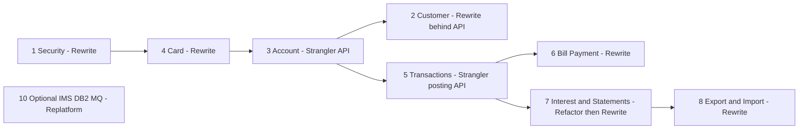

# CardDemo Modernization Blueprint

Strategy selection per bounded context for the AWS CardDemo COBOL/CICS/VSAM estate. Bounded-context names, program lists and file names are the shared ground-truth used by `DOMAIN_DECOMPOSITION.md`, `CUTOVER_PLAN.md` and `RISK_REGISTER.md`; this document only decides **how** each context is modernized. Every claim below was checked against `app/cbl`, `app/cpy`, `app/jcl` and the optional module folders (see "Sources / How this was derived").

## 1. Strategies and scoring model

| Code | Strategy | What it means here |
|---|---|---|
| (a) Strangler | Wrap the CICS transaction / batch step behind an API or event facade, route traffic, replace piece by piece | Facade first, rewrite behind it |
| (b) Replatform | Keep COBOL, run it on a managed cloud runtime (AWS Mainframe Modernization Micro Focus/Rocket or Blu Age managed COBOL) | No business-logic change |
| (c) Refactor | Restructure COBOL in place (remove `ALTER`/`GO TO`, isolate I/O, add tests) before any language change | Same language, cleaner shape |
| (d) Rewrite | Translate to Java/Kotlin/Python with behavioural parity tests | New language, new runtime |

Each strategy is scored 1 (poor fit) to 5 (strong fit) on four dimensions; the recommended strategy is the highest total unless a hard constraint overrides it (noted where it does).

| Dimension | What raises the score for a strategy |
|---|---|
| Business-logic complexity (BLC) | Dense/undocumented rules favour Refactor/Replatform (preserve behaviour); thin CRUD favours Rewrite |
| Data coupling (DC) | Many shared-file writers favour Strangler/Replatform (keep the VSAM record as system of record until seams are cut); isolated files favour Rewrite |
| Team skill availability (TSA) | Assumes a Java-strong, COBOL-thin team; Rewrite/Strangler score high, deep Refactor scores low |
| Risk tolerance (RT) | Money-moving paths score high for Replatform/Strangler (parity preserved); admin/UI paths score high for Rewrite |

## 2. Per-context evaluation

### 2.1 Security/Identity & Access — COSGN00C, COUSR00C/01C/02C/03C, COADM01C; CSUSR01Y, COADM02Y, COMEN02Y; file USRSEC

Verified: all six programs `COPY CSUSR01Y` and the user programs read/write `DATASET(WS-USRSEC-FILE)` where `WS-USRSEC-FILE VALUE 'USRSEC  '` (COSGN00C.cbl:39, :212; COUSR00C.cbl:589; COUSR01C.cbl:241; COUSR02C.cbl:323; COUSR03C.cbl:270). Sign-on is a plaintext compare `IF SEC-USR-PWD = WS-USER-PWD` (COSGN00C.cbl:223; `SEC-USR-PWD PIC X(08)` CSUSR01Y.cpy:21). COADM01C only routes via `XCTL PROGRAM(CDEMO-ADMIN-OPT-PGMNAME(WS-OPTION))` (COADM01C.cbl:146). No other context reads USRSEC.

| Strategy | BLC | DC | TSA | RT | Total | Note |
|---|---|---|---|---|---|---|
| Strangler | 3 | 4 | 4 | 3 | 14 | Facade adds little; nothing else calls these |
| Replatform | 2 | 3 | 3 | 2 | 10 | Keeps plaintext passwords and 8-char IDs |
| Refactor | 2 | 3 | 2 | 2 | 9 | Cannot fix the security model in COBOL/VSAM idiomatically |
| **Rewrite** | **5** | **5** | **5** | **5** | **20** | Thin CRUD on one private file; replacing with IAM/Cognito/Spring Security is a net risk reduction |

**Recommendation: Rewrite (d).** Lowest-coupling context, highest security upside, and the shared-kernel `COCOM01Y` session fields it populates (`CDEMO-USER-ID`, `CDEMO-USER-TYPE`) become JWT claims.

### 2.2 Customer — CBCUS01C; CVCUS01Y, CUSTREC; file CUSTDATA

Verified: CBCUS01C is a 178-line sequential reader (`SELECT CUSTFILE-FILE ASSIGN TO CUSTFILE` :29, `COPY CVCUS01Y` :45) with no writes. CUSTDATA is *read* by COACTVWC (`DATASET(LIT-CUSTFILENAME)` :827) and *rewritten* by COACTUPC (`REWRITE FILE(LIT-CUSTFILENAME)` :4086), by CBSTM03B (`SELECT CUST-FILE ASSIGN TO CUSTFILE` :43), CBTRN01C (:34), CBEXPORT (:35) and CBIMPORT (`CUSTOUT` :43).

| Strategy | BLC | DC | TSA | RT | Total | Note |
|---|---|---|---|---|---|---|
| Strangler | 4 | 4 | 4 | 4 | 16 | Customer API read by Account/Statements first, writes cut over later |
| Replatform | 3 | 3 | 3 | 3 | 12 | Nothing to gain; logic is trivial |
| Refactor | 2 | 2 | 2 | 3 | 9 | Nothing to restructure |
| **Rewrite** | **5** | **3** | **5** | **4** | **17** | Simple record; only the COACTUPC write path is a coupling concern |

**Recommendation: Rewrite (d), exposed behind a Customer API so Account Management (2.3) and Statements (2.7) consume it as a strangler seam.** Hard constraint: the CUSTDATA `REWRITE` inside COACTUPC (:4086) must be redirected to the API in the same wave as 2.3, or the record stays dual-written.

### 2.3 Account Management — COACTVWC, COACTUPC, CBACT01C, CBACT03C; CVACT01Y, CVACT03Y; files ACCTDATA, CARDXREF

Verified: COACTUPC is 4,236 lines; typed edits `TEST-NUMVAL-C` (:1078-1134), cross-field edits (`1280-EDIT-US-STATE-ZIP-CD`, :1664-1705), old-vs-new change detection `1205-COMPARE-OLD-NEW` / `NO-CHANGES-FOUND` (:1460-1463, field compare block around :1684-1705), then `REWRITE FILE(LIT-ACCTFILENAME)` (:4066) and `REWRITE FILE(LIT-CUSTFILENAME)` (:4086). Reads go through the AIX `LIT-CARDXREFNAME-ACCT-PATH` (:3655) = `'CXACAIX '` (:582). ACCTDATA is **also written** by CBTRN02C `2800-UPDATE-ACCOUNT-REC` (:545-560) and CBACT04C `1050-UPDATE-ACCOUNT` (:350-360), and read by COBIL00C (:346), COTRN02C, CBSTM03B (:49), CBEXPORT/CBIMPORT.

| Strategy | BLC | DC | TSA | RT | Total | Note |
|---|---|---|---|---|---|---|
| **Strangler** | **4** | **5** | **4** | **5** | **18** | Account API owns ACCTDATA/CARDXREF; batch writers redirected one at a time |
| Replatform | 3 | 4 | 3 | 4 | 14 | Safe but leaves the 4k-line screen program unchanged |
| Refactor | 3 | 3 | 2 | 3 | 11 | Splitting COACTUPC in COBOL is costly with thin COBOL skills |
| Rewrite (direct) | 3 | 1 | 5 | 2 | 11 | Cannot rewrite while three batch programs still `REWRITE` the same KSDS |

**Recommendation: Strangler (a), then Rewrite.** This context owns the hardest seam (Account master written by 2.5 and 2.7). Sequence: (1) Account/Xref read API; (2) COACTUPC edit rules re-implemented as a validation service with parity tests driven from the 1200-EDIT-* paragraphs; (3) batch writers (CBTRN02C 2800, CBACT04C 1050) switch to the API/event before ACCTDATA leaves VSAM.

### 2.4 Card Management — COCRDLIC, COCRDSLC, COCRDUPC, CBACT02C; CVACT02Y, CVCRD01Y; file CARDDATA

Verified: `'CARDDAT '` literals (COCRDLIC.cbl:214, COCRDSLC.cbl:252, COCRDUPC via `LIT-CARDFILENAME`), browse `STARTBR/READNEXT/ENDBR FILE(LIT-CARD-FILE)` (COCRDLIC.cbl:1130-1376), single `REWRITE FILE(LIT-CARDFILENAME)` (COCRDUPC.cbl:1478), AIX read `LIT-CARDFILENAME-ACCT-PATH` (COCRDSLC.cbl:784). CBACT02C is a 178-line reader (:29). CARDDATA is not written by any other context; CBEXPORT reads it (:59).

| Strategy | BLC | DC | TSA | RT | Total | Note |
|---|---|---|---|---|---|---|
| Strangler | 3 | 4 | 4 | 4 | 15 | Useful only for the list/browse screen paging semantics |
| Replatform | 2 | 3 | 3 | 3 | 11 | Nothing gained |
| Refactor | 2 | 3 | 2 | 3 | 10 | Screen programs are long but structurally simple |
| **Rewrite** | **4** | **4** | **5** | **4** | **17** | Single-writer file, CRUD + paging; ideal first Java domain after Security |

**Recommendation: Rewrite (d).** Card status/expiry edits in COCRDUPC (1200-EDIT-* paragraphs) are the parity test set. The card->account cross-reference (`CVACT03Y`) remains owned jointly with 2.3 and is served by the Account API.

### 2.5 Transactions — COTRN00C/01C/02C, CBTRN01C/02C/03C; CVTRA05Y, CVTRA06Y, CVTRA01Y, CVTRA03Y, CVTRA04Y, CVTRA02Y

Verified: CBTRN02C validation — reject `100` (:385), `101` (:397), over-limit `102` `IF ACCT-CREDIT-LIMIT >= WS-TEMP-BAL` (:407-412), expiry `103` `IF ACCT-EXPIRAION-DATE >= DALYTRAN-ORIG-TS(1:10)` (:414-419), `109` account-not-found (:556). `2000-POST-TRANSACTION` (:424) performs `2700-UPDATE-TCATBAL` (:467, with create/update at :503/:526) and `2800-UPDATE-ACCOUNT-REC` (:545) as three separate VSAM writes (TCATBALF, ACCTFILE, TRANSACT) with no commit scope — a partial failure leaves the files inconsistent. Files: `TRANFILE` (:34), `XREFFILE` (:40), `ACCTFILE` (:51), `TCATBALF` (:57), `DALYTRAN` (:29), `DALYREJS` (:46); JCL POSTTRAN.jcl STEP15 `EXEC PGM=CBTRN02C` (:23) maps them to `TRANSACT/DALYTRAN/CARDXREF/DALYREJS(+1)/ACCTDATA/TCATBALF` (:29-42). Online: COTRN02C writes `DATASET(WS-TRANSACT-FILE)` (:645) after reading `WS-CCXREF-FILE`/`WS-CXACAIX-FILE` (:612/:579); COTRN00C/01C are read-only browse/detail (:594, :270).

| Strategy | BLC | DC | TSA | RT | Total | Note |
|---|---|---|---|---|---|---|
| **Strangler** | **4** | **5** | **4** | **5** | **18** | Posting API/event stream in front of TRANSACT; TCATBALF and ACCTDATA writes redirected through 2.3's seam |
| Replatform | 4 | 4 | 3 | 4 | 15 | Preserves non-atomic posting; buys time only |
| Refactor | 4 | 3 | 2 | 3 | 12 | Cannot add atomicity to three KSDS writes in batch COBOL without redesign |
| Rewrite (direct) | 3 | 1 | 5 | 2 | 11 | Highest volume, most shared data; direct cut-over is the riskiest option |

**Recommendation: Strangler (a) then Rewrite (d).** Read side first (COTRN00C/01C -> Transaction query API over a replicated TRANSACT), then online add (COTRN02C) via the posting API, then batch posting (CBTRN02C) re-implemented as an idempotent, transactional poster that emits account-balance and category-balance updates as events consumed by 2.3 and 2.7. Reject codes 100/101/102/103/109 become an explicit enum with parity tests against DALYREJS output. CBTRN03C is evaluated under 2.7.

### 2.6 Bill Payment — COBIL00C

Verified: `WS-TRANSACT-FILE VALUE 'TRANSACT'`, `WS-ACCTDAT-FILE VALUE 'ACCTDAT '`, `WS-CXACAIX-FILE VALUE 'CXACAIX '` (COBIL00C.cbl:40-42); reads ACCTDAT (:346) and CXACAIX (:411), `REWRITE` of the account (:379), then `WRITE-TRANSACT-FILE` (:510-512) — a two-file "pay in full" with no explicit `SYNCPOINT` (CICS unit-of-work at task end is the only atomicity). 572 lines, single program, `COPY CVACT01Y/CVACT03Y/CVTRA05Y` (:80-82).

| Strategy | BLC | DC | TSA | RT | Total | Note |
|---|---|---|---|---|---|---|
| Strangler | 3 | 4 | 4 | 4 | 15 | Facade is the Transactions posting API — no separate facade needed |
| Replatform | 3 | 3 | 3 | 4 | 13 | Safe, no value |
| Refactor | 2 | 2 | 2 | 3 | 9 | Small program, nothing to restructure |
| **Rewrite** | **4** | **3** | **5** | **4** | **16** | One use case; becomes a client of the Transactions posting API and Account API |

**Recommendation: Rewrite (d), scheduled after the 2.5 posting API exists.** Bill Payment is a thin orchestration; it must not carry its own write path to ACCTDATA/TRANSACT once those are behind APIs.

### 2.7 Interest/Statements/Reporting — CBACT04C, CBSTM03A/CBSTM03B, CORPT00C, CBTRN03C; COSTM01, CVTRA07Y

Verified (CBACT04C, 652 lines): control break on `TRANCAT-ACCT-ID NOT= WS-LAST-ACCT-NUM` / `WS-FIRST-TIME` (:194-201, :220); disclosure lookup `1200-GET-INTEREST-RATE` (:415) falls back silently to `'DEFAULT'` on status `'23'` (:436-438, `1200-A-GET-DEFAULT-INT-RATE` :443); formula `COMPUTE WS-MONTHLY-INT = (TRAN-CAT-BAL * DIS-INT-RATE) / 1200` (:464-465); interest transactions written with hardcoded `'01'`/`'05'` (:482-483); `1400-COMPUTE-FEES` is `* To be implemented` (:518-519); `1050-UPDATE-ACCOUNT` REWRITEs ACCTFILE (:350-356). Files (:28-53): TCATBALF, XREFFILE, ACCTFILE, DISCGRP, TRANSACT; INTCALC.jcl `EXEC PGM=CBACT04C,PARM='2022071800'` (:22).
Verified (CBSTM03A, 924 lines): header lists control-block addressing, ALTER/GO TO, COMP/COMP-3, 2-D array, subroutine call (:26-35); `ALTER 8100-FILE-OPEN TO PROCEED TO ...` x4 (:300-309), 19 `ALTER`/`GO TO` statements; `SET ADDRESS OF PSA-BLOCK/TCB-BLOCK/TIOT-BLOCK` (:266-268); `WS-CARD-TBL OCCURS 51` x `WS-TRAN-TBL OCCURS 10` (:226-228); `CALL 'CBSTM03B' USING WS-M03B-AREA` (:351). All VSAM I/O is delegated to CBSTM03B (TRNXFILE/XREFFILE/CUSTFILE/ACCTFILE, :31-49); CREASTMT.JCL STEP040 `EXEC PGM=CBSTM03A` (:79-86). CBTRN03C (TRANREPT.jcl STEP10R :59) reads TRANFILE/CARDXREF/TRANTYPE/TRANCATG/DATEPARM (:29-55). CORPT00C only submits JCL (read-only over CVTRA05Y :146).

| Strategy | BLC | DC | TSA | RT | Total | Note |
|---|---|---|---|---|---|---|
| Strangler | 3 | 3 | 3 | 3 | 12 | Batch has no request surface to wrap; only outputs can be intercepted |
| Replatform | 4 | 4 | 3 | 4 | 15 | Runs unchanged, but `ALTER`/control-block addressing may not be supported by every managed runtime |
| **Refactor** | **5** | **4** | **3** | **5** | **17** | Remove `ALTER`/`GO TO`, drop PSA/TCB addressing, make DEFAULT fallback and stub fees explicit, isolate I/O — then translation is mechanical |
| Rewrite (direct) | 2 | 2 | 4 | 2 | 10 | Undocumented rules (silent DEFAULT, unimplemented fees, hardcoded '01'/'05') would be either frozen or "fixed" without a decision record |

**Recommendation: Refactor first (c), then Rewrite.** The behaviour is the least documented and most financially sensitive, so the refactor's real deliverable is a **golden-output test set** (INTCALC and CREASTMT outputs per account) plus explicit decisions on the DEFAULT fallback, fee stub and hardcoded codes. After that the Java rewrite is a straight translation validated by the comparison harness. CBTRN03C and CORPT00C are simple report/JCL-submit programs and can be rewritten directly once TRANSACT has a query API.

### 2.8 Data Export/Import — CBEXPORT, CBIMPORT; CVEXPORT

Verified: CBEXPORT (582 lines) reads CUSTFILE/ACCTFILE/XREFFILE/TRANSACT/CARDFILE and writes `EXPFILE` (:35-65, `COPY CVEXPORT` :96); CBIMPORT (487 lines) reads `EXPFILE` and writes `CUSTOUT/ACCTOUT/XREFOUT/TRNXOUT/CARDOUT/ERROUT` (:37-68). CBEXPORT.jcl STEP02 / CBIMPORT.jcl STEP01 map to the five KSDS datasets and `AWS.M2.CARDDEMO.EXPORT.DATA` (:43-63 / :22-49). Pure serialisation of a polymorphic record (`CVEXPORT`), no business rules.

| Strategy | BLC | DC | TSA | RT | Total | Note |
|---|---|---|---|---|---|---|
| Strangler | 2 | 3 | 3 | 3 | 11 | No online surface |
| Replatform | 3 | 4 | 3 | 4 | 14 | Works, but the format is tied to VSAM record layouts that disappear as contexts move |
| Refactor | 2 | 2 | 2 | 3 | 9 | Nothing to restructure |
| **Rewrite** | **5** | **3** | **5** | **4** | **17** | Replace with the target platform's bulk export/import over the new APIs; the polymorphic `CVEXPORT` format is retired |

**Recommendation: Rewrite (d), last.** It touches all five master files, so it is rebuilt as an aggregate export over the new services after 2.2-2.5 have moved; during transition keep the COBOL jobs running as-is on the existing runtime.

### 2.9 Optional/extension contexts (context 10)

Verified locations are `app/app-authorization-ims-db2-mq/cbl` (COPAUS0C 1,032 lines / COPAUS1C 604 / COPAUA0C 1,026 / CBPAUP0C 386, all with `CBLTDLI` IMS calls; COPAUA0C also 3 MQ calls; plus COPAUS2C with 4 `EXEC SQL`, and DBUNLDGS/PAUDBLOD/PAUDBUNL IMS utilities), `app/app-transaction-type-db2/cbl` (COTRTUPC 1,702 lines / COTRTLIC 2,098 / COBTUPDT 237; 7/16/5 `EXEC SQL`), `app/app-vsam-mq/cbl` (CODATE01 524 / COACCT01 620; 12 MQ calls each).

| Strategy | BLC | DC | TSA | RT | Total | Note |
|---|---|---|---|---|---|---|
| Strangler | 2 | 2 | 3 | 3 | 10 | Optional features with no downstream consumers in the core estate |
| **Replatform** | **4** | **5** | **4** | **5** | **18** | IMS/DB2/MQ have managed equivalents; keep COBOL, swap infrastructure |
| Refactor | 2 | 2 | 2 | 3 | 9 | No structural problems found |
| Rewrite | 2 | 2 | 4 | 2 | 10 | Not worth the parity effort for optional modules |

**Recommendation: Replatform (b).** These modules are self-contained and infrastructure-heavy; run them on managed COBOL with DB2->RDS/Aurora, MQ->Amazon MQ, IMS via the runtime's IMS emulation or a DB2 unload (the module already ships PAUDBUNL/PAUDBLOD unload/load utilities). Retire or rewrite only if the business asks for them after the core estate has moved.

## 3. Summary matrix

| # | Bounded context | Strangler | Replatform | Refactor | Rewrite | Recommended | Drives sequencing |
|---|---|---|---|---|---|---|---|
| 1 | Security/Identity & Access | 14 | 10 | 9 | **20** | Rewrite | Private file, no consumers — first wave |
| 2 | Customer | 16 | 12 | 9 | **17** | Rewrite (API-fronted) | COACTUPC write to CUSTDATA must move with #3 |
| 3 | Account Management | **18** | 14 | 11 | 11 | Strangler -> Rewrite | Owns ACCTDATA + CARDXREF, written by #5 and #7 |
| 4 | Card Management | 15 | 11 | 10 | **17** | Rewrite | Single-writer CARDDATA |
| 5 | Transactions | **18** | 15 | 12 | 11 | Strangler -> Rewrite | Non-atomic posting; needs #3 seam |
| 6 | Bill Payment | 15 | 13 | 9 | **16** | Rewrite (after #5 API) | Client of #3 and #5 |
| 7 | Interest/Statements/Reporting | 12 | 15 | **17** | 10 | Refactor -> Rewrite | Golden outputs before translation |
| 8 | Data Export/Import | 11 | 14 | 9 | **17** | Rewrite (last) | Depends on all master files |
| 10 | Optional IMS/DB2/MQ modules | 10 | **18** | 9 | 10 | Replatform | Independent of core waves |

Shared kernel (context 9: COCOM01Y, COMEN01C, CSUTLDPY/CSUTLDWY/CSDAT01Y/CODATECN/CSUTLDTC, CSMSG01Y/02Y, CSSETATY, CSSTRPFY, CSLKPCDY, COTTL01Y) is not a domain and gets no strategy of its own: `COCOM01Y` navigation state is replaced by the new session/JWT model; `CSUTLDPY` date edits (only centuries `19`/`20` valid, CSUTLDPY.cpy:68; 11 `GO TO ... -EXIT` jumps :42-240) become one shared Java validator with parity tests, adopted by whichever context rewrites first.



Validation against the expected outcome shape: Transactions => Strangler-then-Rewrite (confirmed, driven by the ACCTDATA/TCATBALF write coupling); Interest/Statements => Refactor-first (confirmed, driven by `ALTER`/control-block constructs and undocumented rules); Security/User admin => Rewrite (confirmed); optional modules => Replatform (confirmed). Account Management is additionally scored Strangler-first rather than direct Rewrite because it owns the hardest write seam.

## 4. Cross-references

- `DOMAIN_DECOMPOSITION.md` — context boundaries, ownership of CVACT03Y/CARDXREF and ACCTDATA seams this document relies on.
- `CUTOVER_PLAN.md` — wave ordering implied by the mermaid diagram above and the "Drives sequencing" column.
- `RISK_REGISTER.md` — the high-risk items cited here (CBACT04C DEFAULT fallback and fee stub, CBTRN02C non-atomic posting, CBSTM03A `ALTER`/control-block addressing, COACTUPC edit density, CSUTLDPY century limit, COBIL00C pay-in-full).

## Sources / How this was derived

**Files and line ranges inspected**

- `app/cbl/COSGN00C.cbl` :39, :212, :223; `COUSR00C.cbl` :589; `COUSR01C.cbl` :241; `COUSR02C.cbl` :323; `COUSR03C.cbl` :270; `COADM01C.cbl` :146; `app/cpy/CSUSR01Y.cpy` :21
- `app/cbl/CBCUS01C.cbl` :29, :45; `CBACT01C.cbl` :29-45, :89-90; `CBACT02C.cbl` :29, :45; `CBACT03C.cbl` :29, :45
- `app/cbl/COACTUPC.cbl` :574-582 (file literals), :1078-1134, :1460-1463, :1664-1705, :3655, :3704, :3754, :4066, :4086; `COACTVWC.cbl` :728-827
- `app/cbl/COCRDLIC.cbl` :214, :1130-1376; `COCRDSLC.cbl` :252, :743-784; `COCRDUPC.cbl` :1383, :1478
- `app/cbl/CBTRN02C.cbl` :29-57, :181, :208-212, :372-424, :440-441, :467-560; `CBTRN01C.cbl` :29-58, :99-124; `CBTRN03C.cbl` :29-55, :93-113; `COTRN00C.cbl` :594; `COTRN01C.cbl` :270; `COTRN02C.cbl` :41-42, :579, :612, :645
- `app/cbl/COBIL00C.cbl` :40-42, :80-82, :346, :379, :411, :444, :510-512
- `app/cbl/CBACT04C.cbl` :28-53, :97-117, :167-170, :194-221, :350-360, :415-465, :482-483, :518-519; `CBSTM03A.CBL` :26-35, :39-40, :51-57, :226-232, :266-268, :300-309, :351; `CBSTM03B.CBL` :31-49; `CORPT00C.cbl` :138-146; `app/cpy/CVTRA01Y.cpy` :4-9; `app/cpy/CVACT03Y.cpy` :5-7
- `app/cbl/CBEXPORT.cbl` :35-65, :75-96; `CBIMPORT.cbl` :37-68, :84-113
- `app/cpy/CSUTLDPY.cpy` :42-240
- `app/jcl/POSTTRAN.jcl` :23-42; `INTCALC.jcl` :22-41; `CREASTMT.JCL` :44-96; `TRANREPT.jcl` :59-80; `CBEXPORT.jcl` :43-63; `CBIMPORT.jcl` :22-49
- `app/app-authorization-ims-db2-mq/cbl/*`, `app/app-transaction-type-db2/cbl/*`, `app/app-vsam-mq/cbl/*` (line counts and `EXEC SQL` / `CBLTDLI` / `MQ*` call counts)
- `README.md` :74, :283-293, :338, :348-351

**Verification commands (run from repo root)**

```
grep -n -iE "^\s*COPY |SELECT .* ASSIGN|DATASET\s*\(|FILE\s*\(|CALL '|XCTL" app/cbl/*
grep -n -E "1200|DEFAULT|To be implemented|WS-LAST-ACCT-NUM|WS-FIRST-TIME|1400-COMPUTE-FEES|'23'" app/cbl/CBACT04C.cbl
grep -n -E "OVERLIMIT|EXPIR|MOVE 10[0-9]|2000-POST|2700-|2800-" app/cbl/CBTRN02C.cbl
grep -c -E "ALTER |GO TO" app/cbl/CBSTM03A.CBL ; grep -n "SET ADDRESS\|OCCURS\|ALTER " app/cbl/CBSTM03A.CBL
grep -n -hE "VALUE '(USRSEC|ACCTDAT|CARDDAT|CXACAIX|CCXREF|TRANSACT|CUSTDAT)" app/cbl/*.cbl
grep -n -E "EXEC PGM=|DSN=" app/jcl/{POSTTRAN,INTCALC,TRANREPT,CBEXPORT,CBIMPORT}.jcl app/jcl/CREASTMT.JCL
for f in app/app-*/cbl/*; do grep -c -iE "EXEC SQL" $f; grep -c -E "CBLTDLI|EXEC DLI" $f; grep -c -E "MQOPEN|MQGET|MQPUT" $f; done
```

**Discrepancies versus the shared ground-truth (names kept as given)**

1. Optional modules live under `app/` (`app/app-authorization-ims-db2-mq`, `app/app-transaction-type-db2`, `app/app-vsam-mq`), not at the repository root. The authorization module also contains COPAUS2C (DB2) and the IMS utilities DBUNLDGS, PAUDBLOD, PAUDBUNL, which are not in the ground-truth list.
2. Batch DD names differ from the ground-truth file names: CBTRN01C/02C/03C assign TRANSACT to DD `TRANFILE` and CBTRN03C assigns the xref to DD `CARDXREF`; only CBACT04C/CBEXPORT use DD `TRANSACT`. The JCL maps them to the same `AWS.M2.CARDDEMO.TRANSACT.VSAM.KSDS` / `CARDXREF.VSAM.KSDS` datasets, so the coupling analysis is unchanged.
3. CICS file names for the card cross-reference are `CCXREF` (base) and `CXACAIX` (AIX path); the ground-truth's `CARDXREF`/`XREFFILE` are the dataset and batch DD names respectively.
4. CBTRN02C also emits reject reason `101` (:397) in addition to 100/102/103/109.
5. COACTUPC is 4,236 lines, not "~1800+"; the cited edit range :1664-1705 and change detection are confirmed. The interest formula is at CBACT04C.cbl:464-465 (ground-truth "~462").
6. CBSTM03A itself declares no VSAM files (only STMTFILE/HTMLFILE :39-40); all KSDS reads are in CBSTM03B. CBACT04C also copies CVTRA02Y (disclosure group) and reads DISCGRP, which the ground-truth lists under Transactions copybooks.
7. `carddemo-batch/` and `test-harness/` referenced by the environment blueprint are not present on `feature/praveen-java-migration-base` (commit 5c0c7d6); the "comparison harness" referenced in 2.7 is therefore the planned harness, not an existing artifact on this branch.
