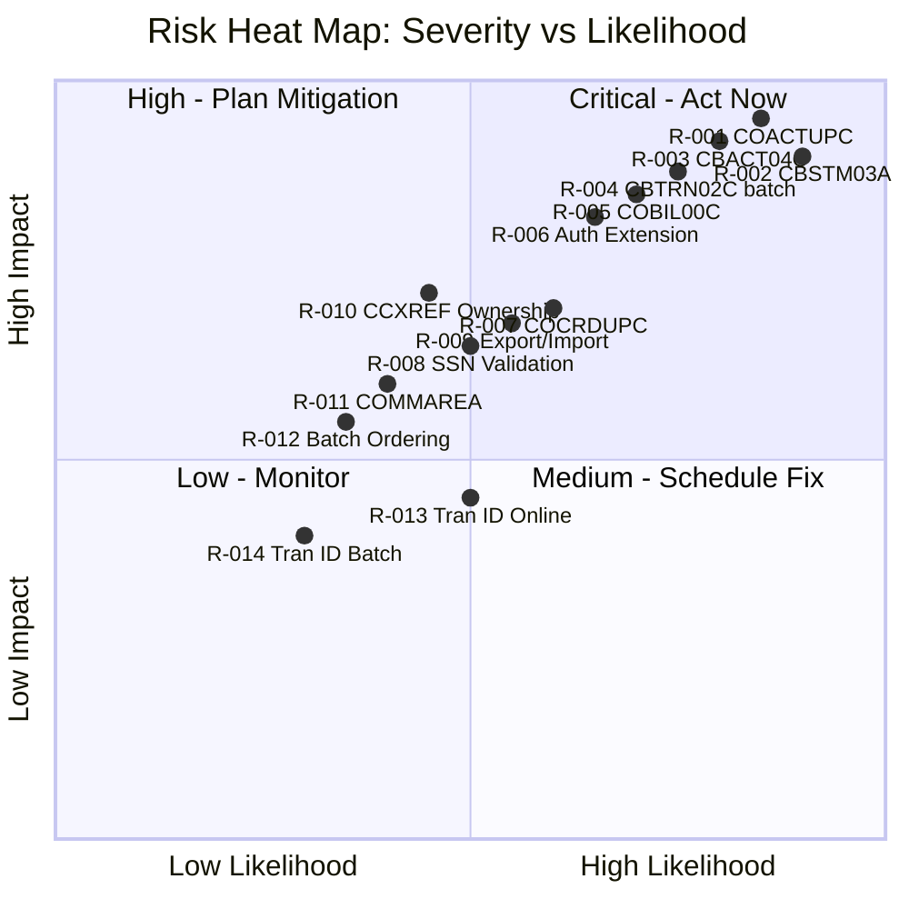

# CardDemo Risk Register

This document catalogs every identified migration risk for the CardDemo COBOL-to-Java modernization, ranked by severity with specific mitigation strategies.

---

## Risk Summary Table

| Risk ID | Program(s) | Category | Severity | Description | Mitigation |
|:--------|:-----------|:---------|:---------|:------------|:-----------|
| R-001 | COACTUPC | Complexity / Validation | **Critical** | Largest program (4,236 lines) with ~50 undocumented validation flags, dual-entity (account+customer) update, and a 16-state EVALUATE dispatcher. The sheer size and interleaved business logic make mechanical translation extremely error-prone. | Extract all validation rules into a formal specification. Decompose into separate Account Update and Customer Update services. Write integration tests for each validation path before migration. |
| R-002 | CBSTM03A | Control Flow / Platform | **Critical** | Uses ALTER/GO TO self-modifying control flow, PSA/TCB/TIOT pointer arithmetic (z/OS-specific), 2D array manipulation (51x10), and sub-program call to CBSTM03B. No direct Java translation is possible. | Rewrite from scratch in Java. Capture current output format as behavioral specification. Build golden-file tests against actual statement output files. Do not attempt mechanical conversion. |
| R-003 | CBACT04C | Financial / Documentation | **Critical** | Undocumented interest formula with magic number 1200 (`monthly_interest = category_balance * rate_percentage / 1200`), undocumented default-group fallback on file status '23', incomplete `1400-COMPUTE-FEES` stub, and destructive cycle-reset (zeros `ACCT-CURR-CYC-CREDIT` and `ACCT-CURR-CYC-DEBIT`). Financial calculation errors could affect every customer account. | Document the complete interest formula with worked examples. Add unit tests with known-good calculations. Implement the fee computation stub. Define cycle-reset semantics explicitly. Replace date-based transaction ID generation with sequence. |
| R-004 | CBTRN02C (batch) | Data Integrity / Transactions | **Critical** | Triple-write across TCATBALF + ACCTFILE + TRANSACT with no transactional boundary. Implicit upsert pattern on TCATBALF (triggered by file status '23'). Incomplete validation (comment "ADD MORE VALIDATIONS HERE" at line 377). Undocumented overlimit calculation. | Define saga pattern with compensating transactions for each write step. Document all validations including the missing ones. Formalize the upsert pattern. Add compensating rollback for each write in the triple-write sequence. |
| R-005 | COBIL00C | Concurrency / Data Integrity | **Critical** | Dual-write (TRANSACT + ACCTDAT) in a single CICS pseudo-conversation. Race condition on transaction ID generation via READPREV/ADD 1. Hardcoded values (type '02', category 2, merchant ID 999999999). "Pay in full" only -- no partial payment support. | Replace READPREV-based ID generation with database sequence. Implement saga pattern for dual-write. Document all hardcoded business rules. Confirm "pay in full" constraint with business stakeholders. |
| R-006 | COPAUA0C, COPAUS0-2C, CBPAUP0C, DBUNLDGS, PAUDBLOD, PAUDBUNL | Platform / Architecture | **Critical** | 8 programs across IMS DB + DB2 + MQ with two-phase commit semantics. No direct Java/Spring equivalent for IMS hierarchical database (DL/I calls). MQ trigger-based processing requires architectural redesign. | Redesign data model from hierarchical (IMS) to relational (PostgreSQL/MySQL). Replace MQ trigger processing with event streaming (Kafka or Spring Cloud Stream). Implement two-phase commit replacement using saga pattern. Phase this as the last migration step. |
| R-007 | COCRDUPC | State Management / Concurrency | **High** | 10-state machine (1,560 lines) with optimistic concurrency control. Private COMMAREA extension via offset arithmetic is fragile and undocumented. State transitions depend on implicit CICS pseudo-conversational semantics. | Map all 10 states and transitions into a formal state diagram. Test optimistic locking behavior under concurrent access. Refactor COMMAREA offset pattern into explicit typed DTOs. |
| R-008 | COACTUPC | Validation / Documentation | **High** | SSN validation contains specific exclusion rules (area numbers 0, 666, 900-999) with a 3-part flag system (`WS-EDIT-SSN-FLAG-1/2/3`). These rules are entirely undocumented and embedded in procedural code. | Extract SSN validation rules into a formal specification. Unit test all edge cases including boundary values. Document the 3-part flag system and its interactions. |
| R-009 | CBEXPORT, CBIMPORT | Data Conversion | **High** | CVEXPORT copybook uses COMP/COMP-3 (packed decimal) fields and REDEFINES for polymorphic record types. Numeric conversion errors during export/import could silently corrupt customer, account, and card data. | Build comprehensive round-trip test (export from COBOL, import to Java, re-export, compare). Validate all numeric field conversions individually. Test every REDEFINES variant with known test data. |
| R-010 | (multiple) | Architecture / Ownership | **High** | CCXREF (card-to-account cross-reference) is read by 10+ programs across 4 domains (Transaction Processing, Card Management, Account Management, Authorization Extension). Ownership decision affects all API boundaries and data consistency guarantees. | Decide CCXREF ownership early (recommended: Card Management). Build a dedicated lookup service API. All consuming domains access CCXREF through this API rather than direct file reads. |
| R-011 | (all online) | Architecture / Coupling | **Medium** | COMMAREA (`COCOM01Y`) couples every online program through a shared session state structure. Fields include user ID, program name, screen data, return codes, and error flags. Any replacement strategy affects all 20+ online programs simultaneously. | Design JWT/session replacement architecture before any program migration. Define per-service session contracts. Implement as a shared library consumed by all microservices during transition. |
| R-012 | (all batch) | Operations / Sequencing | **Medium** | 13 JCL batch jobs have implicit sequencing dependencies. The execution order is not formally documented -- it is implied by the JCL submission sequence. Wrong order causes data corruption (e.g., running POSTTRAN before COMBTRAN produces incomplete postings). | Document the execution DAG with explicit dependencies. Implement in Spring Batch/Airflow with predecessor constraints. Add validation checks between jobs to detect out-of-order execution. |
| R-013 | COTRN02C (online) | Concurrency | **Medium** | Transaction ID generation uses the same READPREV/ADD 1 pattern as COBIL00C (R-005). Under concurrent access, two users could generate the same transaction ID, causing a duplicate key error or data overwrite. | Replace with sequence generator (database sequence or UUID). Add unique constraint on transaction ID. Test under concurrent load. |
| R-014 | CBACT04C | Data Generation | **Medium** | Transaction ID generation concatenates `PARM-DATE` with a sequential suffix. This scheme is fragile: date format changes or high-volume days could exhaust the suffix space. | Replace with UUID or database sequence. Ensure backward compatibility with existing transaction ID formats in downstream systems. |

---

## Risk Heat Map

### Heat Map Summary

| Quadrant | Risks | Action |
|:---------|:------|:-------|
| **Critical -- Act Now** (high impact, high likelihood) | R-001, R-002, R-003, R-004, R-005, R-006 | Document and test before any code migration. These programs require rewrites, decomposition, or saga patterns. |
| **High -- Plan Mitigation** (high impact, medium likelihood) | R-007, R-008, R-009, R-010 | Add test harnesses and formal specifications. These programs can be translated but need rigorous validation. |
| **Medium -- Schedule Fix** (medium impact, medium likelihood) | R-011, R-012 | Address as architectural prerequisites in Phase 1 (COMMAREA replacement, batch DAG documentation). |
| **Low -- Monitor** (lower impact, lower likelihood) | R-013, R-014 | Fix as part of normal migration work (replace ID generation patterns with sequences). |

---

## Risk Dependencies

Several risks are interconnected and should be addressed in coordinated groups:

1. **ID Generation Cluster:** R-005 (COBIL00C), R-013 (COTRN02C online), R-014 (CBACT04C) all share the same READPREV/sequential ID anti-pattern. A single sequence generator design resolves all three.

2. **CCXREF Coupling Cluster:** R-010 (CCXREF ownership) affects R-004 (CBTRN02C cross-reference reads), R-005 (COBIL00C cross-reference reads), and multiple Phase 2-3 programs. Decide ownership before Phase 2.

3. **Financial Accuracy Cluster:** R-003 (CBACT04C interest) and R-004 (CBTRN02C posting) share TCATBALF. Validation of one affects the other. Test together using end-to-end batch cycle simulation.

4. **Dual/Triple-Write Cluster:** R-004 (triple-write) and R-005 (dual-write) both need saga patterns. Design the saga framework once and apply to both programs.
