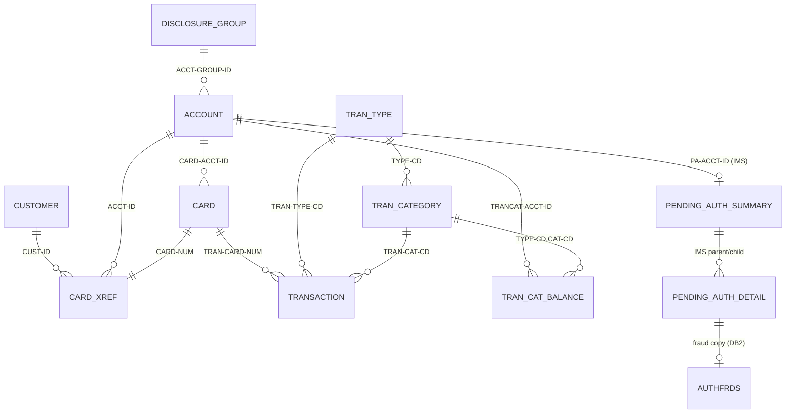

# CardDemo Data Dictionary

Related documents: [APPLICATION_INVENTORY](./APPLICATION_INVENTORY.md), [DEPENDENCY_MAP](./DEPENDENCY_MAP.md), [HOTSPOT_REPORT](./HOTSPOT_REPORT.md).

Generated from static analysis of `app/` on branch develop-asiri; extraction rules are described in HOTSPOT_REPORT.md §1.

Field-level dictionary for every copybook in `app/cpy/`, grouped by business entity. Byte lengths honor OCCURS; REDEFINES show 0 bytes; 88-levels render as condition rows under their parent. Type is derived from PIC+USAGE. Section *PII and sensitive-data inventory* classifies every copybook holding personal, payment-card or credential data.

## Entity relationship

## PII and sensitive-data inventory

CardDemo carries real-world categories of personal and payment data in plain, unencrypted fixed-length records. The table below classifies every copybook that holds such fields so that a modernization team can decide masking, encryption-at-rest, tokenisation and access-logging per entity before any data is migrated or copied into lower environments. Classification used:

- **Direct identifier** — identifies a natural person on its own (name, SSN, government ID, DOB).
- **Payment card data (PCI-DSS)** — PAN, CVV, expiry, cardholder name. CVV must never be stored post-authorisation under PCI-DSS; the estate stores it in `CARD-CVV-CD`.
- **Financial account data** — account numbers, balances, credit limits, FICO score, EFT bank account.
- **Contact data** — address, phone.
- **Credentials** — user id + plaintext password.
- **Indirect / quasi-identifier** — internal keys (CUST-ID, ACCT-ID) and merchant/location data that become identifying when joined.

### By copybook

| Copybook | Record | PII / sensitive fields | Category | Where it flows (programs / datasets) |
|---|---|---|---|---|
| **CVCUS01Y**, **CUSTREC** (identical) | CUSTOMER-RECORD | CUST-FIRST/MIDDLE/LAST-NAME, CUST-ADDR-LINE-1/2/3, CUST-ADDR-STATE-CD, CUST-ADDR-COUNTRY-CD, CUST-ADDR-ZIP, CUST-PHONE-NUM-1/2, **CUST-SSN**, **CUST-GOVT-ISSUED-ID**, **CUST-DOB-YYYY-MM-DD**, CUST-EFT-ACCOUNT-ID, CUST-FICO-CREDIT-SCORE, CUST-ID | Direct identifier, contact, financial | `CUSTDATA.VSAM.KSDS` / `CUSTDATA.PS` (+ `app/data/ASCII/custdata.txt`, `EBCDIC/…CUSTDATA.PS` sample files in the repo); read by COACTVWC, COACTUPC, COCRDSLC, COCRDUPC, COPAUA0C, COPAUS0C, CBCUS01C, CBTRN01C, CBEXPORT, CBSTM03A; rewritten by COACTUPC. Highest-sensitivity record in the estate. |
| **CVACT02Y** | CARD-RECORD | **CARD-NUM** (16-digit PAN), **CARD-CVV-CD**, CARD-EMBOSSED-NAME, CARD-EXPIRAION-DATE, CARD-ACCT-ID | Payment card (PCI) | `CARDDATA.VSAM.KSDS` / `.PS` (+ `carddata.txt` sample); COCRDLIC, COCRDSLC, COCRDUPC, COACTVWC, COPAUS0C, CBACT02C, CBTRN01C, CBEXPORT/CBIMPORT. PAN is displayed unmasked on the card list/detail screens (COCRDLI/COCRDSL maps). |
| **CVACT03Y** | CARD-XREF-RECORD | XREF-CARD-NUM (PAN), XREF-CUST-ID, XREF-ACCT-ID | Payment card + quasi-identifier | `CARDXREF.VSAM.KSDS` (+AIX path); read by 14 programs — this is the join that turns a PAN into a person. |
| **CVACT01Y** | ACCOUNT-RECORD | ACCT-ID, ACCT-CURR-BAL, ACCT-CREDIT-LIMIT, ACCT-CASH-CREDIT-LIMIT, ACCT-CURR-CYC-CREDIT/DEBIT, ACCT-ADDR-ZIP | Financial account, contact (ZIP) | `ACCTDATA.VSAM.KSDS` / `.PS` / `.ARRYPS` / `.VBPS` / `.PSCOMP` (+ `acctdata.txt`); 14 programs; balances shown on COACTVW/COACTUP/COBIL00 screens and on statements. |
| **CVTRA05Y**, **CVTRA06Y**, **COSTM01** (identical layouts) | TRAN-RECORD / DALYTRAN-RECORD / TRNX-RECORD | TRAN-CARD-NUM (PAN), TRAN-MERCHANT-NAME/CITY/ZIP, TRAN-AMT, TRAN-ORIG-TS, TRAN-DESC | Payment card + behavioural/location | `TRANSACT.VSAM.KSDS`, `DALYTRAN.PS`, `DALYREJS(+1)`, `SYSTRAN(+1)`, `TRANSACT.BKUP/COMBINED/DALY(+1)`, `TRXFL.*`, `TRANSACT.IMPORT`, `EXPORT.DATA`; every GDG generation is a PAN-bearing copy. CREASTMT sorts the whole ledger by PAN into `TRXFL`. |
| **CVTRA01Y** | TRAN-CAT-BAL-RECORD | TRANCAT-ACCT-ID, TRAN-CAT-BAL | Financial (spend profile per account/category) | `TCATBALF.VSAM.KSDS`, `TCATBALF.REPT`, `TCATBALF.BKUP`. |
| **CSUSR01Y** | SEC-USER-DATA | SEC-USR-ID, SEC-USR-FNAME, SEC-USR-LNAME, **SEC-USR-PWD (plaintext)**, SEC-USR-TYPE | Credentials, direct identifier | `USRSEC.VSAM.KSDS` / `.PS` (+ `EBCDIC/…USRSEC.PS` sample with default credentials ADMIN001/PASSWORD, USER0001/PASSWORD); COSGN00C compares password byte-for-byte; COUSR00C lists users with passwords on screen. |
| **COCOM01Y** | CARDDEMO-COMMAREA | CDEMO-USER-ID, CDEMO-CUST-ID, CDEMO-CUST-FNAME/MNAME/LNAME, CDEMO-ACCT-ID, CDEMO-CARD-NUM | Direct identifier, payment card, financial | In-flight only: CICS COMMAREA carried on every RETURN/XCTL across all 21 online programs; appears in CICS dumps/traces. |
| **CVCRD01Y** | CC-WORK-AREAS | CC-ACCT-ID, CC-CARD-NUM, CC-CUST-ID | Payment card, quasi-identifier | Working storage of 7 screen programs (COACTVWC, COACTUPC, COCRDLIC, COCRDSLC, COCRDUPC, COTRTLIC, COTRTUPC). |
| **CVEXPORT** | EXPORT-RECORD | Union of *all* of the above: EXP-CUST-* (names, address, phones, **SSN**, **GOVT-ISSUED-ID**, **DOB**, EFT account, FICO), EXP-ACCT-* (balances, limits), EXP-CARD-* (**PAN, CVV**, embossed name, expiry), EXP-XREF-*, EXP-TRAN-* (PAN, merchant) | All categories | `EXPORT.DATA` sequential file written by CBEXPORT and read by CBIMPORT; a single flat file containing the complete customer + card + account + transaction profile — the highest-risk artifact to leave lying in a dataset or in `app/data/EBCDIC/…EXPORT.DATA.PS`. |
| **CIPAUSMY** (IMS PAUTSUM0) | pending-auth summary | PA-ACCT-ID, PA-CUST-ID, PA-CREDIT-LIMIT, PA-CASH-LIMIT, PA-CREDIT-BALANCE, PA-CASH-BALANCE, approved/declined counts+amounts | Financial, quasi-identifier | IMS DB `DBPAUTP0`; COPAUA0C, COPAUS0C/1C, CBPAUP0C; unload files `PAUTDB.ROOT.*`, `IMSDATA.DBPAUTP0` (sample in repo). |
| **CIPAUDTY** (IMS PAUTDTL1) | pending-auth detail | **PA-CARD-NUM** (PAN), PA-CARD-EXPIRY-DATE, PA-TRANSACTION-AMT, PA-APPROVED-AMT, PA-MERCHANT-ID/NAME/CITY/STATE/ZIP, PA-POS-ENTRY-MODE, PA-ACQR-COUNTRY-CODE, PA-AUTH-FRAUD | Payment card + behavioural/location | IMS DB `DBPAUTP0`; unload `PAUTDB.CHILD.*`; copied to DB2 `CARDDEMO.AUTHFRDS` by COPAUS2C. |
| **CCPAURQY** / **CCPAURLY** | MQ auth request / reply | PA-RQ-CARD-NUM, PA-RQ-CARD-EXPIRY-DATE, PA-RQ-TRANSACTION-AMT, PA-RQ-MERCHANT-NAME/CITY/STATE/ZIP; PA-RL-CARD-NUM, PA-RL-APPROVED-AMT | Payment card | Clear-text CSV messages on MQ queues `AWS.M2.CARDDEMO.PAUTH.REQUEST` / `.REPLY` (COPAUA0C). PAN is echoed back in the reply. |
| **AUTHFRDS** (DCLGEN) | DB2 CARDDEMO.AUTHFRDS | CARD_NUM (PAN), CARD_EXPIRY_DATE, ACCT_ID, CUST_ID, MERCHANT_*, TRANSACTION_AMT, APPROVED_AMT, AUTH_FRAUD | Payment card, quasi-identifier | DB2 table; primary key is (CARD_NUM, AUTH_TS) so the PAN is also in the index `XAUTHFRD`. |
| **CVTRA07Y** | transaction report lines | TRAN-REPORT-ACCOUNT-ID, TRAN-REPORT-TRANS-ID, TRAN-REPORT-AMT | Financial | `TRANREPT(+1)` print dataset (CBTRN03C). |
| BMS symbolic maps **COACTUP**, **COACTVW**, **COCRDLI**, **COCRDSL**, **COCRDUP**, **COTRN00/01/02**, **COBIL00**, **COSGN00**, **COUSR00–03**, **COPAU00/01** | screen I/O areas | Screen mirrors of the fields above: names, full address, phones, **SSN**, **DOB**, government id, FICO, PAN, CVV-free but expiry, balances, and for COSGN00/COUSR0x the **password** field | All categories | 3270 data streams; COUSR00 map lists user ids **with passwords**; COSGN00 password field should be DRK-attribute but the record it lands in is plaintext. |

### Copybooks with *no* PII

`CVTRA02Y` (disclosure group rates), `CVTRA03Y`/`CVTRA04Y` (transaction type/category reference), `CSDAT01Y`, `COTTL01Y`, `CSMSG01Y`, `CSMSG02Y`, `CODATECN`, `CSLKPCDY` (public state/ZIP/area-code lists), `CSSETATY`, `CSSTRPFY`, `CSUTLDPY`, `CSUTLDWY`, `COMEN02Y`, `COADM02Y`, `UNUSED1Y`, `IMSFUNCS`, `*PCB`, `CSDB2RPY`, `CSDB2RWY`, `CCPAUERY` (error log — carries MQ/IMS return codes only), `DCLTRTYP`, `DCLTRCAT`, `COTRTLI`/`COTRTUP` maps.

### Sample data shipped in the repository

`app/data/ASCII/*.txt` and `app/data/EBCDIC/AWS.M2.CARDDEMO.*` contain populated instances of every PII-bearing record above (customers with SSNs and DOBs, 16-digit card numbers with CVVs, user ids with passwords). They are synthetic test data, but any pipeline that treats the repo as a data source — or copies these files into a cloud bucket — should apply the same controls as production.

### Implications for the Java target

1. **Tokenise the PAN at the boundary.** `CARD-NUM` is the join key across CARD, XREF, TRANSACTION, AUTH and the MQ messages, and is the physical sort key for statements. Replace it with a token/surrogate id in the relational model and keep the PAN only in a vaulted card service.
2. **Do not carry CVV forward.** `CARD-CVV-CD` (and `EXP-CARD-CVV-CD`) must be dropped at migration; PCI-DSS 3.2 prohibits storing it.
3. **Hash credentials.** `SEC-USR-PWD` is plaintext and displayed on the user-list screen; wave 2 of the modernization order replaces `USRSEC` with a proper identity store.
4. **Split the customer aggregate.** `CVCUS01Y` mixes contact data with SSN/DOB/government id/FICO. Model regulated identifiers as a separate, access-logged entity so that account-servicing screens (COACTVW-equivalents) can be built without SSN read access.
5. **Kill the flat-file copies.** The GDGs (`TRANSACT.BKUP`, `SYSTRAN`, `COMBINED`, `DALYREJS`, `TRXFL`, `EXPORT.DATA`) and the `.PS` seed files are un-encrypted PAN-bearing copies with no retention policy in the JCL; they disappear when posting/interest/statements become database transactions.
6. **Session state.** `COCOM01Y` puts customer name, account id and PAN in the CICS COMMAREA on every interaction. The Java session/JWT should carry opaque ids only and re-read display data server-side.

## Account

### CVACT01Y — `app/cpy/CVACT01Y.cpy`

Account master record (300 bytes). VSAM KSDS AWS.M2.CARDDEMO.ACCTDATA.VSAM.KSDS (CICS file ACCTDAT), key ACCT-ID. Read online by COACTVWC/COACTUPC/COBIL00C/COTRN02C/COPAUA0C/COPAUS0C/COACCT01; rewritten by COACTUPC (update), COBIL00C (bill pay), CBTRN02C (posting), CBACT04C (interest/cycle reset).

Record length: **300 bytes**; used by: COPAUA0C, COPAUS0C, COACCT01, CBACT01C, CBACT04C, CBEXPORT, CBIMPORT, CBSTM03A, CBTRN01C, CBTRN02C, COACTUPC, COACTVWC, COBIL00C, COTRN02C.

| Level | Field | PIC | Usage | Bytes | Type | Business meaning | Validation / domain rules |
|---|---|---|---|---|---|---|---|
| 1 | ACCOUNT-RECORD | - | DISPLAY | 300 | group | Account Record | - |
| 5 | ACCT-ID | 9(11) | DISPLAY | 11 | numeric-display | Account identifier; primary key of ACCTDAT and target of CARD-XREF XREF-ACCT-ID / CARD-ACCT-ID. | 11-digit, numeric, non-zero (COACTUPC 1210-EDIT-ACCOUNT; COCRDUPC/COCRDSLC 'Account number must be a non zero 11 digit number'; COTRN02C 'Account ID must be Numeric'). |
| 5 | ACCT-ACTIVE-STATUS | X(01) | DISPLAY | 1 | alphanumeric | Account open/closed flag. | Must be 'Y' or 'N' (COACTUPC 1220-EDIT-YESNO). COPAUA0C defines decline reason 4300 'account closed' but never tests this field. |
| 5 | ACCT-CURR-BAL | S9(10)V99 | DISPLAY | 12 | numeric-display-signed | Current outstanding balance (positive = amount owed). Increased by posted transaction amounts (CBTRN02C 2800), by monthly interest (CBACT04C 1050), and set to zero by bill payment (COBIL00C). | Signed 10.2; screen edit via COACTUPC 1250-EDIT-SIGNED-9V2 (format -9999999999.99). Authorization uses CREDIT-LIMIT - CURR-BAL as available credit when no IMS summary exists (COPAUA0C 6000). |
| 5 | ACCT-CREDIT-LIMIT | S9(10)V99 | DISPLAY | 12 | numeric-display-signed | Total revolving credit limit. | Signed 10.2 (COACTUPC 1250-EDIT-SIGNED-9V2). Posting rejects a transaction with reason 102 OVERLIMIT when CYC-CREDIT - CYC-DEBIT + amount > CREDIT-LIMIT (CBTRN02C 1500-B). Copied into IMS PA-CREDIT-LIMIT on each authorization (COPAUA0C 8400). |
| 5 | ACCT-CASH-CREDIT-LIMIT | S9(10)V99 | DISPLAY | 12 | numeric-display-signed | Cash-advance sub-limit. | Signed 10.2 (COACTUPC 1250). Copied into IMS PA-CASH-LIMIT; not otherwise enforced in code. |
| 5 | ACCT-OPEN-DATE | X(10) | DISPLAY | 10 | alphanumeric | Date account was opened. | YYYY-MM-DD; validated by CSUTLDPY EDIT-DATE-CCYYMMDD (century 19/20, month 1-12, day-in-month incl. leap year) then CSUTLDTC/CEEDAYS (COACTUPC 1200). YYYY-MM-DD |
| 5 | ACCT-EXPIRAION-DATE | X(10) | DISPLAY | 10 | alphanumeric | Account expiry date (field name misspelled in source and must be preserved for record compatibility). | YYYY-MM-DD (CSUTLDPY EDIT-DATE-CCYYMMDD). Posting rejects with reason 103 when EXPIRAION-DATE < DALYTRAN-ORIG-TS(1:10) (CBTRN02C 1500-B). YYYY-MM-DD |
| 5 | ACCT-REISSUE-DATE | X(10) | DISPLAY | 10 | alphanumeric | Date card(s) on the account were last reissued. | YYYY-MM-DD (CSUTLDPY EDIT-DATE-CCYYMMDD). YYYY-MM-DD |
| 5 | ACCT-CURR-CYC-CREDIT | S9(10)V99 | DISPLAY | 12 | numeric-display-signed | Sum of positive-amount transactions posted in the current statement cycle (note: 'credit' here means purchases/charges, i.e. amount >= 0). | Signed 10.2. Incremented by CBTRN02C 2800 when DALYTRAN-AMT >= 0; reset to 0 by CBACT04C 1050 at interest run (cycle close). |
| 5 | ACCT-CURR-CYC-DEBIT | S9(10)V99 | DISPLAY | 12 | numeric-display-signed | Sum of negative-amount transactions (payments/credits) in the current cycle. | Signed 10.2. Incremented by CBTRN02C 2800 when DALYTRAN-AMT < 0; reset to 0 by CBACT04C 1050. |
| 5 | ACCT-ADDR-ZIP | X(10) | DISPLAY | 10 | alphanumeric | Account-level ZIP code (duplicates CUST-ADDR-ZIP; kept in sync by COACTUPC). | First 5 chars numeric (COACTUPC 1245-EDIT-NUM-REQD len 5); state+ZIP2 combo checked against CSLKPCDY table (1280-EDIT-US-STATE-ZIP-CD). |
| 5 | ACCT-GROUP-ID | X(10) | DISPLAY | 10 | alphanumeric | Pricing/disclosure group. Foreign key to DIS-ACCT-GROUP-ID in CVTRA02Y; selects the interest rate per transaction category. | CBACT04C 1200 looks up (GROUP-ID, TYPE-CD, CAT-CD) in DISCGRP and falls back to group 'DEFAULT' (1200-A) when not found. |
| 5 | FILLER | X(178) | DISPLAY | 178 | alphanumeric | reserved | - |

## Card

### CVACT02Y — `app/cpy/CVACT02Y.cpy`

Credit card master record (150 bytes). VSAM KSDS CARDDATA (CICS CARDDAT), key CARD-NUM, with AIX CARDAIX on CARD-ACCT-ID. Maintained by COCRDLIC/COCRDSLC/COCRDUPC.

Record length: **150 bytes**; used by: COPAUS0C, COTRTLIC, CBACT02C, CBEXPORT, CBIMPORT, CBTRN01C, COACTVWC, COCRDLIC, COCRDSLC, COCRDUPC.

| Level | Field | PIC | Usage | Bytes | Type | Business meaning | Validation / domain rules |
|---|---|---|---|---|---|---|---|
| 1 | CARD-RECORD | - | DISPLAY | 150 | group | Card Record | - |
| 5 | CARD-NUM | X(16) | DISPLAY | 16 | alphanumeric | 16-digit PAN; primary key. | 16-digit numeric (COCRDUPC/COCRDSLC 'Card number if supplied must be a 16 digit number'; COTRN02C 'Card Number must be Numeric'). |
| 5 | CARD-ACCT-ID | 9(11) | DISPLAY | 11 | numeric-display | Owning account; alternate index key (CARDAIX) used for account-scoped card lists. | 11-digit non-zero numeric (COCRDUPC 'Account number must be a non zero 11 digit number'). Non-admin users may only list cards for CDEMO-ACCT-ID in COMMAREA (COCRDLIC). |
| 5 | CARD-CVV-CD | 9(03) | DISPLAY | 3 | numeric-display | Card verification value. | 3 digits; not editable online (not on COCRDUP map). |
| 5 | CARD-EMBOSSED-NAME | X(50) | DISPLAY | 50 | alphanumeric | Cardholder name as printed on the card. | Mandatory; alphabetic + spaces only (COCRDUPC 'Card name can only contain alphabets and spaces'). |
| 5 | CARD-EXPIRAION-DATE | X(10) | DISPLAY | 10 | alphanumeric | Card expiry (misspelling preserved from source). | YYYY-MM-DD. COCRDUPC edits month 1-12 ('Card expiry month must be between 1 and 12') and year against a valid range ('Invalid card expiry year'). Sent to IMS as PA-CARD-EXPIRY-DATE (MMYY, 4 chars) by COPAUA0C. YYYY-MM-DD |
| 5 | CARD-ACTIVE-STATUS | X(01) | DISPLAY | 1 | alphanumeric | Card active flag. | 'Y' or 'N' (COCRDUPC 'Card Active Status must be Y or N'). COPAUA0C defines decline reason 4200 'card not active' but never tests this field. |
| 5 | FILLER | X(59) | DISPLAY | 59 | alphanumeric | reserved | - |

## Card/Customer/Account Cross-reference

### CVACT03Y — `app/cpy/CVACT03Y.cpy`

Card -> customer -> account cross-reference (50 bytes). VSAM KSDS CARDXREF (CICS CCXREF), key XREF-CARD-NUM, with AIX path CXACAIX on XREF-ACCT-ID. This is the join hub of the model: every card-to-account and account-to-customer lookup goes through it.

Record length: **50 bytes**; used by: COPAUA0C, COPAUS0C, CBACT03C, CBACT04C, CBEXPORT, CBIMPORT, CBSTM03A, CBTRN01C, CBTRN02C, CBTRN03C, COACTUPC, COACTVWC, COBIL00C, COTRN02C.

| Level | Field | PIC | Usage | Bytes | Type | Business meaning | Validation / domain rules |
|---|---|---|---|---|---|---|---|
| 1 | CARD-XREF-RECORD | - | DISPLAY | 50 | group | Card Xref Record | - |
| 5 | XREF-CARD-NUM | X(16) | DISPLAY | 16 | alphanumeric | Card number; primary key. | 16-digit numeric. Posting rejects reason 100 'INVALID CARD NUMBER FOUND' when not present (CBTRN02C 1500-A). Authorization declines with reason 3100 when not found (COPAUA0C 5100/6000). |
| 5 | XREF-CUST-ID | 9(09) | DISPLAY | 9 | numeric-display | Customer who holds the card. | 9-digit numeric; FK to CUST-ID. |
| 5 | XREF-ACCT-ID | 9(11) | DISPLAY | 11 | numeric-display | Account the card charges to; AIX key for account -> cards navigation (CXACAIX). | 11-digit numeric; FK to ACCT-ID. |
| 5 | FILLER | X(14) | DISPLAY | 14 | alphanumeric | reserved | - |

## Customer

### CVCUS01Y — `app/cpy/CVCUS01Y.cpy`

Customer master record (500 bytes). VSAM KSDS CUSTDATA (CICS CUSTDAT), key CUST-ID. Read by COACTVWC/COCRDSLC/COPAUA0C/COPAUS0C; rewritten by COACTUPC (account update screen also edits customer data). CUSTREC is a byte-identical copy used by CBSTM03A.

Record length: **500 bytes**; used by: COPAUA0C, COPAUS0C, CBCUS01C, CBEXPORT, CBIMPORT, CBTRN01C, COACTUPC, COACTVWC, COCRDSLC, COCRDUPC.

| Level | Field | PIC | Usage | Bytes | Type | Business meaning | Validation / domain rules |
|---|---|---|---|---|---|---|---|
| 1 | CUSTOMER-RECORD | - | DISPLAY | 500 | group | Customer Record | - |
| 5 | CUST-ID | 9(09) | DISPLAY | 9 | numeric-display | Customer identifier; primary key. | 9-digit numeric. |
| 5 | CUST-FIRST-NAME | X(25) | DISPLAY | 25 | alphanumeric | Legal first name. | Mandatory, alphabetic + spaces (COACTUPC 1225-EDIT-ALPHA-REQD, len 25). |
| 5 | CUST-MIDDLE-NAME | X(25) | DISPLAY | 25 | alphanumeric | Middle name. | Optional, alphabetic + spaces if present (COACTUPC 1235-EDIT-ALPHA-OPT). |
| 5 | CUST-LAST-NAME | X(25) | DISPLAY | 25 | alphanumeric | Legal last name. | Mandatory, alphabetic + spaces (COACTUPC 1225-EDIT-ALPHA-REQD). |
| 5 | CUST-ADDR-LINE-1 | X(50) | DISPLAY | 50 | alphanumeric | Street address line 1. | Mandatory (COACTUPC 1215-EDIT-MANDATORY). |
| 5 | CUST-ADDR-LINE-2 | X(50) | DISPLAY | 50 | alphanumeric | Street address line 2. | Optional (no edit). |
| 5 | CUST-ADDR-LINE-3 | X(50) | DISPLAY | 50 | alphanumeric | City (screen label 'City' in COACTUPC). | Mandatory, alphabetic (COACTUPC 1225-EDIT-ALPHA-REQD, len 50). |
| 5 | CUST-ADDR-STATE-CD | X(02) | DISPLAY | 2 | alphanumeric | US state code. | Mandatory 2-char alpha; must be in CSLKPCDY VALID-US-STATE-CODE list (COACTUPC 1270-EDIT-US-STATE-CD). |
| 5 | CUST-ADDR-COUNTRY-CD | X(03) | DISPLAY | 3 | alphanumeric | ISO-style 3-char country code. | Mandatory, alphabetic, len 3 (COACTUPC 1225). |
| 5 | CUST-ADDR-ZIP | X(10) | DISPLAY | 10 | alphanumeric | Postal code. | First 5 chars numeric and mandatory (COACTUPC 1245-EDIT-NUM-REQD); state + first 2 ZIP digits must be a valid combo in CSLKPCDY (1280-EDIT-US-STATE-ZIP-CD). |
| 5 | CUST-PHONE-NUM-1 | X(15) | DISPLAY | 15 | alphanumeric | Primary phone, stored formatted as (999)999-9999. | Optional; if present area code must be numeric, in CSLKPCDY North-America area-code list, prefix and line numeric (COACTUPC 1260-EDIT-US-PHONE-NUM). |
| 5 | CUST-PHONE-NUM-2 | X(15) | DISPLAY | 15 | alphanumeric | Secondary phone, same format. | Same as PHONE-NUM-1 (COACTUPC 1260). |
| 5 | CUST-SSN | 9(09) | DISPLAY | 9 | numeric-display | US Social Security Number (PII). | 9 digits as 3-2-4 parts; part 1 not 000/666/900-999, part 2 01-99, part 3 0001-9999 (COACTUPC 1265-EDIT-US-SSN). |
| 5 | CUST-GOVT-ISSUED-ID | X(20) | DISPLAY | 20 | alphanumeric | Driver licence / passport number (PII). | Free text; no edit. |
| 5 | CUST-DOB-YYYY-MM-DD | X(10) | DISPLAY | 10 | alphanumeric | Date of birth (PII). | YYYY-MM-DD, valid calendar date (CSUTLDPY EDIT-DATE-CCYYMMDD) and must be in the past (EDIT-DATE-OF-BIRTH via CSUTLDTC/CEEDAYS). |
| 5 | CUST-EFT-ACCOUNT-ID | X(10) | DISPLAY | 10 | alphanumeric | Bank account used for electronic funds transfer / bill pay. | 10 chars numeric, mandatory (COACTUPC 1245-EDIT-NUM-REQD len 10). |
| 5 | CUST-PRI-CARD-HOLDER-IND | X(01) | DISPLAY | 1 | alphanumeric | Primary cardholder indicator. | 'Y' or 'N' (COACTUPC 1220-EDIT-YESNO). |
| 5 | CUST-FICO-CREDIT-SCORE | 9(03) | DISPLAY | 3 | numeric-display | FICO credit score. | 3-digit numeric, 300-850 inclusive (COACTUPC 1275-EDIT-FICO-SCORE, 88 FICO-RANGE-IS-VALID). |
| 5 | FILLER | X(168) | DISPLAY | 168 | alphanumeric | reserved | - |

### CUSTREC — `app/cpy/CUSTREC.cpy`

Alternate customer record layout (RECLN 500), same shape as CVCUS01Y.

Record length: **500 bytes**; used by: CBSTM03A.

| Level | Field | PIC | Usage | Bytes | Type | Business meaning | Validation / domain rules |
|---|---|---|---|---|---|---|---|
| 1 | CUSTOMER-RECORD | - | DISPLAY | 500 | group | Customer Record | - |
| 5 | CUST-ID | 9(09) | DISPLAY | 9 | numeric-display | Cust Id | - |
| 5 | CUST-FIRST-NAME | X(25) | DISPLAY | 25 | alphanumeric | Cust First Name | - |
| 5 | CUST-MIDDLE-NAME | X(25) | DISPLAY | 25 | alphanumeric | Cust Middle Name | - |
| 5 | CUST-LAST-NAME | X(25) | DISPLAY | 25 | alphanumeric | Cust Last Name | - |
| 5 | CUST-ADDR-LINE-1 | X(50) | DISPLAY | 50 | alphanumeric | Cust Addr Line 1 | - |
| 5 | CUST-ADDR-LINE-2 | X(50) | DISPLAY | 50 | alphanumeric | Cust Addr Line 2 | - |
| 5 | CUST-ADDR-LINE-3 | X(50) | DISPLAY | 50 | alphanumeric | Cust Addr Line 3 | - |
| 5 | CUST-ADDR-STATE-CD | X(02) | DISPLAY | 2 | alphanumeric | Cust Addr State Cd | - |
| 5 | CUST-ADDR-COUNTRY-CD | X(03) | DISPLAY | 3 | alphanumeric | Cust Addr Country Cd | - |
| 5 | CUST-ADDR-ZIP | X(10) | DISPLAY | 10 | alphanumeric | Cust Addr Zip | - |
| 5 | CUST-PHONE-NUM-1 | X(15) | DISPLAY | 15 | alphanumeric | Cust Phone Num 1 | - |
| 5 | CUST-PHONE-NUM-2 | X(15) | DISPLAY | 15 | alphanumeric | Cust Phone Num 2 | - |
| 5 | CUST-SSN | 9(09) | DISPLAY | 9 | numeric-display | Cust Ssn | - |
| 5 | CUST-GOVT-ISSUED-ID | X(20) | DISPLAY | 20 | alphanumeric | Cust Govt Issued Id | - |
| 5 | CUST-DOB-YYYYMMDD | X(10) | DISPLAY | 10 | alphanumeric | Cust Dob Yyyymmdd | - |
| 5 | CUST-EFT-ACCOUNT-ID | X(10) | DISPLAY | 10 | alphanumeric | Cust Eft Account Id | - |
| 5 | CUST-PRI-CARD-HOLDER-IND | X(01) | DISPLAY | 1 | alphanumeric | Cust Pri Card Holder Ind | - |
| 5 | CUST-FICO-CREDIT-SCORE | 9(03) | DISPLAY | 3 | numeric-display | Cust Fico Credit Score | - |
| 5 | FILLER | X(168) | DISPLAY | 168 | alphanumeric | reserved | - |

## Transaction

### CVTRA05Y — `app/cpy/CVTRA05Y.cpy`

Posted transaction / ledger record (350 bytes). VSAM KSDS TRANSACT (CICS TRANSACT), key TRAN-ID, AIX on TRAN-PROC-TS (TRANIDX job). Written by CBTRN02C 2900 (batch posting), COTRN02C (online add), COBIL00C (bill payment) and CBACT04C 1300-B (system interest transactions via SYSTRAN merge). Same physical layout as CVTRA06Y and COSTM01.

Record length: **350 bytes**; used by: CBACT04C, CBEXPORT, CBIMPORT, CBTRN01C, CBTRN02C, CBTRN03C, COBIL00C, CORPT00C, COTRN00C, COTRN01C, COTRN02C.

| Level | Field | PIC | Usage | Bytes | Type | Business meaning | Validation / domain rules |
|---|---|---|---|---|---|---|---|
| 1 | TRAN-RECORD | - | DISPLAY | 350 | group | Tran Record | - |
| 5 | TRAN-ID | X(16) | DISPLAY | 16 | alphanumeric | Unique transaction id; primary key. Online adds derive it from the last key + 1 (COTRN02C/COBIL00C); interest transactions use run-date parm + 6-digit suffix (CBACT04C 1300-B). | 16 chars; must be unique (WRITE with INVALID KEY = duplicate). |
| 5 | TRAN-TYPE-CD | X(02) | DISPLAY | 2 | alphanumeric | Transaction type code; FK to TRAN-TYPE in CVTRA03Y / DB2 CARDDEMO.TRANSACTION_TYPE (e.g. 01 purchase, 02 payment). | 2 chars, mandatory and numeric (COTRN02C 'Type CD must be Numeric'). Interest transactions hard-code '01' (CBACT04C 1300-B). |
| 5 | TRAN-CAT-CD | 9(04) | DISPLAY | 4 | numeric-display | Transaction category within type; FK to CVTRA04Y / DB2 TRANSACTION_TYPE_CATEGORY. Together with TYPE-CD drives TCATBALF accumulation and interest-rate lookup. | 4-digit numeric, mandatory (COTRN02C 'Category CD must be Numeric'). Interest uses '05' (CBACT04C). |
| 5 | TRAN-SOURCE | X(10) | DISPLAY | 10 | alphanumeric | Originating channel (e.g. POS TERM, 'System' for generated interest). | Mandatory (COTRN02C 'Source can NOT be empty'). |
| 5 | TRAN-DESC | X(100) | DISPLAY | 100 | alphanumeric | Free-text description shown on statements/reports. | Mandatory (COTRN02C). |
| 5 | TRAN-AMT | S9(09)V99 | DISPLAY | 11 | numeric-display-signed | Signed amount; positive = charge, negative = payment/credit. Sign drives CYC-CREDIT vs CYC-DEBIT bucket in CBTRN02C 2800. | Format -99999999.99 (COTRN02C 'Amount should be in format -99999999.99'); signed 9.2. |
| 5 | TRAN-MERCHANT-ID | 9(09) | DISPLAY | 9 | numeric-display | Merchant identifier. | 9-digit numeric, mandatory (COTRN02C 'Merchant ID must be Numeric'). |
| 5 | TRAN-MERCHANT-NAME | X(50) | DISPLAY | 50 | alphanumeric | Merchant name. | Mandatory (COTRN02C). |
| 5 | TRAN-MERCHANT-CITY | X(50) | DISPLAY | 50 | alphanumeric | Merchant city. | Mandatory (COTRN02C). |
| 5 | TRAN-MERCHANT-ZIP | X(10) | DISPLAY | 10 | alphanumeric | Merchant postal code. | Mandatory (COTRN02C). |
| 5 | TRAN-CARD-NUM | X(16) | DISPLAY | 16 | alphanumeric | Card used; FK to XREF-CARD-NUM. CREASTMT sorts the ledger on this field (pos 263, len 16) to build per-card statements. | 16-digit numeric. |
| 5 | TRAN-ORIG-TS | X(26) | DISPLAY | 26 | alphanumeric | Timestamp the transaction originated at the merchant. | DB2-style 'YYYY-MM-DD HH:MM:SS.ffffff' (26); date part validated YYYY-MM-DD (COTRN02C 'Orig Date should be in format YYYY-MM-DD'); compared to ACCT-EXPIRAION-DATE in CBTRN02C 1500-B. DB2-format timestamp |
| 5 | TRAN-PROC-TS | X(26) | DISPLAY | 26 | alphanumeric | Timestamp the transaction was posted by CardDemo; AIX key for date-range reporting (CBTRN03C). | Set to current time by CBTRN02C Z-GET-DB2-FORMAT-TIMESTAMP at posting; online entry validated YYYY-MM-DD (COTRN02C). DB2-format timestamp |
| 5 | FILLER | X(20) | DISPLAY | 20 | alphanumeric | reserved | - |

### CVTRA06Y — `app/cpy/CVTRA06Y.cpy`

Daily incoming transaction feed record (350 bytes), sequential file AWS.M2.CARDDEMO.DALYTRAN.PS. Byte-identical to CVTRA05Y with DALYTRAN- prefix; CBTRN02C copies it field-for-field into TRAN-RECORD after validation. Rejects are written to DALYREJS with an 80-byte trailer (reason code 100/101/102/103 + text).

Record length: **350 bytes**; used by: CBTRN01C, CBTRN02C.

| Level | Field | PIC | Usage | Bytes | Type | Business meaning | Validation / domain rules |
|---|---|---|---|---|---|---|---|
| 1 | DALYTRAN-RECORD | - | DISPLAY | 350 | group | Dalytran Record | - |
| 5 | DALYTRAN-ID | X(16) | DISPLAY | 16 | alphanumeric | Dalytran Id | - |
| 5 | DALYTRAN-TYPE-CD | X(02) | DISPLAY | 2 | alphanumeric | Dalytran Type Cd | - |
| 5 | DALYTRAN-CAT-CD | 9(04) | DISPLAY | 4 | numeric-display | Dalytran Cat Cd | - |
| 5 | DALYTRAN-SOURCE | X(10) | DISPLAY | 10 | alphanumeric | Dalytran Source | - |
| 5 | DALYTRAN-DESC | X(100) | DISPLAY | 100 | alphanumeric | Dalytran Desc | - |
| 5 | DALYTRAN-AMT | S9(09)V99 | DISPLAY | 11 | numeric-display-signed | Dalytran Amt | - |
| 5 | DALYTRAN-MERCHANT-ID | 9(09) | DISPLAY | 9 | numeric-display | Dalytran Merchant Id | - |
| 5 | DALYTRAN-MERCHANT-NAME | X(50) | DISPLAY | 50 | alphanumeric | Dalytran Merchant Name | - |
| 5 | DALYTRAN-MERCHANT-CITY | X(50) | DISPLAY | 50 | alphanumeric | Dalytran Merchant City | - |
| 5 | DALYTRAN-MERCHANT-ZIP | X(10) | DISPLAY | 10 | alphanumeric | Dalytran Merchant Zip | - |
| 5 | DALYTRAN-CARD-NUM | X(16) | DISPLAY | 16 | alphanumeric | Dalytran Card Num | - |
| 5 | DALYTRAN-ORIG-TS | X(26) | DISPLAY | 26 | alphanumeric | Dalytran Orig Ts | DB2-format timestamp |
| 5 | DALYTRAN-PROC-TS | X(26) | DISPLAY | 26 | alphanumeric | Dalytran Proc Ts | DB2-format timestamp |
| 5 | FILLER | X(20) | DISPLAY | 20 | alphanumeric | reserved | - |

## Transaction Category Balance

### CVTRA01Y — `app/cpy/CVTRA01Y.cpy`

Transaction category balance (50 bytes). VSAM KSDS TCATBALF, composite key (ACCT-ID, TYPE-CD, CAT-CD). Accumulated by CBTRN02C 2700 during posting; read sequentially by CBACT04C to compute interest per category.

Record length: **50 bytes**; used by: CBACT04C, CBTRN02C.

| Level | Field | PIC | Usage | Bytes | Type | Business meaning | Validation / domain rules |
|---|---|---|---|---|---|---|---|
| 1 | TRAN-CAT-BAL-RECORD | - | DISPLAY | 50 | group | Tran Cat Bal Record | - |
| 5 | TRAN-CAT-KEY | - | DISPLAY | 17 | group | Tran Cat Key | - |
| 10 | TRANCAT-ACCT-ID | 9(11) | DISPLAY | 11 | numeric-display | Account the balance belongs to; part 1 of key. | 11-digit numeric; FK to ACCT-ID. |
| 10 | TRANCAT-TYPE-CD | X(02) | DISPLAY | 2 | alphanumeric | Transaction type; part 2 of key. | FK to CVTRA03Y TRAN-TYPE. |
| 10 | TRANCAT-CD | 9(04) | DISPLAY | 4 | numeric-display | Transaction category; part 3 of key. | FK to CVTRA04Y TRAN-CAT-CD. |
| 5 | TRAN-CAT-BAL | S9(09)V99 | DISPLAY | 11 | numeric-display-signed | Running signed sum of TRAN-AMT for this account/type/category. Interest = TRAN-CAT-BAL * DIS-INT-RATE / 1200 per month (CBACT04C 1300). | Signed 9.2; record created on first post (CBTRN02C 2700-A) then ADDed to (2700-B). Never reset in code. |
| 5 | FILLER | X(22) | DISPLAY | 22 | alphanumeric | reserved | - |

## Disclosure Group / Interest Rate

### CVTRA02Y — `app/cpy/CVTRA02Y.cpy`

Disclosure group / pricing record (50 bytes). VSAM KSDS DISCGRP, composite key (ACCT-GROUP-ID, TRAN-TYPE-CD, TRAN-CAT-CD). Provides the annual interest rate applied by CBACT04C.

Record length: **50 bytes**; used by: CBACT04C.

| Level | Field | PIC | Usage | Bytes | Type | Business meaning | Validation / domain rules |
|---|---|---|---|---|---|---|---|
| 1 | DIS-GROUP-RECORD | - | DISPLAY | 50 | group | Dis Group Record | - |
| 5 | DIS-GROUP-KEY | - | DISPLAY | 16 | group | Dis Group Key | - |
| 10 | DIS-ACCT-GROUP-ID | X(10) | DISPLAY | 10 | alphanumeric | Pricing group; matched against ACCT-GROUP-ID. The literal group 'DEFAULT' is the fallback. | CBACT04C 1200 / 1200-A-GET-DEFAULT-INT-RATE. |
| 10 | DIS-TRAN-TYPE-CD | X(02) | DISPLAY | 2 | alphanumeric | Transaction type the rate applies to. | FK to CVTRA03Y. |
| 10 | DIS-TRAN-CAT-CD | 9(04) | DISPLAY | 4 | numeric-display | Transaction category the rate applies to. | FK to CVTRA04Y. |
| 5 | DIS-INT-RATE | S9(04)V99 | DISPLAY | 6 | numeric-display-signed | Annual percentage rate (e.g. 18.00). Monthly interest = balance * rate / 1200. | Signed 4.2; a rate of 0 skips interest and fee computation (CBACT04C mainline IF DIS-INT-RATE NOT = 0). |
| 5 | FILLER | X(28) | DISPLAY | 28 | alphanumeric | reserved | - |

## Transaction Type & Category reference

### CVTRA03Y — `app/cpy/CVTRA03Y.cpy`

Transaction type reference (60 bytes). VSAM KSDS TRANTYPE, key TRAN-TYPE. With the DB2 extension the master copy lives in CARDDEMO.TRANSACTION_TYPE and TRANEXTR unloads it to this file.

Record length: **60 bytes**; used by: CBTRN03C.

| Level | Field | PIC | Usage | Bytes | Type | Business meaning | Validation / domain rules |
|---|---|---|---|---|---|---|---|
| 1 | TRAN-TYPE-RECORD | - | DISPLAY | 60 | group | Tran Type Record | - |
| 5 | TRAN-TYPE | X(02) | DISPLAY | 2 | alphanumeric | 2-char type code (01 Purchase, 02 Payment, ... per DB2LTTYP.ctl seed data). | Primary key; DB2 FK TRANSACTION_TYPE_CATEGORY.TRC_TYPE_CODE with DELETE RESTRICT (COTRTLIC delete checks referential integrity). |
| 5 | TRAN-TYPE-DESC | X(50) | DISPLAY | 50 | alphanumeric | Type description printed on reports (CBTRN03C). | Mandatory on CTTU add/edit (COTRTUPC). |
| 5 | FILLER | X(08) | DISPLAY | 8 | alphanumeric | reserved | - |

### CVTRA04Y — `app/cpy/CVTRA04Y.cpy`

Transaction category reference (60 bytes). VSAM KSDS TRANCATG, composite key (TYPE-CD, CAT-CD). DB2 master: CARDDEMO.TRANSACTION_TYPE_CATEGORY.

Record length: **60 bytes**; used by: CBTRN03C.

| Level | Field | PIC | Usage | Bytes | Type | Business meaning | Validation / domain rules |
|---|---|---|---|---|---|---|---|
| 1 | TRAN-CAT-RECORD | - | DISPLAY | 60 | group | Tran Cat Record | - |
| 5 | TRAN-CAT-KEY | - | DISPLAY | 6 | group | Tran Cat Key | - |
| 10 | TRAN-TYPE-CD | X(02) | DISPLAY | 2 | alphanumeric | Parent type code. | FK to CVTRA03Y. |
| 10 | TRAN-CAT-CD | 9(04) | DISPLAY | 4 | numeric-display | 4-digit category code within type. | Part of key. |
| 5 | TRAN-CAT-TYPE-DESC | X(50) | DISPLAY | 50 | alphanumeric | Category description printed on reports (CBTRN03C). | - |
| 5 | FILLER | X(04) | DISPLAY | 4 | alphanumeric | reserved | - |

## Reporting

### CVTRA07Y — `app/cpy/CVTRA07Y.cpy`

Print-line layouts for the daily transaction report produced by CBTRN03C (TRANREPT job): report header with date range, column headers, detail line (tran id, account, type/category with descriptions, source, amount), and page/account/grand total lines.

Record length: **808 bytes**; used by: CBTRN03C.

| Level | Field | PIC | Usage | Bytes | Type | Business meaning | Validation / domain rules |
|---|---|---|---|---|---|---|---|
| 1 | REPORT-NAME-HEADER | - | DISPLAY | 115 | group | Report Name Header | - |
| 5 | REPT-SHORT-NAME | X(38) | DISPLAY | 38 | alphanumeric | Rept Short Name | - |
| 5 | REPT-LONG-NAME | X(41) | DISPLAY | 41 | alphanumeric | Rept Long Name | - |
| 5 | REPT-DATE-HEADER | X(12) | DISPLAY | 12 | alphanumeric | Rept Date Header | - |
| 5 | REPT-START-DATE | X(10) | DISPLAY | 10 | alphanumeric | Rept Start Date | YYYY-MM-DD |
| 5 | FILLER | X(04) | DISPLAY | 4 | alphanumeric | reserved | - |
| 5 | REPT-END-DATE | X(10) | DISPLAY | 10 | alphanumeric | Rept End Date | YYYY-MM-DD |
| 1 | TRANSACTION-DETAIL-REPORT | - | DISPLAY | 113 | group | Transaction Detail Report | - |
| 5 | TRAN-REPORT-TRANS-ID | X(16) | DISPLAY | 16 | alphanumeric | Tran Report Trans Id | - |
| 5 | FILLER | X(01) | DISPLAY | 1 | alphanumeric | reserved | - |
| 5 | TRAN-REPORT-ACCOUNT-ID | X(11) | DISPLAY | 11 | alphanumeric | Tran Report Account Id | - |
| 5 | FILLER | X(01) | DISPLAY | 1 | alphanumeric | reserved | - |
| 5 | TRAN-REPORT-TYPE-CD | X(02) | DISPLAY | 2 | alphanumeric | Tran Report Type Cd | - |
| 5 | FILLER | X(01) | DISPLAY | 1 | alphanumeric | reserved | - |
| 5 | TRAN-REPORT-TYPE-DESC | X(15) | DISPLAY | 15 | alphanumeric | Tran Report Type Desc | - |
| 5 | FILLER | X(01) | DISPLAY | 1 | alphanumeric | reserved | - |
| 5 | TRAN-REPORT-CAT-CD | 9(04) | DISPLAY | 4 | numeric-display | Tran Report Cat Cd | - |
| 5 | FILLER | X(01) | DISPLAY | 1 | alphanumeric | reserved | - |
| 5 | TRAN-REPORT-CAT-DESC | X(29) | DISPLAY | 29 | alphanumeric | Tran Report Cat Desc | - |
| 5 | FILLER | X(01) | DISPLAY | 1 | alphanumeric | reserved | - |
| 5 | TRAN-REPORT-SOURCE | X(10) | DISPLAY | 10 | alphanumeric | Tran Report Source | - |
| 5 | FILLER | X(04) | DISPLAY | 4 | alphanumeric | reserved | - |
| 5 | TRAN-REPORT-AMT | -ZZZ,ZZZ,ZZZ.ZZ | DISPLAY | 14 | alphanumeric | Tran Report Amt | - |
| 5 | FILLER | X(02) | DISPLAY | 2 | alphanumeric | reserved | - |
| 1 | TRANSACTION-HEADER-1 | - | DISPLAY | 114 | group | Transaction Header 1 | - |
| 5 | FILLER | X(17) | DISPLAY | 17 | alphanumeric | reserved | - |
| 5 | FILLER | X(12) | DISPLAY | 12 | alphanumeric | reserved | - |
| 5 | FILLER | X(19) | DISPLAY | 19 | alphanumeric | reserved | - |
| 5 | FILLER | X(35) | DISPLAY | 35 | alphanumeric | reserved | - |
| 5 | FILLER | X(14) | DISPLAY | 14 | alphanumeric | reserved | - |
| 5 | FILLER | X | DISPLAY | 1 | alphanumeric | reserved | - |
| 5 | FILLER | X(16) | DISPLAY | 16 | alphanumeric | reserved | - |
| 1 | TRANSACTION-HEADER-2 | X(133) | DISPLAY | 133 | alphanumeric | Transaction Header 2 | - |
| 1 | REPORT-PAGE-TOTALS | - | DISPLAY | 111 | group | Report Page Totals | - |
| 5 | FILLER | X(11) | DISPLAY | 11 | alphanumeric | reserved | - |
| 5 | FILLER | X(86) | DISPLAY | 86 | alphanumeric | reserved | - |
| 5 | REPT-PAGE-TOTAL | +ZZZ,ZZZ,ZZZ.ZZ | DISPLAY | 14 | alphanumeric | Rept Page Total | - |
| 1 | REPORT-ACCOUNT-TOTALS | - | DISPLAY | 111 | group | Report Account Totals | - |
| 5 | FILLER | X(13) | DISPLAY | 13 | alphanumeric | reserved | - |
| 5 | FILLER | X(84) | DISPLAY | 84 | alphanumeric | reserved | - |
| 5 | REPT-ACCOUNT-TOTAL | +ZZZ,ZZZ,ZZZ.ZZ | DISPLAY | 14 | alphanumeric | Rept Account Total | - |
| 1 | REPORT-GRAND-TOTALS | - | DISPLAY | 111 | group | Report Grand Totals | - |
| 5 | FILLER | X(11) | DISPLAY | 11 | alphanumeric | reserved | - |
| 5 | FILLER | X(86) | DISPLAY | 86 | alphanumeric | reserved | - |
| 5 | REPT-GRAND-TOTAL | +ZZZ,ZZZ,ZZZ.ZZ | DISPLAY | 14 | alphanumeric | Rept Grand Total | - |

### COSTM01 — `app/cpy/COSTM01.CPY`

Transaction record layout re-declared with TRNX- prefix for CBSTM03A statement generation; byte-identical to CVTRA05Y.

Record length: **350 bytes**; used by: CBSTM03A.

| Level | Field | PIC | Usage | Bytes | Type | Business meaning | Validation / domain rules |
|---|---|---|---|---|---|---|---|
| 1 | TRNX-RECORD | - | DISPLAY | 350 | group | Trnx Record | - |
| 5 | TRNX-KEY | - | DISPLAY | 32 | group | Trnx Key | - |
| 10 | TRNX-CARD-NUM | X(16) | DISPLAY | 16 | alphanumeric | Trnx Card Num | - |
| 10 | TRNX-ID | X(16) | DISPLAY | 16 | alphanumeric | Trnx Id | - |
| 5 | TRNX-REST | - | DISPLAY | 318 | group | Trnx Rest | - |
| 10 | TRNX-TYPE-CD | X(02) | DISPLAY | 2 | alphanumeric | Trnx Type Cd | - |
| 10 | TRNX-CAT-CD | 9(04) | DISPLAY | 4 | numeric-display | Trnx Cat Cd | - |
| 10 | TRNX-SOURCE | X(10) | DISPLAY | 10 | alphanumeric | Trnx Source | - |
| 10 | TRNX-DESC | X(100) | DISPLAY | 100 | alphanumeric | Trnx Desc | - |
| 10 | TRNX-AMT | S9(09)V99 | DISPLAY | 11 | numeric-display-signed | Trnx Amt | - |
| 10 | TRNX-MERCHANT-ID | 9(09) | DISPLAY | 9 | numeric-display | Trnx Merchant Id | - |
| 10 | TRNX-MERCHANT-NAME | X(50) | DISPLAY | 50 | alphanumeric | Trnx Merchant Name | - |
| 10 | TRNX-MERCHANT-CITY | X(50) | DISPLAY | 50 | alphanumeric | Trnx Merchant City | - |
| 10 | TRNX-MERCHANT-ZIP | X(10) | DISPLAY | 10 | alphanumeric | Trnx Merchant Zip | - |
| 10 | TRNX-ORIG-TS | X(26) | DISPLAY | 26 | alphanumeric | Trnx Orig Ts | DB2-format timestamp |
| 10 | TRNX-PROC-TS | X(26) | DISPLAY | 26 | alphanumeric | Trnx Proc Ts | DB2-format timestamp |
| 10 | FILLER | X(20) | DISPLAY | 20 | alphanumeric | reserved | - |

## Export/Import

### CVEXPORT — `app/cpy/CVEXPORT.cpy`

Multi-record export file layout (500 bytes) for CBEXPORT/CBIMPORT branch-migration utilities: a common header (record type C/A/X/T/D, customer id, sequence, timestamp) followed by a REDEFINES union of the customer, account, xref, transaction and card record bodies.

Record length: **500 bytes**; used by: CBEXPORT, CBIMPORT.

| Level | Field | PIC | Usage | Bytes | Type | Business meaning | Validation / domain rules |
|---|---|---|---|---|---|---|---|
| 1 | EXPORT-RECORD | - | DISPLAY | 500 | group | Export Record | - |
| 5 | EXPORT-REC-TYPE | X(1) | DISPLAY | 1 | alphanumeric | Export Rec Type | - |
| 5 | EXPORT-TIMESTAMP | X(26) | DISPLAY | 26 | alphanumeric | Export Timestamp | DB2-format timestamp |
| 5 | EXPORT-TIMESTAMP-R | - | DISPLAY | 0 | REDEFINES EXPORT-TIMESTAMP | Export Timestamp R | - |
| 10 | EXPORT-DATE | X(10) | DISPLAY | 10 | alphanumeric | Export Date | YYYY-MM-DD |
| 10 | EXPORT-DATE-TIME-SEP | X(1) | DISPLAY | 1 | alphanumeric | Export Date Time Sep | - |
| 10 | EXPORT-TIME | X(15) | DISPLAY | 15 | alphanumeric | Export Time | - |
| 5 | EXPORT-SEQUENCE-NUM | 9(9) | COMP | 4 | binary | Export Sequence Num | - |
| 5 | EXPORT-BRANCH-ID | X(4) | DISPLAY | 4 | alphanumeric | Export Branch Id | - |
| 5 | EXPORT-REGION-CODE | X(5) | DISPLAY | 5 | alphanumeric | Export Region Code | - |
| 5 | EXPORT-RECORD-DATA | X(460) | DISPLAY | 460 | alphanumeric | Export Record Data | - |
| 5 | EXPORT-CUSTOMER-DATA | - | DISPLAY | 0 | REDEFINES EXPORT-RECORD-DATA | Export Customer Data | - |
| 10 | EXP-CUST-ID | 9(09) | COMP | 4 | binary | Exp Cust Id | - |
| 10 | EXP-CUST-FIRST-NAME | X(25) | DISPLAY | 25 | alphanumeric | Exp Cust First Name | - |
| 10 | EXP-CUST-MIDDLE-NAME | X(25) | DISPLAY | 25 | alphanumeric | Exp Cust Middle Name | - |
| 10 | EXP-CUST-LAST-NAME | X(25) | DISPLAY | 25 | alphanumeric | Exp Cust Last Name | - |
| 10 | EXP-CUST-ADDR-LINES | - | DISPLAY | 150 | group | Exp Cust Addr Lines | - |
| 15 | EXP-CUST-ADDR-LINE | X(50) | DISPLAY | 50 | alphanumeric | Exp Cust Addr Line | - |
| 10 | EXP-CUST-ADDR-STATE-CD | X(02) | DISPLAY | 2 | alphanumeric | Exp Cust Addr State Cd | - |
| 10 | EXP-CUST-ADDR-COUNTRY-CD | X(03) | DISPLAY | 3 | alphanumeric | Exp Cust Addr Country Cd | - |
| 10 | EXP-CUST-ADDR-ZIP | X(10) | DISPLAY | 10 | alphanumeric | Exp Cust Addr Zip | - |
| 10 | EXP-CUST-PHONE-NUMS | - | DISPLAY | 30 | group | Exp Cust Phone Nums | - |
| 15 | EXP-CUST-PHONE-NUM | X(15) | DISPLAY | 15 | alphanumeric | Exp Cust Phone Num | - |
| 10 | EXP-CUST-SSN | 9(09) | DISPLAY | 9 | numeric-display | Exp Cust Ssn | - |
| 10 | EXP-CUST-GOVT-ISSUED-ID | X(20) | DISPLAY | 20 | alphanumeric | Exp Cust Govt Issued Id | - |
| 10 | EXP-CUST-DOB-YYYY-MM-DD | X(10) | DISPLAY | 10 | alphanumeric | Exp Cust Dob Yyyy Mm Dd | - |
| 10 | EXP-CUST-EFT-ACCOUNT-ID | X(10) | DISPLAY | 10 | alphanumeric | Exp Cust Eft Account Id | - |
| 10 | EXP-CUST-PRI-CARD-HOLDER-IND | X(01) | DISPLAY | 1 | alphanumeric | Exp Cust Pri Card Holder Ind | - |
| 10 | EXP-CUST-FICO-CREDIT-SCORE | 9(03) | COMP-3 | 2 | packed-decimal | Exp Cust Fico Credit Score | - |
| 10 | FILLER | X(134) | DISPLAY | 134 | alphanumeric | reserved | - |
| 5 | EXPORT-ACCOUNT-DATA | - | DISPLAY | 0 | REDEFINES EXPORT-RECORD-DATA | Export Account Data | - |
| 10 | EXP-ACCT-ID | 9(11) | DISPLAY | 11 | numeric-display | Exp Acct Id | - |
| 10 | EXP-ACCT-ACTIVE-STATUS | X(01) | DISPLAY | 1 | alphanumeric | Exp Acct Active Status | - |
| 10 | EXP-ACCT-CURR-BAL | S9(10)V99 | COMP-3 | 7 | packed-decimal | Exp Acct Curr Bal | - |
| 10 | EXP-ACCT-CREDIT-LIMIT | S9(10)V99 | DISPLAY | 12 | numeric-display-signed | Exp Acct Credit Limit | - |
| 10 | EXP-ACCT-CASH-CREDIT-LIMIT | S9(10)V99 | COMP-3 | 7 | packed-decimal | Exp Acct Cash Credit Limit | - |
| 10 | EXP-ACCT-OPEN-DATE | X(10) | DISPLAY | 10 | alphanumeric | Exp Acct Open Date | YYYY-MM-DD |
| 10 | EXP-ACCT-EXPIRAION-DATE | X(10) | DISPLAY | 10 | alphanumeric | Exp Acct Expiraion Date | YYYY-MM-DD |
| 10 | EXP-ACCT-REISSUE-DATE | X(10) | DISPLAY | 10 | alphanumeric | Exp Acct Reissue Date | YYYY-MM-DD |
| 10 | EXP-ACCT-CURR-CYC-CREDIT | S9(10)V99 | DISPLAY | 12 | numeric-display-signed | Exp Acct Curr Cyc Credit | - |
| 10 | EXP-ACCT-CURR-CYC-DEBIT | S9(10)V99 | COMP | 8 | binary | Exp Acct Curr Cyc Debit | - |
| 10 | EXP-ACCT-ADDR-ZIP | X(10) | DISPLAY | 10 | alphanumeric | Exp Acct Addr Zip | - |
| 10 | EXP-ACCT-GROUP-ID | X(10) | DISPLAY | 10 | alphanumeric | Exp Acct Group Id | - |
| 10 | FILLER | X(352) | DISPLAY | 352 | alphanumeric | reserved | - |
| 5 | EXPORT-TRANSACTION-DATA | - | DISPLAY | 0 | REDEFINES EXPORT-RECORD-DATA | Export Transaction Data | - |
| 10 | EXP-TRAN-ID | X(16) | DISPLAY | 16 | alphanumeric | Exp Tran Id | - |
| 10 | EXP-TRAN-TYPE-CD | X(02) | DISPLAY | 2 | alphanumeric | Exp Tran Type Cd | - |
| 10 | EXP-TRAN-CAT-CD | 9(04) | DISPLAY | 4 | numeric-display | Exp Tran Cat Cd | - |
| 10 | EXP-TRAN-SOURCE | X(10) | DISPLAY | 10 | alphanumeric | Exp Tran Source | - |
| 10 | EXP-TRAN-DESC | X(100) | DISPLAY | 100 | alphanumeric | Exp Tran Desc | - |
| 10 | EXP-TRAN-AMT | S9(09)V99 | COMP-3 | 6 | packed-decimal | Exp Tran Amt | - |
| 10 | EXP-TRAN-MERCHANT-ID | 9(09) | COMP | 4 | binary | Exp Tran Merchant Id | - |
| 10 | EXP-TRAN-MERCHANT-NAME | X(50) | DISPLAY | 50 | alphanumeric | Exp Tran Merchant Name | - |
| 10 | EXP-TRAN-MERCHANT-CITY | X(50) | DISPLAY | 50 | alphanumeric | Exp Tran Merchant City | - |
| 10 | EXP-TRAN-MERCHANT-ZIP | X(10) | DISPLAY | 10 | alphanumeric | Exp Tran Merchant Zip | - |
| 10 | EXP-TRAN-CARD-NUM | X(16) | DISPLAY | 16 | alphanumeric | Exp Tran Card Num | - |
| 10 | EXP-TRAN-ORIG-TS | X(26) | DISPLAY | 26 | alphanumeric | Exp Tran Orig Ts | DB2-format timestamp |
| 10 | EXP-TRAN-PROC-TS | X(26) | DISPLAY | 26 | alphanumeric | Exp Tran Proc Ts | DB2-format timestamp |
| 10 | FILLER | X(140) | DISPLAY | 140 | alphanumeric | reserved | - |
| 5 | EXPORT-CARD-XREF-DATA | - | DISPLAY | 0 | REDEFINES EXPORT-RECORD-DATA | Export Card Xref Data | - |
| 10 | EXP-XREF-CARD-NUM | X(16) | DISPLAY | 16 | alphanumeric | Exp Xref Card Num | - |
| 10 | EXP-XREF-CUST-ID | 9(09) | DISPLAY | 9 | numeric-display | Exp Xref Cust Id | - |
| 10 | EXP-XREF-ACCT-ID | 9(11) | COMP | 8 | binary | Exp Xref Acct Id | - |
| 10 | FILLER | X(427) | DISPLAY | 427 | alphanumeric | reserved | - |
| 5 | EXPORT-CARD-DATA | - | DISPLAY | 0 | REDEFINES EXPORT-RECORD-DATA | Export Card Data | - |
| 10 | EXP-CARD-NUM | X(16) | DISPLAY | 16 | alphanumeric | Exp Card Num | - |
| 10 | EXP-CARD-ACCT-ID | 9(11) | COMP | 8 | binary | Exp Card Acct Id | - |
| 10 | EXP-CARD-CVV-CD | 9(03) | COMP | 2 | binary | Exp Card Cvv Cd | - |
| 10 | EXP-CARD-EMBOSSED-NAME | X(50) | DISPLAY | 50 | alphanumeric | Exp Card Embossed Name | - |
| 10 | EXP-CARD-EXPIRAION-DATE | X(10) | DISPLAY | 10 | alphanumeric | Exp Card Expiraion Date | YYYY-MM-DD |
| 10 | EXP-CARD-ACTIVE-STATUS | X(01) | DISPLAY | 1 | alphanumeric | Exp Card Active Status | - |
| 10 | FILLER | X(373) | DISPLAY | 373 | alphanumeric | reserved | - |

## User/Security

### CSUSR01Y — `app/cpy/CSUSR01Y.cpy`

Application user / security record (80 bytes). VSAM KSDS USRSEC, key SEC-USR-ID. Read at sign-on (COSGN00C) and maintained by COUSR00C-03C (admin only). Passwords are stored in clear text.

Record length: **80 bytes**; used by: COTRTLIC, COTRTUPC, COACTUPC, COACTVWC, COADM01C, COCRDLIC, COCRDSLC, COCRDUPC, COMEN01C, COSGN00C, COUSR00C, COUSR01C, COUSR02C, COUSR03C.

| Level | Field | PIC | Usage | Bytes | Type | Business meaning | Validation / domain rules |
|---|---|---|---|---|---|---|---|
| 1 | SEC-USER-DATA | - | DISPLAY | 80 | group | Sec User Data | - |
| 5 | SEC-USR-ID | X(08) | DISPLAY | 8 | alphanumeric | Login id; primary key; propagated into COMMAREA CDEMO-USER-ID. | Mandatory ('User ID can NOT be empty' COUSR01C/COUSR02C); 8 chars. |
| 5 | SEC-USR-FNAME | X(20) | DISPLAY | 20 | alphanumeric | User first name. | Mandatory (COUSR01C/02C). |
| 5 | SEC-USR-LNAME | X(20) | DISPLAY | 20 | alphanumeric | User last name. | Mandatory (COUSR01C/02C). |
| 5 | SEC-USR-PWD | X(08) | DISPLAY | 8 | alphanumeric | Password, plain text, compared byte-for-byte at sign-on (COSGN00C). | Mandatory ('Password can NOT be empty'); 8 chars. |
| 5 | SEC-USR-TYPE | X(01) | DISPLAY | 1 | alphanumeric | Role: 'A' admin (sees COADM01C admin menu) or 'U' regular user (COMEN01C menu). Copied to CDEMO-USER-TYPE. | Mandatory; values A/U (COCOM01Y 88 CDEMO-USRTYP-ADMIN/USER). |
| 5 | SEC-USR-FILLER | X(23) | DISPLAY | 23 | alphanumeric | Sec Usr Filler | - |

## Application infrastructure

### COCOM01Y — `app/cpy/COCOM01Y.cpy`

CICS COMMAREA (160 bytes) passed on every EXEC CICS RETURN/XCTL between the 21 online programs. Carries navigation context (from/to tranid+program), the signed-on user, and the customer/account/card the user is currently working on. This is the pseudo-conversational session state.

Record length: **160 bytes**; used by: COPAUS0C, COPAUS1C, COTRTLIC, COTRTUPC, COACTUPC, COACTVWC, COADM01C, COBIL00C, COCRDLIC, COCRDSLC, COCRDUPC, COMEN01C, CORPT00C, COSGN00C, COTRN00C, COTRN01C, COTRN02C, COUSR00C, COUSR01C, COUSR02C, COUSR03C.

| Level | Field | PIC | Usage | Bytes | Type | Business meaning | Validation / domain rules |
|---|---|---|---|---|---|---|---|
| 1 | CARDDEMO-COMMAREA | - | DISPLAY | 160 | group | Carddemo Commarea | - |
| 5 | CDEMO-GENERAL-INFO | - | DISPLAY | 34 | group | Cdemo General Info | - |
| 10 | CDEMO-FROM-TRANID | X(04) | DISPLAY | 4 | alphanumeric | Transaction id of the calling screen (for PF3 'back' navigation). | 4 chars. |
| 10 | CDEMO-FROM-PROGRAM | X(08) | DISPLAY | 8 | alphanumeric | Program name of the calling screen. | 8 chars. |
| 10 | CDEMO-TO-TRANID | X(04) | DISPLAY | 4 | alphanumeric | Target transaction for XCTL. | 4 chars. |
| 10 | CDEMO-TO-PROGRAM | X(08) | DISPLAY | 8 | alphanumeric | Target program for XCTL (menu option dispatch in COMEN01C/COADM01C). | 8 chars; must be defined in CSD. |
| 10 | CDEMO-USER-ID | X(08) | DISPLAY | 8 | alphanumeric | Signed-on user (from SEC-USR-ID). | Set by COSGN00C only. |
| 10 | CDEMO-USER-TYPE | X(01) | DISPLAY | 1 | alphanumeric | Role of signed-on user; gates admin-only functions and account-scoped card lists. | 'A' admin / 'U' user (88 CDEMO-USRTYP-ADMIN / CDEMO-USRTYP-USER). 88s: CDEMO-USRTYP-ADMIN=A, CDEMO-USRTYP-USER=U |
| 88 | CDEMO-USRTYP-ADMIN | - | - | - | condition-name | Condition on CDEMO-USER-TYPE | = A |
| 88 | CDEMO-USRTYP-USER | - | - | - | condition-name | Condition on CDEMO-USER-TYPE | = U |
| 10 | CDEMO-PGM-CONTEXT | 9(01) | DISPLAY | 1 | numeric-display | 0 = first entry into program (send fresh map), 1 = re-entry (receive map). | 88 CDEMO-PGM-ENTER (0) / CDEMO-PGM-REENTER (1). 88s: CDEMO-PGM-ENTER=0, CDEMO-PGM-REENTER=1 |
| 88 | CDEMO-PGM-ENTER | - | - | - | condition-name | Condition on CDEMO-PGM-CONTEXT | = 0 |
| 88 | CDEMO-PGM-REENTER | - | - | - | condition-name | Condition on CDEMO-PGM-CONTEXT | = 1 |
| 5 | CDEMO-CUSTOMER-INFO | - | DISPLAY | 84 | group | Cdemo Customer Info | - |
| 10 | CDEMO-CUST-ID | 9(09) | DISPLAY | 9 | numeric-display | Customer in context. | 9(09). |
| 10 | CDEMO-CUST-FNAME | X(25) | DISPLAY | 25 | alphanumeric | Customer first name in context (display only). | - |
| 10 | CDEMO-CUST-MNAME | X(25) | DISPLAY | 25 | alphanumeric | Customer middle name in context. | - |
| 10 | CDEMO-CUST-LNAME | X(25) | DISPLAY | 25 | alphanumeric | Customer last name in context. | - |
| 5 | CDEMO-ACCOUNT-INFO | - | DISPLAY | 12 | group | Cdemo Account Info | - |
| 10 | CDEMO-ACCT-ID | 9(11) | DISPLAY | 11 | numeric-display | Account in context; used by COCRDLIC to restrict non-admin card lists and by COACTVWC/COACTUPC as the search key. | 9(11); zeroed when account filter invalid (COACTUPC 1210). |
| 10 | CDEMO-ACCT-STATUS | X(01) | DISPLAY | 1 | alphanumeric | Account active status in context. | Y/N. |
| 5 | CDEMO-CARD-INFO | - | DISPLAY | 16 | group | Cdemo Card Info | - |
| 10 | CDEMO-CARD-NUM | 9(16) | DISPLAY | 16 | numeric-display | Card in context (selected on card list -> card detail/update). | 9(16). |
| 5 | CDEMO-MORE-INFO | - | DISPLAY | 14 | group | Cdemo More Info | - |
| 10 | CDEMO-LAST-MAP | X(7) | DISPLAY | 7 | alphanumeric | Last BMS map sent (for re-send on error). | 7 chars. |
| 10 | CDEMO-LAST-MAPSET | X(7) | DISPLAY | 7 | alphanumeric | Last BMS mapset sent. | 7 chars. |

### CVCRD01Y — `app/cpy/CVCRD01Y.cpy`

Working-storage area shared by the account/card/tran-type screens (COACTVWC, COACTUPC, COCRDLIC, COCRDSLC, COCRDUPC, COTRTLIC, COTRTUPC): decoded AID key, next program/map, messages, and the raw account/card/customer search keys typed by the user (X with numeric REDEFINES for edit).

Record length: **213 bytes**; used by: COTRTLIC, COTRTUPC, COACTUPC, COACTVWC, COCRDLIC, COCRDSLC, COCRDUPC.

| Level | Field | PIC | Usage | Bytes | Type | Business meaning | Validation / domain rules |
|---|---|---|---|---|---|---|---|
| 1 | CC-WORK-AREAS | - | DISPLAY | 213 | group | Cc Work Areas | - |
| 5 | CC-WORK-AREA | - | DISPLAY | 213 | group | Cc Work Area | - |
| 10 | CCARD-AID | X(5) | DISPLAY | 5 | alphanumeric | Decoded attention key pressed (ENTER, CLEAR, PA1/2, PFK01-12). | 88-level enumerations CCARD-AID-ENTER ... CCARD-AID-PFK12. 88s: CCARD-AID-ENTER=ENTER, CCARD-AID-CLEAR=CLEAR, CCARD-AID-PA1=PA1 , CCARD-AID-PA2=PA2 , CCARD-AID-PFK01=PFK01, CCARD-AID-PFK02=PFK02, CCARD-AID-PFK03=PFK03, CCARD-AID-PFK04=PFK04, CCARD-AID-PFK05=PFK05, CCARD-AID-PFK06=PFK06, CCARD-AID-PFK07=PFK07, CCARD-AID-PFK08=PFK08, CCARD-AID-PFK09=PFK09, CCARD-AID-PFK10=PFK10, CCARD-AID-PFK11=PFK11, CCARD-AID-PFK12=PFK12 |
| 88 | CCARD-AID-ENTER | - | - | - | condition-name | Condition on CCARD-AID | = ENTER |
| 88 | CCARD-AID-CLEAR | - | - | - | condition-name | Condition on CCARD-AID | = CLEAR |
| 88 | CCARD-AID-PA1 | - | - | - | condition-name | Condition on CCARD-AID | = PA1  |
| 88 | CCARD-AID-PA2 | - | - | - | condition-name | Condition on CCARD-AID | = PA2  |
| 88 | CCARD-AID-PFK01 | - | - | - | condition-name | Condition on CCARD-AID | = PFK01 |
| 88 | CCARD-AID-PFK02 | - | - | - | condition-name | Condition on CCARD-AID | = PFK02 |
| 88 | CCARD-AID-PFK03 | - | - | - | condition-name | Condition on CCARD-AID | = PFK03 |
| 88 | CCARD-AID-PFK04 | - | - | - | condition-name | Condition on CCARD-AID | = PFK04 |
| 88 | CCARD-AID-PFK05 | - | - | - | condition-name | Condition on CCARD-AID | = PFK05 |
| 88 | CCARD-AID-PFK06 | - | - | - | condition-name | Condition on CCARD-AID | = PFK06 |
| 88 | CCARD-AID-PFK07 | - | - | - | condition-name | Condition on CCARD-AID | = PFK07 |
| 88 | CCARD-AID-PFK08 | - | - | - | condition-name | Condition on CCARD-AID | = PFK08 |
| 88 | CCARD-AID-PFK09 | - | - | - | condition-name | Condition on CCARD-AID | = PFK09 |
| 88 | CCARD-AID-PFK10 | - | - | - | condition-name | Condition on CCARD-AID | = PFK10 |
| 88 | CCARD-AID-PFK11 | - | - | - | condition-name | Condition on CCARD-AID | = PFK11 |
| 88 | CCARD-AID-PFK12 | - | - | - | condition-name | Condition on CCARD-AID | = PFK12 |
| 10 | CCARD-NEXT-PROG | X(8) | DISPLAY | 8 | alphanumeric | Program to XCTL to next. | - |
| 10 | CCARD-NEXT-MAPSET | X(7) | DISPLAY | 7 | alphanumeric | Mapset to send next. | - |
| 10 | CCARD-NEXT-MAP | X(7) | DISPLAY | 7 | alphanumeric | Map to send next. | - |
| 10 | CCARD-ERROR-MSG | X(75) | DISPLAY | 75 | alphanumeric | Error line text for the screen. | 75 chars. |
| 10 | CCARD-RETURN-MSG | X(75) | DISPLAY | 75 | alphanumeric | Informational/return message; 88 CCARD-RETURN-MSG-OFF = LOW-VALUES means none. | - 88s: CCARD-RETURN-MSG-OFF=LOW-VALUES |
| 88 | CCARD-RETURN-MSG-OFF | - | - | - | condition-name | Condition on CCARD-RETURN-MSG | = LOW-VALUES |
| 10 | CC-ACCT-ID | X(11) | DISPLAY | 11 | alphanumeric | Account id as typed on screen (X(11)); CC-ACCT-ID-N is the numeric REDEFINES used after the IS NUMERIC test. | Must be numeric and non-zero (COACTUPC 1210, COCRDUPC/COCRDSLC edits). |
| 10 | CC-ACCT-ID-N | 9(11) | DISPLAY | 0 | REDEFINES CC-ACCT-ID | Cc Acct Id N | - |
| 10 | CC-CARD-NUM | X(16) | DISPLAY | 16 | alphanumeric | Card number as typed (X(16)); CC-CARD-NUM-N numeric view. | 16-digit numeric if supplied. |
| 10 | CC-CARD-NUM-N | 9(16) | DISPLAY | 0 | REDEFINES CC-CARD-NUM | Cc Card Num N | - |
| 10 | CC-CUST-ID | X(09) | DISPLAY | 9 | alphanumeric | Customer id as typed (X(09)); CC-CUST-ID-N numeric view. | 9-digit numeric. |
| 10 | CC-CUST-ID-N | 9(9) | DISPLAY | 0 | REDEFINES CC-CUST-ID | Cc Cust Id N | - |

### COMEN02Y — `app/cpy/COMEN02Y.cpy`

Main-menu option table for regular users: option number, text, target program name, and admin-only flag; COMEN01C dispatches by MOVEing the selected CDEMO-MENU-OPT-PGMNAME to CDEMO-TO-PROGRAM and XCTLing.

Record length: **554 bytes**; used by: COMEN01C.

| Level | Field | PIC | Usage | Bytes | Type | Business meaning | Validation / domain rules |
|---|---|---|---|---|---|---|---|
| 1 | CARDDEMO-MAIN-MENU-OPTIONS | - | DISPLAY | 554 | group | Carddemo Main Menu Options | - |
| 5 | CDEMO-MENU-OPT-COUNT | 9(02) | DISPLAY | 2 | numeric-display | Cdemo Menu Opt Count | - |
| 5 | CDEMO-MENU-OPTIONS-DATA | - | DISPLAY | 506 | group | Cdemo Menu Options Data | - |
| 10 | FILLER | 9(02) | DISPLAY | 2 | numeric-display | reserved | - |
| 10 | FILLER | X(35) | DISPLAY | 35 | alphanumeric | reserved | - |
| 10 | FILLER | X(08) | DISPLAY | 8 | alphanumeric | reserved | - |
| 10 | FILLER | X(01) | DISPLAY | 1 | alphanumeric | reserved | - |
| 10 | FILLER | 9(02) | DISPLAY | 2 | numeric-display | reserved | - |
| 10 | FILLER | X(35) | DISPLAY | 35 | alphanumeric | reserved | - |
| 10 | FILLER | X(08) | DISPLAY | 8 | alphanumeric | reserved | - |
| 10 | FILLER | X(01) | DISPLAY | 1 | alphanumeric | reserved | - |
| 10 | FILLER | 9(02) | DISPLAY | 2 | numeric-display | reserved | - |
| 10 | FILLER | X(35) | DISPLAY | 35 | alphanumeric | reserved | - |
| 10 | FILLER | X(08) | DISPLAY | 8 | alphanumeric | reserved | - |
| 10 | FILLER | X(01) | DISPLAY | 1 | alphanumeric | reserved | - |
| 10 | FILLER | 9(02) | DISPLAY | 2 | numeric-display | reserved | - |
| 10 | FILLER | X(35) | DISPLAY | 35 | alphanumeric | reserved | - |
| 10 | FILLER | X(08) | DISPLAY | 8 | alphanumeric | reserved | - |
| 10 | FILLER | X(01) | DISPLAY | 1 | alphanumeric | reserved | - |
| 10 | FILLER | 9(02) | DISPLAY | 2 | numeric-display | reserved | - |
| 10 | FILLER | X(35) | DISPLAY | 35 | alphanumeric | reserved | - |
| 10 | FILLER | X(08) | DISPLAY | 8 | alphanumeric | reserved | - |
| 10 | FILLER | X(01) | DISPLAY | 1 | alphanumeric | reserved | - |
| 10 | FILLER | 9(02) | DISPLAY | 2 | numeric-display | reserved | - |
| 10 | FILLER | X(35) | DISPLAY | 35 | alphanumeric | reserved | - |
| 10 | FILLER | X(08) | DISPLAY | 8 | alphanumeric | reserved | - |
| 10 | FILLER | X(01) | DISPLAY | 1 | alphanumeric | reserved | - |
| 10 | FILLER | 9(02) | DISPLAY | 2 | numeric-display | reserved | - |
| 10 | FILLER | X(35) | DISPLAY | 35 | alphanumeric | reserved | - |
| 10 | FILLER | X(08) | DISPLAY | 8 | alphanumeric | reserved | - |
| 10 | FILLER | X(01) | DISPLAY | 1 | alphanumeric | reserved | - |
| 10 | FILLER | 9(02) | DISPLAY | 2 | numeric-display | reserved | - |
| 10 | FILLER | X(35) | DISPLAY | 35 | alphanumeric | reserved | - |
| 10 | FILLER | X(08) | DISPLAY | 8 | alphanumeric | reserved | - |
| 10 | FILLER | X(01) | DISPLAY | 1 | alphanumeric | reserved | - |
| 10 | FILLER | 9(02) | DISPLAY | 2 | numeric-display | reserved | - |
| 10 | FILLER | X(35) | DISPLAY | 35 | alphanumeric | reserved | - |
| 10 | FILLER | X(08) | DISPLAY | 8 | alphanumeric | reserved | - |
| 10 | FILLER | X(01) | DISPLAY | 1 | alphanumeric | reserved | - |
| 10 | FILLER | 9(02) | DISPLAY | 2 | numeric-display | reserved | - |
| 10 | FILLER | X(35) | DISPLAY | 35 | alphanumeric | reserved | - |
| 10 | FILLER | X(08) | DISPLAY | 8 | alphanumeric | reserved | - |
| 10 | FILLER | X(01) | DISPLAY | 1 | alphanumeric | reserved | - |
| 10 | FILLER | 9(02) | DISPLAY | 2 | numeric-display | reserved | - |
| 10 | FILLER | X(35) | DISPLAY | 35 | alphanumeric | reserved | - |
| 10 | FILLER | X(08) | DISPLAY | 8 | alphanumeric | reserved | - |
| 10 | FILLER | X(01) | DISPLAY | 1 | alphanumeric | reserved | - |
| 5 | CDEMO-MENU-OPTIONS | - | DISPLAY | 0 | REDEFINES CDEMO-MENU-OPTIONS-DATA | Cdemo Menu Options | - |
| 10 | CDEMO-MENU-OPT | - | DISPLAY | 552 | group | Cdemo Menu Opt | - |
| 15 | CDEMO-MENU-OPT-NUM | 9(02) | DISPLAY | 2 | numeric-display | Cdemo Menu Opt Num | - |
| 15 | CDEMO-MENU-OPT-NAME | X(35) | DISPLAY | 35 | alphanumeric | Cdemo Menu Opt Name | - |
| 15 | CDEMO-MENU-OPT-PGMNAME | X(08) | DISPLAY | 8 | alphanumeric | Cdemo Menu Opt Pgmname | - |
| 15 | CDEMO-MENU-OPT-USRTYPE | X(01) | DISPLAY | 1 | alphanumeric | Cdemo Menu Opt Usrtype | - |

### COADM02Y — `app/cpy/COADM02Y.cpy`

Admin-menu option table (user list/add/update/delete plus the DB2 transaction-type options 5/6 when installed); same dispatch pattern via COADM01C.

Record length: **407 bytes**; used by: COADM01C.

| Level | Field | PIC | Usage | Bytes | Type | Business meaning | Validation / domain rules |
|---|---|---|---|---|---|---|---|
| 1 | CARDDEMO-ADMIN-MENU-OPTIONS | - | DISPLAY | 407 | group | Carddemo Admin Menu Options | - |
| 5 | CDEMO-ADMIN-OPT-COUNT | 9(02) | DISPLAY | 2 | numeric-display | Cdemo Admin Opt Count | - |
| 5 | CDEMO-ADMIN-OPTIONS-DATA | - | DISPLAY | 270 | group | Cdemo Admin Options Data | - |
| 10 | FILLER | 9(02) | DISPLAY | 2 | numeric-display | reserved | - |
| 10 | FILLER | X(35) | DISPLAY | 35 | alphanumeric | reserved | - |
| 10 | FILLER | X(08) | DISPLAY | 8 | alphanumeric | reserved | - |
| 10 | FILLER | 9(02) | DISPLAY | 2 | numeric-display | reserved | - |
| 10 | FILLER | X(35) | DISPLAY | 35 | alphanumeric | reserved | - |
| 10 | FILLER | X(08) | DISPLAY | 8 | alphanumeric | reserved | - |
| 10 | FILLER | 9(02) | DISPLAY | 2 | numeric-display | reserved | - |
| 10 | FILLER | X(35) | DISPLAY | 35 | alphanumeric | reserved | - |
| 10 | FILLER | X(08) | DISPLAY | 8 | alphanumeric | reserved | - |
| 10 | FILLER | 9(02) | DISPLAY | 2 | numeric-display | reserved | - |
| 10 | FILLER | X(35) | DISPLAY | 35 | alphanumeric | reserved | - |
| 10 | FILLER | X(08) | DISPLAY | 8 | alphanumeric | reserved | - |
| 10 | FILLER | 9(02) | DISPLAY | 2 | numeric-display | reserved | - |
| 10 | FILLER | X(35) | DISPLAY | 35 | alphanumeric | reserved | - |
| 10 | FILLER | X(08) | DISPLAY | 8 | alphanumeric | reserved | - |
| 10 | FILLER | 9(02) | DISPLAY | 2 | numeric-display | reserved | - |
| 10 | FILLER | X(35) | DISPLAY | 35 | alphanumeric | reserved | - |
| 10 | FILLER | X(08) | DISPLAY | 8 | alphanumeric | reserved | - |
| 5 | CDEMO-ADMIN-OPTIONS | - | DISPLAY | 0 | REDEFINES CDEMO-ADMIN-OPTIONS-DATA | Cdemo Admin Options | - |
| 10 | CDEMO-ADMIN-OPT | - | DISPLAY | 405 | group | Cdemo Admin Opt | - |
| 15 | CDEMO-ADMIN-OPT-NUM | 9(02) | DISPLAY | 2 | numeric-display | Cdemo Admin Opt Num | - |
| 15 | CDEMO-ADMIN-OPT-NAME | X(35) | DISPLAY | 35 | alphanumeric | Cdemo Admin Opt Name | - |
| 15 | CDEMO-ADMIN-OPT-PGMNAME | X(08) | DISPLAY | 8 | alphanumeric | Cdemo Admin Opt Pgmname | - |

### COTTL01Y — `app/cpy/COTTL01Y.cpy`

Screen title lines shown at the top of every BMS map.

Record length: **120 bytes**; used by: COPAUS0C, COPAUS1C, COTRTLIC, COTRTUPC, COACTUPC, COACTVWC, COADM01C, COBIL00C, COCRDLIC, COCRDSLC, COCRDUPC, COMEN01C, CORPT00C, COSGN00C, COTRN00C, COTRN01C, COTRN02C, COUSR00C, COUSR01C, COUSR02C, COUSR03C.

| Level | Field | PIC | Usage | Bytes | Type | Business meaning | Validation / domain rules |
|---|---|---|---|---|---|---|---|
| 1 | CCDA-SCREEN-TITLE | - | DISPLAY | 120 | group | Ccda Screen Title | - |
| 5 | CCDA-TITLE01 | X(40) | DISPLAY | 40 | alphanumeric | Ccda Title01 | - |
| 5 | CCDA-TITLE02 | X(40) | DISPLAY | 40 | alphanumeric | Ccda Title02 | - |
| 5 | CCDA-THANK-YOU | X(40) | DISPLAY | 40 | alphanumeric | Ccda Thank You | - |

### CSMSG01Y — `app/cpy/CSMSG01Y.cpy`

Two common screen messages (thank-you on exit, invalid key).

Record length: **100 bytes**; used by: COPAUS0C, COPAUS1C, COTRTLIC, COTRTUPC, COACTUPC, COACTVWC, COADM01C, COBIL00C, COCRDLIC, COCRDSLC, COCRDUPC, COMEN01C, CORPT00C, COSGN00C, COTRN00C, COTRN01C, COTRN02C, COUSR00C, COUSR01C, COUSR02C, COUSR03C.

| Level | Field | PIC | Usage | Bytes | Type | Business meaning | Validation / domain rules |
|---|---|---|---|---|---|---|---|
| 1 | CCDA-COMMON-MESSAGES | - | DISPLAY | 100 | group | Ccda Common Messages | - |
| 5 | CCDA-MSG-THANK-YOU | X(50) | DISPLAY | 50 | alphanumeric | Ccda Msg Thank You | - |
| 5 | CCDA-MSG-INVALID-KEY | X(50) | DISPLAY | 50 | alphanumeric | Ccda Msg Invalid Key | - |

### CSMSG02Y — `app/cpy/CSMSG02Y.cpy`

Abend work area (code, culprit program, reason, message) used by the CICS abend handler paragraphs (SEND-PLAIN-TEXT / ABEND-ROUTINE) in the account/card programs.

Record length: **134 bytes**; used by: COPAUS0C, COPAUS1C, COTRTUPC, COACTUPC, COACTVWC, COCRDSLC, COCRDUPC.

| Level | Field | PIC | Usage | Bytes | Type | Business meaning | Validation / domain rules |
|---|---|---|---|---|---|---|---|
| 1 | ABEND-DATA | - | DISPLAY | 134 | group | Abend Data | - |
| 5 | ABEND-CODE | X(4) | DISPLAY | 4 | alphanumeric | Abend Code | - |
| 5 | ABEND-CULPRIT | X(8) | DISPLAY | 8 | alphanumeric | Abend Culprit | - |
| 5 | ABEND-REASON | X(50) | DISPLAY | 50 | alphanumeric | Abend Reason | - |
| 5 | ABEND-MSG | X(72) | DISPLAY | 72 | alphanumeric | Abend Msg | - |

### CSDAT01Y — `app/cpy/CSDAT01Y.cpy`

Current date/time work area filled by EXEC CICS ASKTIME/FORMATTIME in every online program; provides YYYYMMDD, HHMMSS, MM/DD/YY, HH:MM:SS and a DB2-format timestamp for screen headers and TRAN-PROC-TS.

Record length: **58 bytes**; used by: COPAUS0C, COPAUS1C, COTRTLIC, COTRTUPC, COACTUPC, COACTVWC, COADM01C, COBIL00C, COCRDLIC, COCRDSLC, COCRDUPC, COMEN01C, CORPT00C, COSGN00C, COTRN00C, COTRN01C, COTRN02C, COUSR00C, COUSR01C, COUSR02C, COUSR03C.

| Level | Field | PIC | Usage | Bytes | Type | Business meaning | Validation / domain rules |
|---|---|---|---|---|---|---|---|
| 1 | WS-DATE-TIME | - | DISPLAY | 58 | group | Ws Date Time | - |
| 5 | WS-CURDATE-DATA | - | DISPLAY | 16 | group | Ws Curdate Data | - |
| 10 | WS-CURDATE | - | DISPLAY | 8 | group | Ws Curdate | - |
| 15 | WS-CURDATE-YEAR | 9(04) | DISPLAY | 4 | numeric-display | Ws Curdate Year | - |
| 15 | WS-CURDATE-MONTH | 9(02) | DISPLAY | 2 | numeric-display | Ws Curdate Month | - |
| 15 | WS-CURDATE-DAY | 9(02) | DISPLAY | 2 | numeric-display | Ws Curdate Day | - |
| 10 | WS-CURDATE-N | 9(08) | DISPLAY | 0 | REDEFINES WS-CURDATE | Ws Curdate N | - |
| 10 | WS-CURTIME | - | DISPLAY | 8 | group | Ws Curtime | - |
| 15 | WS-CURTIME-HOURS | 9(02) | DISPLAY | 2 | numeric-display | Ws Curtime Hours | - |
| 15 | WS-CURTIME-MINUTE | 9(02) | DISPLAY | 2 | numeric-display | Ws Curtime Minute | - |
| 15 | WS-CURTIME-SECOND | 9(02) | DISPLAY | 2 | numeric-display | Ws Curtime Second | - |
| 15 | WS-CURTIME-MILSEC | 9(02) | DISPLAY | 2 | numeric-display | Ws Curtime Milsec | - |
| 10 | WS-CURTIME-N | 9(08) | DISPLAY | 0 | REDEFINES WS-CURTIME | Ws Curtime N | - |
| 5 | WS-CURDATE-MM-DD-YY | - | DISPLAY | 8 | group | Ws Curdate Mm Dd Yy | - |
| 10 | WS-CURDATE-MM | 9(02) | DISPLAY | 2 | numeric-display | Ws Curdate Mm | - |
| 10 | FILLER | X(01) | DISPLAY | 1 | alphanumeric | reserved | - |
| 10 | WS-CURDATE-DD | 9(02) | DISPLAY | 2 | numeric-display | Ws Curdate Dd | - |
| 10 | FILLER | X(01) | DISPLAY | 1 | alphanumeric | reserved | - |
| 10 | WS-CURDATE-YY | 9(02) | DISPLAY | 2 | numeric-display | Ws Curdate Yy | - |
| 5 | WS-CURTIME-HH-MM-SS | - | DISPLAY | 8 | group | Ws Curtime Hh Mm Ss | - |
| 10 | WS-CURTIME-HH | 9(02) | DISPLAY | 2 | numeric-display | Ws Curtime Hh | - |
| 10 | FILLER | X(01) | DISPLAY | 1 | alphanumeric | reserved | - |
| 10 | WS-CURTIME-MM | 9(02) | DISPLAY | 2 | numeric-display | Ws Curtime Mm | - |
| 10 | FILLER | X(01) | DISPLAY | 1 | alphanumeric | reserved | - |
| 10 | WS-CURTIME-SS | 9(02) | DISPLAY | 2 | numeric-display | Ws Curtime Ss | - |
| 5 | WS-TIMESTAMP | - | DISPLAY | 26 | group | Ws Timestamp | - |
| 10 | WS-TIMESTAMP-DT-YYYY | 9(04) | DISPLAY | 4 | numeric-display | Ws Timestamp Dt Yyyy | - |
| 10 | FILLER | X(01) | DISPLAY | 1 | alphanumeric | reserved | - |
| 10 | WS-TIMESTAMP-DT-MM | 9(02) | DISPLAY | 2 | numeric-display | Ws Timestamp Dt Mm | - |
| 10 | FILLER | X(01) | DISPLAY | 1 | alphanumeric | reserved | - |
| 10 | WS-TIMESTAMP-DT-DD | 9(02) | DISPLAY | 2 | numeric-display | Ws Timestamp Dt Dd | - |
| 10 | FILLER | X(01) | DISPLAY | 1 | alphanumeric | reserved | - |
| 10 | WS-TIMESTAMP-TM-HH | 9(02) | DISPLAY | 2 | numeric-display | Ws Timestamp Tm Hh | - |
| 10 | FILLER | X(01) | DISPLAY | 1 | alphanumeric | reserved | - |
| 10 | WS-TIMESTAMP-TM-MM | 9(02) | DISPLAY | 2 | numeric-display | Ws Timestamp Tm Mm | - |
| 10 | FILLER | X(01) | DISPLAY | 1 | alphanumeric | reserved | - |
| 10 | WS-TIMESTAMP-TM-SS | 9(02) | DISPLAY | 2 | numeric-display | Ws Timestamp Tm Ss | - |
| 10 | FILLER | X(01) | DISPLAY | 1 | alphanumeric | reserved | - |
| 10 | WS-TIMESTAMP-TM-MS6 | 9(06) | DISPLAY | 6 | numeric-display | Ws Timestamp Tm Ms6 | - |

### CODATECN — `app/cpy/CODATECN.cpy`

Parameter/control record for CBACT01C date-format conversion demo (COBDATFT assembler): input date, from/to format codes, and converted output.

Record length: **80 bytes**; used by: CBACT01C.

| Level | Field | PIC | Usage | Bytes | Type | Business meaning | Validation / domain rules |
|---|---|---|---|---|---|---|---|
| 1 | CODATECN-REC | - | DISPLAY | 80 | group | Codatecn Rec | - |
| 5 | CODATECN-IN-REC | - | DISPLAY | 21 | group | Codatecn In Rec | - |
| 10 | CODATECN-TYPE | X | DISPLAY | 1 | alphanumeric | Codatecn Type | 88s: YYYYMMDD-IN=1, YYYY-MM-DD-IN=2 |
| 88 | YYYYMMDD-IN | - | - | - | condition-name | Condition on CODATECN-TYPE | = 1 |
| 88 | YYYY-MM-DD-IN | - | - | - | condition-name | Condition on CODATECN-TYPE | = 2 |
| 10 | CODATECN-INP-DATE | X(20) | DISPLAY | 20 | alphanumeric | Codatecn Inp Date | - |
| 10 | CODATECN-1INP | - | DISPLAY | 0 | REDEFINES CODATECN-INP-DATE | Codatecn 1Inp | - |
| 15 | CODATECN-1YYYY | XXXX | DISPLAY | 4 | alphanumeric | Codatecn 1Yyyy | - |
| 15 | CODATECN-1MM | XX | DISPLAY | 2 | alphanumeric | Codatecn 1Mm | - |
| 15 | CODATECN-1DD | XX | DISPLAY | 2 | alphanumeric | Codatecn 1Dd | - |
| 15 | CODATECN-1FIL | X(12) | DISPLAY | 12 | alphanumeric | Codatecn 1Fil | - |
| 10 | CODATECN-2INP | - | DISPLAY | 0 | REDEFINES CODATECN-INP-DATE | Codatecn 2Inp | - |
| 15 | CODATECN-1O-YYYY | XXXX | DISPLAY | 4 | alphanumeric | Codatecn 1O Yyyy | - |
| 15 | CODATECN-1I-S1 | X | DISPLAY | 1 | alphanumeric | Codatecn 1I S1 | - |
| 15 | CODATECN-1MM | XX | DISPLAY | 2 | alphanumeric | Codatecn 1Mm | - |
| 15 | CODATECN-1I-S2 | X | DISPLAY | 1 | alphanumeric | Codatecn 1I S2 | - |
| 15 | CODATECN-2YY | XX | DISPLAY | 2 | alphanumeric | Codatecn 2Yy | - |
| 15 | CODATECN-2FIL | X(10) | DISPLAY | 10 | alphanumeric | Codatecn 2Fil | YYYY-MM-DD |
| 5 | CODATECN-OUT-REC | - | DISPLAY | 21 | group | Codatecn Out Rec | - |
| 10 | CODATECN-OUTTYPE | X | DISPLAY | 1 | alphanumeric | Codatecn Outtype | 88s: YYYY-MM-DD-OP=1, YYYYMMDD-OP=2 |
| 88 | YYYY-MM-DD-OP | - | - | - | condition-name | Condition on CODATECN-OUTTYPE | = 1 |
| 88 | YYYYMMDD-OP | - | - | - | condition-name | Condition on CODATECN-OUTTYPE | = 2 |
| 10 | CODATECN-0UT-DATE | X(20) | DISPLAY | 20 | alphanumeric | Codatecn 0Ut Date | - |
| 10 | CODATECN-1OUT | - | DISPLAY | 0 | REDEFINES CODATECN-0UT-DATE | Codatecn 1Out | - |
| 15 | CODATECN-1O-YYYY | XXXX | DISPLAY | 4 | alphanumeric | Codatecn 1O Yyyy | - |
| 15 | CODATECN-1O-S1 | X | DISPLAY | 1 | alphanumeric | Codatecn 1O S1 | - |
| 15 | CODATECN-1O-MM | XX | DISPLAY | 2 | alphanumeric | Codatecn 1O Mm | - |
| 15 | CODATECN-1O-S2 | X | DISPLAY | 1 | alphanumeric | Codatecn 1O S2 | - |
| 15 | CODATECN-1O-DD | XX | DISPLAY | 2 | alphanumeric | Codatecn 1O Dd | - |
| 15 | CODATECN-1OFIL | X(10) | DISPLAY | 10 | alphanumeric | Codatecn 1Ofil | YYYY-MM-DD |
| 10 | CODATECN-2OUT | - | DISPLAY | 0 | REDEFINES CODATECN-0UT-DATE | Codatecn 2Out | - |
| 15 | CODATECN-2O-YYYY | XXXX | DISPLAY | 4 | alphanumeric | Codatecn 2O Yyyy | - |
| 15 | CODATECN-2O-MM | XX | DISPLAY | 2 | alphanumeric | Codatecn 2O Mm | - |
| 15 | CODATECN-2O-DD | XX | DISPLAY | 2 | alphanumeric | Codatecn 2O Dd | - |
| 15 | CODATECN-2OFIL | X(12) | DISPLAY | 12 | alphanumeric | Codatecn 2Ofil | - |
| 5 | CODATECN-ERROR-MSG | X(38) | DISPLAY | 38 | alphanumeric | Codatecn Error Msg | - |

### CSLKPCDY — `app/cpy/CSLKPCDY.cpy`

Reference lookup tables implemented as 88-level VALUE lists: valid North-American phone area codes, valid US state codes, and valid state + first-2-ZIP-digit combinations. Used only by COACTUPC edits 1260/1270/1280.

Record length: **12 bytes**; used by: COACTUPC.

| Level | Field | PIC | Usage | Bytes | Type | Business meaning | Validation / domain rules |
|---|---|---|---|---|---|---|---|
| 1 | WS-US-PHONE-AREA-CODE-TO-EDIT | XXX | DISPLAY | 3 | alphanumeric | Ws Us Phone Area Code To Edit | 88s: VALID-PHONE-AREA-CODE, VALID-GENERAL-PURP-CODE, VALID-EASY-RECOG-AREA-CODE |
| 88 | VALID-PHONE-AREA-CODE | - | - | - | condition-name | Condition on WS-US-PHONE-AREA-CODE-TO-EDIT | = ? |
| 88 | VALID-GENERAL-PURP-CODE | - | - | - | condition-name | Condition on WS-US-PHONE-AREA-CODE-TO-EDIT | = ? |
| 88 | VALID-EASY-RECOG-AREA-CODE | - | - | - | condition-name | Condition on WS-US-PHONE-AREA-CODE-TO-EDIT | = ? |
| 1 | US-STATE-CODE-TO-EDIT | X(2) | DISPLAY | 2 | alphanumeric | Us State Code To Edit | 88s: VALID-US-STATE-CODE |
| 88 | VALID-US-STATE-CODE | - | - | - | condition-name | Condition on US-STATE-CODE-TO-EDIT | = ? |
| 1 | US-STATE-ZIPCODE-TO-EDIT | - | DISPLAY | 7 | group | Us State Zipcode To Edit | - |
| 2 | US-STATE-AND-FIRST-ZIP2 | X(4) | DISPLAY | 4 | alphanumeric | Us State And First Zip2 | 88s: VALID-US-STATE-ZIP-CD2-COMBO |
| 88 | VALID-US-STATE-ZIP-CD2-COMBO | - | - | - | condition-name | Condition on US-STATE-AND-FIRST-ZIP2 | = ? |
| 2 | LAST-3-OF-ZIP | X(3) | DISPLAY | 3 | alphanumeric | Last 3 Of Zip | - |

### CSSETATY — `app/cpy/CSSETATY.cpy`

Procedure-division snippet used with COPY ... REPLACING to set BMS field attributes (protected/unprotected, colour, cursor) for one map field; copied ~40 times in COACTUPC and COTRTUPC.

Record length: **0 bytes**; used by: COTRTUPC, COACTUPC.

| Level | Field | PIC | Usage | Bytes | Type | Business meaning | Validation / domain rules |
|---|---|---|---|---|---|---|---|

### CSSTRPFY — `app/cpy/CSSTRPFY.cpy`

Procedure-division snippet that maps EIBAID to the CCARD-AID 88-level values (ENTER/CLEAR/PA/PF keys).

Record length: **0 bytes**; used by: COTRTLIC, COTRTUPC, COACTUPC, COACTVWC, COCRDLIC, COCRDSLC, COCRDUPC.

| Level | Field | PIC | Usage | Bytes | Type | Business meaning | Validation / domain rules |
|---|---|---|---|---|---|---|---|

### CSUTLDPY — `app/cpy/CSUTLDPY.cpy`

Procedure-division copybook: EDIT-DATE-CCYYMMDD validates a date (century 19/20, month 1-12, day within month incl. Feb-29 leap rule) then calls CSUTLDTC (CEEDAYS) for a final Lilian-date check; EDIT-DATE-OF-BIRTH additionally requires the date to be in the past.

Record length: **0 bytes**; used by: COACTUPC.

| Level | Field | PIC | Usage | Bytes | Type | Business meaning | Validation / domain rules |
|---|---|---|---|---|---|---|---|

### CSUTLDWY — `app/cpy/CSUTLDWY.cpy`

Working storage for the reusable date-edit routine (CSUTLDPY): the CCYYMMDD input split into parts plus result flags (valid / blank / not numeric / bad century / bad month / bad day / bad leap-day) and the CEEDAYS feedback area.

Record length: **115 bytes**; used by: COTRTUPC, COACTUPC.

| Level | Field | PIC | Usage | Bytes | Type | Business meaning | Validation / domain rules |
|---|---|---|---|---|---|---|---|
| 10 | WS-EDIT-DATE-CCYYMMDD | - | DISPLAY | 8 | group | Ws Edit Date Ccyymmdd | - |
| 20 | WS-EDIT-DATE-CCYY | - | DISPLAY | 4 | group | Ws Edit Date Ccyy | - |
| 25 | WS-EDIT-DATE-CC | X(2) | DISPLAY | 2 | alphanumeric | Ws Edit Date Cc | - |
| 25 | WS-EDIT-DATE-CC-N | 9(2) | DISPLAY | 0 | REDEFINES WS-EDIT-DATE-CC | Ws Edit Date Cc N | 88s: THIS-CENTURY=20, LAST-CENTURY=19 |
| 88 | THIS-CENTURY | - | - | - | condition-name | Condition on WS-EDIT-DATE-CC-N | = 20 |
| 88 | LAST-CENTURY | - | - | - | condition-name | Condition on WS-EDIT-DATE-CC-N | = 19 |
| 25 | WS-EDIT-DATE-YY | X(2) | DISPLAY | 2 | alphanumeric | Ws Edit Date Yy | - |
| 25 | WS-EDIT-DATE-YY-N | 9(2) | DISPLAY | 0 | REDEFINES WS-EDIT-DATE-YY | Ws Edit Date Yy N | - |
| 20 | WS-EDIT-DATE-CCYY-N | 9(4) | DISPLAY | 0 | REDEFINES WS-EDIT-DATE-CCYY | Ws Edit Date Ccyy N | - |
| 20 | WS-EDIT-DATE-MM | X(2) | DISPLAY | 2 | alphanumeric | Ws Edit Date Mm | - |
| 20 | WS-EDIT-DATE-MM-N | 9(2) | DISPLAY | 0 | REDEFINES WS-EDIT-DATE-MM | Ws Edit Date Mm N | 88s: WS-VALID-MONTH, WS-31-DAY-MONTH, WS-FEBRUARY=2 |
| 88 | WS-VALID-MONTH | - | - | - | condition-name | Condition on WS-EDIT-DATE-MM-N | = ? |
| 88 | WS-31-DAY-MONTH | - | - | - | condition-name | Condition on WS-EDIT-DATE-MM-N | = ? |
| 88 | WS-FEBRUARY | - | - | - | condition-name | Condition on WS-EDIT-DATE-MM-N | = 2 |
| 20 | WS-EDIT-DATE-DD | X(2) | DISPLAY | 2 | alphanumeric | Ws Edit Date Dd | - |
| 20 | WS-EDIT-DATE-DD-N | 9(2) | DISPLAY | 0 | REDEFINES WS-EDIT-DATE-DD | Ws Edit Date Dd N | 88s: WS-VALID-DAY, WS-DAY-31=31, WS-DAY-30=30, WS-DAY-29=29, WS-VALID-FEB-DAY |
| 88 | WS-VALID-DAY | - | - | - | condition-name | Condition on WS-EDIT-DATE-DD-N | = ? |
| 88 | WS-DAY-31 | - | - | - | condition-name | Condition on WS-EDIT-DATE-DD-N | = 31 |
| 88 | WS-DAY-30 | - | - | - | condition-name | Condition on WS-EDIT-DATE-DD-N | = 30 |
| 88 | WS-DAY-29 | - | - | - | condition-name | Condition on WS-EDIT-DATE-DD-N | = 29 |
| 88 | WS-VALID-FEB-DAY | - | - | - | condition-name | Condition on WS-EDIT-DATE-DD-N | = ? |
| 10 | WS-EDIT-DATE-CCYYMMDD-N | 9(8) | DISPLAY | 0 | REDEFINES WS-EDIT-DATE-CCYYMMDD | Ws Edit Date Ccyymmdd N | - |
| 10 | WS-EDIT-DATE-BINARY | S9(9) | BINARY | 4 | binary | Ws Edit Date Binary | - |
| 10 | WS-CURRENT-DATE | - | DISPLAY | 12 | group | Ws Current Date | - |
| 20 | WS-CURRENT-DATE-YYYYMMDD | X(8) | DISPLAY | 8 | alphanumeric | Ws Current Date Yyyymmdd | - |
| 20 | WS-CURRENT-DATE-YYYYMMDD-N | 9(8) | DISPLAY | 0 | REDEFINES WS-CURRENT-DATE-YYYYMMDD | Ws Current Date Yyyymmdd N | - |
| 20 | WS-CURRENT-DATE-BINARY | S9(9) | BINARY | 4 | binary | Ws Current Date Binary | - |
| 10 | WS-EDIT-DATE-FLGS | - | DISPLAY | 3 | group | Ws Edit Date Flgs | 88s: WS-EDIT-DATE-IS-VALID=LOW-VALUES, WS-EDIT-DATE-IS-INVALID=000 |
| 88 | WS-EDIT-DATE-IS-VALID | - | - | - | condition-name | Condition on WS-EDIT-DATE-FLGS | = LOW-VALUES |
| 88 | WS-EDIT-DATE-IS-INVALID | - | - | - | condition-name | Condition on WS-EDIT-DATE-FLGS | = 000 |
| 20 | WS-EDIT-YEAR-FLG | X(01) | DISPLAY | 1 | alphanumeric | Ws Edit Year Flg | 88s: FLG-YEAR-ISVALID=LOW-VALUES, FLG-YEAR-NOT-OK=0, FLG-YEAR-BLANK=B |
| 88 | FLG-YEAR-ISVALID | - | - | - | condition-name | Condition on WS-EDIT-YEAR-FLG | = LOW-VALUES |
| 88 | FLG-YEAR-NOT-OK | - | - | - | condition-name | Condition on WS-EDIT-YEAR-FLG | = 0 |
| 88 | FLG-YEAR-BLANK | - | - | - | condition-name | Condition on WS-EDIT-YEAR-FLG | = B |
| 20 | WS-EDIT-MONTH | X(01) | DISPLAY | 1 | alphanumeric | Ws Edit Month | 88s: FLG-MONTH-ISVALID=LOW-VALUES, FLG-MONTH-NOT-OK=0, FLG-MONTH-BLANK=B |
| 88 | FLG-MONTH-ISVALID | - | - | - | condition-name | Condition on WS-EDIT-MONTH | = LOW-VALUES |
| 88 | FLG-MONTH-NOT-OK | - | - | - | condition-name | Condition on WS-EDIT-MONTH | = 0 |
| 88 | FLG-MONTH-BLANK | - | - | - | condition-name | Condition on WS-EDIT-MONTH | = B |
| 20 | WS-EDIT-DAY | X(01) | DISPLAY | 1 | alphanumeric | Ws Edit Day | 88s: FLG-DAY-ISVALID=LOW-VALUES, FLG-DAY-NOT-OK=0, FLG-DAY-BLANK=B |
| 88 | FLG-DAY-ISVALID | - | - | - | condition-name | Condition on WS-EDIT-DAY | = LOW-VALUES |
| 88 | FLG-DAY-NOT-OK | - | - | - | condition-name | Condition on WS-EDIT-DAY | = 0 |
| 88 | FLG-DAY-BLANK | - | - | - | condition-name | Condition on WS-EDIT-DAY | = B |
| 10 | WS-DATE-FORMAT | X(08) | DISPLAY | 8 | alphanumeric | Ws Date Format | - |
| 10 | WS-DATE-VALIDATION-RESULT | - | DISPLAY | 80 | group | Ws Date Validation Result | - |
| 20 | WS-SEVERITY | X(04) | DISPLAY | 4 | alphanumeric | Ws Severity | - |
| 20 | WS-SEVERITY-N | 9(4) | DISPLAY | 0 | REDEFINES WS-SEVERITY | Ws Severity N | - |
| 20 | FILLER | X(11) | DISPLAY | 11 | alphanumeric | reserved | - |
| 20 | WS-MSG-NO | X(04) | DISPLAY | 4 | alphanumeric | Ws Msg No | - |
| 20 | WS-MSG-NO-N | 9(4) | DISPLAY | 0 | REDEFINES WS-MSG-NO | Ws Msg No N | - |
| 20 | FILLER | X(01) | DISPLAY | 1 | alphanumeric | reserved | - |
| 20 | WS-RESULT | X(15) | DISPLAY | 15 | alphanumeric | Ws Result | - |
| 20 | FILLER | X(01) | DISPLAY | 1 | alphanumeric | reserved | - |
| 20 | FILLER | X(09) | DISPLAY | 9 | alphanumeric | reserved | - |
| 20 | WS-DATE | X(10) | DISPLAY | 10 | alphanumeric | Ws Date | YYYY-MM-DD |
| 20 | FILLER | X(01) | DISPLAY | 1 | alphanumeric | reserved | - |
| 20 | FILLER | X(10) | DISPLAY | 10 | alphanumeric | reserved | - |
| 20 | WS-DATE-FMT | X(10) | DISPLAY | 10 | alphanumeric | Ws Date Fmt | YYYY-MM-DD |
| 20 | FILLER | X(01) | DISPLAY | 1 | alphanumeric | reserved | - |
| 20 | FILLER | X(03) | DISPLAY | 3 | alphanumeric | reserved | - |

### UNUSED1Y — `app/cpy/UNUSED1Y.cpy`

Intentionally unused copybook (not COPYed by any program) - present to exercise dead-code detection in analysis tooling.

Record length: **80 bytes**; used by: -.

| Level | Field | PIC | Usage | Bytes | Type | Business meaning | Validation / domain rules |
|---|---|---|---|---|---|---|---|
| 1 | UNUSED-DATA | - | DISPLAY | 80 | group | Unused Data | - |
| 5 | UNUSED-ID | X(08) | DISPLAY | 8 | alphanumeric | Unused Id | - |
| 5 | UNUSED-FNAME | X(20) | DISPLAY | 20 | alphanumeric | Unused Fname | - |
| 5 | UNUSED-LNAME | X(20) | DISPLAY | 20 | alphanumeric | Unused Lname | - |
| 5 | UNUSED-PWD | X(08) | DISPLAY | 8 | alphanumeric | Unused Pwd | - |
| 5 | UNUSED-TYPE | X(01) | DISPLAY | 1 | alphanumeric | Unused Type | - |
| 5 | UNUSED-FILLER | X(23) | DISPLAY | 23 | alphanumeric | Unused Filler | - |

## Appendix A — sub-app copybooks

### CCPAUERY — `app/app-authorization-ims-db2-mq/cpy/CCPAUERY.cpy`

PENDING AUTHORIZATION ERROR LOGS

Record length: **122 bytes**; used by: COPAUA0C.

| Level | Field | PIC | Usage | Bytes | Type | Business meaning | Validation / domain rules |
|---|---|---|---|---|---|---|---|
| 1 | ERROR-LOG-RECORD | - | DISPLAY | 122 | group | Error Log Record | - |
| 5 | ERR-DATE | X(06) | DISPLAY | 6 | alphanumeric | Err Date | - |
| 5 | ERR-TIME | X(06) | DISPLAY | 6 | alphanumeric | Err Time | - |
| 5 | ERR-APPLICATION | X(08) | DISPLAY | 8 | alphanumeric | Err Application | - |
| 5 | ERR-PROGRAM | X(08) | DISPLAY | 8 | alphanumeric | Err Program | - |
| 5 | ERR-LOCATION | X(04) | DISPLAY | 4 | alphanumeric | Err Location | - |
| 5 | ERR-LEVEL | X(01) | DISPLAY | 1 | alphanumeric | Err Level | - |
| 88 | ERR-LOG | - | - | - | condition-name | Condition on ERR-LEVEL | = L |
| 88 | ERR-INFO | - | - | - | condition-name | Condition on ERR-LEVEL | = I |
| 88 | ERR-WARNING | - | - | - | condition-name | Condition on ERR-LEVEL | = W |
| 88 | ERR-CRITICAL | - | - | - | condition-name | Condition on ERR-LEVEL | = C |
| 5 | ERR-SUBSYSTEM | X(01) | DISPLAY | 1 | alphanumeric | Err Subsystem | - |
| 88 | ERR-APP | - | - | - | condition-name | Condition on ERR-SUBSYSTEM | = A |
| 88 | ERR-CICS | - | - | - | condition-name | Condition on ERR-SUBSYSTEM | = C |
| 88 | ERR-IMS | - | - | - | condition-name | Condition on ERR-SUBSYSTEM | = I |
| 88 | ERR-DB2 | - | - | - | condition-name | Condition on ERR-SUBSYSTEM | = D |
| 88 | ERR-MQ | - | - | - | condition-name | Condition on ERR-SUBSYSTEM | = M |
| 88 | ERR-FILE | - | - | - | condition-name | Condition on ERR-SUBSYSTEM | = F |
| 5 | ERR-CODE-1 | X(09) | DISPLAY | 9 | alphanumeric | Err Code 1 | - |
| 5 | ERR-CODE-2 | X(09) | DISPLAY | 9 | alphanumeric | Err Code 2 | - |
| 5 | ERR-MESSAGE | X(50) | DISPLAY | 50 | alphanumeric | Err Message | - |
| 5 | ERR-EVENT-KEY | X(20) | DISPLAY | 20 | alphanumeric | Err Event Key | - |

### CCPAURLY — `app/app-authorization-ims-db2-mq/cpy/CCPAURLY.cpy`

PENDING AUTHORIZATION RESPONSE

Record length: **55 bytes**; used by: COPAUA0C.

| Level | Field | PIC | Usage | Bytes | Type | Business meaning | Validation / domain rules |
|---|---|---|---|---|---|---|---|
| 5 | PA-RL-CARD-NUM | X(16) | DISPLAY | 16 | alphanumeric | Pa Rl Card Num | - |
| 5 | PA-RL-TRANSACTION-ID | X(15) | DISPLAY | 15 | alphanumeric | Pa Rl Transaction Id | - |
| 5 | PA-RL-AUTH-ID-CODE | X(06) | DISPLAY | 6 | alphanumeric | Pa Rl Auth Id Code | - |
| 5 | PA-RL-AUTH-RESP-CODE | X(02) | DISPLAY | 2 | alphanumeric | Pa Rl Auth Resp Code | - |
| 5 | PA-RL-AUTH-RESP-REASON | X(04) | DISPLAY | 4 | alphanumeric | Pa Rl Auth Resp Reason | - |
| 5 | PA-RL-APPROVED-AMT | +9(10).99 | DISPLAY | 12 | numeric-display | Pa Rl Approved Amt | - |

### CCPAURQY — `app/app-authorization-ims-db2-mq/cpy/CCPAURQY.cpy`

PENDING AUTHORIZATION REQUEST

Record length: **151 bytes**; used by: COPAUA0C.

| Level | Field | PIC | Usage | Bytes | Type | Business meaning | Validation / domain rules |
|---|---|---|---|---|---|---|---|
| 5 | PA-RQ-AUTH-DATE | X(06) | DISPLAY | 6 | alphanumeric | Pa Rq Auth Date | - |
| 5 | PA-RQ-AUTH-TIME | X(06) | DISPLAY | 6 | alphanumeric | Pa Rq Auth Time | - |
| 5 | PA-RQ-CARD-NUM | X(16) | DISPLAY | 16 | alphanumeric | Pa Rq Card Num | - |
| 5 | PA-RQ-AUTH-TYPE | X(04) | DISPLAY | 4 | alphanumeric | Pa Rq Auth Type | - |
| 5 | PA-RQ-CARD-EXPIRY-DATE | X(04) | DISPLAY | 4 | alphanumeric | Pa Rq Card Expiry Date | - |
| 5 | PA-RQ-MESSAGE-TYPE | X(06) | DISPLAY | 6 | alphanumeric | Pa Rq Message Type | - |
| 5 | PA-RQ-MESSAGE-SOURCE | X(06) | DISPLAY | 6 | alphanumeric | Pa Rq Message Source | - |
| 5 | PA-RQ-PROCESSING-CODE | 9(06) | DISPLAY | 6 | numeric-display | Pa Rq Processing Code | - |
| 5 | PA-RQ-TRANSACTION-AMT | +9(10).99 | DISPLAY | 12 | numeric-display | Pa Rq Transaction Amt | - |
| 5 | PA-RQ-MERCHANT-CATAGORY-CODE | X(04) | DISPLAY | 4 | alphanumeric | Pa Rq Merchant Catagory Code | - |
| 5 | PA-RQ-ACQR-COUNTRY-CODE | X(03) | DISPLAY | 3 | alphanumeric | Pa Rq Acqr Country Code | - |
| 5 | PA-RQ-POS-ENTRY-MODE | 9(02) | DISPLAY | 2 | numeric-display | Pa Rq Pos Entry Mode | - |
| 5 | PA-RQ-MERCHANT-ID | X(15) | DISPLAY | 15 | alphanumeric | Pa Rq Merchant Id | - |
| 5 | PA-RQ-MERCHANT-NAME | X(22) | DISPLAY | 22 | alphanumeric | Pa Rq Merchant Name | - |
| 5 | PA-RQ-MERCHANT-CITY | X(13) | DISPLAY | 13 | alphanumeric | Pa Rq Merchant City | - |
| 5 | PA-RQ-MERCHANT-STATE | X(02) | DISPLAY | 2 | alphanumeric | Pa Rq Merchant State | - |
| 5 | PA-RQ-MERCHANT-ZIP | X(09) | DISPLAY | 9 | alphanumeric | Pa Rq Merchant Zip | - |
| 5 | PA-RQ-TRANSACTION-ID | X(15) | DISPLAY | 15 | alphanumeric | Pa Rq Transaction Id | - |

### CIPAUDTY — `app/app-authorization-ims-db2-mq/cpy/CIPAUDTY.cpy`

IMS child segment PAUTDTL1 under PAUTSUM0 (200 bytes), one per authorization request, keyed by PA-AUTHORIZATION-KEY (date+time, packed). ISRTed by COPAUA0C 8500; viewed by COPAUS1C; fraud flag set by COPAUS2C (which also inserts the row into DB2 CARDDEMO.AUTHFRDS); DLETed by CBPAUP0C when older than the expiry window.

Record length: **200 bytes**; used by: CBPAUP0C, COPAUA0C, COPAUS0C, COPAUS1C, COPAUS2C, DBUNLDGS, PAUDBLOD, PAUDBUNL.

| Level | Field | PIC | Usage | Bytes | Type | Business meaning | Validation / domain rules |
|---|---|---|---|---|---|---|---|
| 5 | PA-AUTHORIZATION-KEY | - | DISPLAY | 8 | group | Pa Authorization Key | - |
| 10 | PA-AUTH-DATE-9C | S9(05) | COMP-3 | 3 | packed-decimal | Authorization date (Julian YYDDD, packed) - key part 1. | CBPAUP0C compares to current YYDDD minus expiry days. |
| 10 | PA-AUTH-TIME-9C | S9(09) | COMP-3 | 5 | packed-decimal | Authorization time HHMMSSmmm (packed) - key part 2. | - |
| 5 | PA-AUTH-ORIG-DATE | X(06) | DISPLAY | 6 | alphanumeric | Date from the MQ request (MMDDYY / as sent). | - |
| 5 | PA-AUTH-ORIG-TIME | X(06) | DISPLAY | 6 | alphanumeric | Time from the MQ request; also echoed as AUTH-ID-CODE in the reply. | - |
| 5 | PA-CARD-NUM | X(16) | DISPLAY | 16 | alphanumeric | Card presented. | 16 chars; must exist in CCXREF or auth is declined 3100. |
| 5 | PA-AUTH-TYPE | X(04) | DISPLAY | 4 | alphanumeric | Authorization type from request (e.g. purchase/cash). | - |
| 5 | PA-CARD-EXPIRY-DATE | X(04) | DISPLAY | 4 | alphanumeric | Card expiry as presented (MMYY). | Not validated against CARD-EXPIRAION-DATE in code. |
| 5 | PA-MESSAGE-TYPE | X(06) | DISPLAY | 6 | alphanumeric | ISO-style message type from request. | - |
| 5 | PA-MESSAGE-SOURCE | X(06) | DISPLAY | 6 | alphanumeric | Channel/source id. | - |
| 5 | PA-AUTH-ID-CODE | X(06) | DISPLAY | 6 | alphanumeric | Approval code returned to the merchant (set = request time). | - |
| 5 | PA-AUTH-RESP-CODE | X(02) | DISPLAY | 2 | alphanumeric | Response code: '00' approved, '05' declined. | 88 PA-AUTH-APPROVED = '00' (COPAUA0C 6000). |
| 88 | PA-AUTH-APPROVED | - | - | - | condition-name | Condition on PA-AUTH-RESP-CODE | = 00 |
| 5 | PA-AUTH-RESP-REASON | X(04) | DISPLAY | 4 | alphanumeric | Decline reason: 0000 none, 3100 card/acct/cust not found, 4100 insufficient funds, 4200 card inactive, 4300 account closed, 5100 card fraud, 5200 merchant fraud, 9000 other. | Only 0000/3100/4100/9000 are reachable in COPAUA0C 6000; 4200/4300/5100/5200 flags are never set. |
| 5 | PA-PROCESSING-CODE | 9(06) | DISPLAY | 6 | numeric-display | ISO processing code from request. | 6 digits. |
| 5 | PA-TRANSACTION-AMT | S9(10)V99 | COMP-3 | 7 | packed-decimal | Requested amount. | Declined 4100 if > available credit. |
| 5 | PA-APPROVED-AMT | S9(10)V99 | COMP-3 | 7 | packed-decimal | Amount approved (= requested on approval, 0 on decline). | COPAUA0C 6000. |
| 5 | PA-MERCHANT-CATAGORY-CODE | X(04) | DISPLAY | 4 | alphanumeric | MCC (misspelling preserved). | - |
| 5 | PA-ACQR-COUNTRY-CODE | X(03) | DISPLAY | 3 | alphanumeric | Acquirer country. | - |
| 5 | PA-POS-ENTRY-MODE | 9(02) | DISPLAY | 2 | numeric-display | POS entry mode (swipe/chip/manual). | 2 digits. |
| 5 | PA-MERCHANT-ID | X(15) | DISPLAY | 15 | alphanumeric | Merchant id. | - |
| 5 | PA-MERCHANT-NAME | X(22) | DISPLAY | 22 | alphanumeric | Merchant name. | - |
| 5 | PA-MERCHANT-CITY | X(13) | DISPLAY | 13 | alphanumeric | Merchant city. | - |
| 5 | PA-MERCHANT-STATE | X(02) | DISPLAY | 2 | alphanumeric | Merchant state. | - |
| 5 | PA-MERCHANT-ZIP | X(09) | DISPLAY | 9 | alphanumeric | Merchant ZIP. | - |
| 5 | PA-TRANSACTION-ID | X(15) | DISPLAY | 15 | alphanumeric | Merchant/acquirer transaction reference echoed in reply. | - |
| 5 | PA-MATCH-STATUS | X(01) | DISPLAY | 1 | alphanumeric | Lifecycle: P pending, D declined, E pending-expired, M matched with posted transaction. | 88s PA-MATCH-PENDING/AUTH-DECLINED/PENDING-EXPIRED/MATCHED-WITH-TRAN. Only P and D are ever set (COPAUA0C 8500); no program sets E or M - there is no auth-to-transaction matching in the estate. |
| 88 | PA-MATCH-PENDING | - | - | - | condition-name | Condition on PA-MATCH-STATUS | = P |
| 88 | PA-MATCH-AUTH-DECLINED | - | - | - | condition-name | Condition on PA-MATCH-STATUS | = D |
| 88 | PA-MATCH-PENDING-EXPIRED | - | - | - | condition-name | Condition on PA-MATCH-STATUS | = E |
| 88 | PA-MATCHED-WITH-TRAN | - | - | - | condition-name | Condition on PA-MATCH-STATUS | = M |
| 5 | PA-AUTH-FRAUD | X(01) | DISPLAY | 1 | alphanumeric | Fraud marker: F confirmed, R removed. | 88 PA-FRAUD-CONFIRMED / PA-FRAUD-REMOVED; toggled by COPAUS2C (PF5 on CPVD). |
| 88 | PA-FRAUD-CONFIRMED | - | - | - | condition-name | Condition on PA-AUTH-FRAUD | = F |
| 88 | PA-FRAUD-REMOVED | - | - | - | condition-name | Condition on PA-AUTH-FRAUD | = R |
| 5 | PA-FRAUD-RPT-DATE | X(08) | DISPLAY | 8 | alphanumeric | Date fraud was reported. | 8 chars, set by COPAUS2C. |
| 5 | FILLER | X(17) | DISPLAY | 17 | alphanumeric | reserved | - |

### CIPAUSMY — `app/app-authorization-ims-db2-mq/cpy/CIPAUSMY.cpy`

IMS root segment PAUTSUM0 in HIDAM DB DBPAUTP0 (100 bytes), one per account, keyed PA-ACCT-ID. Created/REPLaced by COPAUA0C 8400 on every authorization; displayed by COPAUS0C; deleted by CBPAUP0C when no detail children remain.

Record length: **100 bytes**; used by: CBPAUP0C, COPAUA0C, COPAUS0C, COPAUS1C, DBUNLDGS, PAUDBLOD, PAUDBUNL.

| Level | Field | PIC | Usage | Bytes | Type | Business meaning | Validation / domain rules |
|---|---|---|---|---|---|---|---|
| 5 | PA-ACCT-ID | S9(11) | COMP-3 | 6 | packed-decimal | Account id; IMS root key (packed). | S9(11) COMP-3; FK to ACCT-ID. |
| 5 | PA-CUST-ID | 9(09) | DISPLAY | 9 | numeric-display | Customer id copied from XREF at first authorization. | - |
| 5 | PA-AUTH-STATUS | X(01) | DISPLAY | 1 | alphanumeric | Overall authorization status for the account. | 1 char; set by COPAUA0C. |
| 5 | PA-ACCOUNT-STATUS | X(02) | DISPLAY | 2 | alphanumeric | Up to 5 account status codes (OCCURS 5). | - |
| 5 | PA-CREDIT-LIMIT | S9(09)V99 | COMP-3 | 6 | packed-decimal | Snapshot of ACCT-CREDIT-LIMIT taken at last authorization. | Available credit for the next auth = PA-CREDIT-LIMIT - PA-CREDIT-BALANCE (COPAUA0C 6000). |
| 5 | PA-CASH-LIMIT | S9(09)V99 | COMP-3 | 6 | packed-decimal | Snapshot of ACCT-CASH-CREDIT-LIMIT. | - |
| 5 | PA-CREDIT-BALANCE | S9(09)V99 | COMP-3 | 6 | packed-decimal | Balance including approved-but-unposted authorizations (ADD WS-APPROVED-AMT on approval, COPAUA0C 8400). | Never decremented in code even when CBPAUP0C purges details (README claims credit is restored; code does not). |
| 5 | PA-CASH-BALANCE | S9(09)V99 | COMP-3 | 6 | packed-decimal | Cash-advance balance snapshot. | - |
| 5 | PA-APPROVED-AUTH-CNT | S9(04) | COMP | 2 | binary | Count of approved authorizations on the account. | Incremented COPAUA0C 8400. |
| 5 | PA-DECLINED-AUTH-CNT | S9(04) | COMP | 2 | binary | Count of declined authorizations. | Incremented COPAUA0C 8400. |
| 5 | PA-APPROVED-AUTH-AMT | S9(09)V99 | COMP-3 | 6 | packed-decimal | Sum of approved amounts. | - |
| 5 | PA-DECLINED-AUTH-AMT | S9(09)V99 | COMP-3 | 6 | packed-decimal | Sum of declined amounts. | - |
| 5 | FILLER | X(34) | DISPLAY | 34 | alphanumeric | reserved | - |

### IMSFUNCS — `app/app-authorization-ims-db2-mq/cpy/IMSFUNCS.cpy`

Record length: **40 bytes**; used by: DBUNLDGS, PAUDBLOD, PAUDBUNL.

| Level | Field | PIC | Usage | Bytes | Type | Business meaning | Validation / domain rules |
|---|---|---|---|---|---|---|---|
| 1 | FUNC-CODES | - | DISPLAY | 40 | group | Func Codes | - |
| 5 | FUNC-GU | X(04) | DISPLAY | 4 | alphanumeric | Func Gu | - |
| 5 | FUNC-GHU | X(04) | DISPLAY | 4 | alphanumeric | Func Ghu | - |
| 5 | FUNC-GN | X(04) | DISPLAY | 4 | alphanumeric | Func Gn | - |
| 5 | FUNC-GHN | X(04) | DISPLAY | 4 | alphanumeric | Func Ghn | - |
| 5 | FUNC-GNP | X(04) | DISPLAY | 4 | alphanumeric | Func Gnp | - |
| 5 | FUNC-GHNP | X(04) | DISPLAY | 4 | alphanumeric | Func Ghnp | - |
| 5 | FUNC-REPL | X(04) | DISPLAY | 4 | alphanumeric | Func Repl | - |
| 5 | FUNC-ISRT | X(04) | DISPLAY | 4 | alphanumeric | Func Isrt | - |
| 5 | FUNC-DLET | X(04) | DISPLAY | 4 | alphanumeric | Func Dlet | - |
| 5 | PARMCOUNT | S9(05) | COMP-5 | 4 | binary | Parmcount | - |

### PADFLPCB — `app/app-authorization-ims-db2-mq/cpy/PADFLPCB.CPY`

Record length: **291 bytes**; used by: DBUNLDGS.

| Level | Field | PIC | Usage | Bytes | Type | Business meaning | Validation / domain rules |
|---|---|---|---|---|---|---|---|
| 1 | PADFLPCB | - | DISPLAY | 291 | group | Padflpcb | - |
| 5 | PADFL-DBDNAME | X(08) | DISPLAY | 8 | alphanumeric | Padfl Dbdname | - |
| 5 | PADFL-SEG-LEVEL | X(02) | DISPLAY | 2 | alphanumeric | Padfl Seg Level | - |
| 5 | PADFL-PCB-STATUS | X(02) | DISPLAY | 2 | alphanumeric | Padfl Pcb Status | - |
| 5 | PADFL-PCB-PROCOPT | X(04) | DISPLAY | 4 | alphanumeric | Padfl Pcb Procopt | - |
| 5 | FILLER | S9(05) | COMP | 4 | binary | reserved | - |
| 5 | PADFL-SEG-NAME | X(08) | DISPLAY | 8 | alphanumeric | Padfl Seg Name | - |
| 5 | PADFL-KEYFB-NAME | S9(05) | COMP | 4 | binary | Padfl Keyfb Name | - |
| 5 | PADFL-NUM-SENSEGS | S9(05) | COMP | 4 | binary | Padfl Num Sensegs | - |
| 5 | PADFL-KEYFB | X(255) | DISPLAY | 255 | alphanumeric | Padfl Keyfb | - |

### PASFLPCB — `app/app-authorization-ims-db2-mq/cpy/PASFLPCB.CPY`

Record length: **136 bytes**; used by: DBUNLDGS.

| Level | Field | PIC | Usage | Bytes | Type | Business meaning | Validation / domain rules |
|---|---|---|---|---|---|---|---|
| 1 | PASFLPCB | - | DISPLAY | 136 | group | Pasflpcb | - |
| 5 | PASFL-DBDNAME | X(08) | DISPLAY | 8 | alphanumeric | Pasfl Dbdname | - |
| 5 | PASFL-SEG-LEVEL | X(02) | DISPLAY | 2 | alphanumeric | Pasfl Seg Level | - |
| 5 | PASFL-PCB-STATUS | X(02) | DISPLAY | 2 | alphanumeric | Pasfl Pcb Status | - |
| 5 | PASFL-PCB-PROCOPT | X(04) | DISPLAY | 4 | alphanumeric | Pasfl Pcb Procopt | - |
| 5 | FILLER | S9(05) | COMP | 4 | binary | reserved | - |
| 5 | PASFL-SEG-NAME | X(08) | DISPLAY | 8 | alphanumeric | Pasfl Seg Name | - |
| 5 | PASFL-KEYFB-NAME | S9(05) | COMP | 4 | binary | Pasfl Keyfb Name | - |
| 5 | PASFL-NUM-SENSEGS | S9(05) | COMP | 4 | binary | Pasfl Num Sensegs | - |
| 5 | PASFL-KEYFB | X(100) | DISPLAY | 100 | alphanumeric | Pasfl Keyfb | - |

### PAUTBPCB — `app/app-authorization-ims-db2-mq/cpy/PAUTBPCB.CPY`

Record length: **291 bytes**; used by: DBUNLDGS, PAUDBLOD, PAUDBUNL.

| Level | Field | PIC | Usage | Bytes | Type | Business meaning | Validation / domain rules |
|---|---|---|---|---|---|---|---|
| 1 | PAUTBPCB | - | DISPLAY | 291 | group | Pautbpcb | - |
| 5 | PAUT-DBDNAME | X(08) | DISPLAY | 8 | alphanumeric | Paut Dbdname | - |
| 5 | PAUT-SEG-LEVEL | X(02) | DISPLAY | 2 | alphanumeric | Paut Seg Level | - |
| 5 | PAUT-PCB-STATUS | X(02) | DISPLAY | 2 | alphanumeric | Paut Pcb Status | - |
| 5 | PAUT-PCB-PROCOPT | X(04) | DISPLAY | 4 | alphanumeric | Paut Pcb Procopt | - |
| 5 | FILLER | S9(05) | COMP | 4 | binary | reserved | - |
| 5 | PAUT-SEG-NAME | X(08) | DISPLAY | 8 | alphanumeric | Paut Seg Name | - |
| 5 | PAUT-KEYFB-NAME | S9(05) | COMP | 4 | binary | Paut Keyfb Name | - |
| 5 | PAUT-NUM-SENSEGS | S9(05) | COMP | 4 | binary | Paut Num Sensegs | - |
| 5 | PAUT-KEYFB | X(255) | DISPLAY | 255 | alphanumeric | Paut Keyfb | - |

### CSDB2RPY — `app/app-transaction-type-db2/cpy/CSDB2RPY.cpy`

CardDemo - Common Procedures for Db2 Dummy call to verify connectivity to Db2

Record length: **0 bytes**; used by: COTRTLIC.

| Level | Field | PIC | Usage | Bytes | Type | Business meaning | Validation / domain rules |
|---|---|---|---|---|---|---|---|

### CSDB2RWY — `app/app-transaction-type-db2/cpy/CSDB2RWY.cpy`

CardDemo - Common Working Storage for Db2 Db2 Common variables

Record length: **816 bytes**; used by: COTRTLIC.

| Level | Field | PIC | Usage | Bytes | Type | Business meaning | Validation / domain rules |
|---|---|---|---|---|---|---|---|
| 5 | WS-DB2-COMMON-VARS | - | DISPLAY | 80 | group | Ws Db2 Common Vars | - |
| 10 | WS-DISP-SQLCODE | ----9 | DISPLAY | 4 | numeric-display | Ws Disp Sqlcode | - |
| 10 | WS-DUMMY-DB2-INT | S9(4) | COMP-3 | 3 | packed-decimal | Ws Dummy Db2 Int | - |
| 10 | WS-DB2-PROCESSING-FLAG | X(1) | DISPLAY | 1 | alphanumeric | Ws Db2 Processing Flag | - |
| 88 | WS-DB2-OK | - | - | - | condition-name | Condition on WS-DB2-PROCESSING-FLAG | = 0 |
| 88 | WS-DB2-ERROR | - | - | - | condition-name | Condition on WS-DB2-PROCESSING-FLAG | = 1 |
| 10 | WS-DB2-CURRENT-ACTION | X(72) | DISPLAY | 72 | alphanumeric | Ws Db2 Current Action | - |
| 5 | WS-DSNTIAC-FORMATTED | - | DISPLAY | 722 | group | Ws Dsntiac Formatted | - |
| 10 | WS-DSNTIAC-MESG-LEN | S9(4) | COMP | 2 | binary | Ws Dsntiac Mesg Len | - |
| 10 | WS-DSNTIAC-FMTD-TEXT | - | DISPLAY | 720 | group | Ws Dsntiac Fmtd Text | - |
| 15 | WS-DSNTIAC-FMTD-TEXT-LINE | X(72) | DISPLAY | 72 | alphanumeric | Ws Dsntiac Fmtd Text Line | - |
| 5 | WS-DSNTIAC-LRECL | S9(4) | COMP | 2 | binary | Ws Dsntiac Lrecl | - |
| 5 | WS-DSNTIAC-ERROR | - | DISPLAY | 12 | group | Ws Dsntiac Error | - |
| 10 | WS-DSNTIAC-ERR-MSG | X(10) | DISPLAY | 10 | alphanumeric | Ws Dsntiac Err Msg | - |
| 10 | WS-DSNTIAC-ERR-CD-X | X(02) | DISPLAY | 2 | alphanumeric | Ws Dsntiac Err Cd X | - |
| 10 | WS-DSNTIAC-ERR-CD | 9(02) | DISPLAY | 0 | REDEFINES WS-DSNTIAC-ERR-CD-X | Ws Dsntiac Err Cd | - |

## Appendix B — DCLGEN tables (DB2)

### AUTHFRDS — `app/app-authorization-ims-db2-mq/dcl/AUTHFRDS.dcl` — table CARDDEMO.AUTHFRDS

| Column | SQL type | Matching COBOL copybook field |
|---|---|---|
| CARD_NUM | CHAR(16) | PA-CARD-NUM (CIPAUDTY) |
| AUTH_TS | TIMESTAMP | PA-AUTH-TS (CIPAUDTY) |
| AUTH_TYPE | CHAR(4) | PA-AUTH-TYPE (CIPAUDTY) |
| CARD_EXPIRY_DATE | CHAR(4) | PA-CARD-EXPIRY-DATE (CIPAUDTY) |
| MESSAGE_TYPE | CHAR(6) | PA-MESSAGE-TYPE (CIPAUDTY) |
| MESSAGE_SOURCE | CHAR(6) | PA-MESSAGE-SOURCE (CIPAUDTY) |
| AUTH_ID_CODE | CHAR(6) | PA-AUTH-ID-CODE (CIPAUDTY) |
| AUTH_RESP_CODE | CHAR(2) | PA-AUTH-RESP-CODE (CIPAUDTY) |
| AUTH_RESP_REASON | CHAR(4) | PA-AUTH-RESP-REASON (CIPAUDTY) |
| PROCESSING_CODE | CHAR(6) | PA-PROCESSING-CODE (CIPAUDTY) |
| TRANSACTION_AMT | DECIMAL(12, 2) | PA-TRANSACTION-AMT (CIPAUDTY) |
| APPROVED_AMT | DECIMAL(12, 2) | PA-APPROVED-AMT (CIPAUDTY) |
| MERCHANT_CATAGORY_CODE | CHAR(4) | PA-MERCHANT-CATAGORY-CODE (CIPAUDTY) |
| ACQR_COUNTRY_CODE | CHAR(3) | PA-ACQR-COUNTRY-CODE (CIPAUDTY) |
| POS_ENTRY_MODE | SMALLINT | PA-POS-ENTRY-MODE (CIPAUDTY) |
| MERCHANT_ID | CHAR(15) | PA-MERCHANT-ID (CIPAUDTY) |
| MERCHANT_NAME | VARCHAR(22) | PA-MERCHANT-NAME (CIPAUDTY) |
| MERCHANT_CITY | CHAR(13) | PA-MERCHANT-CITY (CIPAUDTY) |
| MERCHANT_STATE | CHAR(2) | PA-MERCHANT-STATE (CIPAUDTY) |
| MERCHANT_ZIP | CHAR(9) | PA-MERCHANT-ZIP (CIPAUDTY) |
| TRANSACTION_ID | CHAR(15) | PA-TRANSACTION-ID (CIPAUDTY) |
| MATCH_STATUS | CHAR(1) | PA-MATCH-STATUS (CIPAUDTY) |
| AUTH_FRAUD | CHAR(1) | PA-AUTH-FRAUD (CIPAUDTY) |
| FRAUD_RPT_DATE | DATE | PA-FRAUD-RPT-DATE (CIPAUDTY) |
| ACCT_ID | DECIMAL(11, 0) | PA-ACCT-ID (CIPAUDTY) |
| CUST_ID | DECIMAL(9, 0) | PA-CUST-ID (CIPAUDTY) |

### DCLTRCAT — `app/app-transaction-type-db2/dcl/DCLTRCAT.dcl` — table CARDDEMO.TRANSACTION_TYPE_CATEGORY

| Column | SQL type | Matching COBOL copybook field |
|---|---|---|
| TRC_TYPE_CODE | CHAR(2) | - |
| TRC_TYPE_CATEGORY | CHAR(4) | - |
| TRC_CAT_DATA | VARCHAR(50) | - |

### DCLTRTYP — `app/app-transaction-type-db2/dcl/DCLTRTYP.dcl` — table CARDDEMO.TRANSACTION_TYPE

| Column | SQL type | Matching COBOL copybook field |
|---|---|---|
| TR_TYPE | CHAR(2) | TRAN-TYPE (CVTRA03Y) |
| TR_DESCRIPTION | VARCHAR(50) | TRAN-TYPE-DESC (CVTRA03Y) |
