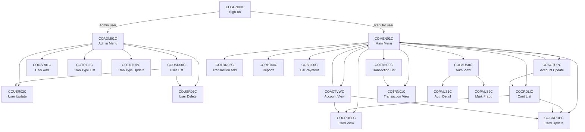
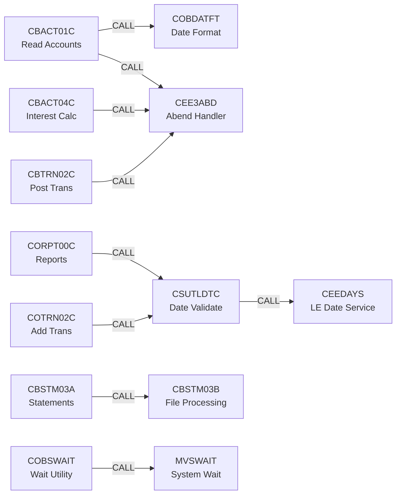
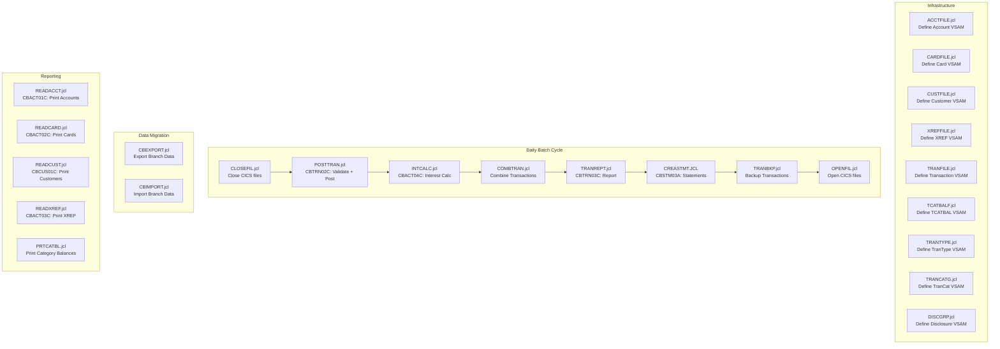
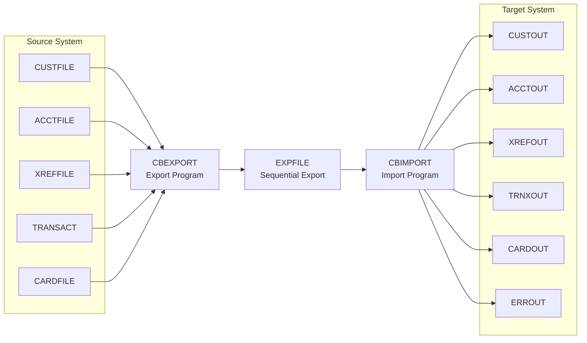

# Dependency Map

## 1. Program Call Graph

### 1.1 Online Program Flow (XCTL)

### 1.2 Batch Program CALL Dependencies

---

## 2. Dataset Lineage

### 2.1 VSAM File Ownership

| VSAM Dataset | Definition JCL | Record Layout | Primary Key | Programs That READ | Programs That WRITE/UPDATE |
|-------------|---------------|---------------|-------------|-------------------|---------------------------|
| ACCTFILE (Account) | ACCTFILE.jcl | CVACT01Y (300 bytes) | ACCT-ID | CBACT01C, CBACT04C, CBEXPORT, CBTRN01C, CBTRN02C, COACTVWC, COACTUPC, COBIL00C | CBACT04C, CBTRN02C, COACTUPC, COBIL00C |
| CARDFILE (Card) | CARDFILE.jcl | CVACT02Y (150 bytes) | CARD-NUM | CBACT02C, CBEXPORT, CBTRN01C, COCRDLIC, COCRDSLC, COCRDUPC | COCRDUPC |
| CUSTFILE (Customer) | CUSTFILE.jcl | CVCUS01Y (500 bytes) | CUST-ID | CBCUS01C, CBEXPORT, CBTRN01C, COACTVWC, COACTUPC | — |
| XREFFILE (Cross-Ref) | XREFFILE.jcl | CVACT03Y (50 bytes) | XREF-CARD-NUM | CBACT03C, CBACT04C, CBEXPORT, CBTRN01C, CBTRN02C, COTRN02C | — |
| TRANSACT (Transaction) | TRANFILE.jcl | CVTRA05Y (350 bytes) | TRAN-ID | CBEXPORT, CBTRN03C, COTRN00C, COTRN01C, COTRN02C, COBIL00C | CBACT04C, CBTRN02C, COTRN02C, COBIL00C |
| TCATBALF (Category Bal) | TCATBALF.jcl | CVTRA01Y (50 bytes) | TRAN-CAT-KEY | CBACT04C, CBTRN02C | CBACT04C, CBTRN02C |
| DALYTRAN (Daily Trans) | — (input PS) | CVTRA06Y (350 bytes) | — | CBTRN01C, CBTRN02C | External feed |
| DALYREJS (Rejects) | DALYREJS.jcl (GDG) | CVTRA06Y (350 bytes) | — | — | CBTRN02C |
| DISCGRP (Disclosure) | DISCGRP.jcl | CVTRA02Y (50 bytes) | DIS-GROUP-KEY | CBACT04C | — |
| USRSEC (User Security) | DUSRSECJ.jcl | CSUSR01Y (80 bytes) | SEC-USR-ID | COSGN00C, COUSR00C, COUSR02C, COUSR03C | COUSR01C, COUSR02C, COUSR03C |
| TRANTYPE (Tran Types) | TRANTYPE.jcl | CVTRA03Y (60 bytes) | TRAN-TYPE | CBTRN03C | — |
| TRANCATG (Tran Category) | TRANCATG.jcl | CVTRA04Y (60 bytes) | TRAN-CAT-KEY | CBTRN03C | — |

### 2.2 Alternate Index (AIX) Paths

| AIX Path | Base Cluster | Alternate Key | Used By |
|----------|-------------|---------------|---------|
| CARDAIX | CARDFILE | CARD-ACCT-ID | COCRDLIC |
| CXACAIX | XREFFILE | XREF-ACCT-ID | COACTVWC, COACTUPC, COBIL00C, COTRN02C |
| CCXREF | XREFFILE | XREF-CARD-NUM | COTRN02C |
| TRANIDX | TRANSACT | TRAN-CARD-NUM | COTRN00C |

---

## 3. Batch Pipeline Flow

### 3.1 End-to-End Processing Sequence

### 3.2 Daily Batch Cycle — Detailed Flow

1. **CLOSEFIL.jcl** — Closes CICS-managed VSAM files (via SDSF commands) to allow exclusive batch access.

2. **POSTTRAN.jcl** (CBTRN02C) — Core transaction posting:
   - Reads DALYTRAN (daily input transactions)
   - Validates: card expiration, overlimit check, cross-reference lookup
   - Posts valid transactions to TRANSACT
   - Updates ACCTFILE (balances) and TCATBALF (category balances)
   - Writes rejected transactions to DALYREJS (GDG)

3. **INTCALC.jcl** (CBACT04C) — Interest calculation:
   - Reads TCATBALF for category balances per account
   - Looks up interest rates from DISCGRP via account group (XREFFILE)
   - Computes interest and writes interest transactions to TRANSACT
   - Updates ACCTFILE with accrued interest

4. **COMBTRAN.jcl** — Sorts and merges transaction records from multiple sources.

5. **TRANREPT.jcl** (CBTRN03C) — Transaction detail report:
   - Reads TRANFILE (sorted), CARDXREF, TRANTYPE, TRANCATG, DATEPARM
   - Produces formatted TRANREPT output

6. **CREASTMT.JCL** (CBSTM03A) — Account statement generation:
   - Produces plain text and HTML statement formats

7. **TRANBKP.jcl** — Backs up transaction master to GDG and purges processed records.

8. **OPENFIL.jcl** — Reopens CICS-managed VSAM files for online access.

### 3.3 Data Migration Pipeline

---

## 4. Online-to-Batch Integration Points

| Integration Mechanism | Online Program | Batch Program | Description |
|-----------------------|---------------|---------------|-------------|
| TDQ (Transient Data Queue) | CORPT00C | CBTRN03C | Online submits report request; batch generates report |
| Shared VSAM (TRANSACT) | COTRN02C, COBIL00C | CBTRN02C, CBTRN03C | Online adds transactions; batch validates and reports |
| Shared VSAM (ACCTFILE) | COACTUPC, COBIL00C | CBTRN02C, CBACT04C | Online updates accounts; batch posts and calculates |
| CICS File Control | OPENFIL/CLOSEFIL | All batch | Manages file exclusivity between online and batch |
