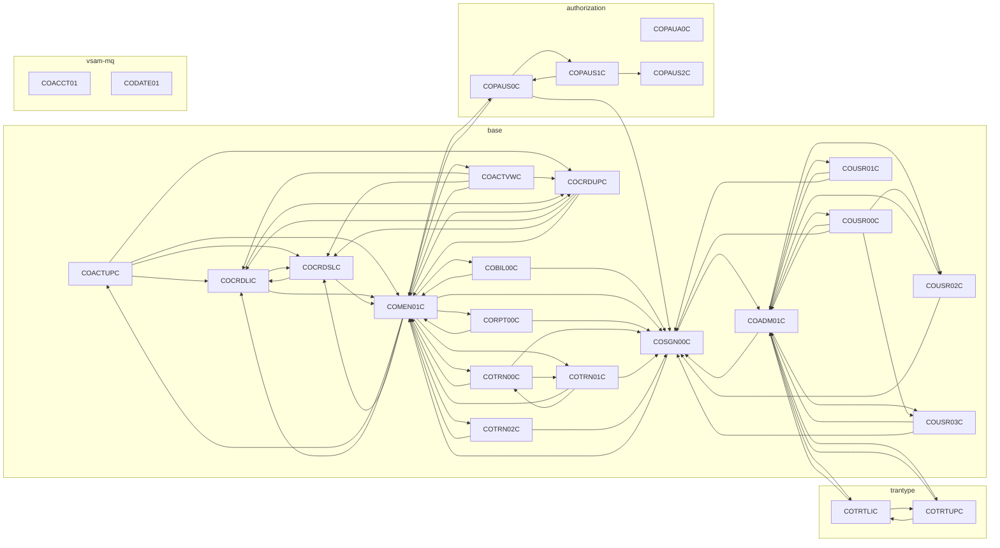
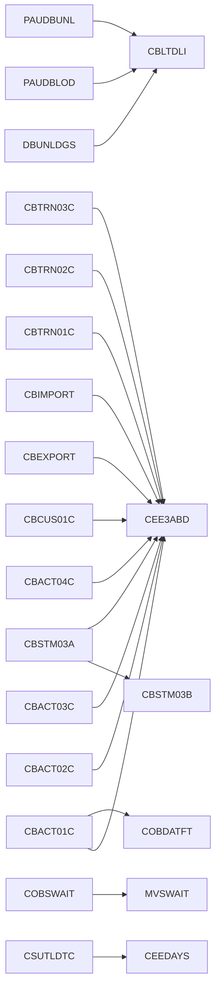
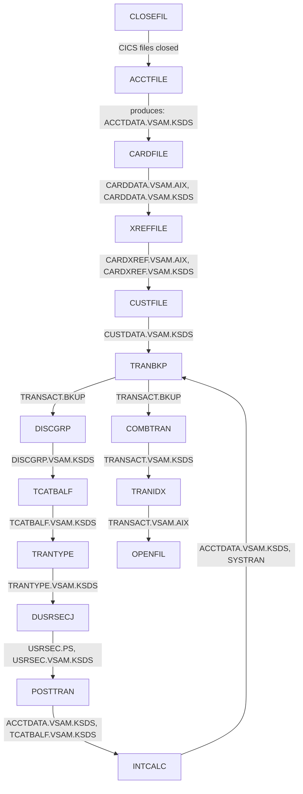
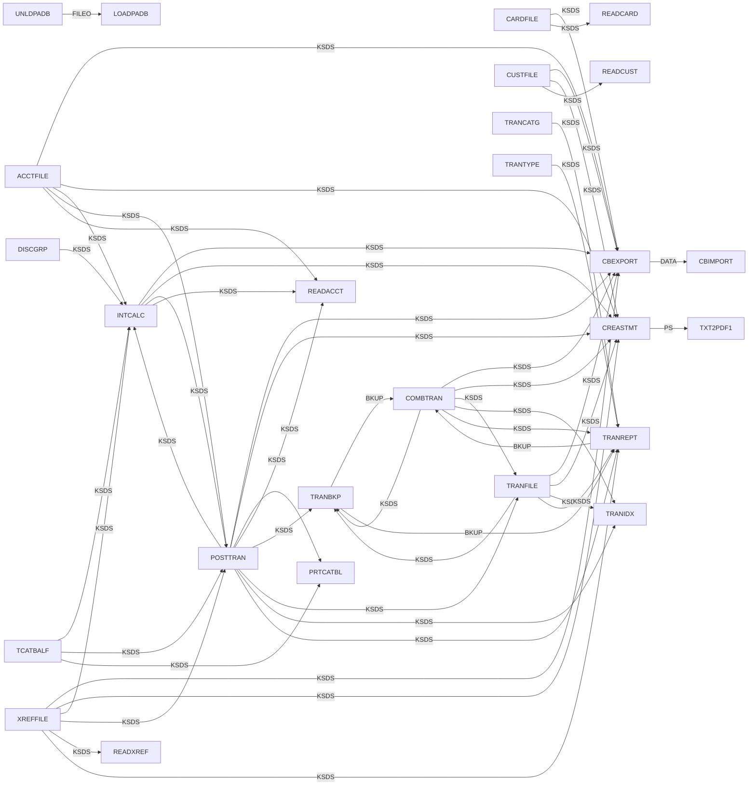
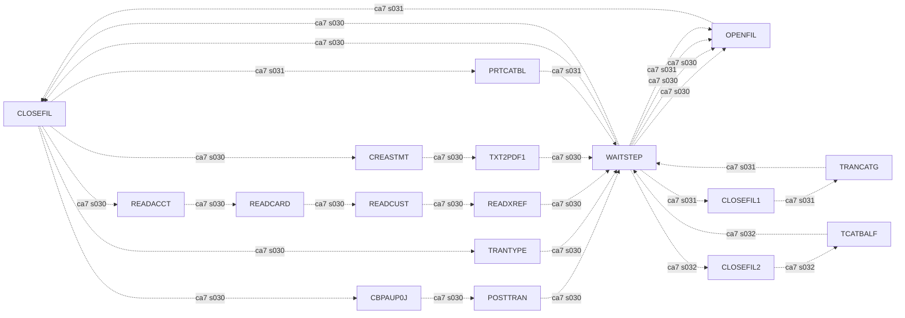
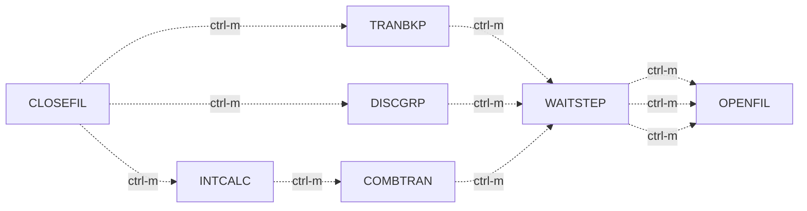

# CardDemo Dependency Map

Related documents: [APPLICATION_INVENTORY](./APPLICATION_INVENTORY.md), [DATA_DICTIONARY](./DATA_DICTIONARY.md), [HOTSPOT_REPORT](./HOTSPOT_REPORT.md).

Generated from static analysis of `app/` on branch develop-asiri; extraction rules are described in HOTSPOT_REPORT.md §1.

## 1. Program call graph

### (a) Outbound references per program

| Program | CALL targets | CICS LINK | CICS XCTL | START/RETURN TRANSID | Navigation literals | Nav via copybook |
|---|---|---|---|---|---|---|
| CBACT01C | CEE3ABD, COBDATFT | - | - | - | - | - |
| CBACT02C | CEE3ABD | - | - | - | - | - |
| CBACT03C | CEE3ABD | - | - | - | - | - |
| CBACT04C | CEE3ABD | - | - | - | - | - |
| CBCUS01C | CEE3ABD | - | - | - | - | - |
| CBEXPORT | CEE3ABD | - | - | - | - | - |
| CBIMPORT | CEE3ABD | - | - | - | - | - |
| CBPAUP0C | - | - | - | - | - | - |
| CBSTM03A | CBSTM03B, CEE3ABD | - | - | - | CBSTM03B | - |
| CBSTM03B | - | - | - | - | - | - |
| CBTRN01C | CEE3ABD | - | - | - | - | - |
| CBTRN02C | CEE3ABD | - | - | - | - | - |
| CBTRN03C | CEE3ABD | - | - | - | - | - |
| COACCT01 | MQCLOSE, MQGET, MQOPEN, MQPUT | - | - | - | - | - |
| COACTUPC | - | - | CDEMO-TO-PROGRAM [dynamic] | CAUP | COCRDLIC, COCRDSLC, COCRDUPC, COMEN01C | CSUTLDTC (via CSUTLDPY) |
| COACTVWC | - | - | CDEMO-TO-PROGRAM [dynamic] | CAVW | COCRDLIC, COCRDSLC, COCRDUPC, COMEN01C | - |
| COADM01C | - | - | CDEMO-TO-PROGRAM [dynamic] | CA00 | COSGN00C | COUSR03C (via COADM02Y), COTRTLIC (via COADM02Y), COTRTUPC (via COADM02Y), COUSR01C (via COADM02Y), COUSR02C (via COADM02Y), COUSR00C (via COADM02Y) |
| COBIL00C | - | - | CDEMO-TO-PROGRAM [dynamic] | CB00 | COMEN01C, COSGN00C | - |
| COBSWAIT | MVSWAIT | - | - | - | - | - |
| COBTUPDT | - | - | - | - | - | - |
| COCRDLIC | - | - | CCARD-NEXT-PROG [dynamic], COMEN01C | CCLI | COCRDSLC, COCRDUPC, COMEN01C | - |
| COCRDSLC | - | - | CDEMO-TO-PROGRAM [dynamic] | CCDL | COCRDLIC, COMEN01C | - |
| COCRDUPC | - | - | CDEMO-TO-PROGRAM [dynamic] | CCUP | COCRDLIC, COCRDSLC, COMEN01C | - |
| CODATE01 | MQCLOSE, MQGET, MQOPEN, MQPUT | - | - | - | - | - |
| COMEN01C | - | - | CDEMO-TO-PROGRAM [dynamic] | CM00 | COPAUS0C, COSGN00C | COTRN00C (via COMEN02Y), COACTVWC (via COMEN02Y), COCRDSLC (via COMEN02Y), COPAUS0C (via COMEN02Y), COCRDLIC (via COMEN02Y), COACTUPC (via COMEN02Y), COCRDUPC (via COMEN02Y), COTRN01C (via COMEN02Y), COTRN02C (via COMEN02Y), CORPT00C (via COMEN02Y), COBIL00C (via COMEN02Y) |
| COPAUA0C | MQCLOSE, MQGET, MQOPEN, MQPUT1 | - | - | - | - | - |
| COPAUS0C | - | - | CDEMO-TO-PROGRAM [dynamic] | CPVS | COMEN01C, COPAUS1C, COSGN00C | - |
| COPAUS1C | - | COPAUS2C | CDEMO-TO-PROGRAM [dynamic] | CPVD | COPAUS0C, COPAUS2C | - |
| COPAUS2C | - | - | - | - | - | - |
| CORPT00C | CSUTLDTC | - | CDEMO-TO-PROGRAM [dynamic] | CR00 | COMEN01C, COSGN00C, CSUTLDTC | - |
| COSGN00C | - | - | COADM01C, COMEN01C | CC00 | COADM01C, COMEN01C | - |
| COTRN00C | - | - | CDEMO-TO-PROGRAM [dynamic] | CT00 | COMEN01C, COSGN00C, COTRN01C | - |
| COTRN01C | - | - | CDEMO-TO-PROGRAM [dynamic] | CT01 | COMEN01C, COSGN00C, COTRN00C | - |
| COTRN02C | CSUTLDTC | - | CDEMO-TO-PROGRAM [dynamic] | CT02 | COMEN01C, COSGN00C, CSUTLDTC | - |
| COTRTLIC | - | - | CDEMO-TO-PROGRAM [dynamic], COTRTUPC | CTLI | COADM01C, COTRTUPC | - |
| COTRTUPC | - | - | CDEMO-TO-PROGRAM [dynamic] | CTTU | COADM01C, COTRTLIC | - |
| COUSR00C | - | - | CDEMO-TO-PROGRAM [dynamic] | CU00 | COADM01C, COSGN00C, COUSR02C, COUSR03C | - |
| COUSR01C | - | - | CDEMO-TO-PROGRAM [dynamic] | CU01 | COADM01C, COSGN00C | - |
| COUSR02C | - | - | CDEMO-TO-PROGRAM [dynamic] | CU02 | COADM01C, COSGN00C | - |
| COUSR03C | - | - | CDEMO-TO-PROGRAM [dynamic] | CU03 | COADM01C, COSGN00C | - |
| CSUTLDTC | CEEDAYS | - | - | - | - | - |
| DBUNLDGS | CBLTDLI | - | - | - | - | - |
| PAUDBLOD | CBLTDLI | - | - | - | - | - |
| PAUDBUNL | CBLTDLI | - | - | - | - | - |

### (b) Online navigation graph

```mermaid
graph LR
    subgraph base["base"]
        COACTUPC[COACTUPC]
        COACTVWC[COACTVWC]
        COADM01C[COADM01C]
        COBIL00C[COBIL00C]
        COCRDLIC[COCRDLIC]
        COCRDSLC[COCRDSLC]
        COCRDUPC[COCRDUPC]
        COMEN01C[COMEN01C]
        CORPT00C[CORPT00C]
        COSGN00C[COSGN00C]
        COTRN00C[COTRN00C]
        COTRN01C[COTRN01C]
        COTRN02C[COTRN02C]
        COUSR00C[COUSR00C]
        COUSR01C[COUSR01C]
        COUSR02C[COUSR02C]
        COUSR03C[COUSR03C]
    end
    subgraph authorization["authorization"]
        COPAUA0C[COPAUA0C]
        COPAUS0C[COPAUS0C]
        COPAUS1C[COPAUS1C]
        COPAUS2C[COPAUS2C]
    end
    subgraph trantype["trantype"]
        COTRTLIC[COTRTLIC]
        COTRTUPC[COTRTUPC]
    end
    subgraph vsam_mq["vsam-mq"]
        COACCT01[COACCT01]
        CODATE01[CODATE01]
    end
    COACTUPC --> COCRDLIC
    COACTUPC --> COCRDSLC
    COACTUPC --> COCRDUPC
    COACTUPC --> COMEN01C
    COACTVWC --> COCRDLIC
    COACTVWC --> COCRDSLC
    COACTVWC --> COCRDUPC
    COACTVWC --> COMEN01C
    COADM01C --> COSGN00C
    COADM01C --> COTRTLIC
    COADM01C --> COTRTUPC
    COADM01C --> COUSR00C
    COADM01C --> COUSR01C
    COADM01C --> COUSR02C
    COADM01C --> COUSR03C
    COBIL00C --> COMEN01C
    COBIL00C --> COSGN00C
    COCRDLIC --> COCRDSLC
    COCRDLIC --> COCRDUPC
    COCRDLIC --> COMEN01C
    COCRDSLC --> COCRDLIC
    COCRDSLC --> COMEN01C
    COCRDUPC --> COCRDLIC
    COCRDUPC --> COCRDSLC
    COCRDUPC --> COMEN01C
    COMEN01C --> COACTUPC
    COMEN01C --> COACTVWC
    COMEN01C --> COBIL00C
    COMEN01C --> COCRDLIC
    COMEN01C --> COCRDSLC
    COMEN01C --> COCRDUPC
    COMEN01C --> COPAUS0C
    COMEN01C --> CORPT00C
    COMEN01C --> COSGN00C
    COMEN01C --> COTRN00C
    COMEN01C --> COTRN01C
    COMEN01C --> COTRN02C
    COPAUS0C --> COMEN01C
    COPAUS0C --> COPAUS1C
    COPAUS0C --> COSGN00C
    COPAUS1C --> COPAUS0C
    COPAUS1C --> COPAUS2C
    CORPT00C --> COMEN01C
    CORPT00C --> COSGN00C
    COSGN00C --> COADM01C
    COSGN00C --> COMEN01C
    COTRN00C --> COMEN01C
    COTRN00C --> COSGN00C
    COTRN00C --> COTRN01C
    COTRN01C --> COMEN01C
    COTRN01C --> COSGN00C
    COTRN01C --> COTRN00C
    COTRN02C --> COMEN01C
    COTRN02C --> COSGN00C
    COTRTLIC --> COADM01C
    COTRTLIC --> COTRTUPC
    COTRTUPC --> COADM01C
    COTRTUPC --> COTRTLIC
    COUSR00C --> COADM01C
    COUSR00C --> COSGN00C
    COUSR00C --> COUSR02C
    COUSR00C --> COUSR03C
    COUSR01C --> COADM01C
    COUSR01C --> COSGN00C
    COUSR02C --> COADM01C
    COUSR02C --> COSGN00C
    COUSR03C --> COADM01C
    COUSR03C --> COSGN00C
```

### (c) Batch CALL graph

```mermaid
graph LR
    DBUNLDGS --> CBLTDLI
    PAUDBLOD --> CBLTDLI
    PAUDBUNL --> CBLTDLI
    CBACT01C --> CEE3ABD
    CBACT01C --> COBDATFT
    CBACT02C --> CEE3ABD
    CBACT03C --> CEE3ABD
    CBACT04C --> CEE3ABD
    CBCUS01C --> CEE3ABD
    CBEXPORT --> CEE3ABD
    CBIMPORT --> CEE3ABD
    CBSTM03A --> CBSTM03B
    CBSTM03A --> CEE3ABD
    CBTRN01C --> CEE3ABD
    CBTRN02C --> CEE3ABD
    CBTRN03C --> CEE3ABD
    COBSWAIT --> MVSWAIT
    CSUTLDTC --> CEEDAYS
```

### (d) Inbound reference counts

| Program | Inbound refs | Referenced by |
|---|---|---|
| COSGN00C | 12 | COADM01C, COBIL00C, COMEN01C, COPAUS0C, CORPT00C, COTRN00C, COTRN01C, COTRN02C, COUSR00C, COUSR01C, COUSR02C, COUSR03C |
| COMEN01C | 12 | COACTUPC, COACTVWC, COBIL00C, COCRDLIC, COCRDSLC, COCRDUPC, COPAUS0C, CORPT00C, COSGN00C, COTRN00C, COTRN01C, COTRN02C |
| COADM01C | 7 | COSGN00C, COTRTLIC, COTRTUPC, COUSR00C, COUSR01C, COUSR02C, COUSR03C |
| COCRDLIC | 5 | COACTUPC, COACTVWC, COCRDSLC, COCRDUPC, COMEN01C |
| COCRDSLC | 5 | COACTUPC, COACTVWC, COCRDLIC, COCRDUPC, COMEN01C |
| COCRDUPC | 4 | COACTUPC, COACTVWC, COCRDLIC, COMEN01C |
| CSUTLDTC | 3 | COACTUPC, CORPT00C, COTRN02C |
| COPAUS0C | 2 | COMEN01C, COPAUS1C |
| COTRTUPC | 2 | COADM01C, COTRTLIC |
| COTRTLIC | 2 | COADM01C, COTRTUPC |
| COUSR03C | 2 | COADM01C, COUSR00C |
| COUSR02C | 2 | COADM01C, COUSR00C |
| COTRN01C | 2 | COMEN01C, COTRN00C |
| COTRN00C | 2 | COMEN01C, COTRN01C |
| COPAUS1C | 1 | COPAUS0C |
| COPAUS2C | 1 | COPAUS1C |
| CBSTM03B | 1 | CBSTM03A |
| COUSR00C | 1 | COADM01C |
| COUSR01C | 1 | COADM01C |
| COTRN02C | 1 | COMEN01C |
| COACTUPC | 1 | COMEN01C |
| COBIL00C | 1 | COMEN01C |
| CORPT00C | 1 | COMEN01C |
| COACTVWC | 1 | COMEN01C |

## 2. JCL → program → dataset lineage

### Job ACCTFILE (`app/jcl/ACCTFILE.jcl`)

| Step | Exec | DD | DSN | R/W |
|---|---|---|---|---|
| STEP05 | PGM=IDCAMS | (SYSIN) | AWS.M2.CARDDEMO.ACCTDATA.VSAM.KSDS | DELETE |
| STEP15 | PGM=IDCAMS | ACCTDATA | AWS.M2.CARDDEMO.ACCTDATA.PS | R |
| STEP15 | PGM=IDCAMS | ACCTVSAM | AWS.M2.CARDDEMO.ACCTDATA.VSAM.KSDS | W |

### Job CARDFILE (`app/jcl/CARDFILE.jcl`)

| Step | Exec | DD | DSN | R/W |
|---|---|---|---|---|
| STEP05 | PGM=IDCAMS | (SYSIN) | AWS.M2.CARDDEMO.CARDDATA.VSAM.KSDS | DELETE |
| STEP05 | PGM=IDCAMS | (SYSIN) | AWS.M2.CARDDEMO.CARDDATA.VSAM.AIX | DELETE |
| STEP15 | PGM=IDCAMS | CARDDATA | AWS.M2.CARDDEMO.CARDDATA.PS | R |
| STEP15 | PGM=IDCAMS | CARDVSAM | AWS.M2.CARDDEMO.CARDDATA.VSAM.KSDS | W |
| STEP60 | PGM=IDCAMS | (SYSIN) | AWS.M2.CARDDEMO.CARDDATA.VSAM.KSDS | R |
| STEP60 | PGM=IDCAMS | (SYSIN) | AWS.M2.CARDDEMO.CARDDATA.VSAM.AIX | W |

### Job CBADMCDJ (`app/jcl/CBADMCDJ.jcl`)

| Step | Exec | DD | DSN | R/W |
|---|---|---|---|---|
| STEP1 | PGM=DFHCSDUP | STEPLIB | OEM.CICSTS.V05R06M0.CICS.SDFHLOAD | R |
| STEP1 | PGM=DFHCSDUP | DFHCSD | OEM.CICSTS.DFHCSD | R |

### Job CBEXPORT (`app/jcl/CBEXPORT.jcl`)

| Step | Exec | DD | DSN | R/W |
|---|---|---|---|---|
| STEP01 | PGM=IDCAMS | (SYSIN) | AWS.M2.CARDDEMO.EXPORT.DATA | DELETE |
| STEP02 | PGM=CBEXPORT | STEPLIB | AWS.M2.CARDDEMO.LOADLIB | R |
| STEP02 | PGM=CBEXPORT | CUSTFILE | AWS.M2.CARDDEMO.CUSTDATA.VSAM.KSDS | R |
| STEP02 | PGM=CBEXPORT | ACCTFILE | AWS.M2.CARDDEMO.ACCTDATA.VSAM.KSDS | R |
| STEP02 | PGM=CBEXPORT | XREFFILE | AWS.M2.CARDDEMO.CARDXREF.VSAM.KSDS | R |
| STEP02 | PGM=CBEXPORT | TRANSACT | AWS.M2.CARDDEMO.TRANSACT.VSAM.KSDS | R |
| STEP02 | PGM=CBEXPORT | CARDFILE | AWS.M2.CARDDEMO.CARDDATA.VSAM.KSDS | R |
| STEP02 | PGM=CBEXPORT | EXPFILE | AWS.M2.CARDDEMO.EXPORT.DATA | W |

### Job CBIMPORT (`app/jcl/CBIMPORT.jcl`)

| Step | Exec | DD | DSN | R/W |
|---|---|---|---|---|
| STEP01 | PGM=CBIMPORT | STEPLIB | AWS.M2.CARDDEMO.LOADLIB | R |
| STEP01 | PGM=CBIMPORT | EXPFILE | AWS.M2.CARDDEMO.EXPORT.DATA | R |
| STEP01 | PGM=CBIMPORT | CUSTOUT | AWS.M2.CARDDEMO.CUSTDATA.IMPORT | R |
| STEP01 | PGM=CBIMPORT | ACCTOUT | AWS.M2.CARDDEMO.ACCTDATA.IMPORT | R |
| STEP01 | PGM=CBIMPORT | XREFOUT | AWS.M2.CARDDEMO.CARDXREF.IMPORT | R |
| STEP01 | PGM=CBIMPORT | TRNXOUT | AWS.M2.CARDDEMO.TRANSACT.IMPORT | R |
| STEP01 | PGM=CBIMPORT | ERROUT | AWS.M2.CARDDEMO.IMPORT.ERRORS | W |

### Job CBPAUP0J (`app/app-authorization-ims-db2-mq/jcl/CBPAUP0J.jcl`)

| Step | Exec | DD | DSN | R/W |
|---|---|---|---|---|
| STEP01 | PGM=DFSRRC00 | STEPLIB | IMS.SDFSRESL | R |
| STEP01 | PGM=DFSRRC00 | DFSRESLB | IMS.SDFSRESL | R |
| STEP01 | PGM=DFSRRC00 | PROCLIB | IMS.PROCLIB | R |
| STEP01 | PGM=DFSRRC00 | DFSSEL | IMS.SDFSRESL | R |
| STEP01 | PGM=DFSRRC00 | IMS | IMS.PSBLIB | R |

### Job COMBTRAN (`app/jcl/COMBTRAN.jcl`)

| Step | Exec | DD | DSN | R/W |
|---|---|---|---|---|
| STEP05R | PGM=SORT | SORTIN | AWS.M2.CARDDEMO.TRANSACT.BKUP(0) | R |
| STEP05R | PGM=SORT | SORTOUT | AWS.M2.CARDDEMO.TRANSACT.COMBINED(+1) | W |
| STEP10 | PGM=IDCAMS | TRANSACT | AWS.M2.CARDDEMO.TRANSACT.COMBINED(+1) | R |
| STEP10 | PGM=IDCAMS | TRANVSAM | AWS.M2.CARDDEMO.TRANSACT.VSAM.KSDS | W |

### Job CREADB2 (`app/app-transaction-type-db2/jcl/CREADB21.jcl`)

| Step | Exec | DD | DSN | R/W |
|---|---|---|---|---|
| FREEPLN | PGM=IKJEFT01 | STEPLIB | OEM.DB2.DAZ1.SDSNEXIT | R |
| FREEPLN | PGM=IKJEFT01 | SYSTSIN | &LBNM..CNTL(DB2FREE) | R |
| CRCRDDB | PGM=IKJEFT01 | STEPLIB | OEM.DB2.&DB2S..RUNLIB.LOAD | R |
| CRCRDDB | PGM=IKJEFT01 | SYSTSIN | &LBNM..CNTL(DB2TIAD1) | R |
| CRCRDDB | PGM=IKJEFT01 | SYSIN | &LBNM..CNTL(DB2CREAT) | R |
| RUNTEP2 | PGM=IKJEFT01 | STEPLIB | OEM.DB2.&DB2S..RUNLIB.LOAD | R |
| RUNTEP2 | PGM=IKJEFT01 | SYSTSIN | &LBNM..CNTL(DB2TEP41) | R |
| RUNTEP2 | PGM=IKJEFT01 | SYSIN | &LBNM..CNTL(DB2LTTYP) | R |
| LDTCCAT | PGM=IKJEFT01 | STEPLIB | OEM.DB2.&DB2S..RUNLIB.LOAD | R |
| LDTCCAT | PGM=IKJEFT01 | SYSTSIN | &LBNM..CNTL(DB2TEP41) | R |
| LDTCCAT | PGM=IKJEFT01 | SYSIN | &LBNM..CNTL(DB2LTCAT) | R |

### Job CREASTMT (`app/jcl/CREASTMT.JCL`)

| Step | Exec | DD | DSN | R/W |
|---|---|---|---|---|
| DELDEF01 | PGM=IDCAMS | (SYSIN) | AWS.M2.CARDDEMO.TRXFL.SEQ | DELETE |
| DELDEF01 | PGM=IDCAMS | (SYSIN) | AWS.M2.CARDDEMO.TRXFL.VSAM.KSDS | DELETE |
| STEP010 | PGM=SORT | SORTIN | AWS.M2.CARDDEMO.TRANSACT.VSAM.KSDS | R |
| STEP010 | PGM=SORT | SORTOUT | AWS.M2.CARDDEMO.TRXFL.SEQ | W |
| STEP020 | PGM=IDCAMS | INFILE | AWS.M2.CARDDEMO.TRXFL.SEQ | R |
| STEP020 | PGM=IDCAMS | OUTFILE | AWS.M2.CARDDEMO.TRXFL.VSAM.KSDS | W |
| STEP030 | PGM=IEFBR14 | HTMLFILE | AWS.M2.CARDDEMO.STATEMNT.HTML | R |
| STEP030 | PGM=IEFBR14 | STMTFILE | AWS.M2.CARDDEMO.STATEMNT.PS | R |
| STEP040 | PGM=CBSTM03A | STEPLIB | AWS.M2.CARDDEMO.LOADLIB | R |
| STEP040 | PGM=CBSTM03A | TRNXFILE | AWS.M2.CARDDEMO.TRXFL.VSAM.KSDS | R |
| STEP040 | PGM=CBSTM03A | XREFFILE | AWS.M2.CARDDEMO.CARDXREF.VSAM.KSDS | R |
| STEP040 | PGM=CBSTM03A | ACCTFILE | AWS.M2.CARDDEMO.ACCTDATA.VSAM.KSDS | R |
| STEP040 | PGM=CBSTM03A | CUSTFILE | AWS.M2.CARDDEMO.CUSTDATA.VSAM.KSDS | R |
| STEP040 | PGM=CBSTM03A | STMTFILE | AWS.M2.CARDDEMO.STATEMNT.PS | W |
| STEP040 | PGM=CBSTM03A | HTMLFILE | AWS.M2.CARDDEMO.STATEMNT.HTML | W |

### Job CUSTFILE (`app/jcl/CUSTFILE.jcl`)

| Step | Exec | DD | DSN | R/W |
|---|---|---|---|---|
| STEP05 | PGM=IDCAMS | (SYSIN) | AWS.M2.CARDDEMO.CUSTDATA.VSAM.KSDS | DELETE |
| STEP15 | PGM=IDCAMS | CUSTDATA | AWS.M2.CARDDEMO.CUSTDATA.PS | R |
| STEP15 | PGM=IDCAMS | CUSTVSAM | AWS.M2.CARDDEMO.CUSTDATA.VSAM.KSDS | W |

### Job DBPAUTP0 (`app/app-authorization-ims-db2-mq/jcl/DBPAUTP0.jcl`)

| Step | Exec | DD | DSN | R/W |
|---|---|---|---|---|
| STEPDEL | PGM=IEFBR14 | SYSUT1 | AWS.M2.CARDDEMO.IMSDATA.DBPAUTP0 | R |
| UNLOAD | PGM=DFSRRC00 | STEPLIB | OEMA.IMS.IMSP.SDFSRESL | R |
| UNLOAD | PGM=DFSRRC00 | DFSRESLB | OEMA.IMS.IMSP.SDFSRESL | R |
| UNLOAD | PGM=DFSRRC00 | IMS | OEM.IMS.IMSP.PSBLIB | R |
| UNLOAD | PGM=DFSRRC00 | DFSURGU1 | AWS.M2.CARDDEMO.IMSDATA.DBPAUTP0 | R |
| UNLOAD | PGM=DFSRRC00 | DDPAUTP0 | OEM.IMS.IMSP.PAUTHDB | R |
| UNLOAD | PGM=DFSRRC00 | DDPAUTX0 | OEM.IMS.IMSP.PAUTHDBX | R |
| UNLOAD | PGM=DFSRRC00 | DFSVSAMP | OEMPP.IMS.V15R01MB.PROCLIB(DFSVSMDB) | R |
| UNLOAD | PGM=DFSRRC00 | RECON1 | OEM.IMS.IMSP.RECON1 | R |
| UNLOAD | PGM=DFSRRC00 | RECON2 | OEM.IMS.IMSP.RECON2 | R |
| UNLOAD | PGM=DFSRRC00 | RECON3 | OEM.IMS.IMSP.RECON3 | R |

### Job DEFCUST (`app/jcl/DEFCUST.jcl`)

| Step | Exec | DD | DSN | R/W |
|---|---|---|---|---|
| STEP05 | PGM=IDCAMS | (SYSIN) | AWS.CCDA.CUSTDATA.CLUSTER | DELETE |

### Job DEFGDGD (`app/jcl/DEFGDGD.jcl`)

| Step | Exec | DD | DSN | R/W |
|---|---|---|---|---|
| STEP20 | PGM=IEBGENER | SYSUT1 | AWS.M2.CARDDEMO.TRANTYPE.PS | R |
| STEP20 | PGM=IEBGENER | SYSUT2 | AWS.M2.CARDDEMO.TRANTYPE.BKUP(+1) | W |
| STEP40 | PGM=IEBGENER | SYSUT1 | AWS.M2.CARDDEMO.TRANCATG.PS | R |
| STEP40 | PGM=IEBGENER | SYSUT2 | AWS.M2.CARDDEMO.TRANCATG.PS.BKUP(+1) | W |
| STEP60 | PGM=IEBGENER | SYSUT1 | AWS.M2.CARDDEMO.DISCGRP.PS | R |
| STEP60 | PGM=IEBGENER | SYSUT2 | AWS.M2.CARDDEMO.DISCGRP.BKUP(+1) | W |

### Job DISCGRP (`app/jcl/DISCGRP.jcl`)

| Step | Exec | DD | DSN | R/W |
|---|---|---|---|---|
| STEP05 | PGM=IDCAMS | (SYSIN) | AWS.M2.CARDDEMO.DISCGRP.VSAM.KSDS | DELETE |
| STEP15 | PGM=IDCAMS | DISCGRP | AWS.M2.CARDDEMO.DISCGRP.PS | R |
| STEP15 | PGM=IDCAMS | DISCVSAM | AWS.M2.CARDDEMO.DISCGRP.VSAM.KSDS | W |

### Job DUSRSECJ (`app/jcl/DUSRSECJ.jcl`)

| Step | Exec | DD | DSN | R/W |
|---|---|---|---|---|
| PREDEL | PGM=IEFBR14 | DD01 | AWS.M2.CARDDEMO.USRSEC.PS | R |
| STEP01 | PGM=IEBGENER | SYSUT2 | AWS.M2.CARDDEMO.USRSEC.PS | W |
| STEP02 | PGM=IDCAMS | (SYSIN) | AWS.M2.CARDDEMO.USRSEC.VSAM.KSDS | DELETE |
| STEP03 | PGM=IDCAMS | IN | AWS.M2.CARDDEMO.USRSEC.PS | R |
| STEP03 | PGM=IDCAMS | OUT | AWS.M2.CARDDEMO.USRSEC.VSAM.KSDS | W |

### Job ESDSRRDS (`app/jcl/ESDSRRDS.jcl`)

| Step | Exec | DD | DSN | R/W |
|---|---|---|---|---|
| PREDEL | PGM=IEFBR14 | DD01 | AWS.M2.CARDDEMO.ESDSRRDS.PS | R |
| STEP01 | PGM=IEBGENER | SYSUT2 | AWS.M2.CARDDEMO.ESDSRRDS.PS | W |
| STEP02 | PGM=IDCAMS | (SYSIN) | AWS.M2.CARDDEMO.USRSEC.VSAM.ESDS | DELETE |
| STEP03 | PGM=IDCAMS | IN | AWS.M2.CARDDEMO.ESDSRRDS.PS | R |
| STEP03 | PGM=IDCAMS | OUT | AWS.M2.CARDDEMO.USRSEC.VSAM.ESDS | W |
| STEP04 | PGM=IDCAMS | (SYSIN) | AWS.M2.CARDDEMO.USRSEC.VSAM.RRDS | DELETE |
| STEP05 | PGM=IDCAMS | IN | AWS.M2.CARDDEMO.ESDSRRDS.PS | R |
| STEP05 | PGM=IDCAMS | OUT | AWS.M2.CARDDEMO.USRSEC.VSAM.RRDS | W |

### Job INTCALC (`app/jcl/INTCALC.jcl`)

| Step | Exec | DD | DSN | R/W |
|---|---|---|---|---|
| STEP15 | PGM=CBACT04C | STEPLIB | AWS.M2.CARDDEMO.LOADLIB | R |
| STEP15 | PGM=CBACT04C | TCATBALF | AWS.M2.CARDDEMO.TCATBALF.VSAM.KSDS | R |
| STEP15 | PGM=CBACT04C | XREFFILE | AWS.M2.CARDDEMO.CARDXREF.VSAM.KSDS | R |
| STEP15 | PGM=CBACT04C | XREFFIL1 | AWS.M2.CARDDEMO.CARDXREF.VSAM.AIX.PATH | R |
| STEP15 | PGM=CBACT04C | ACCTFILE | AWS.M2.CARDDEMO.ACCTDATA.VSAM.KSDS | R/W |
| STEP15 | PGM=CBACT04C | DISCGRP | AWS.M2.CARDDEMO.DISCGRP.VSAM.KSDS | R |
| STEP15 | PGM=CBACT04C | TRANSACT | AWS.M2.CARDDEMO.SYSTRAN(+1) | W |

### Job INTRDRJ1 (`app/jcl/INTRDRJ1.JCL`)

| Step | Exec | DD | DSN | R/W |
|---|---|---|---|---|
| IDCAMS | PGM=IDCAMS | IN | AWS.M2.CARDEMO.FTP.TEST | R |
| IDCAMS | PGM=IDCAMS | OUT | AWS.M2.CARDEMO.FTP.TEST.BKUP | R |
| STEP01 | PGM=IEBGENER | SYSUT1 | AWS.M2.CARDDEMO.JCL(INTRDRJ2) | R |

### Job INTRDRJ2 (`app/jcl/INTRDRJ2.JCL`)

| Step | Exec | DD | DSN | R/W |
|---|---|---|---|---|
| IDCAMS | PGM=IDCAMS | IN | AWS.M2.CARDEMO.FTP.TEST.BKUP | R |
| IDCAMS | PGM=IDCAMS | OUT | AWS.M2.CARDEMO.FTP.TEST.BKUP.INTRDR | R |

### Job LOADPADB (`app/app-authorization-ims-db2-mq/jcl/LOADPADB.JCL`)

| Step | Exec | DD | DSN | R/W |
|---|---|---|---|---|
| STEP01 | PGM=DFSRRC00 | STEPLIB | OEMA.IMS.IMSP.SDFSRESL | R |
| STEP01 | PGM=DFSRRC00 | DFSRESLB | OEMA.IMS.IMSP.SDFSRESL | R |
| STEP01 | PGM=DFSRRC00 | IMS | OEM.IMS.IMSP.PSBLIB | R |
| STEP01 | PGM=DFSRRC00 | INFILE1 | AWS.M2.CARDDEMO.PAUTDB.ROOT.FILEO | R |
| STEP01 | PGM=DFSRRC00 | INFILE2 | AWS.M2.CARDDEMO.PAUTDB.CHILD.FILEO | R |
| STEP01 | PGM=DFSRRC00 | DFSVSAMP | OEMPP.IMS.V15R01MB.PROCLIB(DFSVSMDB) | R |

### Job MNTTRDB2 (`app/app-transaction-type-db2/jcl/MNTTRDB2.jcl`)

| Step | Exec | DD | DSN | R/W |
|---|---|---|---|---|
| STEP1 | PGM=IKJEFT01 | STEPLIB | OEM.DB2.DAZ1.SDSNEXIT | R |
| STEP1 | PGM=IKJEFT01 | DBRMLIB | AWS.M2.CARDDEMO.DBRMLIB | R |
| STEP1 | PGM=IKJEFT01 | INPFILE | INPFILE | R |

### Job POSTTRAN (`app/jcl/POSTTRAN.jcl`)

| Step | Exec | DD | DSN | R/W |
|---|---|---|---|---|
| STEP15 | PGM=CBTRN02C | STEPLIB | AWS.M2.CARDDEMO.LOADLIB | R |
| STEP15 | PGM=CBTRN02C | TRANFILE | AWS.M2.CARDDEMO.TRANSACT.VSAM.KSDS | W |
| STEP15 | PGM=CBTRN02C | DALYTRAN | AWS.M2.CARDDEMO.DALYTRAN.PS | R |
| STEP15 | PGM=CBTRN02C | XREFFILE | AWS.M2.CARDDEMO.CARDXREF.VSAM.KSDS | R |
| STEP15 | PGM=CBTRN02C | DALYREJS | AWS.M2.CARDDEMO.DALYREJS(+1) | W |
| STEP15 | PGM=CBTRN02C | ACCTFILE | AWS.M2.CARDDEMO.ACCTDATA.VSAM.KSDS | R/W |
| STEP15 | PGM=CBTRN02C | TCATBALF | AWS.M2.CARDDEMO.TCATBALF.VSAM.KSDS | R/W |

### Job PRTCATBL (`app/jcl/PRTCATBL.jcl`)

| Step | Exec | DD | DSN | R/W |
|---|---|---|---|---|
| DELDEF | PGM=IEFBR14 | THEFILE | AWS.M2.CARDDEMO.TCATBALF.REPT | R |
| STEP05R | PROC=REPROC | PRC001.FILEIN | AWS.M2.CARDDEMO.TCATBALF.VSAM.KSDS | R |
| STEP05R | PROC=REPROC | PRC001.FILEOUT | AWS.M2.CARDDEMO.TCATBALF.BKUP(+1) | W |
| STEP05R | PROC=REPROC | PRC001.FILEIN | AWS.M2.CARDDEMO.TCATBALF.VSAM.KSDS | R |
| STEP05R | PROC=REPROC | PRC001.FILEOUT | AWS.M2.CARDDEMO.TCATBALF.BKUP(+1) | W |
| STEP05R | PROC=REPROC | PRC001.SYSIN | AWS.M2.CARDDEMO.CNTL(REPROCT) | R |
| STEP10R | PGM=SORT | SORTIN | AWS.M2.CARDDEMO.TCATBALF.BKUP(+1) | R |
| STEP10R | PGM=SORT | SORTOUT | AWS.M2.CARDDEMO.TCATBALF.REPT | W |

### Job READACCT (`app/jcl/READACCT.jcl`)

| Step | Exec | DD | DSN | R/W |
|---|---|---|---|---|
| PREDEL | PGM=IEFBR14 | DD01 | AWS.M2.CARDDEMO.ACCTDATA.PSCOMP | R |
| PREDEL | PGM=IEFBR14 | DD02 | AWS.M2.CARDDEMO.ACCTDATA.ARRYPS | R |
| PREDEL | PGM=IEFBR14 | DD03 | AWS.M2.CARDDEMO.ACCTDATA.VBPS | R |
| STEP05 | PGM=CBACT01C | STEPLIB | AWS.M2.CARDDEMO.LOADLIB | R |
| STEP05 | PGM=CBACT01C | ACCTFILE | AWS.M2.CARDDEMO.ACCTDATA.VSAM.KSDS | R |
| STEP05 | PGM=CBACT01C | OUTFILE | AWS.M2.CARDDEMO.ACCTDATA.PSCOMP | W |
| STEP05 | PGM=CBACT01C | ARRYFILE | AWS.M2.CARDDEMO.ACCTDATA.ARRYPS | W |
| STEP05 | PGM=CBACT01C | VBRCFILE | AWS.M2.CARDDEMO.ACCTDATA.VBPS | W |

### Job READCARD (`app/jcl/READCARD.jcl`)

| Step | Exec | DD | DSN | R/W |
|---|---|---|---|---|
| STEP05 | PGM=CBACT02C | STEPLIB | AWS.M2.CARDDEMO.LOADLIB | R |
| STEP05 | PGM=CBACT02C | CARDFILE | AWS.M2.CARDDEMO.CARDDATA.VSAM.KSDS | R |

### Job READCUST (`app/jcl/READCUST.jcl`)

| Step | Exec | DD | DSN | R/W |
|---|---|---|---|---|
| STEP05 | PGM=CBCUS01C | STEPLIB | AWS.M2.CARDDEMO.LOADLIB | R |
| STEP05 | PGM=CBCUS01C | CUSTFILE | AWS.M2.CARDDEMO.CUSTDATA.VSAM.KSDS | R |

### Job READXREF (`app/jcl/READXREF.jcl`)

| Step | Exec | DD | DSN | R/W |
|---|---|---|---|---|
| STEP05 | PGM=CBACT03C | STEPLIB | AWS.M2.CARDDEMO.LOADLIB | R |
| STEP05 | PGM=CBACT03C | XREFFILE | AWS.M2.CARDDEMO.CARDXREF.VSAM.KSDS | R |

### Job TCATBALF (`app/jcl/TCATBALF.jcl`)

| Step | Exec | DD | DSN | R/W |
|---|---|---|---|---|
| STEP05 | PGM=IDCAMS | (SYSIN) | AWS.M2.CARDDEMO.TCATBALF.VSAM.KSDS | DELETE |
| STEP15 | PGM=IDCAMS | TCATBAL | AWS.M2.CARDDEMO.TCATBALF.PS | R |
| STEP15 | PGM=IDCAMS | TCATBALV | AWS.M2.CARDDEMO.TCATBALF.VSAM.KSDS | W |

### Job TRANBKP (`app/jcl/TRANBKP.jcl`)

| Step | Exec | DD | DSN | R/W |
|---|---|---|---|---|
| STEP05R | PROC=REPROC | PRC001.FILEIN | AWS.M2.CARDDEMO.TRANSACT.VSAM.KSDS | R |
| STEP05R | PROC=REPROC | PRC001.FILEOUT | AWS.M2.CARDDEMO.TRANSACT.BKUP(+1) | W |
| STEP05R | PROC=REPROC | PRC001.FILEIN | AWS.M2.CARDDEMO.TRANSACT.VSAM.KSDS | R |
| STEP05R | PROC=REPROC | PRC001.FILEOUT | AWS.M2.CARDDEMO.TRANSACT.BKUP(+1) | W |
| STEP05R | PROC=REPROC | PRC001.SYSIN | AWS.M2.CARDDEMO.CNTL(REPROCT) | R |
| STEP05 | PGM=IDCAMS | (SYSIN) | AWS.M2.CARDDEMO.TRANSACT.VSAM.KSDS | DELETE |
| STEP05 | PGM=IDCAMS | (SYSIN) | AWS.M2.CARDDEMO.TRANSACT.VSAM.AIX | DELETE |

### Job TRANCATG (`app/jcl/TRANCATG.jcl`)

| Step | Exec | DD | DSN | R/W |
|---|---|---|---|---|
| STEP05 | PGM=IDCAMS | (SYSIN) | AWS.M2.CARDDEMO.TRANCATG.VSAM.KSDS | DELETE |
| STEP15 | PGM=IDCAMS | TRANCATG | AWS.M2.CARDDEMO.TRANCATG.PS | R |
| STEP15 | PGM=IDCAMS | TCATVSAM | AWS.M2.CARDDEMO.TRANCATG.VSAM.KSDS | W |

### Job TRANEXTR (`app/app-transaction-type-db2/jcl/TRANEXTR.jcl`)

| Step | Exec | DD | DSN | R/W |
|---|---|---|---|---|
| STEP10 | PGM=IEBGENER | SYSUT1 | &HLQ..TRANTYPE.PS | R |
| STEP10 | PGM=IEBGENER | SYSUT2 | &HLQ..TRANTYPE.BKUP(+1) | W |
| STEP20 | PGM=IEBGENER | SYSUT1 | &HLQ..TRANCATG.PS | R |
| STEP20 | PGM=IEBGENER | SYSUT2 | &HLQ..TRANCATG.PS.BKUP(+1) | W |
| STEP30 | PGM=IEFBR14 | DD01 | &HLQ..TRANTYPE.PS | R |
| STEP30 | PGM=IEFBR14 | DD02 | &HLQ..TRANCATG.PS | R |
| STEP40 | PGM=IKJEFT01 | STEPLIB | OEM.DB2.DAZ1.RUNLIB.LOAD | R |
| STEP40 | PGM=IKJEFT01 | SYSREC00 | &HLQ..TRANTYPE.PS | W |
| STEP50 | PGM=IKJEFT01 | STEPLIB | OEM.DB2.DAZ1.RUNLIB.LOAD | R |
| STEP50 | PGM=IKJEFT01 | SYSREC00 | &HLQ..TRANCATG.PS | W |

### Job TRANFILE (`app/jcl/TRANFILE.jcl`)

| Step | Exec | DD | DSN | R/W |
|---|---|---|---|---|
| STEP05 | PGM=IDCAMS | (SYSIN) | AWS.M2.CARDDEMO.TRANSACT.VSAM.KSDS | DELETE |
| STEP05 | PGM=IDCAMS | (SYSIN) | AWS.M2.CARDDEMO.TRANSACT.VSAM.AIX | DELETE |
| STEP15 | PGM=IDCAMS | TRANSACT | AWS.M2.CARDDEMO.DALYTRAN.PS.INIT | R |
| STEP15 | PGM=IDCAMS | TRANVSAM | AWS.M2.CARDDEMO.TRANSACT.VSAM.KSDS | W |
| STEP30 | PGM=IDCAMS | (SYSIN) | AWS.M2.CARDDEMO.TRANSACT.VSAM.KSDS | R |
| STEP30 | PGM=IDCAMS | (SYSIN) | AWS.M2.CARDDEMO.TRANSACT.VSAM.AIX | W |

### Job TRANIDX (`app/jcl/TRANIDX.jcl`)

| Step | Exec | DD | DSN | R/W |
|---|---|---|---|---|
| STEP30 | PGM=IDCAMS | (SYSIN) | AWS.M2.CARDDEMO.TRANSACT.VSAM.KSDS | R |
| STEP30 | PGM=IDCAMS | (SYSIN) | AWS.M2.CARDDEMO.TRANSACT.VSAM.AIX | W |

### Job TRANREPT (`app/jcl/TRANREPT.jcl`)

| Step | Exec | DD | DSN | R/W |
|---|---|---|---|---|
| STEP05R | PROC=REPROC | PRC001.FILEIN | AWS.M2.CARDDEMO.TRANSACT.VSAM.KSDS | R |
| STEP05R | PROC=REPROC | PRC001.FILEOUT | AWS.M2.CARDDEMO.TRANSACT.BKUP(+1) | W |
| STEP05R | PROC=REPROC | PRC001.FILEIN | AWS.M2.CARDDEMO.TRANSACT.VSAM.KSDS | R |
| STEP05R | PROC=REPROC | PRC001.FILEOUT | AWS.M2.CARDDEMO.TRANSACT.BKUP(+1) | W |
| STEP05R | PROC=REPROC | PRC001.SYSIN | AWS.M2.CARDDEMO.CNTL(REPROCT) | R |
| STEP05R | PGM=SORT | SORTIN | AWS.M2.CARDDEMO.TRANSACT.BKUP(+1) | R |
| STEP05R | PGM=SORT | SORTOUT | AWS.M2.CARDDEMO.TRANSACT.DALY(+1) | W |
| STEP10R | PGM=CBTRN03C | STEPLIB | AWS.M2.CARDDEMO.LOADLIB | R |
| STEP10R | PGM=CBTRN03C | TRANFILE | AWS.M2.CARDDEMO.TRANSACT.DALY(+1) | R |
| STEP10R | PGM=CBTRN03C | CARDXREF | AWS.M2.CARDDEMO.CARDXREF.VSAM.KSDS | R |
| STEP10R | PGM=CBTRN03C | TRANTYPE | AWS.M2.CARDDEMO.TRANTYPE.VSAM.KSDS | R |
| STEP10R | PGM=CBTRN03C | TRANCATG | AWS.M2.CARDDEMO.TRANCATG.VSAM.KSDS | R |
| STEP10R | PGM=CBTRN03C | DATEPARM | AWS.M2.CARDDEMO.DATEPARM | R |
| STEP10R | PGM=CBTRN03C | TRANREPT | AWS.M2.CARDDEMO.TRANREPT(+1) | W |

### Job TRANTYPE (`app/jcl/TRANTYPE.jcl`)

| Step | Exec | DD | DSN | R/W |
|---|---|---|---|---|
| STEP05 | PGM=IDCAMS | (SYSIN) | AWS.M2.CARDDEMO.TRANTYPE.VSAM.KSDS | DELETE |
| STEP15 | PGM=IDCAMS | TRANTYPE | AWS.M2.CARDDEMO.TRANTYPE.PS | R |
| STEP15 | PGM=IDCAMS | TTYPVSAM | AWS.M2.CARDDEMO.TRANTYPE.VSAM.KSDS | W |

### Job TXT2PDF1 (`app/jcl/TXT2PDF1.JCL`)

| Step | Exec | DD | DSN | R/W |
|---|---|---|---|---|
| TXT2PDF | PGM=IKJEFT1B | STEPLIB | AWS.M2.LBD.TXT2PDF.LOAD | R |
| TXT2PDF | PGM=IKJEFT1B | SYSEXEC | AWS.M2.LBD.TXT2PDF.EXEC | R |
| TXT2PDF | PGM=IKJEFT1B | INDD | AWS.M2.CARDDEMO.STATEMNT.PS | R |

### Job UNLDGSAM (`app/app-authorization-ims-db2-mq/jcl/UNLDGSAM.JCL`)

| Step | Exec | DD | DSN | R/W |
|---|---|---|---|---|
| STEP01 | PGM=DFSRRC00 | STEPLIB | OEMA.IMS.IMSP.SDFSRESL | R |
| STEP01 | PGM=DFSRRC00 | DFSRESLB | OEMA.IMS.IMSP.SDFSRESL | R |
| STEP01 | PGM=DFSRRC00 | IMS | OEM.IMS.IMSP.PSBLIB | R |
| STEP01 | PGM=DFSRRC00 | PASFILOP | AWS.M2.CARDDEMO.PAUTDB.ROOT.GSAM | R |
| STEP01 | PGM=DFSRRC00 | PADFILOP | AWS.M2.CARDDEMO.PAUTDB.CHILD.GSAM | R |
| STEP01 | PGM=DFSRRC00 | DDPAUTP0 | OEM.IMS.IMSP.PAUTHDB | R |
| STEP01 | PGM=DFSRRC00 | DDPAUTX0 | OEM.IMS.IMSP.PAUTHDBX | R |
| STEP01 | PGM=DFSRRC00 | DFSVSAMP | OEMPP.IMS.V15R01MB.PROCLIB(DFSVSMDB) | R |

### Job UNLDPADB (`app/app-authorization-ims-db2-mq/jcl/UNLDPADB.JCL`)

| Step | Exec | DD | DSN | R/W |
|---|---|---|---|---|
| STEP0 | PGM=IEFBR14 | DD1 | AWS.M2.CARDDEMO.PAUTDB.ROOT.FILEO | R |
| STEP0 | PGM=IEFBR14 | DD2 | AWS.M2.CARDDEMO.PAUTDB.CHILD.FILEO | R |
| STEP01 | PGM=DFSRRC00 | STEPLIB | OEMA.IMS.IMSP.SDFSRESL | R |
| STEP01 | PGM=DFSRRC00 | DFSRESLB | OEMA.IMS.IMSP.SDFSRESL | R |
| STEP01 | PGM=DFSRRC00 | IMS | OEM.IMS.IMSP.PSBLIB | R |
| STEP01 | PGM=DFSRRC00 | OUTFIL1 | AWS.M2.CARDDEMO.PAUTDB.ROOT.FILEO | W |
| STEP01 | PGM=DFSRRC00 | OUTFIL2 | AWS.M2.CARDDEMO.PAUTDB.CHILD.FILEO | W |
| STEP01 | PGM=DFSRRC00 | DDPAUTP0 | OEM.IMS.IMSP.PAUTHDB | R |
| STEP01 | PGM=DFSRRC00 | DDPAUTX0 | OEM.IMS.IMSP.PAUTHDBX | R |
| STEP01 | PGM=DFSRRC00 | DFSVSAMP | OEMPP.IMS.V15R01MB.PROCLIB(DFSVSMDB) | R |

### Job WAITSTEP (`app/jcl/WAITSTEP.jcl`)

| Step | Exec | DD | DSN | R/W |
|---|---|---|---|---|
| WAIT | PGM=COBSWAIT                                            00040001 | STEPLIB | AWS.M2.CARDDEMO.LOADLIB | R |

### Job XREFFILE (`app/jcl/XREFFILE.jcl`)

| Step | Exec | DD | DSN | R/W |
|---|---|---|---|---|
| STEP05 | PGM=IDCAMS | (SYSIN) | AWS.M2.CARDDEMO.CARDXREF.VSAM.KSDS | DELETE |
| STEP05 | PGM=IDCAMS | (SYSIN) | AWS.M2.CARDDEMO.CARDXREF.VSAM.AIX | DELETE |
| STEP15 | PGM=IDCAMS | XREFDATA | AWS.M2.CARDDEMO.CARDXREF.PS | R |
| STEP15 | PGM=IDCAMS | XREFVSAM | AWS.M2.CARDDEMO.CARDXREF.VSAM.KSDS | W |
| STEP30 | PGM=IDCAMS | (SYSIN) | AWS.M2.CARDDEMO.CARDXREF.VSAM.KSDS | R |
| STEP30 | PGM=IDCAMS | (SYSIN) | AWS.M2.CARDDEMO.CARDXREF.VSAM.AIX | W |

### Consolidated dataset lineage

| DSN | Layout copybook | Written by | Read by | Deleted/allocated by | CICS file | Online pgms R/W |
|---|---|---|---|---|---|---|
| AWS.CCDA.CUSTDATA.CLUSTER | CVCUS01Y | - | - | DEFCUST.STEP05/IDCAMS | - | - |
| AWS.M2.CARDDEMO.ACCTDATA.ARRYPS | CBACT01C output layouts (array/VB/COMP variants) | READACCT.STEP05/CBACT01C | - | READACCT.PREDEL/IEFBR14 | - | - |
| AWS.M2.CARDDEMO.ACCTDATA.IMPORT | CVACT01Y | - | - | - | - | - |
| AWS.M2.CARDDEMO.ACCTDATA.PS | CVACT01Y | - | ACCTFILE.STEP15/IDCAMS | - | - | - |
| AWS.M2.CARDDEMO.ACCTDATA.PSCOMP | CBACT01C output layouts (array/VB/COMP variants) | READACCT.STEP05/CBACT01C | - | READACCT.PREDEL/IEFBR14 | - | - |
| AWS.M2.CARDDEMO.ACCTDATA.VBPS | CBACT01C output layouts (array/VB/COMP variants) | READACCT.STEP05/CBACT01C | - | READACCT.PREDEL/IEFBR14 | - | - |
| AWS.M2.CARDDEMO.ACCTDATA.VSAM.KSDS | CVACT01Y | ACCTFILE.STEP15/IDCAMS, INTCALC.STEP15/CBACT04C, POSTTRAN.STEP15/CBTRN02C | CBEXPORT.STEP02/CBEXPORT, CREASTMT.STEP040/CBSTM03A, INTCALC.STEP15/CBACT04C, POSTTRAN.STEP15/CBTRN02C, READACCT.STEP05/CBACT01C | ACCTFILE.STEP05/IDCAMS | ACCTDAT | R: COPAUA0C, COPAUS0C, COACCT01, COACTUPC, COACTVWC, COBIL00C; W: COACTUPC, COBIL00C |
| AWS.M2.CARDDEMO.CARDDATA.PS | CVACT02Y | - | CARDFILE.STEP15/IDCAMS | - | - | - |
| AWS.M2.CARDDEMO.CARDDATA.VSAM.AIX | CVACT02Y | CARDFILE.STEP60/IDCAMS | - | CARDFILE.STEP05/IDCAMS | - | - |
| AWS.M2.CARDDEMO.CARDDATA.VSAM.AIX.PATH | CVACT02Y | - | - | - | CARDAIX | R: COCRDSLC |
| AWS.M2.CARDDEMO.CARDDATA.VSAM.KSDS | CVACT02Y | CARDFILE.STEP15/IDCAMS | CARDFILE.STEP60/IDCAMS, CBEXPORT.STEP02/CBEXPORT, READCARD.STEP05/CBACT02C | CARDFILE.STEP05/IDCAMS | CARDDAT | R: COCRDLIC, COCRDSLC, COCRDUPC; W: COCRDUPC |
| AWS.M2.CARDDEMO.CARDXREF.IMPORT | CVACT03Y | - | - | - | - | - |
| AWS.M2.CARDDEMO.CARDXREF.PS | CVACT03Y | - | XREFFILE.STEP15/IDCAMS | - | - | - |
| AWS.M2.CARDDEMO.CARDXREF.VSAM.AIX | CVACT03Y | XREFFILE.STEP30/IDCAMS | - | XREFFILE.STEP05/IDCAMS | - | - |
| AWS.M2.CARDDEMO.CARDXREF.VSAM.AIX.PATH | CVACT03Y | - | INTCALC.STEP15/CBACT04C | - | CXACAIX | R: COPAUS0C, COACTUPC, COACTVWC, COBIL00C, COTRN02C |
| AWS.M2.CARDDEMO.CARDXREF.VSAM.KSDS | CVACT03Y | XREFFILE.STEP15/IDCAMS | CBEXPORT.STEP02/CBEXPORT, CREASTMT.STEP040/CBSTM03A, INTCALC.STEP15/CBACT04C, POSTTRAN.STEP15/CBTRN02C, READXREF.STEP05/CBACT03C, TRANREPT.STEP10R/CBTRN03C, XREFFILE.STEP30/IDCAMS | XREFFILE.STEP05/IDCAMS | CCXREF | R: COPAUA0C, COTRN02C |
| AWS.M2.CARDDEMO.CNTL(REPROCT) | (system library) | - | PRTCATBL.STEP05R/PROC=REPROC, TRANBKP.STEP05R/PROC=REPROC, TRANREPT.STEP05R/PROC=REPROC | - | - | - |
| AWS.M2.CARDDEMO.CUSTDATA.IMPORT | CVCUS01Y | - | - | - | - | - |
| AWS.M2.CARDDEMO.CUSTDATA.PS | CVCUS01Y | - | CUSTFILE.STEP15/IDCAMS | - | - | - |
| AWS.M2.CARDDEMO.CUSTDATA.VSAM.KSDS | CVCUS01Y | CUSTFILE.STEP15/IDCAMS | CBEXPORT.STEP02/CBEXPORT, CREASTMT.STEP040/CBSTM03A, READCUST.STEP05/CBCUS01C | CUSTFILE.STEP05/IDCAMS | CUSTDAT | R: COPAUA0C, COPAUS0C, COACTUPC, COACTVWC; W: COACTUPC |
| AWS.M2.CARDDEMO.DALYREJS | CVTRA06Y + 80-byte reject trailer (CBTRN02C REJECT-RECORD) | POSTTRAN.STEP15/CBTRN02C | - | - | - | - |
| AWS.M2.CARDDEMO.DALYTRAN.PS | CVTRA06Y | - | POSTTRAN.STEP15/CBTRN02C | - | - | - |
| AWS.M2.CARDDEMO.DALYTRAN.PS.INIT | CVTRA06Y | - | TRANFILE.STEP15/IDCAMS | - | - | - |
| AWS.M2.CARDDEMO.DATEPARM | CBTRN03C WS-DATEPARM | - | TRANREPT.STEP10R/CBTRN03C | - | - | - |
| AWS.M2.CARDDEMO.DBRMLIB | (system library) | - | MNTTRDB2.STEP1/IKJEFT01 | - | - | - |
| AWS.M2.CARDDEMO.DISCGRP.BKUP | CVTRA02Y | DEFGDGD.STEP60/IEBGENER | - | - | - | - |
| AWS.M2.CARDDEMO.DISCGRP.PS | CVTRA02Y | - | DEFGDGD.STEP60/IEBGENER, DISCGRP.STEP15/IDCAMS | - | - | - |
| AWS.M2.CARDDEMO.DISCGRP.VSAM.KSDS | CVTRA02Y | DISCGRP.STEP15/IDCAMS | INTCALC.STEP15/CBACT04C | DISCGRP.STEP05/IDCAMS | - | - |
| AWS.M2.CARDDEMO.ESDSRRDS.PS | - | ESDSRRDS.STEP01/IEBGENER | ESDSRRDS.STEP03/IDCAMS, ESDSRRDS.STEP05/IDCAMS | ESDSRRDS.PREDEL/IEFBR14 | - | - |
| AWS.M2.CARDDEMO.EXPORT.DATA | CVEXPORT | CBEXPORT.STEP02/CBEXPORT | CBIMPORT.STEP01/CBIMPORT | CBEXPORT.STEP01/IDCAMS | - | - |
| AWS.M2.CARDDEMO.IMPORT.ERRORS | CVEXPORT | CBIMPORT.STEP01/CBIMPORT | - | - | - | - |
| AWS.M2.CARDDEMO.IMSDATA.DBPAUTP0 | CIPAUSMY/CIPAUDTY | - | DBPAUTP0.UNLOAD/DFSRRC00 | DBPAUTP0.STEPDEL/IEFBR14 | - | - |
| AWS.M2.CARDDEMO.JCL(INTRDRJ2) | (system library) | - | INTRDRJ1.STEP01/IEBGENER | - | - | - |
| AWS.M2.CARDDEMO.LOADLIB | (system library) | - | CBEXPORT.STEP02/CBEXPORT, CBIMPORT.STEP01/CBIMPORT, CREASTMT.STEP040/CBSTM03A, INTCALC.STEP15/CBACT04C, POSTTRAN.STEP15/CBTRN02C, READACCT.STEP05/CBACT01C, READCARD.STEP05/CBACT02C, READCUST.STEP05/CBCUS01C, READXREF.STEP05/CBACT03C, TRANREPT.STEP10R/CBTRN03C, WAITSTEP.WAIT/COBSWAIT | - | - | - |
| AWS.M2.CARDDEMO.PAUTDB.CHILD.FILEO | CIPAUDTY | UNLDPADB.STEP01/DFSRRC00 | LOADPADB.STEP01/DFSRRC00 | UNLDPADB.STEP0/IEFBR14 | - | - |
| AWS.M2.CARDDEMO.PAUTDB.CHILD.GSAM | CIPAUDTY | - | UNLDGSAM.STEP01/DFSRRC00 | - | - | - |
| AWS.M2.CARDDEMO.PAUTDB.ROOT.FILEO | CIPAUSMY | UNLDPADB.STEP01/DFSRRC00 | LOADPADB.STEP01/DFSRRC00 | UNLDPADB.STEP0/IEFBR14 | - | - |
| AWS.M2.CARDDEMO.PAUTDB.ROOT.GSAM | CIPAUSMY | - | UNLDGSAM.STEP01/DFSRRC00 | - | - | - |
| AWS.M2.CARDDEMO.STATEMNT.HTML | CBSTM03A HTML-LINES | CREASTMT.STEP040/CBSTM03A | - | CREASTMT.STEP030/IEFBR14 | - | - |
| AWS.M2.CARDDEMO.STATEMNT.PS | CBSTM03A STATEMENT-LINES | CREASTMT.STEP040/CBSTM03A | TXT2PDF1.TXT2PDF/IKJEFT1B | CREASTMT.STEP030/IEFBR14 | - | - |
| AWS.M2.CARDDEMO.SYSTRAN | CVTRA05Y | INTCALC.STEP15/CBACT04C | - | - | - | - |
| AWS.M2.CARDDEMO.TCATBALF.BKUP | CVTRA01Y | PRTCATBL.STEP05R/PROC=REPROC | PRTCATBL.STEP10R/SORT | - | - | - |
| AWS.M2.CARDDEMO.TCATBALF.PS | CVTRA01Y | - | TCATBALF.STEP15/IDCAMS | - | - | - |
| AWS.M2.CARDDEMO.TCATBALF.REPT | CVTRA01Y | PRTCATBL.STEP10R/SORT | - | PRTCATBL.DELDEF/IEFBR14 | - | - |
| AWS.M2.CARDDEMO.TCATBALF.VSAM.KSDS | CVTRA01Y | POSTTRAN.STEP15/CBTRN02C, TCATBALF.STEP15/IDCAMS | INTCALC.STEP15/CBACT04C, POSTTRAN.STEP15/CBTRN02C, PRTCATBL.STEP05R/PROC=REPROC | TCATBALF.STEP05/IDCAMS | - | - |
| AWS.M2.CARDDEMO.TRANCATG.PS | CVTRA04Y | - | DEFGDGD.STEP40/IEBGENER, TRANCATG.STEP15/IDCAMS | - | - | - |
| AWS.M2.CARDDEMO.TRANCATG.PS.BKUP | CVTRA04Y | DEFGDGD.STEP40/IEBGENER | - | - | - | - |
| AWS.M2.CARDDEMO.TRANCATG.VSAM.KSDS | CVTRA04Y | TRANCATG.STEP15/IDCAMS | TRANREPT.STEP10R/CBTRN03C | TRANCATG.STEP05/IDCAMS | - | - |
| AWS.M2.CARDDEMO.TRANREPT | CVTRA07Y | TRANREPT.STEP10R/CBTRN03C | - | - | - | - |
| AWS.M2.CARDDEMO.TRANSACT.BKUP | CVTRA05Y | TRANBKP.STEP05R/PROC=REPROC, TRANREPT.STEP05R/PROC=REPROC | COMBTRAN.STEP05R/SORT, TRANREPT.STEP05R/SORT | - | - | - |
| AWS.M2.CARDDEMO.TRANSACT.COMBINED | CVTRA05Y | COMBTRAN.STEP05R/SORT | COMBTRAN.STEP10/IDCAMS | - | - | - |
| AWS.M2.CARDDEMO.TRANSACT.DALY | CVTRA05Y | TRANREPT.STEP05R/SORT | TRANREPT.STEP10R/CBTRN03C | - | - | - |
| AWS.M2.CARDDEMO.TRANSACT.IMPORT | CVTRA05Y | - | - | - | - | - |
| AWS.M2.CARDDEMO.TRANSACT.VSAM.AIX | CVTRA05Y | TRANFILE.STEP30/IDCAMS, TRANIDX.STEP30/IDCAMS | - | TRANBKP.STEP05/IDCAMS, TRANFILE.STEP05/IDCAMS | - | - |
| AWS.M2.CARDDEMO.TRANSACT.VSAM.KSDS | CVTRA05Y | COMBTRAN.STEP10/IDCAMS, POSTTRAN.STEP15/CBTRN02C, TRANFILE.STEP15/IDCAMS | CBEXPORT.STEP02/CBEXPORT, CREASTMT.STEP010/SORT, TRANBKP.STEP05R/PROC=REPROC, TRANFILE.STEP30/IDCAMS, TRANIDX.STEP30/IDCAMS, TRANREPT.STEP05R/PROC=REPROC | TRANBKP.STEP05/IDCAMS, TRANFILE.STEP05/IDCAMS | TRANSACT | R: COBIL00C, COTRN00C, COTRN01C, COTRN02C; W: COBIL00C, COTRN01C, COTRN02C |
| AWS.M2.CARDDEMO.TRANTYPE.BKUP | CVTRA03Y | DEFGDGD.STEP20/IEBGENER | - | - | - | - |
| AWS.M2.CARDDEMO.TRANTYPE.PS | CVTRA03Y | - | DEFGDGD.STEP20/IEBGENER, TRANTYPE.STEP15/IDCAMS | - | - | - |
| AWS.M2.CARDDEMO.TRANTYPE.VSAM.KSDS | CVTRA03Y | TRANTYPE.STEP15/IDCAMS | TRANREPT.STEP10R/CBTRN03C | TRANTYPE.STEP05/IDCAMS | - | - |
| AWS.M2.CARDDEMO.TRXFL.SEQ | CVTRA05Y | CREASTMT.STEP010/SORT | CREASTMT.STEP020/IDCAMS | CREASTMT.DELDEF01/IDCAMS | - | - |
| AWS.M2.CARDDEMO.TRXFL.VSAM.KSDS | CVTRA05Y | CREASTMT.STEP020/IDCAMS | CREASTMT.STEP040/CBSTM03A | CREASTMT.DELDEF01/IDCAMS | - | - |
| AWS.M2.CARDDEMO.USRSEC.PS | CSUSR01Y | DUSRSECJ.STEP01/IEBGENER | DUSRSECJ.STEP03/IDCAMS | DUSRSECJ.PREDEL/IEFBR14 | - | - |
| AWS.M2.CARDDEMO.USRSEC.VSAM.ESDS | CSUSR01Y | ESDSRRDS.STEP03/IDCAMS | - | ESDSRRDS.STEP02/IDCAMS | - | - |
| AWS.M2.CARDDEMO.USRSEC.VSAM.KSDS | CSUSR01Y | DUSRSECJ.STEP03/IDCAMS | - | DUSRSECJ.STEP02/IDCAMS | USRSEC | R: COSGN00C, COUSR00C, COUSR02C, COUSR03C; W: COUSR01C, COUSR02C, COUSR03C |
| AWS.M2.CARDDEMO.USRSEC.VSAM.RRDS | CSUSR01Y | ESDSRRDS.STEP05/IDCAMS | - | ESDSRRDS.STEP04/IDCAMS | - | - |
| AWS.M2.CARDEMO.FTP.TEST | (system library) | - | INTRDRJ1.IDCAMS/IDCAMS | - | - | - |
| AWS.M2.CARDEMO.FTP.TEST.BKUP | (system library) | - | INTRDRJ1.IDCAMS/IDCAMS, INTRDRJ2.IDCAMS/IDCAMS | - | - | - |
| AWS.M2.CARDEMO.FTP.TEST.BKUP.INTRDR | (system library) | - | INTRDRJ2.IDCAMS/IDCAMS | - | - | - |
| AWS.M2.LBD.TXT2PDF.EXEC | - | - | TXT2PDF1.TXT2PDF/IKJEFT1B | - | - | - |
| AWS.M2.LBD.TXT2PDF.LOAD | - | - | TXT2PDF1.TXT2PDF/IKJEFT1B | - | - | - |
| IMS.PROCLIB | (system library) | - | CBPAUP0J.STEP01/DFSRRC00 | - | - | - |
| IMS.PSBLIB | (system library) | - | CBPAUP0J.STEP01/DFSRRC00 | - | - | - |
| IMS.SDFSRESL | (system library) | - | CBPAUP0J.STEP01/DFSRRC00 | - | - | - |
| INPFILE | - | - | MNTTRDB2.STEP1/IKJEFT01 | - | - | - |
| OEM.CICSTS.DFHCSD | - | - | CBADMCDJ.STEP1/DFHCSDUP | - | - | - |
| OEM.CICSTS.V05R06M0.CICS.SDFHLOAD | - | - | CBADMCDJ.STEP1/DFHCSDUP | - | - | - |
| OEM.DB2.&DB2S..RUNLIB.LOAD | (system library) | - | CREADB2.CRCRDDB/IKJEFT01, CREADB2.RUNTEP2/IKJEFT01, CREADB2.LDTCCAT/IKJEFT01 | - | - | - |
| OEM.DB2.DAZ1.RUNLIB.LOAD | (system library) | - | TRANEXTR.STEP40/IKJEFT01, TRANEXTR.STEP50/IKJEFT01 | - | - | - |
| OEM.DB2.DAZ1.SDSNEXIT | (system library) | - | CREADB2.FREEPLN/IKJEFT01, MNTTRDB2.STEP1/IKJEFT01 | - | - | - |
| OEM.IMS.IMSP.PAUTHDB | - | - | DBPAUTP0.UNLOAD/DFSRRC00, UNLDGSAM.STEP01/DFSRRC00, UNLDPADB.STEP01/DFSRRC00 | - | - | - |
| OEM.IMS.IMSP.PAUTHDBX | - | - | DBPAUTP0.UNLOAD/DFSRRC00, UNLDGSAM.STEP01/DFSRRC00, UNLDPADB.STEP01/DFSRRC00 | - | - | - |
| OEM.IMS.IMSP.PSBLIB | (system library) | - | DBPAUTP0.UNLOAD/DFSRRC00, LOADPADB.STEP01/DFSRRC00, UNLDGSAM.STEP01/DFSRRC00, UNLDPADB.STEP01/DFSRRC00 | - | - | - |
| OEM.IMS.IMSP.RECON1 | (system library) | - | DBPAUTP0.UNLOAD/DFSRRC00 | - | - | - |
| OEM.IMS.IMSP.RECON2 | (system library) | - | DBPAUTP0.UNLOAD/DFSRRC00 | - | - | - |
| OEM.IMS.IMSP.RECON3 | (system library) | - | DBPAUTP0.UNLOAD/DFSRRC00 | - | - | - |
| OEMA.IMS.IMSP.SDFSRESL | (system library) | - | DBPAUTP0.UNLOAD/DFSRRC00, LOADPADB.STEP01/DFSRRC00, UNLDGSAM.STEP01/DFSRRC00, UNLDPADB.STEP01/DFSRRC00 | - | - | - |
| OEMPP.IMS.V15R01MB.PROCLIB(DFSVSMDB) | (system library) | - | DBPAUTP0.UNLOAD/DFSRRC00, LOADPADB.STEP01/DFSRRC00, UNLDGSAM.STEP01/DFSRRC00, UNLDPADB.STEP01/DFSRRC00 | - | - | - |

## 3. Copybook usage

| Copybook | Used by (programs) |
|---|---|
| COPAU00 | COPAUS0C |
| COPAU01 | COPAUS1C |
| CCPAUERY | COPAUA0C |
| CCPAURLY | COPAUA0C |
| CCPAURQY | COPAUA0C |
| CIPAUDTY | CBPAUP0C, COPAUA0C, COPAUS0C, COPAUS1C, COPAUS2C, DBUNLDGS, PAUDBLOD, PAUDBUNL |
| CIPAUSMY | CBPAUP0C, COPAUA0C, COPAUS0C, COPAUS1C, DBUNLDGS, PAUDBLOD, PAUDBUNL |
| IMSFUNCS | DBUNLDGS, PAUDBLOD, PAUDBUNL |
| PADFLPCB | DBUNLDGS |
| PASFLPCB | DBUNLDGS |
| PAUTBPCB | DBUNLDGS, PAUDBLOD, PAUDBUNL |
| AUTHFRDS | COPAUS2C |
| COTRTLI | COTRTLIC |
| COTRTUP | COTRTUPC |
| CSDB2RPY | COTRTLIC |
| CSDB2RWY | COTRTLIC |
| DCLTRCAT | COTRTUPC |
| DCLTRTYP | COBTUPDT, COTRTLIC, COTRTUPC |
| COACTUP | COACTUPC |
| COACTVW | COACTVWC |
| COADM01 | COADM01C |
| COBIL00 | COBIL00C |
| COCRDLI | COCRDLIC |
| COCRDSL | COCRDSLC |
| COCRDUP | COCRDUPC |
| COMEN01 | COMEN01C |
| CORPT00 | CORPT00C |
| COSGN00 | COSGN00C |
| COTRN00 | COTRN00C |
| COTRN01 | COTRN01C |
| COTRN02 | COTRN02C |
| COUSR00 | COUSR00C |
| COUSR01 | COUSR01C |
| COUSR02 | COUSR02C |
| COUSR03 | COUSR03C |
| COADM02Y | COADM01C |
| COCOM01Y | COPAUS0C, COPAUS1C, COTRTLIC, COTRTUPC, COACTUPC, COACTVWC, COADM01C, COBIL00C, COCRDLIC, COCRDSLC, COCRDUPC, COMEN01C, CORPT00C, COSGN00C, COTRN00C, COTRN01C, COTRN02C, COUSR00C, COUSR01C, COUSR02C, COUSR03C |
| CODATECN | CBACT01C |
| COMEN02Y | COMEN01C |
| COSTM01 | CBSTM03A |
| COTTL01Y | COPAUS0C, COPAUS1C, COTRTLIC, COTRTUPC, COACTUPC, COACTVWC, COADM01C, COBIL00C, COCRDLIC, COCRDSLC, COCRDUPC, COMEN01C, CORPT00C, COSGN00C, COTRN00C, COTRN01C, COTRN02C, COUSR00C, COUSR01C, COUSR02C, COUSR03C |
| CSDAT01Y | COPAUS0C, COPAUS1C, COTRTLIC, COTRTUPC, COACTUPC, COACTVWC, COADM01C, COBIL00C, COCRDLIC, COCRDSLC, COCRDUPC, COMEN01C, CORPT00C, COSGN00C, COTRN00C, COTRN01C, COTRN02C, COUSR00C, COUSR01C, COUSR02C, COUSR03C |
| CSLKPCDY | COACTUPC |
| CSMSG01Y | COPAUS0C, COPAUS1C, COTRTLIC, COTRTUPC, COACTUPC, COACTVWC, COADM01C, COBIL00C, COCRDLIC, COCRDSLC, COCRDUPC, COMEN01C, CORPT00C, COSGN00C, COTRN00C, COTRN01C, COTRN02C, COUSR00C, COUSR01C, COUSR02C, COUSR03C |
| CSMSG02Y | COPAUS0C, COPAUS1C, COTRTUPC, COACTUPC, COACTVWC, COCRDSLC, COCRDUPC |
| CSSETATY | COTRTUPC, COACTUPC |
| CSSTRPFY | COTRTLIC, COTRTUPC, COACTUPC, COACTVWC, COCRDLIC, COCRDSLC, COCRDUPC |
| CSUSR01Y | COTRTLIC, COTRTUPC, COACTUPC, COACTVWC, COADM01C, COCRDLIC, COCRDSLC, COCRDUPC, COMEN01C, COSGN00C, COUSR00C, COUSR01C, COUSR02C, COUSR03C |
| CSUTLDPY | COACTUPC |
| CSUTLDWY | COTRTUPC, COACTUPC |
| CUSTREC | CBSTM03A |
| CVACT01Y | COPAUA0C, COPAUS0C, COACCT01, CBACT01C, CBACT04C, CBEXPORT, CBIMPORT, CBSTM03A, CBTRN01C, CBTRN02C, COACTUPC, COACTVWC, COBIL00C, COTRN02C |
| CVACT02Y | COPAUS0C, COTRTLIC, CBACT02C, CBEXPORT, CBIMPORT, CBTRN01C, COACTVWC, COCRDLIC, COCRDSLC, COCRDUPC |
| CVACT03Y | COPAUA0C, COPAUS0C, CBACT03C, CBACT04C, CBEXPORT, CBIMPORT, CBSTM03A, CBTRN01C, CBTRN02C, CBTRN03C, COACTUPC, COACTVWC, COBIL00C, COTRN02C |
| CVCRD01Y | COTRTLIC, COTRTUPC, COACTUPC, COACTVWC, COCRDLIC, COCRDSLC, COCRDUPC |
| CVCUS01Y | COPAUA0C, COPAUS0C, CBCUS01C, CBEXPORT, CBIMPORT, CBTRN01C, COACTUPC, COACTVWC, COCRDSLC, COCRDUPC |
| CVEXPORT | CBEXPORT, CBIMPORT |
| CVTRA01Y | CBACT04C, CBTRN02C |
| CVTRA02Y | CBACT04C |
| CVTRA03Y | CBTRN03C |
| CVTRA04Y | CBTRN03C |
| CVTRA05Y | CBACT04C, CBEXPORT, CBIMPORT, CBTRN01C, CBTRN02C, CBTRN03C, COBIL00C, CORPT00C, COTRN00C, COTRN01C, COTRN02C |
| CVTRA06Y | CBTRN01C, CBTRN02C |
| CVTRA07Y | CBTRN03C |
| UNUSED1Y | - |

## End-to-end batch pipeline

### Canonical run order (scripts/run_full_batch.sh)

1. CLOSEFIL
2. ACCTFILE
3. CARDFILE
4. XREFFILE
5. CUSTFILE
6. TRANBKP
7. DISCGRP
8. TCATBALF
9. TRANTYPE
10. DUSRSECJ
11. POSTTRAN
12. INTCALC
13. TRANBKP
14. COMBTRAN
15. TRANIDX
16. OPENFIL

- `run_posting.sh`: CLOSEFIL → ACCTFILE → TCATBALF → TRANBKP → POSTTRAN → TRANIDX → OPENFIL
- `run_interest_calc.sh`: CLOSEFIL → INTCALC → TRANBKP → COMBTRAN → TRANIDX → OPENFIL

```mermaid
graph TD
    CLOSEFIL -->|"CICS files closed"| ACCTFILE
    ACCTFILE -->|"produces: ACCTDATA.VSAM.KSDS"| CARDFILE
    CARDFILE -->|"CARDDATA.VSAM.AIX, CARDDATA.VSAM.KSDS"| XREFFILE
    XREFFILE -->|"CARDXREF.VSAM.AIX, CARDXREF.VSAM.KSDS"| CUSTFILE
    CUSTFILE -->|"CUSTDATA.VSAM.KSDS"| TRANBKP
    TRANBKP -->|"TRANSACT.BKUP"| DISCGRP
    DISCGRP -->|"DISCGRP.VSAM.KSDS"| TCATBALF
    TCATBALF -->|"TCATBALF.VSAM.KSDS"| TRANTYPE
    TRANTYPE -->|"TRANTYPE.VSAM.KSDS"| DUSRSECJ
    DUSRSECJ -->|"USRSEC.PS, USRSEC.VSAM.KSDS"| POSTTRAN
    POSTTRAN -->|"ACCTDATA.VSAM.KSDS, TCATBALF.VSAM.KSDS"| INTCALC
    INTCALC -->|"ACCTDATA.VSAM.KSDS, SYSTRAN"| TRANBKP
    TRANBKP -->|"TRANSACT.BKUP"| COMBTRAN
    COMBTRAN -->|"TRANSACT.VSAM.KSDS"| TRANIDX
    TRANIDX -->|"TRANSACT.VSAM.AIX"| OPENFIL
```

### Dataset-mediated edges (writer job → reader job)

```mermaid
graph LR
    ACCTFILE -->|"KSDS"| CBEXPORT
    ACCTFILE -->|"KSDS"| CREASTMT
    ACCTFILE -->|"KSDS"| INTCALC
    ACCTFILE -->|"KSDS"| POSTTRAN
    ACCTFILE -->|"KSDS"| READACCT
    CARDFILE -->|"KSDS"| CBEXPORT
    CARDFILE -->|"KSDS"| READCARD
    CBEXPORT -->|"DATA"| CBIMPORT
    COMBTRAN -->|"KSDS"| CBEXPORT
    COMBTRAN -->|"KSDS"| CREASTMT
    COMBTRAN -->|"KSDS"| TRANBKP
    COMBTRAN -->|"KSDS"| TRANFILE
    COMBTRAN -->|"KSDS"| TRANIDX
    COMBTRAN -->|"KSDS"| TRANREPT
    CREASTMT -->|"PS"| TXT2PDF1
    CUSTFILE -->|"KSDS"| CBEXPORT
    CUSTFILE -->|"KSDS"| CREASTMT
    CUSTFILE -->|"KSDS"| READCUST
    DISCGRP -->|"KSDS"| INTCALC
    INTCALC -->|"KSDS"| CBEXPORT
    INTCALC -->|"KSDS"| CREASTMT
    INTCALC -->|"KSDS"| POSTTRAN
    INTCALC -->|"KSDS"| READACCT
    POSTTRAN -->|"KSDS"| CBEXPORT
    POSTTRAN -->|"KSDS"| CREASTMT
    POSTTRAN -->|"KSDS"| INTCALC
    POSTTRAN -->|"KSDS"| PRTCATBL
    POSTTRAN -->|"KSDS"| READACCT
    POSTTRAN -->|"KSDS"| TRANBKP
    POSTTRAN -->|"KSDS"| TRANFILE
    POSTTRAN -->|"KSDS"| TRANIDX
    POSTTRAN -->|"KSDS"| TRANREPT
    TCATBALF -->|"KSDS"| INTCALC
    TCATBALF -->|"KSDS"| POSTTRAN
    TCATBALF -->|"KSDS"| PRTCATBL
    TRANBKP -->|"BKUP"| COMBTRAN
    TRANBKP -->|"BKUP"| TRANREPT
    TRANCATG -->|"KSDS"| TRANREPT
    TRANFILE -->|"KSDS"| CBEXPORT
    TRANFILE -->|"KSDS"| CREASTMT
    TRANFILE -->|"KSDS"| TRANBKP
    TRANFILE -->|"KSDS"| TRANIDX
    TRANFILE -->|"KSDS"| TRANREPT
    TRANREPT -->|"BKUP"| COMBTRAN
    TRANTYPE -->|"KSDS"| TRANREPT
    UNLDPADB -->|"FILEO"| LOADPADB
    XREFFILE -->|"KSDS"| CBEXPORT
    XREFFILE -->|"KSDS"| CREASTMT
    XREFFILE -->|"KSDS"| INTCALC
    XREFFILE -->|"KSDS"| POSTTRAN
    XREFFILE -->|"KSDS"| READXREF
    XREFFILE -->|"KSDS"| TRANREPT
```

### CA-7 trigger chains (by SCHID)

| Job block | Triggered job | SCHID |
|---|---|---|
| CLOSEFIL | CBPAUP0J | 030 |
| CBPAUP0J | POSTTRAN | 030 |
| POSTTRAN | WAITSTEP | 030 |
| WAITSTEP | OPENFIL | 030 |
| CLOSEFIL | TRANTYPE | 030 |
| TRANTYPE | WAITSTEP | 030 |
| WAITSTEP | CLOSEFIL1 | 031 |
| WAITSTEP | CLOSEFIL2 | 032 |
| CLOSEFIL1 | TRANCATG | 031 |
| CLOSEFIL2 | TCATBALF | 032 |
| TRANCATG | WAITSTEP | 031 |
| WAITSTEP | CLOSEFIL | 030 |
| TCATBALF | WAITSTEP | 032 |
| WAITSTEP | CLOSEFIL | 030 |
| CLOSEFIL | READACCT | 030 |
| READACCT | READCARD | 030 |
| READCARD | READCUST | 030 |
| READCUST | READXREF | 030 |
| READXREF | WAITSTEP | 030 |
| WAITSTEP | OPENFIL | 030 |
| CLOSEFIL | CREASTMT | 030 |
| CREASTMT | TXT2PDF1 | 030 |
| TXT2PDF1 | WAITSTEP | 030 |
| WAITSTEP | OPENFIL | 030 |
| OPENFIL | CLOSEFIL | 031 |
| CLOSEFIL | PRTCATBL | 031 |
| PRTCATBL | WAITSTEP | 031 |
| WAITSTEP | OPENFIL | 031 |

```mermaid
graph LR
    CLOSEFIL -.->|"ca7 s030"| CBPAUP0J
    CBPAUP0J -.->|"ca7 s030"| POSTTRAN
    POSTTRAN -.->|"ca7 s030"| WAITSTEP
    WAITSTEP -.->|"ca7 s030"| OPENFIL
    CLOSEFIL -.->|"ca7 s030"| TRANTYPE
    TRANTYPE -.->|"ca7 s030"| WAITSTEP
    WAITSTEP -.->|"ca7 s031"| CLOSEFIL1
    WAITSTEP -.->|"ca7 s032"| CLOSEFIL2
    CLOSEFIL1 -.->|"ca7 s031"| TRANCATG
    CLOSEFIL2 -.->|"ca7 s032"| TCATBALF
    TRANCATG -.->|"ca7 s031"| WAITSTEP
    WAITSTEP -.->|"ca7 s030"| CLOSEFIL
    TCATBALF -.->|"ca7 s032"| WAITSTEP
    WAITSTEP -.->|"ca7 s030"| CLOSEFIL
    CLOSEFIL -.->|"ca7 s030"| READACCT
    READACCT -.->|"ca7 s030"| READCARD
    READCARD -.->|"ca7 s030"| READCUST
    READCUST -.->|"ca7 s030"| READXREF
    READXREF -.->|"ca7 s030"| WAITSTEP
    WAITSTEP -.->|"ca7 s030"| OPENFIL
    CLOSEFIL -.->|"ca7 s030"| CREASTMT
    CREASTMT -.->|"ca7 s030"| TXT2PDF1
    TXT2PDF1 -.->|"ca7 s030"| WAITSTEP
    WAITSTEP -.->|"ca7 s030"| OPENFIL
    OPENFIL -.->|"ca7 s031"| CLOSEFIL
    CLOSEFIL -.->|"ca7 s031"| PRTCATBL
    PRTCATBL -.->|"ca7 s031"| WAITSTEP
    WAITSTEP -.->|"ca7 s031"| OPENFIL
```

### Control-M folders

**DAILY-TransactionBackup** — jobs in JOBISN order: CLOSEFIL, TRANBKP, WAITSTEP, OPENFIL

| From | To |
|---|---|
| CLOSEFIL | TRANBKP |
| TRANBKP | WAITSTEP |
| WAITSTEP | OPENFIL |

**WEEKLY-TransactionTypesDBRefresh** — jobs in JOBISN order: MNTTRDB2

**WEEKLY-DisclosureGroupsRefresh** — jobs in JOBISN order: CLOSEFIL, DISCGRP, WAITSTEP, OPENFIL

| From | To |
|---|---|
| CLOSEFIL | DISCGRP |
| DISCGRP | WAITSTEP |
| WAITSTEP | OPENFIL |

**WEEKLY-TransactionTypesDBRefresh** — jobs in JOBISN order: TRANEXTR

**MONTHLY-InterestCalculation** — jobs in JOBISN order: CLOSEFIL, INTCALC, COMBTRAN, WAITSTEP, OPENFIL

| From | To |
|---|---|
| CLOSEFIL | INTCALC |
| INTCALC | COMBTRAN |
| COMBTRAN | WAITSTEP |
| WAITSTEP | OPENFIL |

```mermaid
graph LR
    CLOSEFIL -.->|"ctrl-m"| TRANBKP
    TRANBKP -.->|"ctrl-m"| WAITSTEP
    WAITSTEP -.->|"ctrl-m"| OPENFIL
    CLOSEFIL -.->|"ctrl-m"| DISCGRP
    DISCGRP -.->|"ctrl-m"| WAITSTEP
    WAITSTEP -.->|"ctrl-m"| OPENFIL
    CLOSEFIL -.->|"ctrl-m"| INTCALC
    INTCALC -.->|"ctrl-m"| COMBTRAN
    COMBTRAN -.->|"ctrl-m"| WAITSTEP
    WAITSTEP -.->|"ctrl-m"| OPENFIL
```

### Pipeline narrative

The batch estate is one daily ledger cycle plus a handful of periodic and utility jobs. Three sources describe the ordering and they agree: `scripts/run_full_batch.sh` (the canonical developer run), the CA-7 listing (`CardDemo.ca7`, SCHID 030/031/032 chains) and the Control-M export (`CardDemo.controlm`, DAILY / WEEKLY / MONTHLY folders). Read them together and the pipeline is:

**Phase 0 — quiesce CICS.** `CLOSEFIL` (SDSF `CEMT SET FILE ... CLOSED`) is the first job of every chain, and `OPENFIL` is the last; every chain passes through `WAITSTEP` (`COBSWAIT` → `MVSWAIT` assembler) before `OPENFIL` to let the VSAM closes settle. Everything between them runs with the online application unable to touch the KSDS files.

**Phase 1 — reference/master refresh (idempotent).** `ACCTFILE`, `CARDFILE`, `XREFFILE`, `CUSTFILE`, `DISCGRP`, `TCATBALF`, `TRANTYPE`, `TRANCATG`, `DUSRSECJ` each DELETE/DEFINE a KSDS (plus AIX + PATH for CARDDATA, CARDXREF, TRANSACT) and REPRO the `.PS` seed file into it. `TRANFILE` does the same for the ledger from `DALYTRAN.PS.INIT`. With the DB2 extension installed, `TRANEXTR` (DSNTIAUL) unloads `CARDDEMO.TRANSACTION_TYPE[_CATEGORY]` into `TRANTYPE.PS` / `TRANCATG.PS` first, so DB2 is the system of record and VSAM is a nightly projection. These jobs have no inter-dependencies except that the AIX jobs need their base cluster; in the run script they are simply sequential.

**Phase 2 — backup.** `TRANBKP` REPROs `TRANSACT.VSAM.KSDS` → `TRANSACT.BKUP(+1)` (GDG). It runs twice in the daily script: once before posting (recovery point) and once after interest so `COMBTRAN` has a current sequential image of the ledger.

**Phase 3 — posting (`POSTTRAN` → `CBTRN02C`).** Reads `DALYTRAN.PS` sequentially and, per record, validates via `CARDXREF` (reason 100) and `ACCTDATA` (101 not found, 102 over-limit, 103 after account expiry). Valid records are written to `TRANSACT.VSAM.KSDS`, added into `TCATBALF` (creating the account/type/category row on first sight) and applied to `ACCTDATA` (`CURR-BAL`, and `CYC-CREDIT` or `CYC-DEBIT` by sign). Rejects go to `DALYREJS(+1)` with an 80-byte reason trailer. Note that `DALYTRAN.PS` is an *input* to the estate: nothing in the repository produces it. In particular the IMS pending-authorization database written by `COPAUA0C` is never read by any batch program other than the purge (`CBPAUP0J`), so there is no authorization → settlement → posting bridge; `PA-MATCH-STATUS = 'M'` is defined but never set.

**Phase 4 — interest (`INTCALC` → `CBACT04C`, monthly in Control-M).** Reads `TCATBALF` in key order; per (account, type, category) looks up the rate in `DISCGRP` by `ACCT-GROUP-ID` with fallback to group `DEFAULT`, computes `balance × rate / 1200`, and emits a system transaction (`TYPE 01 / CAT 05`, id = run-date parm + suffix) to the sequential `SYSTRAN(+1)`. On account change it adds the accumulated interest to `ACCT-CURR-BAL` and **zeroes both cycle buckets** — this is the statement-cycle close. `1400-COMPUTE-FEES` is an empty stub.

**Phase 5 — merge (`TRANBKP` → `COMBTRAN`).** `COMBTRAN` SORT-merges `TRANSACT.BKUP(0)` with `SYSTRAN(0)` on `TRAN-ID` into `TRANSACT.COMBINED(+1)` and REPROs it back over `TRANSACT.VSAM.KSDS` (REPLACE). Interest transactions are now on the ledger. `TRANIDX` then rebuilds the AIX on `TRAN-PROC-TS` so `COTRN00C`/`CORPT00C` can browse by date.

**Phase 6 — reporting / statements (on demand, CA-7 SCHID 030/031).** `CREASTMT` SORTs the ledger by card number into `TRXFL` and runs `CBSTM03A` (+`CBSTM03B` for file I/O) to produce `STATEMNT.PS` and `STATEMNT.HTML`; `TXT2PDF1` converts the text file. `TRANREPT` (submitted from CICS by `CORPT00C` through the internal reader, with `DATEPARM` from the screen) unloads the ledger via `REPROC`, SORTs the date range into `TRANSACT.DALY(+1)` and runs `CBTRN03C` for the paginated report. `PRTCATBL` dumps `TCATBALF`.

**Side chains.** `CBPAUP0J` (CA-7 SCHID 030, before `POSTTRAN`) runs the IMS BMP `CBPAUP0C` to DLET expired `PAUTDTL1` segments and empty `PAUTSUM0` roots. `CBEXPORT`/`CBIMPORT` are a branch-migration utility pair (`EXPORT.DATA` multi-record file). `READACCT/READCARD/READCUST/READXREF` (CA-7 chain) are read-and-print smoke tests; `READACCT` also writes the COMP / ODO / VB layout variants used by the "complex copybook" demo. The IMS `UNLDPADB → LOADPADB` and `UNLDGSAM` jobs are DBA unload/reload utilities, not part of the business cycle.

**What the lineage tells a modernisation team.**
- Every business dataset has exactly one writer program in the daily cycle: `ACCTDATA` (CBTRN02C, CBACT04C — plus COACTUPC/COBIL00C online), `TCATBALF` (CBTRN02C), `TRANSACT` (CBTRN02C, COMBTRAN merge — plus COTRN02C/COBIL00C online). Ownership boundaries for a service decomposition are therefore clean.
- The GDGs (`TRANSACT.BKUP`, `SYSTRAN`, `COMBINED`, `DALYREJS`, `TRANSACT.DALY`, `TRANREPT`) exist only to move data between steps; none is read by online code. In a Java/relational target they collapse into transactional writes and a rejects table.
- `CLOSEFIL`/`OPENFIL`/`WAITSTEP` encode the fundamental constraint of the legacy design — batch and online cannot share the files. Removing that constraint (row-level locking) is the main operational win of the migration and should drive the sequencing: post transactions first, since it is the only job that must currently take the online system down every night.
