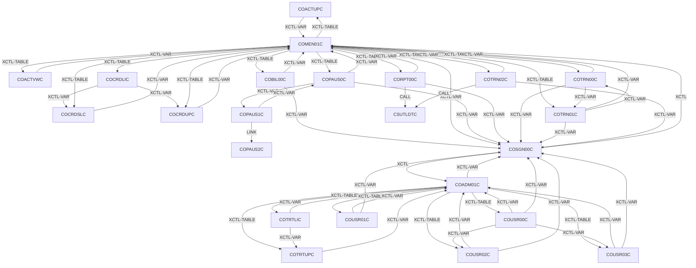
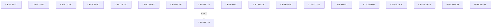
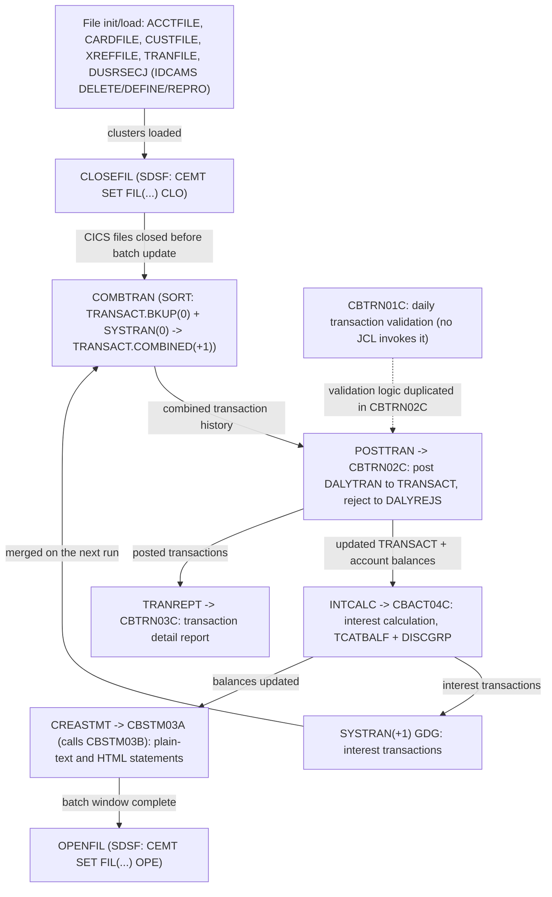

# CardDemo Dependency Map

Program-to-program edges were re-extracted directly from the COBOL sources (`CALL 'literal'`, `EXEC CICS XCTL PROGRAM(...)`, `EXEC CICS LINK PROGRAM(...)`); dataset lineage was parsed from the `//name EXEC` / `//name DD` cards and the in-stream IDCAMS control statements of every JCL member. Nothing here is inferred from documentation.

Sources: `app/cbl/`, `app/app-authorization-ims-db2-mq/cbl/`, `app/app-transaction-type-db2/cbl/`, `app/app-vsam-mq/cbl/`, `app/jcl/`, `app/proc/`, extension `jcl/` directories, `app/catlg/LISTCAT.txt`.

## 1. How the edges were resolved

| Edge kind | Source construct | Resolution |
| --- | --- | --- |
| `XCTL` | `EXEC CICS XCTL PROGRAM('COMEN01C')` | literal, exact |
| `LINK` | `EXEC CICS LINK PROGRAM(WS-PGM-AUTH-FRAUD)` | the data name is a `PIC X(08) VALUE 'COPAUS2C'` constant, so the target is static |
| `XCTL-VAR` | `EXEC CICS XCTL PROGRAM(CDEMO-TO-PROGRAM)` | resolved from every `MOVE <literal-or-constant> TO CDEMO-TO-PROGRAM` in the same program |
| `XCTL-TABLE` | `EXEC CICS XCTL PROGRAM(CDEMO-MENU-OPT-PGMNAME(...))` | resolved from the menu option tables `app/cpy/COMEN02Y.cpy` and `app/cpy/COADM02Y.cpy` |
| `XCTL-RETURN` | `MOVE CDEMO-FROM-PROGRAM TO CDEMO-TO-PROGRAM` then `XCTL` | returns to whichever program invoked the screen; the target is only known at run time |
| `CALL` | `CALL 'CSUTLDTC'` | static COBOL call |

## 2. Online navigation graph (CICS XCTL / LINK)

```mermaid
graph TD
    COACTUPC["COACTUPC"]
    COACTVWC["COACTVWC"]
    COADM01C["COADM01C"]
    COBIL00C["COBIL00C"]
    COCRDLIC["COCRDLIC"]
    COCRDSLC["COCRDSLC"]
    COCRDUPC["COCRDUPC"]
    COMEN01C["COMEN01C"]
    COPAUS0C["COPAUS0C"]
    COPAUS1C["COPAUS1C"]
    COPAUS2C["COPAUS2C"]
    CORPT00C["CORPT00C"]
    COSGN00C["COSGN00C"]
    COTRN00C["COTRN00C"]
    COTRN01C["COTRN01C"]
    COTRN02C["COTRN02C"]
    COTRTLIC["COTRTLIC"]
    COTRTUPC["COTRTUPC"]
    COUSR00C["COUSR00C"]
    COUSR01C["COUSR01C"]
    COUSR02C["COUSR02C"]
    COUSR03C["COUSR03C"]
    CSUTLDTC["CSUTLDTC"]
    COACTUPC -->|"XCTL-VAR"| COMEN01C
    COACTVWC -->|"XCTL-VAR"| COMEN01C
    COADM01C -->|"XCTL-VAR"| COSGN00C
    COADM01C -->|"XCTL-TABLE"| COTRTLIC
    COADM01C -->|"XCTL-TABLE"| COTRTUPC
    COADM01C -->|"XCTL-TABLE"| COUSR00C
    COADM01C -->|"XCTL-TABLE"| COUSR01C
    COADM01C -->|"XCTL-TABLE"| COUSR02C
    COADM01C -->|"XCTL-TABLE"| COUSR03C
    COBIL00C -->|"XCTL-VAR"| COMEN01C
    COBIL00C -->|"XCTL-VAR"| COSGN00C
    COCRDLIC -->|"XCTL-VAR"| COCRDSLC
    COCRDLIC -->|"XCTL-VAR"| COCRDUPC
    COCRDSLC -->|"XCTL-VAR"| COMEN01C
    COCRDUPC -->|"XCTL-VAR"| COMEN01C
    COMEN01C -->|"XCTL-TABLE"| COACTUPC
    COMEN01C -->|"XCTL-TABLE"| COACTVWC
    COMEN01C -->|"XCTL-TABLE"| COBIL00C
    COMEN01C -->|"XCTL-TABLE"| COCRDLIC
    COMEN01C -->|"XCTL-TABLE"| COCRDSLC
    COMEN01C -->|"XCTL-TABLE"| COCRDUPC
    COMEN01C -->|"XCTL-TABLE"| COPAUS0C
    COMEN01C -->|"XCTL-TABLE"| CORPT00C
    COMEN01C -->|"XCTL-VAR"| COSGN00C
    COMEN01C -->|"XCTL-TABLE"| COTRN00C
    COMEN01C -->|"XCTL-TABLE"| COTRN01C
    COMEN01C -->|"XCTL-TABLE"| COTRN02C
    COPAUS0C -->|"XCTL-VAR"| COMEN01C
    COPAUS0C -->|"XCTL-VAR"| COPAUS1C
    COPAUS0C -->|"XCTL-VAR"| COSGN00C
    COPAUS1C -->|"XCTL-VAR"| COPAUS0C
    COPAUS1C -->|"LINK"| COPAUS2C
    CORPT00C -->|"XCTL-VAR"| COMEN01C
    CORPT00C -->|"XCTL-VAR"| COSGN00C
    CORPT00C -->|"CALL"| CSUTLDTC
    COSGN00C -->|"XCTL"| COADM01C
    COSGN00C -->|"XCTL"| COMEN01C
    COTRN00C -->|"XCTL-VAR"| COMEN01C
    COTRN00C -->|"XCTL-VAR"| COSGN00C
    COTRN00C -->|"XCTL-VAR"| COTRN01C
    COTRN01C -->|"XCTL-VAR"| COMEN01C
    COTRN01C -->|"XCTL-VAR"| COSGN00C
    COTRN01C -->|"XCTL-VAR"| COTRN00C
    COTRN02C -->|"XCTL-VAR"| COMEN01C
    COTRN02C -->|"XCTL-VAR"| COSGN00C
    COTRN02C -->|"CALL"| CSUTLDTC
    COTRTLIC -->|"XCTL-VAR"| COADM01C
    COTRTLIC -->|"XCTL-VAR"| COTRTUPC
    COTRTUPC -->|"XCTL-VAR"| COADM01C
    COUSR00C -->|"XCTL-VAR"| COADM01C
    COUSR00C -->|"XCTL-VAR"| COSGN00C
    COUSR00C -->|"XCTL-VAR"| COUSR02C
    COUSR00C -->|"XCTL-VAR"| COUSR03C
    COUSR01C -->|"XCTL-VAR"| COADM01C
    COUSR01C -->|"XCTL-VAR"| COSGN00C
    COUSR02C -->|"XCTL-VAR"| COADM01C
    COUSR02C -->|"XCTL-VAR"| COSGN00C
    COUSR03C -->|"XCTL-VAR"| COADM01C
    COUSR03C -->|"XCTL-VAR"| COSGN00C
```

Self-transfers (`COCRDLIC -> COCRDLIC`, `COPAUS0C -> COPAUS0C`, i.e. a screen re-driving itself for paging) are omitted from the diagram; they are listed in the edge table below.

### Return-to-caller transfers

These programs end by transferring back to `CDEMO-FROM-PROGRAM`, the program stored in the commarea by whoever invoked them, so the target is dynamic:

| Program | Construct |
| --- | --- |
| `COACTUPC` | `MOVE CDEMO-FROM-PROGRAM TO CDEMO-TO-PROGRAM` + `XCTL PROGRAM(CDEMO-TO-PROGRAM)` |
| `COACTVWC` | `MOVE CDEMO-FROM-PROGRAM TO CDEMO-TO-PROGRAM` + `XCTL PROGRAM(CDEMO-TO-PROGRAM)` |
| `COBIL00C` | `MOVE CDEMO-FROM-PROGRAM TO CDEMO-TO-PROGRAM` + `XCTL PROGRAM(CDEMO-TO-PROGRAM)` |
| `COCRDSLC` | `MOVE CDEMO-FROM-PROGRAM TO CDEMO-TO-PROGRAM` + `XCTL PROGRAM(CDEMO-TO-PROGRAM)` |
| `COCRDUPC` | `MOVE CDEMO-FROM-PROGRAM TO CDEMO-TO-PROGRAM` + `XCTL PROGRAM(CDEMO-TO-PROGRAM)` |
| `COTRN01C` | `MOVE CDEMO-FROM-PROGRAM TO CDEMO-TO-PROGRAM` + `XCTL PROGRAM(CDEMO-TO-PROGRAM)` |
| `COTRN02C` | `MOVE CDEMO-FROM-PROGRAM TO CDEMO-TO-PROGRAM` + `XCTL PROGRAM(CDEMO-TO-PROGRAM)` |
| `COTRTLIC` | `MOVE CDEMO-FROM-PROGRAM TO CDEMO-TO-PROGRAM` + `XCTL PROGRAM(CDEMO-TO-PROGRAM)` |
| `COTRTUPC` | `MOVE CDEMO-FROM-PROGRAM TO CDEMO-TO-PROGRAM` + `XCTL PROGRAM(CDEMO-TO-PROGRAM)` |
| `COUSR02C` | `MOVE CDEMO-FROM-PROGRAM TO CDEMO-TO-PROGRAM` + `XCTL PROGRAM(CDEMO-TO-PROGRAM)` |
| `COUSR03C` | `MOVE CDEMO-FROM-PROGRAM TO CDEMO-TO-PROGRAM` + `XCTL PROGRAM(CDEMO-TO-PROGRAM)` |

## 3. Batch and utility call graph

```mermaid
graph TD
    CBACT01C["CBACT01C"]
    CBACT02C["CBACT02C"]
    CBACT03C["CBACT03C"]
    CBACT04C["CBACT04C"]
    CBCUS01C["CBCUS01C"]
    CBEXPORT["CBEXPORT"]
    CBIMPORT["CBIMPORT"]
    CBSTM03A["CBSTM03A"]
    CBSTM03B["CBSTM03B"]
    CBTRN01C["CBTRN01C"]
    CBTRN02C["CBTRN02C"]
    CBTRN03C["CBTRN03C"]
    COACCT01["COACCT01"]
    COBSWAIT["COBSWAIT"]
    CODATE01["CODATE01"]
    COPAUA0C["COPAUA0C"]
    DBUNLDGS["DBUNLDGS"]
    PAUDBLOD["PAUDBLOD"]
    PAUDBUNL["PAUDBUNL"]
    CBSTM03A -->|"CALL"| CBSTM03B
```

### External / runtime calls (not application programs)

| Caller | Target | Meaning |
| --- | --- | --- |
| `CBACT01C` | `CEE3ABD` | Language Environment callable service used to force an abend after a fatal file or logic error |
| `CBACT01C` | `COBDATFT` | COBOL date-format helper invoked by `CBACT01C` |
| `CBACT02C` | `CEE3ABD` | Language Environment callable service used to force an abend after a fatal file or logic error |
| `CBACT03C` | `CEE3ABD` | Language Environment callable service used to force an abend after a fatal file or logic error |
| `CBACT04C` | `CEE3ABD` | Language Environment callable service used to force an abend after a fatal file or logic error |
| `CBCUS01C` | `CEE3ABD` | Language Environment callable service used to force an abend after a fatal file or logic error |
| `CBEXPORT` | `CEE3ABD` | Language Environment callable service used to force an abend after a fatal file or logic error |
| `CBIMPORT` | `CEE3ABD` | Language Environment callable service used to force an abend after a fatal file or logic error |
| `CBSTM03A` | `CEE3ABD` | Language Environment callable service used to force an abend after a fatal file or logic error |
| `CBTRN01C` | `CEE3ABD` | Language Environment callable service used to force an abend after a fatal file or logic error |
| `CBTRN02C` | `CEE3ABD` | Language Environment callable service used to force an abend after a fatal file or logic error |
| `CBTRN03C` | `CEE3ABD` | Language Environment callable service used to force an abend after a fatal file or logic error |
| `COACCT01` | `MQCLOSE` | IBM MQ close queue |
| `COACCT01` | `MQGET` | IBM MQ get message |
| `COACCT01` | `MQOPEN` | IBM MQ open queue |
| `COACCT01` | `MQPUT` | IBM MQ put message |
| `COBSWAIT` | `MVSWAIT` | MVS wait service used by the `COBSWAIT` delay program |
| `CODATE01` | `MQCLOSE` | IBM MQ close queue |
| `CODATE01` | `MQGET` | IBM MQ get message |
| `CODATE01` | `MQOPEN` | IBM MQ open queue |
| `CODATE01` | `MQPUT` | IBM MQ put message |
| `COPAUA0C` | `MQCLOSE` | IBM MQ close queue |
| `COPAUA0C` | `MQGET` | IBM MQ get message |
| `COPAUA0C` | `MQOPEN` | IBM MQ open queue |
| `COPAUA0C` | `MQPUT1` | IBM MQ put single message |
| `DBUNLDGS` | `CBLTDLI` | IMS DL/I language interface (database and GSAM calls) |
| `PAUDBLOD` | `CBLTDLI` | IMS DL/I language interface (database and GSAM calls) |
| `PAUDBUNL` | `CBLTDLI` | IMS DL/I language interface (database and GSAM calls) |

### Complete edge list

| From | To | Kind |
| --- | --- | --- |
| `CBSTM03A` | `CBSTM03B` | CALL |
| `COACTUPC` | `COMEN01C` | XCTL-VAR |
| `COACTVWC` | `COMEN01C` | XCTL-VAR |
| `COADM01C` | `COSGN00C` | XCTL-VAR |
| `COADM01C` | `COTRTLIC` | XCTL-TABLE |
| `COADM01C` | `COTRTUPC` | XCTL-TABLE |
| `COADM01C` | `COUSR00C` | XCTL-TABLE |
| `COADM01C` | `COUSR01C` | XCTL-TABLE |
| `COADM01C` | `COUSR02C` | XCTL-TABLE |
| `COADM01C` | `COUSR03C` | XCTL-TABLE |
| `COBIL00C` | `COMEN01C` | XCTL-VAR |
| `COBIL00C` | `COSGN00C` | XCTL-VAR |
| `COCRDLIC` | `COCRDLIC` | XCTL-VAR |
| `COCRDLIC` | `COCRDSLC` | XCTL-VAR |
| `COCRDLIC` | `COCRDUPC` | XCTL-VAR |
| `COCRDSLC` | `COMEN01C` | XCTL-VAR |
| `COCRDUPC` | `COMEN01C` | XCTL-VAR |
| `COMEN01C` | `COACTUPC` | XCTL-TABLE |
| `COMEN01C` | `COACTVWC` | XCTL-TABLE |
| `COMEN01C` | `COBIL00C` | XCTL-TABLE |
| `COMEN01C` | `COCRDLIC` | XCTL-TABLE |
| `COMEN01C` | `COCRDSLC` | XCTL-TABLE |
| `COMEN01C` | `COCRDUPC` | XCTL-TABLE |
| `COMEN01C` | `COPAUS0C` | XCTL-TABLE |
| `COMEN01C` | `CORPT00C` | XCTL-TABLE |
| `COMEN01C` | `COSGN00C` | XCTL-VAR |
| `COMEN01C` | `COTRN00C` | XCTL-TABLE |
| `COMEN01C` | `COTRN01C` | XCTL-TABLE |
| `COMEN01C` | `COTRN02C` | XCTL-TABLE |
| `COPAUS0C` | `COMEN01C` | XCTL-VAR |
| `COPAUS0C` | `COPAUS0C` | XCTL-VAR |
| `COPAUS0C` | `COPAUS1C` | XCTL-VAR |
| `COPAUS0C` | `COSGN00C` | XCTL-VAR |
| `COPAUS1C` | `COPAUS0C` | XCTL-VAR |
| `COPAUS1C` | `COPAUS2C` | LINK |
| `CORPT00C` | `COMEN01C` | XCTL-VAR |
| `CORPT00C` | `COSGN00C` | XCTL-VAR |
| `CORPT00C` | `CSUTLDTC` | CALL |
| `COSGN00C` | `COADM01C` | XCTL |
| `COSGN00C` | `COMEN01C` | XCTL |
| `COTRN00C` | `COMEN01C` | XCTL-VAR |
| `COTRN00C` | `COSGN00C` | XCTL-VAR |
| `COTRN00C` | `COTRN01C` | XCTL-VAR |
| `COTRN01C` | `COMEN01C` | XCTL-VAR |
| `COTRN01C` | `COSGN00C` | XCTL-VAR |
| `COTRN01C` | `COTRN00C` | XCTL-VAR |
| `COTRN02C` | `COMEN01C` | XCTL-VAR |
| `COTRN02C` | `COSGN00C` | XCTL-VAR |
| `COTRN02C` | `CSUTLDTC` | CALL |
| `COTRTLIC` | `COADM01C` | XCTL-VAR |
| `COTRTLIC` | `COTRTUPC` | XCTL-VAR |
| `COTRTUPC` | `COADM01C` | XCTL-VAR |
| `COUSR00C` | `COADM01C` | XCTL-VAR |
| `COUSR00C` | `COSGN00C` | XCTL-VAR |
| `COUSR00C` | `COUSR02C` | XCTL-VAR |
| `COUSR00C` | `COUSR03C` | XCTL-VAR |
| `COUSR01C` | `COADM01C` | XCTL-VAR |
| `COUSR01C` | `COSGN00C` | XCTL-VAR |
| `COUSR02C` | `COADM01C` | XCTL-VAR |
| `COUSR02C` | `COSGN00C` | XCTL-VAR |
| `COUSR03C` | `COADM01C` | XCTL-VAR |
| `COUSR03C` | `COSGN00C` | XCTL-VAR |

## 4. Dataset lineage

Every DD card carrying a real dataset name, per job step. Housekeeping DDs (`SYSPRINT`, `SYSOUT`, `SYSUDUMP`, `STEPLIB`, ...) and in-stream control-card DDs are omitted. For IDCAMS steps the direction comes from the `REPRO INFILE/OUTFILE` control statement rather than from `DISP`, because both clusters are normally allocated `DISP=SHR`. For steps that run an application program the role is the COBOL `OPEN` mode of the matching `SELECT ... ASSIGN TO <dd>` (`INPUT` -> read, `OUTPUT` -> write, `I-O` -> read/update); `CBSTM03A` inherits the modes of the files opened by its subroutine `CBSTM03B`. `&HLQ`/`&LBNM` are unresolved JCL symbols.

| Job | Step | Program / utility | DD | Dataset | Role |
| --- | --- | --- | --- | --- | --- |
| `ACCTFILE` | `STEP15` | `IDCAMS` | `ACCTDATA` | `AWS.M2.CARDDEMO.ACCTDATA.PS` | read (`REPRO INFILE`) |
| `ACCTFILE` | `STEP15` | `IDCAMS` | `ACCTVSAM` | `AWS.M2.CARDDEMO.ACCTDATA.VSAM.KSDS` | write (`REPRO OUTFILE`) |
| `CARDFILE` | `STEP15` | `IDCAMS` | `CARDDATA` | `AWS.M2.CARDDEMO.CARDDATA.PS` | read (`REPRO INFILE`) |
| `CARDFILE` | `STEP15` | `IDCAMS` | `CARDVSAM` | `AWS.M2.CARDDEMO.CARDDATA.VSAM.KSDS` | write (`REPRO OUTFILE`) |
| `CBADMCDJ` | `STEP1` | `DFHCSDUP` | `DFHCSD` | `OEM.CICSTS.DFHCSD` | read |
| `CBEXPORT` | `STEP02` | `CBEXPORT` | `CUSTFILE` | `AWS.M2.CARDDEMO.CUSTDATA.VSAM.KSDS` | read |
| `CBEXPORT` | `STEP02` | `CBEXPORT` | `ACCTFILE` | `AWS.M2.CARDDEMO.ACCTDATA.VSAM.KSDS` | read |
| `CBEXPORT` | `STEP02` | `CBEXPORT` | `XREFFILE` | `AWS.M2.CARDDEMO.CARDXREF.VSAM.KSDS` | read |
| `CBEXPORT` | `STEP02` | `CBEXPORT` | `TRANSACT` | `AWS.M2.CARDDEMO.TRANSACT.VSAM.KSDS` | read |
| `CBEXPORT` | `STEP02` | `CBEXPORT` | `CARDFILE` | `AWS.M2.CARDDEMO.CARDDATA.VSAM.KSDS` | read |
| `CBEXPORT` | `STEP02` | `CBEXPORT` | `EXPFILE` | `AWS.M2.CARDDEMO.EXPORT.DATA` | write |
| `CBIMPORT` | `STEP01` | `CBIMPORT` | `EXPFILE` | `AWS.M2.CARDDEMO.EXPORT.DATA` | read |
| `CBIMPORT` | `STEP01` | `CBIMPORT` | `CUSTOUT` | `AWS.M2.CARDDEMO.CUSTDATA.IMPORT` | write |
| `CBIMPORT` | `STEP01` | `CBIMPORT` | `ACCTOUT` | `AWS.M2.CARDDEMO.ACCTDATA.IMPORT` | write |
| `CBIMPORT` | `STEP01` | `CBIMPORT` | `XREFOUT` | `AWS.M2.CARDDEMO.CARDXREF.IMPORT` | write |
| `CBIMPORT` | `STEP01` | `CBIMPORT` | `TRNXOUT` | `AWS.M2.CARDDEMO.TRANSACT.IMPORT` | write |
| `CBIMPORT` | `STEP01` | `CBIMPORT` | `ERROUT` | `AWS.M2.CARDDEMO.IMPORT.ERRORS` | write |
| `COMBTRAN` | `STEP05R` | `SORT` | `SORTIN` | `AWS.M2.CARDDEMO.TRANSACT.BKUP(0)` | read |
| `COMBTRAN` | `STEP05R` | `SORT` | `SORTIN (concat)` | `AWS.M2.CARDDEMO.SYSTRAN(0)` | read |
| `COMBTRAN` | `STEP05R` | `SORT` | `SORTOUT` | `AWS.M2.CARDDEMO.TRANSACT.COMBINED(+1)` | write |
| `COMBTRAN` | `STEP10` | `IDCAMS` | `TRANSACT` | `AWS.M2.CARDDEMO.TRANSACT.COMBINED(+1)` | read (`REPRO INFILE`) |
| `COMBTRAN` | `STEP10` | `IDCAMS` | `TRANVSAM` | `AWS.M2.CARDDEMO.TRANSACT.VSAM.KSDS` | write (`REPRO OUTFILE`) |
| `CREASTMT` | `STEP010` | `SORT` | `SORTIN` | `AWS.M2.CARDDEMO.TRANSACT.VSAM.KSDS` | read |
| `CREASTMT` | `STEP010` | `SORT` | `SORTOUT` | `AWS.M2.CARDDEMO.TRXFL.SEQ` | write |
| `CREASTMT` | `STEP020` | `IDCAMS` | `INFILE` | `AWS.M2.CARDDEMO.TRXFL.SEQ` | read (`REPRO INFILE`) |
| `CREASTMT` | `STEP020` | `IDCAMS` | `OUTFILE` | `AWS.M2.CARDDEMO.TRXFL.VSAM.KSDS` | write (`REPRO OUTFILE`) |
| `CREASTMT` | `STEP030` | `IEFBR14` | `HTMLFILE` | `AWS.M2.CARDDEMO.STATEMNT.HTML` | write |
| `CREASTMT` | `STEP030` | `IEFBR14` | `STMTFILE` | `AWS.M2.CARDDEMO.STATEMNT.PS` | write |
| `CREASTMT` | `STEP040` | `CBSTM03A` | `TRNXFILE` | `AWS.M2.CARDDEMO.TRXFL.VSAM.KSDS` | read |
| `CREASTMT` | `STEP040` | `CBSTM03A` | `XREFFILE` | `AWS.M2.CARDDEMO.CARDXREF.VSAM.KSDS` | read |
| `CREASTMT` | `STEP040` | `CBSTM03A` | `ACCTFILE` | `AWS.M2.CARDDEMO.ACCTDATA.VSAM.KSDS` | read |
| `CREASTMT` | `STEP040` | `CBSTM03A` | `CUSTFILE` | `AWS.M2.CARDDEMO.CUSTDATA.VSAM.KSDS` | read |
| `CREASTMT` | `STEP040` | `CBSTM03A` | `STMTFILE` | `AWS.M2.CARDDEMO.STATEMNT.PS` | write |
| `CREASTMT` | `STEP040` | `CBSTM03A` | `HTMLFILE` | `AWS.M2.CARDDEMO.STATEMNT.HTML` | write |
| `CUSTFILE` | `STEP15` | `IDCAMS` | `CUSTDATA` | `AWS.M2.CARDDEMO.CUSTDATA.PS` | read (`REPRO INFILE`) |
| `CUSTFILE` | `STEP15` | `IDCAMS` | `CUSTVSAM` | `AWS.M2.CARDDEMO.CUSTDATA.VSAM.KSDS` | write (`REPRO OUTFILE`) |
| `DEFGDGD` | `STEP20` | `IEBGENER` | `SYSUT1` | `AWS.M2.CARDDEMO.TRANTYPE.PS` | read |
| `DEFGDGD` | `STEP20` | `IEBGENER` | `SYSUT2` | `AWS.M2.CARDDEMO.TRANTYPE.BKUP(+1)` | write |
| `DEFGDGD` | `STEP40` | `IEBGENER` | `SYSUT1` | `AWS.M2.CARDDEMO.TRANCATG.PS` | read |
| `DEFGDGD` | `STEP40` | `IEBGENER` | `SYSUT2` | `AWS.M2.CARDDEMO.TRANCATG.PS.BKUP(+1)` | write |
| `DEFGDGD` | `STEP60` | `IEBGENER` | `SYSUT1` | `AWS.M2.CARDDEMO.DISCGRP.PS` | read |
| `DEFGDGD` | `STEP60` | `IEBGENER` | `SYSUT2` | `AWS.M2.CARDDEMO.DISCGRP.BKUP(+1)` | write |
| `DISCGRP` | `STEP15` | `IDCAMS` | `DISCGRP` | `AWS.M2.CARDDEMO.DISCGRP.PS` | read (`REPRO INFILE`) |
| `DISCGRP` | `STEP15` | `IDCAMS` | `DISCVSAM` | `AWS.M2.CARDDEMO.DISCGRP.VSAM.KSDS` | write (`REPRO OUTFILE`) |
| `DUSRSECJ` | `PREDEL` | `IEFBR14` | `DD01` | `AWS.M2.CARDDEMO.USRSEC.PS` | write |
| `DUSRSECJ` | `STEP01` | `IEBGENER` | `SYSUT2` | `AWS.M2.CARDDEMO.USRSEC.PS` | write |
| `DUSRSECJ` | `STEP03` | `IDCAMS` | `IN` | `AWS.M2.CARDDEMO.USRSEC.PS` | read (`REPRO INFILE`) |
| `DUSRSECJ` | `STEP03` | `IDCAMS` | `OUT` | `AWS.M2.CARDDEMO.USRSEC.VSAM.KSDS` | write (`REPRO OUTFILE`) |
| `ESDSRRDS` | `PREDEL` | `IEFBR14` | `DD01` | `AWS.M2.CARDDEMO.ESDSRRDS.PS` | write |
| `ESDSRRDS` | `STEP01` | `IEBGENER` | `SYSUT2` | `AWS.M2.CARDDEMO.ESDSRRDS.PS` | write |
| `ESDSRRDS` | `STEP03` | `IDCAMS` | `IN` | `AWS.M2.CARDDEMO.ESDSRRDS.PS` | read (`REPRO INFILE`) |
| `ESDSRRDS` | `STEP03` | `IDCAMS` | `OUT` | `AWS.M2.CARDDEMO.USRSEC.VSAM.ESDS` | write (`REPRO OUTFILE`) |
| `ESDSRRDS` | `STEP05` | `IDCAMS` | `IN` | `AWS.M2.CARDDEMO.ESDSRRDS.PS` | read (`REPRO INFILE`) |
| `ESDSRRDS` | `STEP05` | `IDCAMS` | `OUT` | `AWS.M2.CARDDEMO.USRSEC.VSAM.RRDS` | write (`REPRO OUTFILE`) |
| `INTCALC` | `STEP15` | `CBACT04C` | `TCATBALF` | `AWS.M2.CARDDEMO.TCATBALF.VSAM.KSDS` | read |
| `INTCALC` | `STEP15` | `CBACT04C` | `XREFFILE` | `AWS.M2.CARDDEMO.CARDXREF.VSAM.KSDS` | read |
| `INTCALC` | `STEP15` | `CBACT04C` | `XREFFIL1` | `AWS.M2.CARDDEMO.CARDXREF.VSAM.AIX.PATH` | read |
| `INTCALC` | `STEP15` | `CBACT04C` | `ACCTFILE` | `AWS.M2.CARDDEMO.ACCTDATA.VSAM.KSDS` | read/update (`OPEN I-O`) |
| `INTCALC` | `STEP15` | `CBACT04C` | `DISCGRP` | `AWS.M2.CARDDEMO.DISCGRP.VSAM.KSDS` | read |
| `INTCALC` | `STEP15` | `CBACT04C` | `TRANSACT` | `AWS.M2.CARDDEMO.SYSTRAN(+1)` | write |
| `INTRDRJ1` | `IDCAMS` | `IDCAMS` | `IN` | `AWS.M2.CARDEMO.FTP.TEST` | read |
| `INTRDRJ1` | `IDCAMS` | `IDCAMS` | `OUT` | `AWS.M2.CARDEMO.FTP.TEST.BKUP` | read |
| `INTRDRJ1` | `STEP01` | `IEBGENER` | `SYSUT1` | `AWS.M2.CARDDEMO.JCL(INTRDRJ2)` | read |
| `INTRDRJ2` | `IDCAMS` | `IDCAMS` | `IN` | `AWS.M2.CARDEMO.FTP.TEST.BKUP` | read |
| `INTRDRJ2` | `IDCAMS` | `IDCAMS` | `OUT` | `AWS.M2.CARDEMO.FTP.TEST.BKUP.INTRDR` | read |
| `POSTTRAN` | `STEP15` | `CBTRN02C` | `TRANFILE` | `AWS.M2.CARDDEMO.TRANSACT.VSAM.KSDS` | write |
| `POSTTRAN` | `STEP15` | `CBTRN02C` | `DALYTRAN` | `AWS.M2.CARDDEMO.DALYTRAN.PS` | read |
| `POSTTRAN` | `STEP15` | `CBTRN02C` | `XREFFILE` | `AWS.M2.CARDDEMO.CARDXREF.VSAM.KSDS` | read |
| `POSTTRAN` | `STEP15` | `CBTRN02C` | `DALYREJS` | `AWS.M2.CARDDEMO.DALYREJS(+1)` | write |
| `POSTTRAN` | `STEP15` | `CBTRN02C` | `ACCTFILE` | `AWS.M2.CARDDEMO.ACCTDATA.VSAM.KSDS` | read/update (`OPEN I-O`) |
| `POSTTRAN` | `STEP15` | `CBTRN02C` | `TCATBALF` | `AWS.M2.CARDDEMO.TCATBALF.VSAM.KSDS` | read/update (`OPEN I-O`) |
| `PRTCATBL` | `DELDEF` | `IEFBR14` | `THEFILE` | `AWS.M2.CARDDEMO.TCATBALF.REPT` | write |
| `PRTCATBL` | `STEP05R` | `PROC REPROC` | `PRC001.FILEIN` | `AWS.M2.CARDDEMO.TCATBALF.VSAM.KSDS` | read |
| `PRTCATBL` | `STEP05R` | `PROC REPROC` | `PRC001.FILEOUT` | `AWS.M2.CARDDEMO.TCATBALF.BKUP(+1)` | write |
| `PRTCATBL` | `STEP10R` | `SORT` | `SORTIN` | `AWS.M2.CARDDEMO.TCATBALF.BKUP(+1)` | read |
| `PRTCATBL` | `STEP10R` | `SORT` | `SORTOUT` | `AWS.M2.CARDDEMO.TCATBALF.REPT` | write |
| `READACCT` | `PREDEL` | `IEFBR14` | `DD01` | `AWS.M2.CARDDEMO.ACCTDATA.PSCOMP` | write |
| `READACCT` | `PREDEL` | `IEFBR14` | `DD02` | `AWS.M2.CARDDEMO.ACCTDATA.ARRYPS` | write |
| `READACCT` | `PREDEL` | `IEFBR14` | `DD03` | `AWS.M2.CARDDEMO.ACCTDATA.VBPS` | write |
| `READACCT` | `STEP05` | `CBACT01C` | `ACCTFILE` | `AWS.M2.CARDDEMO.ACCTDATA.VSAM.KSDS` | read |
| `READACCT` | `STEP05` | `CBACT01C` | `OUTFILE` | `AWS.M2.CARDDEMO.ACCTDATA.PSCOMP` | write |
| `READACCT` | `STEP05` | `CBACT01C` | `ARRYFILE` | `AWS.M2.CARDDEMO.ACCTDATA.ARRYPS` | write |
| `READACCT` | `STEP05` | `CBACT01C` | `VBRCFILE` | `AWS.M2.CARDDEMO.ACCTDATA.VBPS` | write |
| `READCARD` | `STEP05` | `CBACT02C` | `CARDFILE` | `AWS.M2.CARDDEMO.CARDDATA.VSAM.KSDS` | read |
| `READCUST` | `STEP05` | `CBCUS01C` | `CUSTFILE` | `AWS.M2.CARDDEMO.CUSTDATA.VSAM.KSDS` | read |
| `READXREF` | `STEP05` | `CBACT03C` | `XREFFILE` | `AWS.M2.CARDDEMO.CARDXREF.VSAM.KSDS` | read |
| `TCATBALF` | `STEP15` | `IDCAMS` | `TCATBAL` | `AWS.M2.CARDDEMO.TCATBALF.PS` | read (`REPRO INFILE`) |
| `TCATBALF` | `STEP15` | `IDCAMS` | `TCATBALV` | `AWS.M2.CARDDEMO.TCATBALF.VSAM.KSDS` | write (`REPRO OUTFILE`) |
| `TRANBKP` | `STEP05R` | `PROC REPROC` | `PRC001.FILEIN` | `AWS.M2.CARDDEMO.TRANSACT.VSAM.KSDS` | read |
| `TRANBKP` | `STEP05R` | `PROC REPROC` | `PRC001.FILEOUT` | `AWS.M2.CARDDEMO.TRANSACT.BKUP(+1)` | write |
| `TRANCATG` | `STEP15` | `IDCAMS` | `TRANCATG` | `AWS.M2.CARDDEMO.TRANCATG.PS` | read (`REPRO INFILE`) |
| `TRANCATG` | `STEP15` | `IDCAMS` | `TCATVSAM` | `AWS.M2.CARDDEMO.TRANCATG.VSAM.KSDS` | write (`REPRO OUTFILE`) |
| `TRANFILE` | `STEP15` | `IDCAMS` | `TRANSACT` | `AWS.M2.CARDDEMO.DALYTRAN.PS.INIT` | read (`REPRO INFILE`) |
| `TRANFILE` | `STEP15` | `IDCAMS` | `TRANVSAM` | `AWS.M2.CARDDEMO.TRANSACT.VSAM.KSDS` | write (`REPRO OUTFILE`) |
| `TRANREPT` | `STEP05R` | `PROC REPROC` | `PRC001.FILEIN` | `AWS.M2.CARDDEMO.TRANSACT.VSAM.KSDS` | read |
| `TRANREPT` | `STEP05R` | `PROC REPROC` | `PRC001.FILEOUT` | `AWS.M2.CARDDEMO.TRANSACT.BKUP(+1)` | write |
| `TRANREPT` | `STEP05R` | `SORT` | `SORTIN` | `AWS.M2.CARDDEMO.TRANSACT.BKUP(+1)` | read |
| `TRANREPT` | `STEP05R` | `SORT` | `SORTOUT` | `AWS.M2.CARDDEMO.TRANSACT.DALY(+1)` | write |
| `TRANREPT` | `STEP10R` | `CBTRN03C` | `TRANFILE` | `AWS.M2.CARDDEMO.TRANSACT.DALY(+1)` | read |
| `TRANREPT` | `STEP10R` | `CBTRN03C` | `CARDXREF` | `AWS.M2.CARDDEMO.CARDXREF.VSAM.KSDS` | read |
| `TRANREPT` | `STEP10R` | `CBTRN03C` | `TRANTYPE` | `AWS.M2.CARDDEMO.TRANTYPE.VSAM.KSDS` | read |
| `TRANREPT` | `STEP10R` | `CBTRN03C` | `TRANCATG` | `AWS.M2.CARDDEMO.TRANCATG.VSAM.KSDS` | read |
| `TRANREPT` | `STEP10R` | `CBTRN03C` | `DATEPARM` | `AWS.M2.CARDDEMO.DATEPARM` | read |
| `TRANREPT` | `STEP10R` | `CBTRN03C` | `TRANREPT` | `AWS.M2.CARDDEMO.TRANREPT(+1)` | write |
| `TRANTYPE` | `STEP15` | `IDCAMS` | `TRANTYPE` | `AWS.M2.CARDDEMO.TRANTYPE.PS` | read (`REPRO INFILE`) |
| `TRANTYPE` | `STEP15` | `IDCAMS` | `TTYPVSAM` | `AWS.M2.CARDDEMO.TRANTYPE.VSAM.KSDS` | write (`REPRO OUTFILE`) |
| `TXT2PDF1` | `TXT2PDF` | `IKJEFT1B` | `SYSEXEC` | `AWS.M2.LBD.TXT2PDF.EXEC` | read |
| `TXT2PDF1` | `TXT2PDF` | `IKJEFT1B` | `INDD` | `AWS.M2.CARDDEMO.STATEMNT.PS` | read |
| `XREFFILE` | `STEP15` | `IDCAMS` | `XREFDATA` | `AWS.M2.CARDDEMO.CARDXREF.PS` | read (`REPRO INFILE`) |
| `XREFFILE` | `STEP15` | `IDCAMS` | `XREFVSAM` | `AWS.M2.CARDDEMO.CARDXREF.VSAM.KSDS` | write (`REPRO OUTFILE`) |
| `REPROC` | `PRC001` | `IDCAMS` | `FILEIN` | `NULLFILE` | read |
| `REPROC` | `PRC001` | `IDCAMS` | `FILEOUT` | `NULLFILE` | read |
| `REPROC` | `PRC001` | `IDCAMS` | `SYSIN` | `&CNTLLIB(REPROCT)PEND` | read |
| `TRANREPT` | `STEP01R` | `PROC REPROC` | `PRC001.FILEIN` | `AWS.M2.CARDDEMO.TRANSACT.VSAM.KSDS` | read |
| `TRANREPT` | `STEP01R` | `PROC REPROC` | `PRC001.FILEOUT` | `AWS.M2.CARDDEMO.TRANSACT.BKUP(+1)` | write |
| `TRANREPT` | `STEP05R` | `SORT` | `SORTIN` | `AWS.M2.CARDDEMO.TRANSACT.BKUP(+1)` | read |
| `TRANREPT` | `STEP05R` | `SORT` | `SORTOUT` | `AWS.M2.CARDDEMO.TRANSACT.DALY(+1)` | write |
| `TRANREPT` | `STEP10R` | `CBTRN03C` | `TRANFILE` | `AWS.M2.CARDDEMO.TRANSACT.DALY(+1)` | read |
| `TRANREPT` | `STEP10R` | `CBTRN03C` | `CARDXREF` | `AWS.M2.CARDDEMO.CARDXREF.VSAM.KSDS` | read |
| `TRANREPT` | `STEP10R` | `CBTRN03C` | `TRANTYPE` | `AWS.M2.CARDDEMO.TRANTYPE.VSAM.KSDS` | read |
| `TRANREPT` | `STEP10R` | `CBTRN03C` | `TRANCATG` | `AWS.M2.CARDDEMO.TRANCATG.VSAM.KSDS` | read |
| `TRANREPT` | `STEP10R` | `CBTRN03C` | `DATEPARM` | `AWS.M2.CARDDEMO.DATEPARM` | read |
| `TRANREPT` | `STEP10R` | `CBTRN03C` | `TRANREPT` | `AWS.M2.CARDDEMO.TRANREPT(+1)PEND` | write |
| `CBPAUP0J` | `STEP01` | `DFSRRC00` | `DFSRESLB` | `IMS.SDFSRESL` | read |
| `CBPAUP0J` | `STEP01` | `DFSRRC00` | `PROCLIB` | `IMS.PROCLIB` | read |
| `CBPAUP0J` | `STEP01` | `DFSRRC00` | `DFSSEL` | `IMS.SDFSRESL` | read |
| `CBPAUP0J` | `STEP01` | `DFSRRC00` | `IMS` | `IMS.PSBLIB` | read |
| `CBPAUP0J` | `STEP01` | `DFSRRC00` | `IMS (concat)` | `IMS.DBDLIB` | read |
| `DBPAUTP0` | `STEPDEL` | `IEFBR14` | `SYSUT1` | `AWS.M2.CARDDEMO.IMSDATA.DBPAUTP0` | read |
| `DBPAUTP0` | `UNLOAD` | `DFSRRC00` | `DFSRESLB` | `OEMA.IMS.IMSP.SDFSRESL` | read |
| `DBPAUTP0` | `UNLOAD` | `DFSRRC00` | `IMS` | `OEM.IMS.IMSP.PSBLIB` | read |
| `DBPAUTP0` | `UNLOAD` | `DFSRRC00` | `IMS (concat)` | `OEM.IMS.IMSP.DBDLIB` | read |
| `DBPAUTP0` | `UNLOAD` | `DFSRRC00` | `DFSURGU1` | `AWS.M2.CARDDEMO.IMSDATA.DBPAUTP0` | n/a |
| `DBPAUTP0` | `UNLOAD` | `DFSRRC00` | `DDPAUTP0` | `OEM.IMS.IMSP.PAUTHDB` | read |
| `DBPAUTP0` | `UNLOAD` | `DFSRRC00` | `DDPAUTX0` | `OEM.IMS.IMSP.PAUTHDBX` | read |
| `DBPAUTP0` | `UNLOAD` | `DFSRRC00` | `DFSVSAMP` | `OEMPP.IMS.V15R01MB.PROCLIB(DFSVSMDB)` | read |
| `DBPAUTP0` | `UNLOAD` | `DFSRRC00` | `RECON1` | `OEM.IMS.IMSP.RECON1` | read |
| `DBPAUTP0` | `UNLOAD` | `DFSRRC00` | `RECON2` | `OEM.IMS.IMSP.RECON2` | read |
| `DBPAUTP0` | `UNLOAD` | `DFSRRC00` | `RECON3` | `OEM.IMS.IMSP.RECON3` | read |
| `LOADPADB` | `STEP01` | `DFSRRC00` | `DFSRESLB` | `OEMA.IMS.IMSP.SDFSRESL` | read |
| `LOADPADB` | `STEP01` | `DFSRRC00` | `IMS` | `OEM.IMS.IMSP.PSBLIB` | read |
| `LOADPADB` | `STEP01` | `DFSRRC00` | `IMS (concat)` | `OEM.IMS.IMSP.DBDLIB` | read |
| `LOADPADB` | `STEP01` | `DFSRRC00` | `INFILE1` | `AWS.M2.CARDDEMO.PAUTDB.ROOT.FILEO` | read |
| `LOADPADB` | `STEP01` | `DFSRRC00` | `INFILE2` | `AWS.M2.CARDDEMO.PAUTDB.CHILD.FILEO` | read |
| `LOADPADB` | `STEP01` | `DFSRRC00` | `DFSVSAMP` | `OEMPP.IMS.V15R01MB.PROCLIB(DFSVSMDB)` | read |
| `UNLDGSAM` | `STEP01` | `DFSRRC00` | `DFSRESLB` | `OEMA.IMS.IMSP.SDFSRESL` | read |
| `UNLDGSAM` | `STEP01` | `DFSRRC00` | `IMS` | `OEM.IMS.IMSP.PSBLIB` | read |
| `UNLDGSAM` | `STEP01` | `DFSRRC00` | `IMS (concat)` | `OEM.IMS.IMSP.DBDLIB` | read |
| `UNLDGSAM` | `STEP01` | `DFSRRC00` | `PASFILOP` | `AWS.M2.CARDDEMO.PAUTDB.ROOT.GSAM` | read |
| `UNLDGSAM` | `STEP01` | `DFSRRC00` | `PADFILOP` | `AWS.M2.CARDDEMO.PAUTDB.CHILD.GSAM` | read |
| `UNLDGSAM` | `STEP01` | `DFSRRC00` | `DDPAUTP0` | `OEM.IMS.IMSP.PAUTHDB` | read |
| `UNLDGSAM` | `STEP01` | `DFSRRC00` | `DDPAUTX0` | `OEM.IMS.IMSP.PAUTHDBX` | read |
| `UNLDGSAM` | `STEP01` | `DFSRRC00` | `DFSVSAMP` | `OEMPP.IMS.V15R01MB.PROCLIB(DFSVSMDB)` | read |
| `UNLDPADB` | `STEP0` | `IEFBR14` | `DD1` | `AWS.M2.CARDDEMO.PAUTDB.ROOT.FILEO` | read |
| `UNLDPADB` | `STEP0` | `IEFBR14` | `DD2` | `AWS.M2.CARDDEMO.PAUTDB.CHILD.FILEO` | read |
| `UNLDPADB` | `STEP01` | `DFSRRC00` | `DFSRESLB` | `OEMA.IMS.IMSP.SDFSRESL` | read |
| `UNLDPADB` | `STEP01` | `DFSRRC00` | `IMS` | `OEM.IMS.IMSP.PSBLIB` | read |
| `UNLDPADB` | `STEP01` | `DFSRRC00` | `IMS (concat)` | `OEM.IMS.IMSP.DBDLIB` | read |
| `UNLDPADB` | `STEP01` | `DFSRRC00` | `OUTFIL1` | `AWS.M2.CARDDEMO.PAUTDB.ROOT.FILEO` | write |
| `UNLDPADB` | `STEP01` | `DFSRRC00` | `OUTFIL2` | `AWS.M2.CARDDEMO.PAUTDB.CHILD.FILEO` | write |
| `UNLDPADB` | `STEP01` | `DFSRRC00` | `DDPAUTP0` | `OEM.IMS.IMSP.PAUTHDB` | read |
| `UNLDPADB` | `STEP01` | `DFSRRC00` | `DDPAUTX0` | `OEM.IMS.IMSP.PAUTHDBX` | read |
| `UNLDPADB` | `STEP01` | `DFSRRC00` | `DFSVSAMP` | `OEMPP.IMS.V15R01MB.PROCLIB(DFSVSMDB)` | read |
| `CREADB21` | `CRCRDDB` | `IKJEFT01` | `SYSIN` | `&LBNM..CNTL(DB2CREAT)` | read |
| `CREADB21` | `RUNTEP2` | `IKJEFT01` | `SYSIN` | `&LBNM..CNTL(DB2LTTYP)` | read |
| `CREADB21` | `LDTCCAT` | `IKJEFT01` | `SYSIN` | `&LBNM..CNTL(DB2LTCAT)` | read |
| `MNTTRDB2` | `STEP1` | `IKJEFT01` | `DBRMLIB` | `AWS.M2.CARDDEMO.DBRMLIB` | read |
| `MNTTRDB2` | `STEP1` | `IKJEFT01` | `INPFILE` | `INPFILE` | read |
| `TRANEXTR` | `STEP10` | `IEBGENER` | `SYSUT1` | `&HLQ..TRANTYPE.PS` | read |
| `TRANEXTR` | `STEP10` | `IEBGENER` | `SYSUT2` | `&HLQ..TRANTYPE.BKUP(+1)` | write |
| `TRANEXTR` | `STEP20` | `IEBGENER` | `SYSUT1` | `&HLQ..TRANCATG.PS` | read |
| `TRANEXTR` | `STEP20` | `IEBGENER` | `SYSUT2` | `&HLQ..TRANCATG.PS.BKUP(+1)` | write |
| `TRANEXTR` | `STEP30` | `IEFBR14` | `DD01` | `&HLQ..TRANTYPE.PS` | write |
| `TRANEXTR` | `STEP30` | `IEFBR14` | `DD02` | `&HLQ..TRANCATG.PS` | write |
| `TRANEXTR` | `STEP40` | `IKJEFT01` | `SYSREC00` | `&HLQ..TRANTYPE.PS` | write |
| `TRANEXTR` | `STEP50` | `IKJEFT01` | `SYSREC00` | `&HLQ..TRANCATG.PS` | write |

### Clusters created or deleted by in-stream IDCAMS statements

`DELETE`/`DEFINE CLUSTER` name their target inside `SYSIN`, not on a DD card, so those clusters would be invisible in the table above.

| Job | Step | Action | Object |
| --- | --- | --- | --- |
| `ACCTFILE` | `STEP05` | DELETE | `AWS.M2.CARDDEMO.ACCTDATA.VSAM.KSDS` |
| `ACCTFILE` | `STEP10` | DEFINE CLUSTER | `AWS.M2.CARDDEMO.ACCTDATA.VSAM.KSDS` |
| `CARDFILE` | `STEP05` | DELETE | `AWS.M2.CARDDEMO.CARDDATA.VSAM.KSDS` |
| `CARDFILE` | `STEP05` | DELETE | `AWS.M2.CARDDEMO.CARDDATA.VSAM.AIX` |
| `CARDFILE` | `STEP10` | DEFINE CLUSTER | `AWS.M2.CARDDEMO.CARDDATA.VSAM.KSDS` |
| `CARDFILE` | `STEP40` | DEFINE AIX | `AWS.M2.CARDDEMO.CARDDATA.VSAM.AIX` |
| `CARDFILE` | `STEP50` | DEFINE PATH | `AWS.M2.CARDDEMO.CARDDATA.VSAM.AIX.PATH` |
| `CBADMCDJ` | `STEP1` | DELETE | `COMMAND.` |
| `CBADMCDJ` | `STEP1` | DELETE | `GROUP(CARDDEMO)` |
| `CBEXPORT` | `STEP01` | DEFINE CLUSTER | `AWS.M2.CARDDEMO.EXPORT.DATA` |
| `CBEXPORT` | `STEP01` | DELETE | `AWS.M2.CARDDEMO.EXPORT.DATA` |
| `CREASTMT` | `DELDEF01` | DEFINE CLUSTER | `AWS.M2.CARDDEMO.TRXFL.VSAM.KSDS` |
| `CREASTMT` | `DELDEF01` | DELETE | `AWS.M2.CARDDEMO.TRXFL.SEQ` |
| `CREASTMT` | `DELDEF01` | DELETE | `AWS.M2.CARDDEMO.TRXFL.VSAM.KSDS` |
| `CUSTFILE` | `STEP05` | DELETE | `AWS.M2.CARDDEMO.CUSTDATA.VSAM.KSDS` |
| `CUSTFILE` | `STEP10` | DEFINE CLUSTER | `AWS.M2.CARDDEMO.CUSTDATA.VSAM.KSDS` |
| `DEFCUST` | `STEP05` | DELETE | `AWS.CCDA.CUSTDATA.CLUSTER` |
| `DEFCUST` | `STEP05` | DEFINE CLUSTER | `AWS.CUSTDATA.CLUSTER` |
| `DISCGRP` | `STEP05` | DELETE | `AWS.M2.CARDDEMO.DISCGRP.VSAM.KSDS` |
| `DISCGRP` | `STEP10` | DEFINE CLUSTER | `AWS.M2.CARDDEMO.DISCGRP.VSAM.KSDS` |
| `DUSRSECJ` | `STEP02` | DEFINE CLUSTER | `AWS.M2.CARDDEMO.USRSEC.VSAM.KSDS` |
| `DUSRSECJ` | `STEP02` | DELETE | `AWS.M2.CARDDEMO.USRSEC.VSAM.KSDS` |
| `ESDSRRDS` | `STEP02` | DEFINE CLUSTER | `AWS.M2.CARDDEMO.USRSEC.VSAM.ESDS` |
| `ESDSRRDS` | `STEP02` | DELETE | `AWS.M2.CARDDEMO.USRSEC.VSAM.ESDS` |
| `ESDSRRDS` | `STEP04` | DEFINE CLUSTER | `AWS.M2.CARDDEMO.USRSEC.VSAM.RRDS` |
| `ESDSRRDS` | `STEP04` | DELETE | `AWS.M2.CARDDEMO.USRSEC.VSAM.RRDS` |
| `TCATBALF` | `STEP05` | DELETE | `AWS.M2.CARDDEMO.TCATBALF.VSAM.KSDS` |
| `TCATBALF` | `STEP10` | DEFINE CLUSTER | `AWS.M2.CARDDEMO.TCATBALF.VSAM.KSDS` |
| `TRANBKP` | `STEP05` | DELETE | `AWS.M2.CARDDEMO.TRANSACT.VSAM.KSDS` |
| `TRANBKP` | `STEP05` | DELETE | `AWS.M2.CARDDEMO.TRANSACT.VSAM.AIX` |
| `TRANBKP` | `STEP10` | DEFINE CLUSTER | `AWS.M2.CARDDEMO.TRANSACT.VSAM.KSDS` |
| `TRANCATG` | `STEP05` | DELETE | `AWS.M2.CARDDEMO.TRANCATG.VSAM.KSDS` |
| `TRANCATG` | `STEP10` | DEFINE CLUSTER | `AWS.M2.CARDDEMO.TRANCATG.VSAM.KSDS` |
| `TRANFILE` | `STEP05` | DELETE | `AWS.M2.CARDDEMO.TRANSACT.VSAM.KSDS` |
| `TRANFILE` | `STEP05` | DELETE | `AWS.M2.CARDDEMO.TRANSACT.VSAM.AIX` |
| `TRANFILE` | `STEP10` | DEFINE CLUSTER | `AWS.M2.CARDDEMO.TRANSACT.VSAM.KSDS` |
| `TRANFILE` | `STEP20` | DEFINE AIX | `AWS.M2.CARDDEMO.TRANSACT.VSAM.AIX` |
| `TRANFILE` | `STEP25` | DEFINE PATH | `AWS.M2.CARDDEMO.TRANSACT.VSAM.AIX.PATH` |
| `TRANIDX` | `STEP20` | DEFINE AIX | `AWS.M2.CARDDEMO.TRANSACT.VSAM.AIX` |
| `TRANIDX` | `STEP25` | DEFINE PATH | `AWS.M2.CARDDEMO.TRANSACT.VSAM.AIX.PATH` |
| `TRANTYPE` | `STEP05` | DELETE | `AWS.M2.CARDDEMO.TRANTYPE.VSAM.KSDS` |
| `TRANTYPE` | `STEP10` | DEFINE CLUSTER | `AWS.M2.CARDDEMO.TRANTYPE.VSAM.KSDS` |
| `XREFFILE` | `STEP05` | DELETE | `AWS.M2.CARDDEMO.CARDXREF.VSAM.KSDS` |
| `XREFFILE` | `STEP05` | DELETE | `AWS.M2.CARDDEMO.CARDXREF.VSAM.AIX` |
| `XREFFILE` | `STEP10` | DEFINE CLUSTER | `AWS.M2.CARDDEMO.CARDXREF.VSAM.KSDS` |
| `XREFFILE` | `STEP20` | DEFINE AIX | `AWS.M2.CARDDEMO.CARDXREF.VSAM.AIX` |
| `XREFFILE` | `STEP25` | DEFINE PATH | `AWS.M2.CARDDEMO.CARDXREF.VSAM.AIX.PATH` |

## 5. The six core VSAM KSDS clusters

Attributes are the catalogued values listed in `app/catlg/LISTCAT.txt`.

| Cluster | Key length / RKP | Avg / max record | Defined and loaded by | Online programs | Batch programs |
| --- | --- | --- | --- | --- | --- |
| `AWS.M2.CARDDEMO.ACCTDATA.VSAM.KSDS` | 11 / 0 | 300 / 300 | `ACCTFILE` | `COACTVWC`, `COACTUPC`, `COBIL00C` | `CBACT01C`, `CBTRN02C`, `CBACT04C`, `CBEXPORT` |
| `AWS.M2.CARDDEMO.CUSTDATA.VSAM.KSDS` | 9 / 0 | 500 / 500 | `CUSTFILE` | `COACTVWC`, `COACTUPC` | `CBCUS01C`, `CBSTM03A`, `CBEXPORT` |
| `AWS.M2.CARDDEMO.CARDDATA.VSAM.KSDS` | 16 / 0 (AIX 11 / RKP 5) | 150 / 150 | `CARDFILE` | `COCRDLIC`, `COCRDSLC`, `COCRDUPC` | `CBACT02C`, `CBIMPORT` |
| `AWS.M2.CARDDEMO.CARDXREF.VSAM.KSDS` | 16 / 0 (AIX 11 / RKP 5) | 50 / 50 | `XREFFILE` | `COACTVWC`, `COACTUPC`, `COCRDLIC`, `COBIL00C` | `CBACT03C`, `CBTRN02C`, `CBSTM03A` |
| `AWS.M2.CARDDEMO.TRANSACT.VSAM.KSDS` | 16 / 0 (AIX 26 / RKP 5) | 350 / 350 | `TRANFILE`, index by `TRANIDX` | `COTRN00C`, `COTRN01C`, `COTRN02C`, `COBIL00C` | `CBTRN02C`, `CBSTM03A`, `CBTRN03C` |
| `AWS.M2.CARDDEMO.USRSEC.VSAM.KSDS` | 8 / 0 | 80 / 80 | `DUSRSECJ` | `COSGN00C`, `COUSR00C`-`COUSR03C` | - |

Supporting clusters defined by the same family of jobs: `DISCGRP.VSAM.KSDS` (key 16, `DISCGRP`), `TCATBALF.VSAM.KSDS` (key 17, `TCATBALF`), `TRANCATG.VSAM.KSDS` (key 6, `TRANCATG`), `TRANTYPE.VSAM.KSDS` (key 2, `TRANTYPE`).

## 6. End-to-end batch pipeline

```mermaid
graph TD
    INIT["File init/load: ACCTFILE, CARDFILE, CUSTFILE, XREFFILE, TRANFILE, DUSRSECJ (IDCAMS DELETE/DEFINE/REPRO)"]
    CLOSE["CLOSEFIL (SDSF: CEMT SET FIL(...) CLO)"]
    OPEN["OPENFIL (SDSF: CEMT SET FIL(...) OPE)"]
    COMBTRAN["COMBTRAN (SORT: TRANSACT.BKUP(0) + SYSTRAN(0) -> TRANSACT.COMBINED(+1))"]
    SYSTRAN["SYSTRAN(+1) GDG: interest transactions"]
    POSTTRAN["POSTTRAN -> CBTRN02C: post DALYTRAN to TRANSACT, reject to DALYREJS"]
    TRANREPT["TRANREPT -> CBTRN03C: transaction detail report"]
    INTCALC["INTCALC -> CBACT04C: interest calculation, TCATBALF + DISCGRP"]
    CREASTMT["CREASTMT -> CBSTM03A (calls CBSTM03B): plain-text and HTML statements"]
    CBTRN01C["CBTRN01C: daily transaction validation (no JCL invokes it)"]
    INIT -->|"clusters loaded"| CLOSE
    CLOSE -->|"CICS files closed before batch update"| COMBTRAN
    COMBTRAN -->|"combined transaction history"| POSTTRAN
    POSTTRAN -->|"updated TRANSACT + account balances"| INTCALC
    POSTTRAN -->|"posted transactions"| TRANREPT
    INTCALC -->|"interest transactions"| SYSTRAN
    SYSTRAN -->|"merged on the next run"| COMBTRAN
    INTCALC -->|"balances updated"| CREASTMT
    CREASTMT -->|"batch window complete"| OPEN
    CBTRN01C -.->|"validation logic duplicated in CBTRN02C"| POSTTRAN
```

### Stage detail

| Stage | Job(s) | Program / utility | Inputs | Outputs |
| --- | --- | --- | --- | --- |
| Cluster init and load | `ACCTFILE`, `CARDFILE`, `CUSTFILE`, `XREFFILE`, `TRANFILE`, `DUSRSECJ`, `DISCGRP`, `TRANCATG`, `TRANTYPE`, `TCATBALF` | IDCAMS | `*.PS` flat files | the six core KSDS clusters plus supporting clusters and AIX/PATH |
| Alternate index build | `TRANIDX`, steps inside `CARDFILE`/`XREFFILE` | IDCAMS | base clusters | `*.VSAM.AIX` and `*.VSAM.PATH` |
| History merge | `COMBTRAN` | SORT | `TRANSACT.BKUP(0)`, `SYSTRAN(0)` | `TRANSACT.COMBINED(+1)` |
| Daily posting | `POSTTRAN` | `CBTRN02C` | `DALYTRAN.PS`, `TRANSACT`, `XREFFILE`, `ACCTFILE`, `TCATBALF` | updated `TRANSACT` and `ACCTDATA`, `DALYREJS(+1)` |
| Reporting | `TRANREPT`, `DALYREJS`, `PRTCATBL`, `REPTFILE` | `CBTRN03C`, IDCAMS, SORT | `TRANSACT`, `TRANCATG`, reject GDG | printed/PS reports |
| Interest | `INTCALC` | `CBACT04C` | `TCATBALF`, `ACCTDATA` (`OPEN I-O`), `DISCGRP`, `CARDXREF` + AIX path | updated account balances, interest transactions written to the GDG `AWS.M2.CARDDEMO.SYSTRAN(+1)`, which `COMBTRAN` later merges into transaction history |
| Statements | `CREASTMT` | SORT + IDCAMS, then `CBSTM03A` (calls `CBSTM03B`) | `TRANSACT` sorted into `TRXFL.SEQ` and REPRO'd into `TRXFL.VSAM.KSDS`, then `TRXFL.VSAM.KSDS`, `CARDXREF`, `ACCTDATA`, `CUSTDATA` read by `CBSTM03B` | `STATEMNT.PS`, `STATEMNT.HTML` written by `CBSTM03A` |
| Export / import | `CBEXPORT`, `CBIMPORT` | `CBEXPORT`, `CBIMPORT` | core clusters / `EXPORT.DATA` | `EXPORT.DATA` / `*.IMPORT` sequential files |

### Close-Process-Open VSAM pattern

The core clusters are open to CICS while the region is up, so a batch job that rewrites them must first take them out of the region:

1. `app/jcl/CLOSEFIL.jcl` runs a single `SDSF` step whose in-stream commands are `/F CICSAWSA,'CEMT SET FIL(TRANSACT|CCXREF|ACCTDAT|CXACAIX|USRSEC ) CLO'`.

2. The batch chain runs (`COMBTRAN` -> `POSTTRAN` -> `INTCALC` -> `CREASTMT`, or a reload job such as `ACCTFILE`).

3. `app/jcl/OPENFIL.jcl` issues the matching `... OPE` commands and CICS resumes serving the files.

`CARDFILE`, `CUSTFILE` and `TRANFILE` embed their own close (`CLCIFIL`) and open (`OPCIFIL`) steps around their reload steps, so reloading those three clusters is self-contained and does not need `CLOSEFIL`/`OPENFIL`.

## 7. Extension subsystems

| Subsystem | Entry point | Runtime dependency | Data |
| --- | --- | --- | --- |
| Pending-authorization (IMS + DB2 + MQ) | `COPAUA0C` (transaction `CP00`, MQ driven), `COPAUS0C`/`COPAUS1C` screens | `MQOPEN`/`MQGET`/`MQPUT1`/`MQCLOSE`, `CBLTDLI` | IMS segments `PAUTSUM0`, `PAUTDTL1`; DB2 table `CARDDEMO.AUTHFRDS` via `COPAUS2C` |
| Authorization database load/unload | `PAUDBLOD`, `PAUDBUNL`, `DBUNLDGS` (run through `DFSRRC00`) | `CBLTDLI` | IMS database, GSAM sequential files |
| Transaction-type maintenance (DB2) | `COTRTLIC` list, `COTRTUPC` update (from `COADM01C`), `COBTUPDT` batch | `EXEC SQL` | `CARDDEMO.TRANSACTION_TYPE`, `CARDDEMO.TRANSACTION_TYPE_CATEGORY` |
| VSAM + MQ services | `COACCT01` (`CDRA`), `CODATE01` (`CDRD`) | `MQOPEN`/`MQGET`/`MQPUT`/`MQCLOSE` | account KSDS, date service |

