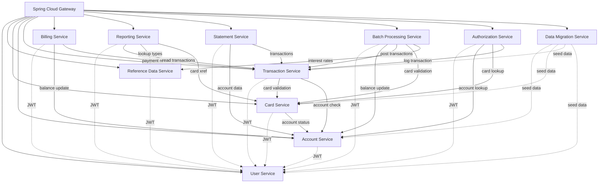
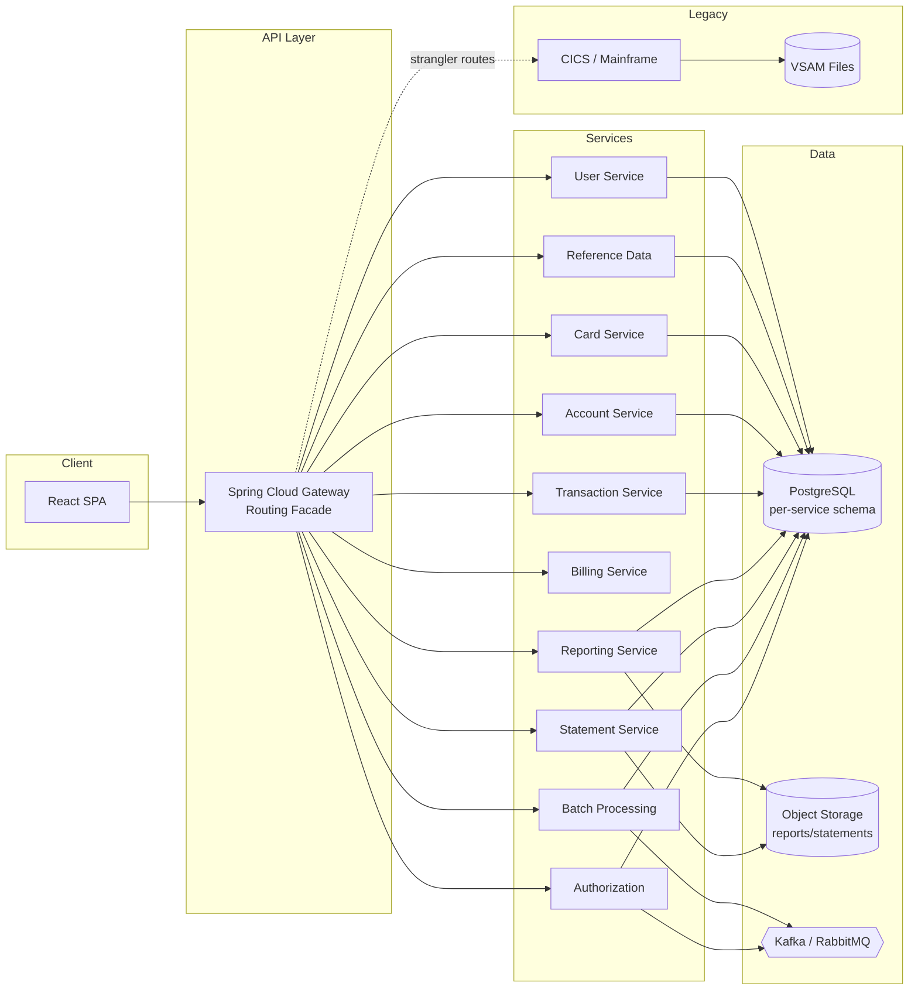

# Microservice Architecture — CardDemo Migration Plan

> **Approach:** Strangler Fig pattern — incrementally replace COBOL/CICS modules with Spring Boot microservices behind a unified API gateway, routing traffic service-by-service until the mainframe is fully retired.
>
> **Target Stack:** Spring Boot 3 · React · PostgreSQL · Spring Cloud Gateway · Kafka/RabbitMQ · S3-compatible object storage

---

## 1. Overview

The CardDemo mainframe application is migrated using the **strangler fig** pattern. A Spring Cloud Gateway sits in front of both the legacy CICS system and the new microservices. Each bounded context is extracted one at a time — starting with low-coupling reference data services and finishing with high-complexity domains — while the gateway progressively re-routes traffic from the mainframe to the new services.

Key principles:

| Principle | Implementation |
|-----------|---------------|
| **One service per bounded context** | Each service owns its PostgreSQL schema; no shared tables |
| **VSAM → PostgreSQL** | Every VSAM KSDS/AIX is mapped to a PostgreSQL table with equivalent indexes |
| **CICS → REST** | Pseudo-conversational CICS transactions become stateless REST endpoints |
| **BMS → React** | 3270 BMS maps are replaced by React components calling the REST APIs |
| **JCL batch → Spring Batch / scheduled jobs** | Nightly batch cycle becomes Spring Batch jobs triggered by cron or Kafka events |
| **COMMAREA → DTOs / events** | Inter-program data passing becomes JSON DTOs (sync) or Kafka messages (async) |

> **Traceability:** This document references [`APPLICATION_INVENTORY.md`](APPLICATION_INVENTORY.md), [`DEPENDENCY_MAP.md`](DEPENDENCY_MAP.md), and [`HOTSPOT_REPORT.md`](HOTSPOT_REPORT.md) for program-level detail.

---

## 2. Service Catalog

### 2.1 User Service

| Attribute | Detail |
|-----------|--------|
| **Domain** | Identity & Access Management |
| **COBOL Programs** | `COUSR00C` (list users), `COUSR01C` (add user), `COUSR02C` (update user), `COUSR03C` (delete user), `COSGN00C` (sign-on / authentication) |
| **PostgreSQL Tables** | `users` |
| **Source VSAM** | `USRSEC` (record layout `CSUSR01Y`, 80 bytes) |
| **REST Endpoints** | `POST /api/auth/login`, `POST /api/auth/logout`, `GET /api/users`, `GET /api/users/{id}`, `POST /api/users`, `PUT /api/users/{id}`, `DELETE /api/users/{id}` |
| **Dependencies** | — (foundational; no upstream service dependencies) |
| **Dependents** | All services (JWT validation), React UI (authentication) |

### 2.2 Reference Data Service

| Attribute | Detail |
|-----------|--------|
| **Domain** | Lookup / Configuration Data |
| **COBOL Programs** | `COTRTLIC` (list transaction types), `COTRTUPC` (update transaction type), `COBTUPDT` (batch update transaction type) |
| **PostgreSQL Tables** | `transaction_types`, `transaction_categories`, `disclosure_groups`, `lookup_codes` |
| **Source VSAM/DB2** | `TRANTYPE` (`CVTRA03Y`, 60 bytes), `TRANCATG` (`CVTRA04Y`, 60 bytes), `DISCGRP` (`CVTRA02Y`, 50 bytes), `CSLKPCDY` (lookup copybook) |
| **REST Endpoints** | `GET /api/reference/transaction-types`, `GET /api/reference/transaction-types/{code}`, `PUT /api/reference/transaction-types/{code}`, `DELETE /api/reference/transaction-types/{code}`, `GET /api/reference/transaction-categories`, `GET /api/reference/disclosure-groups`, `GET /api/reference/lookup-codes` |
| **Dependencies** | User Service (authentication) |
| **Dependents** | Transaction Service, Batch Processing Service, Reporting Service |

### 2.3 Card Service

| Attribute | Detail |
|-----------|--------|
| **Domain** | Card Lifecycle Management |
| **COBOL Programs** | `COCRDLIC` (list cards), `COCRDSLC` (card detail), `COCRDUPC` (card update) |
| **PostgreSQL Tables** | `cards`, `card_account_xref` |
| **Source VSAM** | `CARDDAT` (`CVACT02Y`, 150 bytes), `XREFDAT` (`CVACT03Y`, 50 bytes, incl. AIX paths `CARDAIX`, `CXACAIX`, `CCXREF`) |
| **REST Endpoints** | `GET /api/cards`, `GET /api/cards/{cardNumber}`, `PUT /api/cards/{cardNumber}`, `GET /api/cards?accountId={id}` |
| **Dependencies** | User Service, Account Service (account status validation) |
| **Dependents** | Transaction Service, Account Service (card lookups) |

### 2.4 Account Service

| Attribute | Detail |
|-----------|--------|
| **Domain** | Account & Customer Management |
| **COBOL Programs** | `COACTVWC` (account view), `COACTUPC` (account update — 4,236 LOC, highest complexity) |
| **PostgreSQL Tables** | `accounts`, `customers` |
| **Source VSAM** | `ACCTDAT` (`CVACT01Y`, 300 bytes), `CUSTDAT` (`CVCUS01Y`, 500 bytes) |
| **REST Endpoints** | `GET /api/accounts/{id}`, `PUT /api/accounts/{id}`, `GET /api/accounts?customerId={id}`, `GET /api/customers/{id}` |
| **Dependencies** | User Service, Card Service (cross-reference lookups) |
| **Dependents** | Transaction Service, Billing Service, Batch Processing Service |

### 2.5 Transaction Service

| Attribute | Detail |
|-----------|--------|
| **Domain** | Transaction Processing (Online) |
| **COBOL Programs** | `COTRN00C` (list transactions), `COTRN01C` (view transaction detail), `COTRN02C` (add new transaction) |
| **PostgreSQL Tables** | `transactions` |
| **Source VSAM** | `TRANSACT` (`CVTRA05Y`, 350 bytes, incl. AIX `TRANIDX`) |
| **REST Endpoints** | `GET /api/transactions`, `GET /api/transactions/{id}`, `POST /api/transactions`, `GET /api/transactions?cardNumber={num}`, `GET /api/transactions?accountId={id}` |
| **Dependencies** | User Service, Card Service (card validation via `CCXREF`/`CXACAIX`), Account Service (account active check) |
| **Dependents** | Billing Service, Reporting Service, Statement Service |

### 2.6 Billing Service

| Attribute | Detail |
|-----------|--------|
| **Domain** | Bill Payment |
| **COBOL Programs** | `COBIL00C` (bill payment — reads/writes `TRANSACT` and `ACCTDAT` via `CXACAIX`) |
| **PostgreSQL Tables** | — (stateless orchestrator; no owned tables) |
| **Source VSAM** | Reads/writes via Account Service and Transaction Service |
| **REST Endpoints** | `POST /api/payments`, `GET /api/payments/{id}` |
| **Dependencies** | User Service, Account Service (balance update), Transaction Service (payment record creation) |
| **Dependents** | — |

### 2.7 Reporting Service

| Attribute | Detail |
|-----------|--------|
| **Domain** | Transaction Report Generation |
| **COBOL Programs** | `CBTRN03C` (print transaction detail report), `CORPT00C` (submit batch report job via TDQ) |
| **PostgreSQL Tables** | `report_runs` (metadata: requester, date range, status, storage URL) |
| **Object Storage** | Report output files (PDF/CSV) stored in S3-compatible bucket |
| **Source VSAM** | `TRANREPT` (report output file) |
| **REST Endpoints** | `POST /api/reports` (request report generation), `GET /api/reports/{id}` (status + download URL), `GET /api/reports` (list reports) |
| **Dependencies** | User Service, Transaction Service (read transactions), Reference Data Service (transaction types/categories), Card Service (cross-reference data) |
| **Dependents** | — |

### 2.8 Statement Service

| Attribute | Detail |
|-----------|--------|
| **Domain** | Account Statement Generation |
| **COBOL Programs** | `CBSTM03A` (statement generation — text + HTML, 924 LOC), `CBSTM03B` (file processing subroutine) |
| **PostgreSQL Tables** | `statement_runs` (metadata: account, period, status, storage URL) |
| **Object Storage** | Statement output files (text/HTML/PDF) stored in S3-compatible bucket |
| **Source VSAM** | `STMTFILE` / `HTMLFILE` (statement output files) |
| **REST Endpoints** | `POST /api/statements` (trigger generation), `GET /api/statements/{id}`, `GET /api/statements?accountId={id}` |
| **Dependencies** | Account Service, Transaction Service |
| **Dependents** | — |

### 2.9 Batch Processing Service

| Attribute | Detail |
|-----------|--------|
| **Domain** | Nightly Batch Cycle (Daily Posting, Interest, Validation) |
| **COBOL Programs** | `CBTRN01C` (post daily transaction file), `CBTRN02C` (validate & post daily transactions, write rejects — 731 LOC), `CBACT04C` (interest calculator — 652 LOC) |
| **PostgreSQL Tables** | `category_balances`, `rejected_transactions`, `daily_transactions` |
| **Source VSAM** | `TCATBALF` (`CVTRA01Y`, 50 bytes), `DALYREJS` (`CVTRA06Y`, GDG), `DALYTRAN` (`CVTRA06Y`, external feed) |
| **REST / Job Endpoints** | `POST /api/batch/daily-posting` (trigger), `POST /api/batch/interest-calculation` (trigger), `GET /api/batch/runs/{id}` (status), `GET /api/batch/rejected-transactions` |
| **Dependencies** | Account Service (balance updates), Transaction Service (write posted transactions), Card Service (card validation), Reference Data Service (disclosure groups for interest rates) |
| **Dependents** | Reporting Service (reads posted transactions), Statement Service |

### 2.10 Authorization Service

| Attribute | Detail |
|-----------|--------|
| **Domain** | Credit Card Authorization (IMS/DB2/MQ module) |
| **COBOL Programs** | `COPAUA0C` (authorization decision), `COPAUS0C` (list pending auths), `COPAUS1C` (auth detail), `COPAUS2C` (mark fraud), `CBPAUP0C` (batch purge expired auths), `PAUDBLOD` (IMS DB load), `PAUDBUNL` (IMS DB unload), `DBUNLDGS` (unload IMS segments) |
| **PostgreSQL Tables** | `authorization_messages` |
| **Source** | IMS DB (hierarchical segments — migrated to relational) |
| **REST Endpoints** | `POST /api/authorizations` (submit auth request), `GET /api/authorizations`, `GET /api/authorizations/{id}`, `PUT /api/authorizations/{id}/fraud` (mark fraud), `DELETE /api/authorizations/expired` (purge) |
| **Dependencies** | User Service, Account Service, Card Service, Transaction Service (log authorized transactions) |
| **Dependents** | — |

### 2.11 Data Migration Service (Temporary Utility)

| Attribute | Detail |
|-----------|--------|
| **Domain** | Legacy Data Export / Import |
| **COBOL Programs** | `CBEXPORT` (export all entities to sequential file), `CBIMPORT` (import from export file, split into entities) |
| **PostgreSQL Tables** | — (writes to all target service tables during initial migration) |
| **REST Endpoints** | `POST /api/migration/export`, `POST /api/migration/import`, `GET /api/migration/status` |
| **Dependencies** | All data-owning services (Account, Card, Transaction, User) |
| **Dependents** | — (retired after migration complete) |

---

## 3. Service Dependency Graph

### High-Level Architecture

---

## 4. Inter-Service Communication Patterns

| Pattern | When to Use | Examples |
|---------|-------------|---------|
| **Synchronous REST** | Real-time reads, user-facing queries, cross-service validation that must complete before responding | Card Service → Account Service (check account active before card update); Transaction Service → Card Service (validate card exists) |
| **Async Events (Kafka/RabbitMQ)** | Fire-and-forget notifications, eventual consistency, decoupling producers from consumers | Batch Processing Service publishes `TransactionPosted` events; Reporting Service consumes them to update report data. Authorization Service publishes `AuthorizationDecision` events |
| **Saga Pattern (choreography)** | Multi-service write operations that must be atomically consistent across boundaries | Billing Service: (1) debit account via Account Service → (2) create payment transaction via Transaction Service → compensate on failure |
| **API Composition** | Aggregating data from multiple services into a single response for the UI | Account detail view: Account Service (account) + Card Service (cards for account) + Transaction Service (recent transactions) — composed at the gateway or a BFF layer |
| **Spring Batch + Kafka triggers** | Nightly batch cycle replacing JCL pipeline | Batch Processing Service: `CLOSEFIL` → `POSTTRAN` → `INTCALC` sequence replaced by Spring Batch steps triggered by scheduled Kafka events |

---

## 5. PostgreSQL Schema Ownership

| Service | Owned Tables | Source VSAM / DB2 Dataset | Record Layout | Notes |
|---------|-------------|---------------------------|---------------|-------|
| **User Service** | `users` | `USRSEC` | `CSUSR01Y` (80 bytes) | Roles, hashed passwords, JWT metadata |
| **Reference Data Service** | `transaction_types`, `transaction_categories`, `disclosure_groups`, `lookup_codes` | `TRANTYPE`, `TRANCATG`, `DISCGRP`, `CSLKPCDY` | `CVTRA03Y` (60 bytes), `CVTRA04Y` (60 bytes), `CVTRA02Y` (50 bytes) | Read-heavy; cached aggressively |
| **Card Service** | `cards`, `card_account_xref` | `CARDDAT`, `XREFDAT` | `CVACT02Y` (150 bytes), `CVACT03Y` (50 bytes) | Replaces AIX paths (`CARDAIX`, `CXACAIX`, `CCXREF`) with PostgreSQL indexes |
| **Account Service** | `accounts`, `customers` | `ACCTDAT`, `CUSTDAT` | `CVACT01Y` (300 bytes), `CVCUS01Y` (500 bytes) | Largest record layouts; field validation from `COACTUPC` becomes service-layer constraints |
| **Transaction Service** | `transactions` | `TRANSACT` | `CVTRA05Y` (350 bytes) | Replaces AIX `TRANIDX` with a `card_number` index |
| **Reporting Service** | `report_runs` | `TRANREPT` | — | Metadata only; report files stored in object storage |
| **Statement Service** | `statement_runs` | `STMTFILE`, `HTMLFILE` | — | Metadata only; statement files stored in object storage |
| **Batch Processing Service** | `category_balances`, `rejected_transactions`, `daily_transactions` | `TCATBALF`, `DALYREJS`, `DALYTRAN` | `CVTRA01Y` (50 bytes), `CVTRA06Y` (350 bytes) | `DALYTRAN` is external feed → ingested via Kafka or file upload |
| **Authorization Service** | `authorization_messages` | IMS DB (hierarchical) | — | Flattened from IMS hierarchical segments to relational tables |
| **Billing Service** | — (stateless) | — | — | Orchestrates Account + Transaction services |
| **Data Migration Service** | — (temporary) | — | — | Writes to all service schemas during initial data load |

---

## 6. Migration Order

| Order | Service | Rationale | Risk Level | Blue-Green Rollback Strategy |
|-------|---------|-----------|------------|------------------------------|
| 1 | **User Service** | Foundational — all other services depend on JWT authentication. Simple CRUD on `USRSEC` (4 programs, 299–695 LOC each). Lowest coupling. | Low | Gateway routes `/api/auth/*` and `/api/users/*` to new service. Rollback: re-route to CICS sign-on (`COSGN00C`). User data synced bidirectionally during transition. |
| 2 | **Reference Data Service** | Read-heavy lookup data with minimal write operations. Enables downstream services (Transaction, Batch) to resolve types/categories. | Low | Gateway routes `/api/reference/*` to new service. Rollback: re-route to DB2 tables. Data is static enough for dual-write during transition. |
| 3 | **Card Service** | Medium complexity (1,459–1,560 LOC). Depends only on User and Account services. Establishes the card-account cross-reference pattern used by Transaction and Batch services. | Medium | Gateway routes `/api/cards/*` to new service. Rollback: re-route to CICS programs (`COCRDLIC`, `COCRDSLC`, `COCRDUPC`). `XREFDAT` kept in sync via CDC (Change Data Capture). |
| 4 | **Account Service** | High complexity (`COACTUPC` = 4,236 LOC, 12 copybooks). Delayed until Card Service exists for cross-reference lookups. Customer data (`CUSTDAT`) co-located here. | High | Gateway routes `/api/accounts/*` to new service. Rollback: re-route to CICS `COACTVWC`/`COACTUPC`. Dual-write to both `ACCTDAT` VSAM and PostgreSQL during transition. |
| 5 | **Transaction Service** | Core online transaction management. Requires Card and Account services for validation. Medium complexity (330–783 LOC). | Medium | Gateway routes `/api/transactions/*` to new service. Rollback: re-route to CICS `COTRN*` programs. `TRANSACT` VSAM kept in sync via CDC. |
| 6 | **Billing Service** | Stateless orchestrator over Account + Transaction services. Migrated after both dependencies exist. | Low | Gateway routes `/api/payments/*` to new service. Rollback: re-route to CICS `COBIL00C`. No owned data — rollback is purely routing. |
| 7 | **Reporting Service** | Batch report generation. Depends on Transaction and Reference Data services. Replaces TDQ submission (`CORPT00C`) with async job API. | Medium | Gateway routes `/api/reports/*` to new service. Rollback: re-submit reports via JCL `TRANREPT.jcl`. Report output stored in object storage regardless. |
| 8 | **Statement Service** | Batch statement generation. Depends on Account and Transaction services. | Medium | Gateway routes `/api/statements/*` to new service. Rollback: re-run `CREASTMT.JCL` (`CBSTM03A`). Output format (HTML/text) preserved. |
| 9 | **Batch Processing Service** | Replaces the entire nightly JCL batch cycle (`POSTTRAN` → `INTCALC`). Highest I/O density (6 files in `CBTRN02C`). Requires all upstream services. | High | Spring Batch jobs run in parallel with JCL batch during transition. Rollback: disable Spring Batch triggers, re-enable JCL schedule. Reconciliation job compares outputs nightly. |
| 10 | **Authorization Service** | IMS DB / MQ dependency makes this the most infrastructure-intensive migration. Deferred until all VSAM-based services are stable. | High | Gateway routes `/api/authorizations/*` to new service. Rollback: re-route to CICS `COPAU*` programs + IMS DB. MQ bridge maintained during transition for message compatibility. |

> **Data Migration Service** runs as a temporary utility throughout the migration, seeding PostgreSQL tables from VSAM/EBCDIC data files via `CBEXPORT`/`CBIMPORT` logic. Retired after all services are live and verified.

---

## 7. Shared Infrastructure

| Component | Technology | Purpose |
|-----------|-----------|---------|
| **API Gateway / Routing Facade** | Spring Cloud Gateway | Single entry point for the React SPA. Routes requests to microservices or legacy CICS (strangler fig). Handles rate limiting, CORS, and request/response transformation. |
| **Service Registry** | Spring Cloud Netflix Eureka | Service discovery — each microservice registers on startup. Gateway resolves service locations dynamically. Enables blue-green deployments by registering new service instances before deregistering old ones. |
| **Config Server** | Spring Cloud Config Server | Centralized externalized configuration (database URLs, feature flags, batch schedules). Backed by a Git repo for audit trail. Per-environment profiles (`dev`, `staging`, `prod`). |
| **Message Broker** | Kafka or RabbitMQ | Async event bus for: batch job triggers, `TransactionPosted` events, `AuthorizationDecision` events, CDC change events during dual-write transition. Kafka preferred for high-throughput batch events; RabbitMQ acceptable for lower-volume authorization messages. |
| **Object Storage** | S3-compatible (MinIO / AWS S3) | Report and statement output files. Replaces mainframe spool/print datasets (`TRANREPT`, `STMTFILE`, `HTMLFILE`). |
| **Distributed Tracing** | Spring Cloud Sleuth + Zipkin (or OpenTelemetry) | End-to-end request tracing across services. Critical during migration to compare latency between legacy and new paths. |
| **Circuit Breaker** | Resilience4j | Fault tolerance for inter-service REST calls. Prevents cascade failures when a downstream service is unavailable during phased rollout. |

---

## 8. Navigation / Menu Retirement

The following COBOL programs are **thin routing/navigation shells** with no business logic of their own:

| Program | Current Role | Retirement Plan |
|---------|-------------|-----------------|
| `COSGN00C` | CICS sign-on screen — authenticates user and routes to admin or main menu | Authentication logic migrated to **User Service** (`POST /api/auth/login`). 3270 sign-on screen replaced by React login page. Program retired after User Service is live (migration step 1). |
| `COMEN01C` | Main menu — dispatches to 11 user functions via XCTL | React SPA router + navigation sidebar replaces menu dispatch. Each menu option becomes a React route pointing to the corresponding microservice API. Program retired after all user-facing services (steps 1–6) are live. |
| `COADM01C` | Admin menu — dispatches to user management and transaction type screens | React admin dashboard replaces admin menu. Routes to User Service and Reference Data Service APIs. Program retired after User Service and Reference Data Service are live (steps 1–2). |

These programs are **not** mapped to individual microservices. Their functionality is absorbed into:
- **React SPA** — client-side routing, navigation components, role-based menu rendering
- **User Service** — authentication, session management, role-based access control
- **Spring Cloud Gateway** — route-level authorization (admin vs. regular user paths)

> **Timeline:** `COADM01C` can be retired as early as migration step 2 (after Reference Data Service). `COMEN01C` is retired last, after all services behind its menu options are migrated. `COSGN00C` is retired in step 1 alongside User Service deployment.
