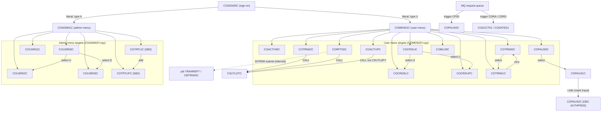
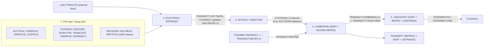

# CardDemo COBOL Estate — Dependency Map

Program-to-program call graph and dataset lineage for the estate under `app/`. Every edge below was traced to a specific `EXEC CICS XCTL PROGRAM(...)`, `EXEC CICS LINK PROGRAM(...)`, `CALL '…'`, `SELECT … ASSIGN`, or JCL `DD` statement. Edges whose target is a runtime variable were resolved by reading the `VALUE` literals / option tables that populate that variable; these are marked **(runtime, resolved from …)**. Anything not directly evidenced in the source is marked **inferred**.

## 1. Online (CICS) navigation graph

### 1.1 How navigation is coded

* `COSGN00C` is the only program with **literal** XCTL targets:
  `EXEC CICS XCTL PROGRAM ('COADM01C')` (user type `A`) and `EXEC CICS XCTL PROGRAM ('COMEN01C')` (user type `U`) — `COSGN00C.cbl` lines 231–237.
* `COMEN01C` executes `EXEC CICS XCTL PROGRAM(CDEMO-MENU-OPT-PGMNAME(WS-OPTION))`; the table is `COMEN02Y.cpy` (`CDEMO-MENU-OPT-COUNT VALUE 11`).
* `COADM01C` executes `EXEC CICS XCTL PROGRAM(CDEMO-ADMIN-OPT-PGMNAME(WS-OPTION))`; the table is `COADM02Y.cpy` (`CDEMO-ADMIN-OPT-COUNT VALUE 6`).
* All other screens XCTL to `CDEMO-TO-PROGRAM` (COMMAREA field from `COCOM01Y`) or `CCARD-NEXT-PROG` (`CVCRD01Y`), populated from `MOVE 'literal' TO CDEMO-TO-PROGRAM` or from `LIT-*PGM`/`WS-PGM-*` working-storage constants. PF3 generally returns to the caller recorded in `CDEMO-FROM-PROGRAM` or to the menu ("XCTL TO CALLING PROGRAM OR MAIN MENU").
* Every online program can fall back to `COSGN00C` when entered without a COMMAREA (`MOVE 'COSGN00C' TO CDEMO-TO-PROGRAM`); these sign-on edges are omitted from the diagram for legibility.

### 1.2 Edge table

| From | To | Mechanism / evidence |
|---|---|---|
| `COSGN00C` | `COADM01C` | literal `XCTL PROGRAM ('COADM01C')` |
| `COSGN00C` | `COMEN01C` | literal `XCTL PROGRAM ('COMEN01C')` |
| `COMEN01C` | `COACTVWC`, `COACTUPC`, `COCRDLIC`, `COCRDSLC`, `COCRDUPC`, `COTRN00C`, `COTRN01C`, `COTRN02C`, `CORPT00C`, `COBIL00C`, `COPAUS0C` | runtime, resolved from `COMEN02Y.cpy` options 1–11 |
| `COADM01C` | `COUSR00C`, `COUSR01C`, `COUSR02C`, `COUSR03C`, `COTRTLIC`, `COTRTUPC` | runtime, resolved from `COADM02Y.cpy` options 1–6 |
| `COMEN01C`, `COADM01C`, `COBIL00C`, `CORPT00C`, `COTRN00C/01C/02C`, `COUSR00C–03C`, `COPAUS0C` | `COSGN00C` | `MOVE 'COSGN00C' TO CDEMO-TO-PROGRAM` (no-COMMAREA / sign-off path) |
| `COACTVWC`, `COACTUPC`, `COCRDLIC`, `COCRDSLC`, `COCRDUPC` | `COMEN01C` | `LIT-MENUPGM VALUE 'COMEN01C'` → `CDEMO-TO-PROGRAM` (PF3) |
| `COBIL00C`, `CORPT00C`, `COTRN00C`, `COTRN01C`, `COTRN02C` | `COMEN01C` | `MOVE 'COMEN01C' TO CDEMO-TO-PROGRAM` (PF3) |
| `COCRDLIC` | `COCRDSLC` | `LIT-CARDDTLPGM VALUE 'COCRDSLC'` → `CCARD-NEXT-PROG` (row selected with `S`) |
| `COCRDLIC` | `COCRDUPC` | `LIT-CARDUPDPGM VALUE 'COCRDUPC'` → `CCARD-NEXT-PROG` (row selected with `U`) |
| `COTRN00C` | `COTRN01C` | `MOVE 'COTRN01C' TO CDEMO-TO-PROGRAM` (row selected) |
| `COTRN01C` | `COTRN00C` | `MOVE 'COTRN00C' TO CDEMO-TO-PROGRAM` (PF4/back) |
| `COUSR00C` | `COUSR02C`, `COUSR03C` | `MOVE 'COUSR02C'/'COUSR03C' TO CDEMO-TO-PROGRAM` (row selected `U`/`D`) |
| `COUSR00C–03C` | `COADM01C` | `MOVE 'COADM01C' TO CDEMO-TO-PROGRAM` (PF3) |
| `COTRTLIC` | `COTRTUPC` | `LIT-ADDTPGM VALUE 'COTRTUPC'` (PF? add path, `XCTL PROGRAM (LIT-ADDTPGM)`) |
| `COTRTLIC`, `COTRTUPC` | `COADM01C` | `LIT-ADMINPGM VALUE 'COADM01C'` |
| `COPAUS0C` | `COPAUS1C` | `WS-PGM-AUTH-DTL VALUE 'COPAUS1C'` → `CDEMO-TO-PROGRAM` |
| `COPAUS0C` | `COMEN01C` | `WS-PGM-MENU VALUE 'COMEN01C'` |
| `COPAUS1C` | `COPAUS0C` | `WS-PGM-AUTH-SMRY VALUE 'COPAUS0C'` |
| `COPAUS1C` | `COPAUS2C` | `EXEC CICS LINK PROGRAM(WS-PGM-AUTH-FRAUD)` where `WS-PGM-AUTH-FRAUD VALUE 'COPAUS2C'` |
| `CORPT00C` | job `TRANREPT` | `EXEC CICS SPOOLOPEN/SPOOLWRITE/WRITEQ TD QUEUE('JOBS')` — submits JCL to INTRDR (**inferred** batch trigger) |
| `COPAUA0C` (MQ trigger, `CP00`) | — | entered by MQ trigger monitor, not by XCTL; no outbound XCTL |
| `COACCT01`, `CODATE01` | — | MQ request/reply, no XCTL |

Programs with **no inbound XCTL** other than sign-on/menu: `COPAUA0C`, `COACCT01`, `CODATE01`, `COPAUS2C` (LINK only).

### 1.3 Online navigation diagram

(Return edges to `COMEN01C`/`COADM01C`/`COSGN00C` exist from every screen and are omitted.)

## 2. Batch call graph (`CALL 'literal'`)

| Caller | Callee | Evidence |
|---|---|---|
| `CBSTM03A` | `CBSTM03B` | `CALL 'CBSTM03B' USING WS-M03B-AREA` (multiple sites for OPEN/READ/CLOSE of TRNXFILE, XREFFILE, CUSTFILE, ACCTFILE) |
| `CBACT01C` | `COBDATFT` (asm) | `CALL 'COBDATFT' USING CODATECN-REC` |
| `COBSWAIT` | `MVSWAIT` (asm) | `CALL 'MVSWAIT' USING MVSWAIT-TIME` |
| `COTRN02C`, `CORPT00C` | `CSUTLDTC` | `CALL 'CSUTLDTC' USING CSUTLDTC-DATE …` (2 sites each) |
| `COACTUPC` (via copybook `CSUTLDPY` paragraph `EDIT-DATE-LE`) | `CSUTLDTC` | `CALL 'CSUTLDTC'` inside `CSUTLDPY.cpy` |
| `CSUTLDTC` | `CEEDAYS` (LE) | `CALL 'CEEDAYS'` |
| `CBTRN01C`, `CBTRN02C`, `CBTRN03C` | `CEE3ABD` (LE abend) | `CALL 'CEE3ABD' USING ABCODE, TIMING` |
| `DBUNLDGS`, `PAUDBLOD`, `PAUDBUNL` | `CBLTDLI` (IMS) | `CALL 'CBLTDLI' USING FUNC-*, PCB, segment` |
| `COPAUA0C`, `COACCT01`, `CODATE01` | `MQOPEN`, `MQGET`, `MQPUT`/`MQPUT1`, `MQCLOSE` | MQI calls |
| `COTRTLIC` (via `CSDB2RPY`) | `DSNTIAC` | DB2 message formatter |

**Fan-in / fan-out summary (program-to-program only, excluding system routines):**

| Program | Fan-out (targets) | Fan-in (callers/menu entries) |
|---|---|---|
| `COMEN01C` | 11 (+`COSGN00C`) | 1 menu entry from `COSGN00C` + return edges from 15 screens |
| `COADM01C` | 6 (+`COSGN00C`) | 1 from `COSGN00C` + returns from 6 admin screens |
| `COSGN00C` | 2 | 12 programs `MOVE 'COSGN00C'` |
| `COCRDLIC` | 3 (`COCRDSLC`, `COCRDUPC`, `COMEN01C`) | 1 (`COMEN01C`) |
| `CSUTLDTC` | 0 (LE only) | 3 (`COTRN02C`, `CORPT00C`, `COACTUPC`) |
| `CBSTM03B` | 0 | 1 (`CBSTM03A`) |
| `COPAUS0C` | 3 | 1 (`COMEN01C`) |
| `COPAUS2C` | 0 | 1 (`COPAUS1C` LINK) |
| `COTRTLIC` | 2 | 1 (`COADM01C`) |
| `COTRTUPC` | 1 | 2 (`COADM01C`, `COTRTLIC`) |
| `CBTRN02C`, `CBACT04C`, `CBTRN03C`, `CBSTM03A` | 0 / 0 / 0 / 1 | 0 (JCL-invoked only) |

## 3. Dataset lineage

HLQ `AWS.M2.CARDDEMO.` shown as `…`. "Producer" means the step creates/loads/rewrites the dataset; "consumer" reads it. Program DD names are in parentheses.

### 3.1 Master VSAM files

| Dataset | Producers (job → step/program) | Consumers |
|---|---|---|
| `…ACCTDATA.VSAM.KSDS` (CICS `ACCTDAT`) | `ACCTFILE` (IDCAMS REPRO from `…ACCTDATA.PS`); **updated** by `POSTTRAN`/`CBTRN02C` (ACCTFILE REWRITE), `INTCALC`/`CBACT04C` (ACCTFILE REWRITE); online `COACTUPC`, `COBIL00C` (REWRITE) | `READACCT`/`CBACT01C`, `CREASTMT`/`CBSTM03A` (ACCTFILE via CBSTM03B), `CBEXPORT`; online `COACTVWC`, `COTRN02C`, `COPAUA0C`, `COPAUS0C`, `COACCT01` |
| `…CARDDATA.VSAM.KSDS` (+`.AIX`; CICS `CARDDAT`/`CARDAIX`) | `CARDFILE` (REPRO from `…CARDDATA.PS`, BLDINDEX); online `COCRDUPC` (REWRITE) | `READCARD`/`CBACT02C`, `CBEXPORT`; online `COCRDLIC`, `COCRDSLC`, `COCRDUPC`, `COACTVWC` |
| `…CARDXREF.VSAM.KSDS` (+`.AIX`/`.AIX.PATH`; CICS `CCXREF`/`CXACAIX`) | `XREFFILE` (REPRO from `…CARDXREF.PS`, BLDINDEX) | `POSTTRAN`/`CBTRN02C` (XREFFILE), `INTCALC`/`CBACT04C` (XREFFILE), `TRANREPT`/`CBTRN03C` (CARDXREF), `CREASTMT`/`CBSTM03A` (XREFFILE), `READXREF`/`CBACT03C`, `CBEXPORT`; online `COACTVWC`, `COACTUPC`, `COBIL00C`, `COTRN02C`, `COPAUA0C`, `COPAUS0C` |
| `…CUSTDATA.VSAM.KSDS` (CICS `CUSTDAT`) | `CUSTFILE` (REPRO from `…CUSTDATA.PS`); online `COACTUPC` (REWRITE) | `READCUST`/`CBCUS01C`, `CREASTMT`/`CBSTM03A` (CUSTFILE), `CBEXPORT`; online `COACTVWC`, `COPAUA0C`, `COPAUS0C` |
| `…TRANSACT.VSAM.KSDS` (+`.AIX`; CICS `TRANSACT`) | `TRANFILE` (REPRO from `…DALYTRAN.PS.INIT`), `TRANIDX` (AIX), `COMBTRAN` STEP10 (REPRO from `…TRANSACT.COMBINED(+1)`), `TRANBKP` (re-DEFINE after backup); **appended** by `POSTTRAN`/`CBTRN02C` (TRANFILE WRITE); online `COBIL00C`, `COTRN02C` (WRITE) | `TRANBKP`/`TRANREPT`/`REPROC` (backup), `CREASTMT` STEP010 SORT, `CBEXPORT`; online `COTRN00C`, `COTRN01C`, `COBIL00C` (READPREV for next id) |
| `…TCATBALF.VSAM.KSDS` | `TCATBALF` (REPRO from `…TCATBALF.PS`); **updated** by `POSTTRAN`/`CBTRN02C` (TCATBALF WRITE/REWRITE) | `INTCALC`/`CBACT04C` (TCATBALF), `PRTCATBL` |
| `…DISCGRP.VSAM.KSDS` | `DISCGRP` (REPRO from `…DISCGRP.PS`) | `INTCALC`/`CBACT04C` (DISCGRP) |
| `…TRANTYPE.VSAM.KSDS`, `…TRANCATG.VSAM.KSDS` | `TRANTYPE`, `TRANCATG` (REPRO from `.PS`); `.PS` refreshed from DB2 by `TRANEXTR` (DSNTIAUL) | `TRANREPT`/`CBTRN03C` (TRANTYPE, TRANCATG) |
| `…USRSEC.VSAM.KSDS` (CICS `USRSEC`) | `DUSRSECJ` (IEBGENER + REPRO); online `COUSR01C` (WRITE), `COUSR02C` (REWRITE), `COUSR03C` (DELETE) | online `COSGN00C`, `COUSR00C`, `COUSR02C`, `COUSR03C` |

### 3.2 Batch flow datasets

| Dataset | Producer | Consumer |
|---|---|---|
| `…DALYTRAN.PS` | external feed (no producer job in repo) | `POSTTRAN`/`CBTRN02C` (DALYTRAN) |
| `…DALYREJS(+1)` (GDG defined by `DALYREJS.jcl`) | `POSTTRAN`/`CBTRN02C` (DALYREJS) | none in repo |
| `…SYSTRAN(+1)` (GDG, `DEFGDGB`) | `INTCALC`/`CBACT04C` (TRANSACT DD → interest transactions) | `COMBTRAN` STEP05R — second SORTIN concatenation `…SYSTRAN(0)` |
| `…TRANSACT.BKUP(+1)` (GDG) | `TRANBKP` STEP05R, `TRANREPT` STEP05R (via `REPROC`) | `COMBTRAN` STEP05R SORTIN `…TRANSACT.BKUP(0)` (concatenated with `…SYSTRAN(0)`) |
| `…TRANSACT.COMBINED(+1)` (GDG) | `COMBTRAN` STEP05R SORT | `COMBTRAN` STEP10 REPRO → `…TRANSACT.VSAM.KSDS` |
| `…TRXFL.SEQ` → `…TRXFL.VSAM.KSDS` | `CREASTMT` STEP010 SORT (from `TRANSACT.VSAM.KSDS`, re-keyed card+id) → STEP020 REPRO | `CREASTMT` STEP040 `CBSTM03A` (TRNXFILE via CBSTM03B) |
| `…STATEMNT.PS`, `…STATEMNT.HTML` | `CREASTMT`/`CBSTM03A` (STMTFILE, HTMLFILE) | `TXT2PDF1` (INDD `…STATEMNT.PS`) |
| `…TRANSACT.DALY(+1)` (GDG) | `TRANREPT` STEP05R SORT (date-range INCLUDE) | `TRANREPT` STEP10R `CBTRN03C` (TRANFILE) |
| `…TRANREPT(+1)` (GDG, `REPTFILE`/`DEFGDGB`) | `TRANREPT`/`CBTRN03C` (TRANREPT) | none in repo |
| `…DATEPARM` | instream/external | `TRANREPT`/`CBTRN03C` (DATEPARM) |
| `…TCATBALF.BKUP(+1)`, `…TCATBALF.REPT` | `PRTCATBL` | none |
| `…EXPORT.DATA` | `CBEXPORT` | `CBIMPORT` → `…CUSTDATA.IMPORT`, `…ACCTDATA.IMPORT`, `…CARDXREF.IMPORT`, `…TRANSACT.IMPORT`, `…IMPORT.ERRORS` (**defect:** `CBIMPORT.jcl` has no `CARDOUT` DD for the program's `CARD-OUTPUT` file, so the job fails at open as checked in) |
| `…ACCTDATA.PSCOMP`, `.ARRYPS`, `.VBPS` | `READACCT`/`CBACT01C` | none |
| IMS `PAUTHDB` (`OEM.IMS.IMSP.PAUTHDB`/`PAUTHDBX`) | `LOADPADB`/`PAUDBLOD` (from `…PAUTDB.ROOT.FILEO`, `…PAUTDB.CHILD.FILEO`); online `COPAUA0C` (ISRT), `COPAUS1C` (REPL); `CBPAUP0J`/`CBPAUP0C` (DLET) | `UNLDPADB`/`PAUDBUNL`, `UNLDGSAM`/`DBUNLDGS`, `DBPAUTP0` (DFSURGU0); online `COPAUS0C`, `COPAUS1C` |
| DB2 `CARDDEMO.TRANSACTION_TYPE`, `…_CATEGORY` | `CREADB21` (create+load from `ctl/`), `MNTTRDB2`/`COBTUPDT`; online `COTRTLIC`, `COTRTUPC` | `TRANEXTR` (DSNTIAUL → `.PS` → `TRANTYPE`/`TRANCATG` VSAM jobs) |
| DB2 `CARDDEMO.AUTHFRDS` | online `COPAUS2C` (INSERT/UPDATE) | none in repo |

### 3.3 Worked examples (as requested)

* **`CBTRN02C` (job `POSTTRAN`)** — reads `DALYTRAN` = `…DALYTRAN.PS` and `XREFFILE` = `…CARDXREF.VSAM.KSDS`; updates `TRANFILE` = `…TRANSACT.VSAM.KSDS` (WRITE), `ACCTFILE` = `…ACCTDATA.VSAM.KSDS` (REWRITE), `TCATBALF` = `…TCATBALF.VSAM.KSDS` (WRITE/REWRITE); writes `DALYREJS` = `…DALYREJS(+1)`.
* **`CBACT04C` (job `INTCALC`, `PARM='2022071800'`)** — reads `TCATBALF`, `XREFFILE` (`…CARDXREF.VSAM.KSDS`), `ACCTFILE` (`…ACCTDATA.VSAM.KSDS`, also REWRITE), `DISCGRP` (`…DISCGRP.VSAM.KSDS`); writes `TRANSACT` DD = `…SYSTRAN(+1)`.
* **`CBSTM03A` (job `CREASTMT`, STEP040)** — reads (through `CBSTM03B`) `TRNXFILE` = `…TRXFL.VSAM.KSDS`, `XREFFILE` = `…CARDXREF.VSAM.KSDS`, `ACCTFILE` = `…ACCTDATA.VSAM.KSDS`, `CUSTFILE` = `…CUSTDATA.VSAM.KSDS`; writes `STMTFILE` = `…STATEMNT.PS` and `HTMLFILE` = `…STATEMNT.HTML`.

## 4. Inferred end-to-end batch pipeline

> **Caveat:** the end-to-end order below (file-load → `POSTTRAN` → `INTCALC` → `COMBTRAN` → `CREASTMT`) is **inferred from producer→consumer dataset relationships** in the JCL `DD` statements and program `SELECT` clauses; no single scheduler definition encodes that full chain. The repository *does* contain two scheduler exports under `app/scheduler/` (`CardDemo.controlm`, `CardDemo.ca7`), but they define separate daily/weekly/monthly flows, each bracketed by `CLOSEFIL`/`OPENFIL`, and never link `POSTTRAN` to `INTCALC` or `COMBTRAN` to `CREASTMT` (see §4.1). The `SYSTRAN` → `COMBTRAN` link is explicit in the JCL (`SORTIN` concatenates `TRANSACT.BKUP(0)` and `SYSTRAN(0)`).

### 4.1 What the scheduler artifacts actually encode

`app/scheduler/CardDemo.controlm` (Control-M XML, IN/OUT conditions) — four folders:

| Folder | Job chain (from `INCOND`/`OUTCOND`) |
|---|---|
| `DAILY-TransactionBackup` (`DAYS="ALL"`) | `CLOSEFIL` → `TRANBKP` → `WAITSTEP` → `OPENFIL` |
| `WEEKLY-DisclosureGroupsRefresh` (`DAYS="SA"`) | `CLOSEFIL` → `DISCGRP` → `WAITSTEP` → `OPENFIL` |
| `WEEKLY-TransactionTypesDBRefresh` (`DAYS="SA"`) | `MNTTRDB2` → `TRANEXTR` |
| `MONTHLY-InterestCalculation` | `CLOSEFIL` → `INTCALC` → `COMBTRAN` → `WAITSTEP` → `OPENFIL` |

`app/scheduler/CardDemo.ca7` (CA-7 `LJOB` listings, `TRIGGERED JOBS` sections, `JCLLIB=&CARDDEMOPRODJCL`) — trigger chains:

| SCHID | Trigger chain |
|---|---|
| 030 | `CLOSEFIL` → `CBPAUP0J` → `POSTTRAN` → `WAITSTEP` → `OPENFIL` |
| 030/031/032 | `CLOSEFIL` → `TRANTYPE` → `WAITSTEP` → {`CLOSEFIL1` → `TRANCATG`, `CLOSEFIL2` → `TCATBALF`} → `WAITSTEP` → `CLOSEFIL` |
| 030 | `CLOSEFIL` → `READACCT` → `READCARD` → `READCUST` → `READXREF` → `WAITSTEP` → `OPENFIL` |
| 030 → 031 | `CLOSEFIL` → `CREASTMT` → `TXT2PDF1` → `WAITSTEP` → `OPENFIL` → `CLOSEFIL` → `PRTCATBL` → `WAITSTEP` → `OPENFIL` |

Corroborations: `INTCALC` → `COMBTRAN` (Control-M monthly) and `CREASTMT` → `TXT2PDF1` (CA-7) are scheduler-confirmed. `POSTTRAN` appears only in CA-7 (daily-style chain with the IMS purge `CBPAUP0J`), `INTCALC` only in Control-M (monthly); the two exports are independent and neither orders `POSTTRAN` before `INTCALC` or `COMBTRAN` before `CREASTMT` — those two links remain dataset-lineage inferences. Every flow closes CICS files first (`CLOSEFIL` = `CEMT SET FIL CLO`) and reopens them last (`OPENFIL`), with `WAITSTEP` (`COBSWAIT`) as a settle delay.

Ordered narrative (inferred):

1. **File-load jobs** (`ACCTFILE`, `CARDFILE`, `XREFFILE`, `CUSTFILE`, `TCATBALF`, `DISCGRP`, `TRANTYPE`, `TRANCATG`, `TRANFILE`, `DUSRSECJ`, GDG definitions `DEFGDGB`/`DALYREJS`/`REPTFILE`) create every VSAM/GDG that later steps open.
2. **`POSTTRAN` → `CBTRN02C`** consumes `DALYTRAN.PS`, needs `CARDXREF`, and mutates `TRANSACT`, `ACCTDATA`, `TCATBALF`; produces `DALYREJS(+1)`.
3. **`INTCALC` → `CBACT04C`** consumes the `TCATBALF` balances that `POSTTRAN` built, applies `DISCGRP` rates, rewrites `ACCTDATA`, and emits interest transactions to `SYSTRAN(+1)`. It must follow `POSTTRAN` because its input is `POSTTRAN`'s output.
4. **`COMBTRAN`** sorts the concatenation of the transaction backup (`TRANSACT.BKUP(0)`, produced by `TRANBKP`/`REPROC`) and the interest transactions (`SYSTRAN(0)` from `INTCALC`) by `TRAN-ID` into `TRANSACT.COMBINED(+1)`, then REPROs it into `TRANSACT.VSAM.KSDS`. It therefore depends on both `INTCALC` and a prior `TRANBKP` run.
5. **`CREASTMT` → `CBSTM03A`** re-keys `TRANSACT.VSAM.KSDS` by card (`TRXFL`), then joins with `CARDXREF`/`ACCTDATA`/`CUSTDATA` to emit `STATEMNT.PS`/`.HTML`; it therefore runs after the master `TRANSACT` file and account balances are final. `TXT2PDF1` post-processes `STATEMNT.PS`.
6. **`TRANREPT` → `CBTRN03C`** is a sibling reporting branch off the same `TRANSACT` master (it is also what `CORPT00C` submits online).

## 5. Copybook fan-in (shared layouts = coupling)

| Copybook | Included by (count) |
|---|---|
| `COCOM01Y`, `COTTL01Y` | 21 (every BMS screen program incl. auth and DB2 screens) |
| `CVACT01Y` | 14 (`CBACT01C`, `CBACT04C`, `CBEXPORT`, `CBIMPORT`, `CBSTM03A`, `CBTRN01C`, `CBTRN02C`, `COACTUPC`, `COACTVWC`, `COBIL00C`, `COTRN02C`, `COPAUA0C`, `COPAUS0C`, `COACCT01`); `COCRDSLC`/`COCRDUPC` carry it only as commented-out `*COPY` |
| `CVACT03Y` | 14 (same pattern: commented out in `COCRDSLC`/`COCRDUPC`) |
| `CSUSR01Y` | 14 |
| `CVTRA05Y` | 11 |
| `CVACT02Y`, `CVCUS01Y` | 10 each |
| `CIPAUDTY` / `CIPAUSMY` | 8 / 7 (whole auth module) |
| `CVCRD01Y` | 7 |

Changing `CVACT01Y` (`ACCOUNT-RECORD`) or `CVTRA05Y` (`TRAN-RECORD`) touches both the batch financial engine and a dozen online screens — the highest blast radius in the estate.
