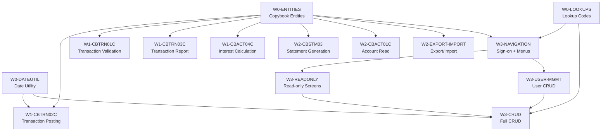

# CardDemo COBOL-to-Java Migration — Agent Execution Playbook

Execution playbook for Devin agents performing CardDemo COBOL-to-Java migration.

This file defines discrete tasks, each scoped to one migration unit. Do NOT duplicate sibling docs — cross-reference them:

| Doc | Use For |
|-----|---------|
| `APPLICATION_INVENTORY.md` | Full program/copybook/JCL catalog |
| `DATA_DICTIONARY.md` | Field-level COBOL PIC → Java type mappings |
| `DEPENDENCY_MAP.md` | Call graphs, dataset lineage, batch pipeline |
| `HOTSPOT_REPORT.md` | Complexity ranking, wave priorities, entity mapping table |

---

## Global Constraints

Apply to ALL tasks — non-negotiable:

- Use `BigDecimal` for all `COMP-3` and `S9(n)V99` fields. Never use `double`/`float` for financial data.
- Trim trailing spaces when reading `PIC X(n)` fields into Java `String`.
- Use `java.time.LocalDate` / `LocalDateTime` for all date fields. Never `java.util.Date`.
- Map COBOL `FILE STATUS` codes to Java exceptions (e.g., `'23'` → `RecordNotFoundException`).
- Map `CEE3ABD` calls to `throw new RuntimeException(...)` or a custom `AbendException`.
- Map copybook `COPY` statements to Java imports of shared POJO classes.
- Map COBOL `PERFORM` paragraphs to private methods within the same Java service class.
- Map COBOL `CALL` to calls to separate Java service/utility classes.
- Hash passwords (bcrypt) — never store cleartext (applies to `CSUSR01Y` / `SEC-USR-PWD`).
- PII fields (`CUST-SSN`, `CARD-NUM`, `CARD-CVV-CD`) must be masked/encrypted/tokenized.
- All generated Java classes go under `src/main/java/com/carddemo/` with sub-packages: `entity`, `batch`, `service`, `util`, `dto`.
- Every batch migration task MUST end with a test-harness validation run: `cd test-harness && mvn test`.
- Refer to `DATA_DICTIONARY.md` Section "PIC Clause to Java Type Quick Reference" for all type conversions.

---

## Task Definitions

### Wave 0 — Foundation

| Field | Value |
|-------|-------|
| **Task ID** | `W0-ENTITIES` |
| **Wave** | 0 |
| **Scope** | Convert all copybook record layouts to Java entity POJOs/records |
| **Depends On** | None |
| **Inputs** | `app/cpy/CVACT01Y.cpy`, `CVACT02Y.cpy`, `CVACT03Y.cpy`, `CVCUS01Y.cpy`, `CVTRA05Y.cpy`, `CVTRA06Y.cpy`, `CVTRA01Y.cpy`, `CVTRA02Y.cpy`, `CVTRA03Y.cpy`, `CVTRA04Y.cpy`, `CVTRA07Y.cpy`, `CVEXPORT.cpy`, `COCOM01Y.cpy`, `CSUSR01Y.cpy`, `CUSTREC.cpy` |
| **Outputs** | `com.carddemo.entity.*` — `AccountRecord.java`, `CardRecord.java`, `CardXrefRecord.java`, `CustomerRecord.java`, `TransactionRecord.java`, `DailyTransactionRecord.java`, `TranCatBalRecord.java`, `DiscGroupRecord.java`, `TranTypeRecord.java`, `TranCatRecord.java`, `ReportLayoutRecord.java`, `ExportRecord.java`, `CardDemoCommarea.java`, `SecUserData.java` |
| **Key Logic** | Map each copybook to a Java class per HOTSPOT_REPORT.md Section 6. Use DATA_DICTIONARY.md for exact field names and types. |
| **Watch Out** | `CVEXPORT.cpy` has REDEFINES — use sealed interface or abstract base class with subclasses per record type. Consolidate `CUSTREC.cpy` and `CVCUS01Y.cpy` into a single `CustomerRecord.java`. |
| **Acceptance** | All entity classes compile. Unit tests verify field counts match copybook field counts. |

---

| Field | Value |
|-------|-------|
| **Task ID** | `W0-DATEUTIL` |
| **Wave** | 0 |
| **Scope** | Create Java date validation utility replacing `CSUTLDTC.cbl` |
| **Depends On** | None |
| **Inputs** | `app/cbl/CSUTLDTC.cbl`, `app/cpy/CSUTLDPY.cpy`, `app/cpy/CSUTLDWY.cpy`, `app/cpy/CSDAT01Y.cpy` |
| **Outputs** | `com.carddemo.util.DateValidationUtil.java` |
| **Key Logic** | Replicate: EDIT-DATE-CCYYMMDD, EDIT-YEAR-CCYY, EDIT-MONTH, EDIT-DAY, EDIT-DAY-MONTH-YEAR (leap year), EDIT-DATE-OF-BIRTH (cannot be in future). Use `java.time.LocalDate` and `DateTimeFormatter`. |
| **Watch Out** | Leap year edge cases. Future date-of-birth rejection. |
| **Acceptance** | Unit tests covering valid dates, invalid dates, leap year edge cases, future DOB rejection. |

---

| Field | Value |
|-------|-------|
| **Task ID** | `W0-LOOKUPS` |
| **Wave** | 0 |
| **Scope** | Convert `CSLKPCDY.cpy` 88-level lookup values to Java |
| **Depends On** | None |
| **Inputs** | `app/cpy/CSLKPCDY.cpy` (1318 lines of 88-level phone area codes, state codes, ZIP prefixes) |
| **Outputs** | `com.carddemo.util.LookupCodes.java` — static `Set<String>` or enum for each validation set |
| **Key Logic** | Parse all 88-level condition names into Java constant sets. |
| **Watch Out** | Large file — ensure all values are captured. |
| **Acceptance** | Unit test verifying set sizes match 88-level value counts in the copybook. |

---

### Wave 1 — Batch Core

| Field | Value |
|-------|-------|
| **Task ID** | `W1-CBTRN02C` |
| **Wave** | 1 |
| **Scope** | Migrate daily transaction posting |
| **Depends On** | `W0-ENTITIES`, `W0-DATEUTIL` |
| **Inputs** | `app/cbl/CBTRN02C.cbl`, copybooks `CVACT01Y`, `CVACT03Y`, `CVTRA05Y`, `CVTRA06Y`, `CVTRA01Y` |
| **Outputs** | `com.carddemo.batch.TransactionPostingService.java` |
| **Key Logic** | Read DALYTRAN sequentially → validate card XREF + account + credit limit + expiration → post valid to TRANSACT → update ACCTFILE balances → update/create TCATBALF → write rejects to DALYREJS |
| **Watch Out** | Core financial logic — BigDecimal required for all balance operations. |
| **Acceptance** | `test-harness` CBTRN02C validation passes (record counts, balance integrity, credit limits). |

---

| Field | Value |
|-------|-------|
| **Task ID** | `W1-CBTRN01C` |
| **Wave** | 1 |
| **Scope** | Migrate transaction validation |
| **Depends On** | `W0-ENTITIES` |
| **Inputs** | `app/cbl/CBTRN01C.cbl`, copybooks `CVACT01Y`, `CVACT02Y`, `CVACT03Y`, `CVCUS01Y`, `CVTRA05Y` |
| **Outputs** | `com.carddemo.batch.TransactionValidationService.java` |
| **Key Logic** | Read DALYTRAN → validate against CUSTFILE, XREFFILE, CARDFILE, ACCTFILE → write valid to TRANFILE |
| **Watch Out** | Multiple file lookups — ensure all FILE STATUS codes are mapped. |
| **Acceptance** | `test-harness` validation passes. |

---

| Field | Value |
|-------|-------|
| **Task ID** | `W1-CBTRN03C` |
| **Wave** | 1 |
| **Scope** | Migrate transaction report |
| **Depends On** | `W0-ENTITIES` |
| **Inputs** | `app/cbl/CBTRN03C.cbl`, copybooks `CVTRA05Y`, `CVTRA06Y`, `CVTRA03Y`, `CVTRA04Y`, `CVTRA07Y` |
| **Outputs** | `com.carddemo.batch.TransactionReportService.java` |
| **Key Logic** | Read filtered TRANFILE → lookup CARDXREF + TRANTYPE + TRANCATG → produce formatted TRANREPT |
| **Watch Out** | Report formatting — preserve column alignment. |
| **Acceptance** | Report output matches expected format. |

---

| Field | Value |
|-------|-------|
| **Task ID** | `W1-CBACT04C` |
| **Wave** | 1 |
| **Scope** | Migrate interest calculator |
| **Depends On** | `W0-ENTITIES` |
| **Inputs** | `app/cbl/CBACT04C.cbl`, copybooks `CVACT01Y`, `CVACT03Y`, `CVTRA05Y`, `CVTRA01Y`, `CVTRA02Y` |
| **Outputs** | `com.carddemo.batch.InterestCalculationService.java` |
| **Key Logic** | Read TCATBALF → lookup disclosure group rate → compute `interest = balance * rate / 1200` → update ACCTFILE → write interest transactions to SYSTRAN |
| **Watch Out** | LINKAGE SECTION with external date parameter. COMPUTE-based financial math — must use BigDecimal with HALF_UP rounding. |
| **Acceptance** | `test-harness` CBACT04C validation passes (balance integrity, interest amounts). |

---

### Wave 2 — Batch Supporting

| Field | Value |
|-------|-------|
| **Task ID** | `W2-CBSTM03` |
| **Wave** | 2 |
| **Scope** | Migrate statement generation (CBSTM03A + CBSTM03B as one unit) |
| **Depends On** | `W0-ENTITIES` |
| **Inputs** | `app/cbl/CBSTM03A.CBL`, `app/cbl/CBSTM03B.CBL`, copybooks `COSTM01`, `CVACT03Y`, `CUSTREC`, `CVACT01Y` |
| **Outputs** | `com.carddemo.batch.StatementGenerationService.java` (CBSTM03B logic becomes private methods or inner helper class) |
| **Key Logic** | Generate customer statements by reading account/transaction data and formatting output. |
| **Watch Out** | **CBSTM03A uses ALTER/GO TO** — hardest control flow pattern. Do NOT replicate ALTER semantics. Refactor to structured if/else or state machine with an enum. Also has 2D array handling and PSA addressing. |
| **Acceptance** | Text and HTML statement output matches expected samples. |

---

| Field | Value |
|-------|-------|
| **Task ID** | `W2-CBACT01C` |
| **Wave** | 2 |
| **Scope** | Migrate account read/export |
| **Depends On** | `W0-ENTITIES` |
| **Inputs** | `app/cbl/CBACT01C.cbl`, copybook `CVACT01Y` |
| **Outputs** | `com.carddemo.batch.AccountReadService.java` |
| **Key Logic** | Read account master VSAM and write to output files. |
| **Watch Out** | Variable-length records (VB format), COMP-3 variables, CALL to assembler program COBDATFT (replace with `java.time.format.DateTimeFormatter`). |
| **Acceptance** | `test-harness` CBACT01C validation passes. |

---

| Field | Value |
|-------|-------|
| **Task ID** | `W2-EXPORT-IMPORT` |
| **Wave** | 2 |
| **Scope** | Migrate CBEXPORT + CBIMPORT |
| **Depends On** | `W0-ENTITIES` |
| **Inputs** | `app/cbl/CBEXPORT.cbl`, `app/cbl/CBIMPORT.cbl`, copybooks `CVCUS01Y`, `CVACT01Y`, `CVACT03Y`, `CVTRA05Y`, `CVCRD01Y`, `CVEXPORT` |
| **Outputs** | `com.carddemo.batch.ExportService.java`, `com.carddemo.batch.ImportService.java` |
| **Key Logic** | Multi-record REDEFINES → use the sealed interface / subclass pattern from W0-ENTITIES ExportRecord |
| **Watch Out** | Multiple entity types in one file — routing logic must be correct. |
| **Acceptance** | Round-trip export→import produces identical entity data. |

---

### Wave 3 — Online CICS Programs

| Field | Value |
|-------|-------|
| **Task ID** | `W3-NAVIGATION` |
| **Wave** | 3 |
| **Scope** | Migrate sign-on + menus (COSGN00C, COMEN01C, COADM01C) |
| **Depends On** | `W0-ENTITIES`, `W0-LOOKUPS` |
| **Inputs** | `app/cbl/COSGN00C.cbl`, `app/cbl/COMEN01C.cbl`, `app/cbl/COADM01C.cbl`, related BMS copybooks |
| **Outputs** | Spring Boot REST controllers under `com.carddemo.web` |
| **Key Logic** | Map COMMAREA (`COCOM01Y`) to session state or request-scoped DTO. Map BMS maps to REST API DTOs or frontend templates. Map XCTL to controller dispatch/redirect. |
| **Watch Out** | These form the app entry point — must be migrated together. |
| **Acceptance** | Authentication flow works end-to-end. Menu navigation returns correct responses. |

---

| Field | Value |
|-------|-------|
| **Task ID** | `W3-READONLY` |
| **Wave** | 3 |
| **Scope** | Migrate read-only CICS screens (COACTVWC, COCRDSLC, COTRN00C, COTRN01C) |
| **Depends On** | `W3-NAVIGATION` |
| **Inputs** | `app/cbl/COACTVWC.cbl`, `app/cbl/COCRDSLC.cbl`, `app/cbl/COTRN00C.cbl`, `app/cbl/COTRN01C.cbl` |
| **Outputs** | REST controllers under `com.carddemo.web` |
| **Key Logic** | Simpler than update screens — no REWRITE operations. Read-only data retrieval and display. |
| **Watch Out** | None critical. |
| **Acceptance** | All read endpoints return correct data matching COBOL output. |

---

| Field | Value |
|-------|-------|
| **Task ID** | `W3-USER-MGMT` |
| **Wave** | 3 |
| **Scope** | Migrate user CRUD (COUSR00C, COUSR01C, COUSR02C, COUSR03C) |
| **Depends On** | `W3-NAVIGATION` |
| **Inputs** | `app/cbl/COUSR00C.cbl`, `app/cbl/COUSR01C.cbl`, `app/cbl/COUSR02C.cbl`, `app/cbl/COUSR03C.cbl` |
| **Outputs** | `com.carddemo.web.UserManagementController.java`, `com.carddemo.service.UserService.java` |
| **Key Logic** | Full CRUD on USRSEC file. Password hashing (bcrypt). |
| **Watch Out** | Enforce bcrypt for `SEC-USR-PWD`. Never store cleartext. |
| **Acceptance** | User create/read/update/delete operations work correctly. Passwords stored as bcrypt hashes. |

---

| Field | Value |
|-------|-------|
| **Task ID** | `W3-CRUD` |
| **Wave** | 3 |
| **Scope** | Migrate full CRUD CICS programs (COACTUPC, COCRDUPC, COTRN02C, COBIL00C, CORPT00C) |
| **Depends On** | `W3-READONLY`, `W3-USER-MGMT`, `W0-DATEUTIL`, `W0-LOOKUPS` |
| **Inputs** | `app/cbl/COACTUPC.cbl`, `app/cbl/COCRDUPC.cbl`, `app/cbl/COTRN02C.cbl`, `app/cbl/COBIL00C.cbl`, `app/cbl/CORPT00C.cbl` |
| **Outputs** | Controllers and services under `com.carddemo.web` and `com.carddemo.service` |
| **Key Logic** | Full CRUD with deep validation, state machines, BMS map interactions. CORPT00C submits batch JCL via TDQ — map to Spring Batch `JobLauncher` async invocation. COCRDLIC has complex page-up/down browse — map to paginated repository queries. |
| **Watch Out** | COACTUPC is 4,236 lines with 16 copybooks and nesting depth 5+. Has multi-level EVALUATE TRUE state machine — map to Java state enum with switch. Migrate COACTUPC LAST. |
| **Acceptance** | All CRUD operations work. State transitions validated. Batch submission triggers correctly. |

---

## Task Dependency Graph

**Parallelism**: All Wave 0 tasks run in parallel. Within Wave 1, all four tasks run in parallel (after W0 completes). Within Wave 2, all three tasks run in parallel. Wave 3 is partially sequential: NAVIGATION first, then READONLY + USER-MGMT in parallel, then CRUD last.

---

## Session Workflow

For each task, every Devin session MUST follow this checklist:

1. Read this task definition.
2. Read the referenced COBOL source file(s) in `app/cbl/`.
3. Read the referenced copybooks in `app/cpy/`.
4. Cross-reference `DATA_DICTIONARY.md` for field mappings.
5. Cross-reference `DEPENDENCY_MAP.md` for dataset I/O and call relationships.
6. Write the Java class(es) under `src/main/java/com/carddemo/`.
7. Write unit tests under `src/test/java/com/carddemo/`.
8. For batch tasks: run `cd test-harness && mvn test` to validate.
9. Commit with message format: `migrate(<task-id>): <short description>`
