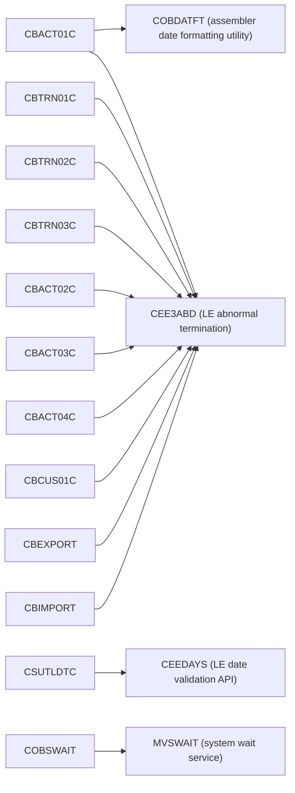
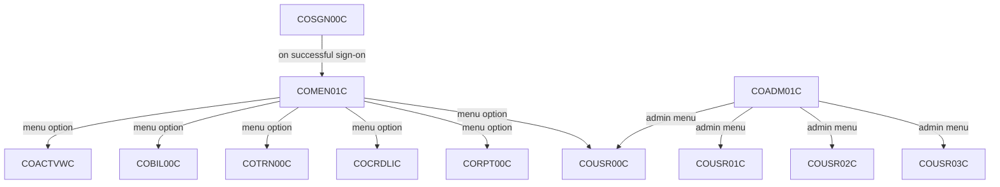
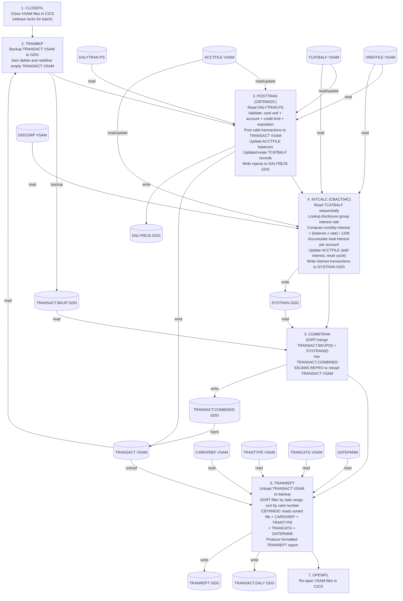

# CardDemo Dependency Map — COBOL-to-Java Migration Reference

## Section 1: Overview

CardDemo is an AWS mainframe reference application simulating a credit card management system with two tiers — **Online (CICS)** and **Batch (JCL/COBOL)** — sharing a **VSAM data layer**. This document maps all program dependencies, dataset lineage, and the end-to-end batch pipeline to serve as a reference during the COBOL-to-Java migration.

---

## Section 2: Program Inventory

### 2a. Batch COBOL Programs (`app/cbl/`)

| Program | File | Type | Function |
|---------|------|------|----------|
| CBTRN01C | app/cbl/CBTRN01C.cbl | Batch | Validate daily transactions against XREF, Card, Account files |
| CBTRN02C | app/cbl/CBTRN02C.cbl | Batch | Post daily transactions: validate, write to TRANSACT, update ACCTFILE & TCATBALF, write rejects to DALYREJS |
| CBTRN03C | app/cbl/CBTRN03C.cbl | Batch | Print transaction detail report with date filtering |
| CBACT01C | app/cbl/CBACT01C.cbl | Batch | Read account master VSAM and write to output files (flat, array, variable-length) |
| CBACT02C | app/cbl/CBACT02C.cbl | Batch | Read and print card data file |
| CBACT03C | app/cbl/CBACT03C.cbl | Batch | Read and print account cross-reference file |
| CBACT04C | app/cbl/CBACT04C.cbl | Batch | Interest calculator: read TCATBALF, lookup disclosure group rates, compute interest, update ACCTFILE, write interest transactions |
| CBCUS01C | app/cbl/CBCUS01C.cbl | Batch | Read and print customer data file |
| CBEXPORT | app/cbl/CBEXPORT.cbl | Batch | Export all entity data (Customer, Account, Card, Xref, Transaction) to multi-record export file for branch migration |
| CBIMPORT | app/cbl/CBIMPORT.cbl | Batch | Import from multi-record export file, split into normalized output files with validation |
| CSUTLDTC | app/cbl/CSUTLDTC.cbl | Utility | Date validation using LE CEEDAYS API |
| COBSWAIT | app/cbl/COBSWAIT.cbl | Utility | Wait for specified centiseconds (MVSWAIT) |

### 2b. Online CICS Programs (`app/cbl/`)

| Program | Function |
|---------|----------|
| COSGN00C | Sign-on / Authentication |
| COMEN01C | Main Menu navigation |
| COADM01C | Admin Menu |
| COACTVWC | Account View |
| COACTUPC | Account Update |
| COBIL00C | Bill Payment |
| COCRDLIC | Card List |
| COCRDSLC | Card Search/Select |
| COCRDUPC | Card Update |
| CORPT00C | Report submission (triggers batch) |
| COTRN00C | Transaction List |
| COTRN01C | Transaction Add |
| COTRN02C | Transaction Detail View |
| COUSR00C | User List |
| COUSR01C | User Add |
| COUSR02C | User Update |
| COUSR03C | User Delete |

### 2c. Extension Module Programs

| Program | Module | Function |
|---------|--------|----------|
| COPAUA0C | app-authorization-ims-db2-mq | Credit card authorization via IMS/DB2/MQ |
| COPAUS0C | app-authorization-ims-db2-mq | Authorization status inquiry |
| COPAUS1C | app-authorization-ims-db2-mq | Authorization detail |
| COPAUS2C | app-authorization-ims-db2-mq | Authorization summary |
| CBPAUP0C | app-authorization-ims-db2-mq | Payment update processing |
| COTRTLIC | app-transaction-type-db2 | Transaction type list (DB2) |
| COTRTUPC | app-transaction-type-db2 | Transaction type update (DB2) |
| COBTUPDT | app-transaction-type-db2 | Batch transaction type update (DB2) |
| COACCT01 | app-vsam-mq | VSAM-MQ bridge account inquiry |
| CODATE01 | app-vsam-mq | VSAM-MQ bridge date service |

---

## Section 3: Call Graph (CALL / External Program References)

### 3a. Batch COBOL CALL Relationships

### 3b. Online CICS Screen Navigation Transfers

Online CICS programs use `EXEC CICS XCTL` / `EXEC CICS LINK` for inter-program transfer (not COBOL CALL).

> **Note:** All online programs use `EXEC CICS LINK` to call `CSUTLDTC` for date validation and `EXEC CICS XCTL` for screen transfers.

---

## Section 4: Dataset Lineage (VSAM and Sequential Files)

### 4a. Core VSAM Datasets

| DD Name | DSN Pattern | Key | Record Size | Description | Defined By JCL |
|---------|-------------|-----|-------------|-------------|----------------|
| ACCTFILE | ACCTDATA.VSAM.KSDS | 11 bytes (ACCT-ID) | 300 | Account Master | ACCTFILE.jcl |
| CARDFILE | CARDDATA.VSAM.KSDS | 16 bytes (CARD-NUM) | 150 | Card Master (+ AIX on ACCT-ID) | CARDFILE.jcl |
| CUSTFILE | CUSTDATA.VSAM.KSDS | 9 bytes (CUST-ID) | 500 | Customer Master | CUSTFILE.jcl |
| TRANFILE / TRANSACT | TRANSACT.VSAM.KSDS | 16 bytes (TRAN-ID) | 350 | Transaction Master (+ AIX on PROC-TS) | TRANFILE.jcl |
| XREFFILE / CARDXREF | CARDXREF.VSAM.KSDS | 16 bytes (CARD-NUM) | 50 | Card-Account Cross Reference (+ AIX on ACCT-ID) | XREFFILE.jcl |
| TCATBALF | TCATBALF.VSAM.KSDS | 17 bytes (ACCT+TYPE+CAT) | 50 | Transaction Category Balance | TCATBALF.jcl |
| TRANTYPE | TRANTYPE.VSAM.KSDS | 2 bytes (TYPE-CD) | 60 | Transaction Type Reference | TRANTYPE.jcl |
| TRANCATG | TRANCATG.VSAM.KSDS | 6 bytes (TYPE+CAT) | 60 | Transaction Category Reference | TRANCATG.jcl |
| DISCGRP | DISCGRP.VSAM.KSDS | 16 bytes | 50 | Disclosure Group (interest rates) | DISCGRP.jcl |

### 4b. Sequential / GDG Datasets

| DSN Pattern | Format | Description |
|-------------|--------|-------------|
| DALYTRAN.PS | Sequential, LRECL=350 | Daily transaction input file |
| DALYREJS GDG (limit 5) | Sequential, LRECL=430 | Daily rejects from CBTRN02C |
| TRANSACT.BKUP GDG | Sequential, LRECL=350 | Transaction master backup |
| TRANSACT.DALY GDG | Sequential, LRECL=350 | Filtered/sorted transactions for reporting |
| TRANSACT.COMBINED GDG | Sequential, LRECL=350 | Merged posted + system transactions |
| SYSTRAN GDG | Sequential, LRECL=350 | System-generated interest transactions |
| TRANREPT GDG (limit 10) | Sequential, LRECL=133 | Transaction detail report output |
| EXPORT.DATA | VSAM KSDS, LRECL=500 | Multi-record export file for branch migration |
| DATEPARM | Sequential, LRECL=80 | Date range parameters for reporting |

### 4c. Dataset Access Matrix

| Dataset | CBTRN01C | CBTRN02C | CBTRN03C | CBACT01C | CBACT02C | CBACT03C | CBACT04C | CBCUS01C | CBEXPORT | CBIMPORT |
|---------|----------|----------|----------|----------|----------|----------|----------|----------|----------|----------|
| DALYTRAN | R | R | | | | | | | | |
| ACCTFILE | R | I-O | | R | | | I-O | | R | |
| CARDFILE | R | | | | R | | | | R | |
| CUSTFILE | R | | | | | | | R | R | |
| XREFFILE | R | R | R | | | R | R | | R | |
| TRANFILE | R | W | R | | | | W | | R | |
| TCATBALF | | I-O | | | | | R | | | |
| TRANTYPE | | | R | | | | | | | |
| TRANCATG | | | R | | | | | | | |
| DISCGRP | | | | | | | R | | | |
| DALYREJS | | W | | | | | | | | |
| EXPFILE | | | | | | | | | W | R |
| TRANREPT | | | W | | | | | | | |
| DATEPARM | | | R | | | | | | | |
| OUTFILE | | | | W | | | | | | |
| ARRYFILE | | | | W | | | | | | |
| VBRCFILE | | | | W | | | | | | |
| SYSTRAN | | | | | | | W | | | |
| CUSTOUT | | | | | | | | | | W |
| ACCTOUT | | | | | | | | | | W |
| XREFOUT | | | | | | | | | | W |
| TRNXOUT | | | | | | | | | | W |
| CARDOUT | | | | | | | | | | W |
| ERROUT | | | | | | | | | | W |

---

## Section 5: JCL Job → Program → Dataset Map

| JCL Job | Step | Program | Input Datasets | Output Datasets | Purpose |
|---------|------|---------|----------------|-----------------|---------|
| POSTTRAN.jcl | STEP15 | CBTRN02C | DALYTRAN.PS, XREFFILE VSAM, ACCTFILE VSAM, TCATBALF VSAM | TRANFILE VSAM (new), DALYREJS GDG(+1) | Post daily transactions, update account balances and category balances |
| INTCALC.jcl | STEP15 | CBACT04C (PARM=date) | TCATBALF VSAM, XREFFILE VSAM (+AIX path), ACCTFILE VSAM, DISCGRP VSAM | SYSTRAN GDG(+1) | Calculate interest, update accounts, write interest transactions |
| TRANREPT.jcl | STEP05R | REPROC (SORT) | TRANSACT VSAM | TRANSACT.BKUP GDG(+1) | Unload transaction file |
| TRANREPT.jcl | STEP05R (2nd) | SORT | TRANSACT.BKUP GDG(+1) | TRANSACT.DALY GDG(+1) | Filter by date range and sort by card number |
| TRANREPT.jcl | STEP10R | CBTRN03C | TRANSACT.DALY GDG(+1), CARDXREF VSAM, TRANTYPE VSAM, TRANCATG VSAM, DATEPARM | TRANREPT GDG(+1) | Produce formatted transaction report |
| TRANBKP.jcl | STEP05R | REPROC | TRANSACT VSAM | TRANSACT.BKUP GDG(+1) | Backup transaction master |
| TRANBKP.jcl | STEP05/STEP10 | IDCAMS | — | TRANSACT VSAM (recreated) | Delete and redefine empty transaction VSAM |
| COMBTRAN.jcl | STEP05R | SORT | TRANSACT.BKUP(0), SYSTRAN(0) | TRANSACT.COMBINED GDG(+1) | Sort-merge posted + interest transactions |
| COMBTRAN.jcl | STEP10 | IDCAMS REPRO | TRANSACT.COMBINED(+1) | TRANSACT VSAM | Reload combined transactions to VSAM |
| READACCT.jcl | STEP05 | CBACT01C | ACCTFILE VSAM | OUTFILE (flat), ARRYFILE (array), VBRCFILE (VB) | Read account master, write output files |
| READCUST.jcl | STEP05 | CBCUS01C | CUSTFILE VSAM | (SYSOUT only) | Read and print customer data |
| READCARD.jcl | STEP05 | CBACT02C | CARDFILE VSAM | (SYSOUT only) | Read and print card data |
| READXREF.jcl | STEP05 | CBACT03C | XREFFILE VSAM | (SYSOUT only) | Read and print cross-reference data |
| PRTCATBL.jcl | STEP05R/STEP10R | REPROC + SORT | TCATBALF VSAM | TCATBALF.BKUP GDG(+1), TCATBALF.REPT | Print transaction category balance report |
| CBEXPORT.jcl | STEP01 | IDCAMS | — | EXPORT.DATA VSAM (defined) | Define export VSAM cluster |
| CBEXPORT.jcl | STEP02 | CBEXPORT | CUSTFILE VSAM, ACCTFILE VSAM, XREFFILE VSAM, TRANSACT VSAM, CARDFILE VSAM | EXPORT.DATA VSAM | Export all entity data to multi-record file |
| CBIMPORT.jcl | STEP01 | CBIMPORT | EXPORT.DATA VSAM | CUSTOUT, ACCTOUT, XREFOUT, TRNXOUT, CARDOUT, ERROUT (all sequential) | Import and split export file into normalized outputs |
| WAITSTEP.jcl | WAIT | COBSWAIT | SYSIN (parm) | — | Wait utility for scheduling synchronization |
| CLOSEFIL.jcl | CLCIFIL | SDSF | — | — | Close VSAM files in CICS region before batch |
| OPENFIL.jcl | OPCIFIL | SDSF | — | — | Re-open VSAM files in CICS region after batch |

---

## Section 6: End-to-End Batch Pipeline Flow

The daily batch cycle is defined by the scheduler configurations in `app/scheduler/CardDemo.controlm` and `app/scheduler/CardDemo.ca7`. The pipeline executes in the following order:

> **Note:** CBTRN01C is a standalone validation utility that can be run before POSTTRAN for pre-validation of daily transaction files.

---

## Section 7: Copybook Dependencies

Key copybooks from `app/cpy/` and the batch programs that include them:

| Copybook | Description | Used By (batch programs) |
|----------|-------------|--------------------------|
| CVACT01Y | Account Record layout | CBTRN01C, CBTRN02C, CBACT01C, CBACT04C, CBEXPORT |
| CVACT02Y | Card Record layout | CBTRN01C, CBACT02C, CBEXPORT |
| CVACT03Y | Card Cross-Reference Record layout | CBTRN01C, CBTRN02C, CBTRN03C, CBACT03C, CBACT04C, CBEXPORT |
| CVCUS01Y | Customer Record layout | CBTRN01C, CBCUS01C, CBEXPORT |
| CVTRA01Y | Transaction Category Balance layout | CBTRN02C, CBACT04C |
| CVTRA02Y | Disclosure Group Record layout | CBACT04C |
| CVTRA03Y | Transaction Type Record layout | CBTRN03C |
| CVTRA04Y | Transaction Category Record layout | CBTRN03C |
| CVTRA05Y | Transaction Record layout | CBTRN02C, CBTRN03C, CBACT04C, CBEXPORT |
| CVTRA06Y | Daily Transaction Record layout | CBTRN01C, CBTRN02C |
| CVTRA07Y | Transaction Report layouts | CBTRN03C |
| CVEXPORT | Export Record layout | CBEXPORT, CBIMPORT |
| CODATECN | Date Conversion layout | CBACT01C |
| CSLKPCDY | Lookup code utility | Various online programs |

---

## Section 8: Key Technical Terms Glossary

| Term | Definition | Java Equivalent |
|------|------------|-----------------|
| **VSAM KSDS** | Virtual Storage Access Method, Key-Sequenced Data Set. Indexed file organization used for random and sequential access. | Database table or indexed file |
| **AIX (Alternate Index)** | Secondary index on a VSAM file allowing access by a non-primary key. | Secondary database index |
| **GDG (Generation Data Group)** | Versioned dataset mechanism where each generation is a new copy (like (+1) = new, (0) = current). | Timestamped file naming or versioned storage |
| **IDCAMS** | IBM utility for defining, deleting, and copying VSAM clusters. | DDL/schema migration scripts |
| **REPRO** | IDCAMS command to copy data between datasets. | Data migration/ETL logic |
| **JCL (Job Control Language)** | Batch job orchestration language defining steps, programs, and DD (dataset) assignments. | Spring Batch job configuration or shell scripts |
| **DD (Data Definition)** | JCL statement that assigns a logical file name used by a COBOL program to a physical dataset. | File path configuration / dependency injection |
| **CICS** | Customer Information Control System. Online transaction processing monitor. | Web application server (e.g., Spring Boot with REST APIs) |
| **BMS (Basic Mapping Support)** | CICS screen definition language for 3270 terminals. | HTML/JSP/React UI templates |
| **EXEC CICS XCTL** | Transfer control to another CICS program (no return). | HTTP redirect or controller dispatch |
| **EXEC CICS LINK** | Call another CICS program (with return). | Service method call |
| **PERFORM** | COBOL internal subroutine call (within same program). | Private method call |
| **CALL** | COBOL external program invocation. | Service class method call or utility class invocation |
| **CEE3ABD** | IBM Language Environment abnormal termination routine. | Throwing a `RuntimeException` |
| **CEEDAYS** | IBM LE date validation service. | `java.time.LocalDate.parse()` with validation |
| **COBDATFT** | Custom assembler date formatting program. | `java.time.format.DateTimeFormatter` |
| **COMP / COMP-3** | Binary and packed-decimal numeric storage. | `int`, `long`, or `BigDecimal` |
| **PIC clause** | COBOL data type/size declaration. | Java field types (`String`, `int`, `BigDecimal`) |
| **FILE STATUS** | Two-byte return code from file I/O operations. | Exception handling (`try`/`catch`) |
| **Pseudo-conversational** | CICS design pattern where the program ends after each screen send and restarts on user input. | Stateless REST API or session-based web controllers |
| **SORT** | IBM utility for sorting/merging sequential datasets with filtering. | `Collections.sort()`, SQL `ORDER BY`, or stream operations |
| **GOBACK** | COBOL statement to return control to caller or OS. | Method return or `System.exit()` |
| **WORKING-STORAGE** | COBOL program-level variable declarations. | Instance fields in a Java class |
| **LINKAGE SECTION** | COBOL area for parameters passed from calling programs. | Method parameters |
| **REDEFINES** | COBOL overlay of one data layout on another. | Union types, type casting, or multiple DTO mappings |

---

## Section 9: Migration Considerations

1. **Centralized Exception Handling** — All batch programs use `CEE3ABD` for error handling. This should map to a centralized exception handling strategy in Java (e.g., a common `@ControllerAdvice` or a shared `BatchErrorHandler`).

2. **Repository/DAO Pattern** — VSAM file I/O with `FILE STATUS` checking is pervasive. This maps to the repository/DAO pattern with proper exception handling in Java.

3. **Private Methods from PERFORMs** — The `PERFORM`-based structure within each program maps naturally to private methods in a Java service class.

4. **Shared DTOs from Copybooks** — Copybooks (`.cpy`) map to shared Java DTOs/POJOs/record classes. Each copybook should become a shared data class in a common module.

5. **Spring Batch for JCL** — JCL job orchestration maps to Spring Batch jobs with step definitions. Each JCL step becomes a Spring Batch `Step` with an `ItemReader`, `ItemProcessor`, and `ItemWriter`.

6. **CICS File Locking** — The CLOSEFIL/OPENFIL pattern (CICS file locking) has no direct Java equivalent but may need a maintenance window or feature flag mechanism to prevent online access during batch processing.

7. **GDG Versioning** — GDG versioning maps to timestamped files or a file versioning service. Consider using a naming convention like `{dataset}.{yyyyMMddHHmmss}` or a dedicated versioning service.

8. **Test Harness** — The `test-harness/` directory contains a Java validation framework for comparing COBOL batch output to Java output field-by-field. This should be used during migration validation to ensure functional parity.
