# CardDemo COBOL-to-Java Migration Hotspot Report

## 1. Executive Summary

CardDemo is a credit card management mainframe reference application with 29 core COBOL programs (19 online CICS + 10 batch), 41 copybooks, and extension modules. This report ranks the top 10 programs across 5 complexity dimensions to guide COBOL-to-Java migration prioritization. COBOL sources live in `app/cbl/` (`.cbl` and `.CBL`). Copybooks are in `app/cpy/`.

---

## 2. Key Technology Terms Glossary

- **COBOL** -- COmmon Business-Oriented Language. The primary programming language used for mainframe business applications.
- **CICS (Customer Information Control System)** -- IBM's online transaction processing (OLTP) middleware. Programs run as pseudo-conversational transactions using BMS maps for 3270 terminal screens. Key CICS commands: SEND MAP, RECEIVE MAP, READ, WRITE, REWRITE, DELETE, STARTBR, READNEXT, READPREV, ENDBR, XCTL, RETURN, LINK.
- **BMS (Basic Mapping Support)** -- CICS screen definition macros that generate copybooks (e.g., `COTRN01`, `COACTUP`) for 3270 terminal I/O.
- **Copybook (.cpy)** -- A reusable COBOL source fragment included via `COPY` statement. Used for record layouts (e.g., `CVACT01Y` = Account Record), screen maps, and common variables.
- **VSAM (Virtual Storage Access Method)** -- IBM file organization for mainframe datasets. KSDS (Key-Sequenced Data Set) is used here with primary and alternate index (AIX) access.
- **JCL (Job Control Language)** -- Controls batch job execution on mainframes, defining steps, files (DD names), and parameters.
- **COMMAREA (Communication Area)** -- A CICS data structure passed between programs via XCTL/RETURN to maintain state across pseudo-conversational transactions.
- **EVALUATE** -- COBOL's equivalent of a switch/case statement. `EVALUATE TRUE` with multiple `WHEN` clauses is a common pattern for state machines.
- **LINKAGE SECTION** -- Defines data passed to a COBOL program from its caller (via CALL USING or CICS COMMAREA).
- **Pseudo-conversational** -- CICS design pattern where a program returns control to CICS between user interactions, passing state via COMMAREA. The program is re-invoked on the next user action.
- **COMP / COMP-3** -- Packed-decimal and binary data types. COMP = binary integer, COMP-3 = packed decimal (BCD). These need special handling in Java (use BigDecimal for COMP-3).
- **88-level condition names** -- Named boolean conditions on a data item (e.g., `88 APPL-AOK VALUE 0.`), used extensively for readable IF/EVALUATE logic.
- **XCTL (Transfer Control)** -- CICS command to transfer control to another program, passing COMMAREA. The calling program does not get control back.
- **ALTER / GO TO** -- Legacy control flow constructs. `ALTER` dynamically changes the target of a `GO TO`. Present in CBSTM03A -- this is the hardest pattern to convert to structured Java.
- **REDEFINES** -- Allows the same memory area to be interpreted with different data layouts. Equivalent to a union type; requires careful mapping in Java.
- **FILE STATUS** -- Two-byte codes returned after each file I/O operation. '00' = success, '10' = EOF, '23' = record not found.
- **CEE3ABD** -- IBM Language Environment routine for abnormal program termination (abend). All batch programs call this on fatal errors.
- **TDQ (Transient Data Queue)** -- CICS facility for asynchronous data transfer. Used by CORPT00C to submit batch JCL via the internal reader.

---

## 3. Hotspot Ranking Tables

### Table 1: Lines of Code (LOC)

| Rank | Program | LOC | Type | Function |
|------|---------|-----|------|----------|
| 1 | COACTUPC.cbl | ~4,236 | CICS | Account Update (account + customer) |
| 2 | COCRDUPC.cbl | ~1,560 | CICS | Credit Card Update |
| 3 | COCRDLIC.cbl | ~1,459 | CICS | Credit Card List |
| 4 | COACTVWC.cbl | ~941 | CICS | Account View |
| 5 | CBSTM03A.CBL | ~924 | Batch | Statement Generation (text + HTML) |
| 6 | COCRDSLC.cbl | ~887 | CICS | Credit Card Detail View |
| 7 | COTRN02C.cbl | ~783 | CICS | Add Transaction |
| 8 | CBTRN02C.cbl | ~731 | Batch | Post Daily Transactions |
| 9 | COTRN00C.cbl | ~699 | CICS | Transaction List |
| 10 | COUSR00C.cbl | ~695 | CICS | User List |

### Table 2: Copybooks Referenced

| Rank | Program | Count | Key Copybooks |
|------|---------|-------|---------------|
| 1 | COACTUPC.cbl | 16 | CSUTLDWY, CVCRD01Y, CSLKPCDY, DFHBMSCA, DFHAID, COTTL01Y, COACTUP, CSDAT01Y, CSMSG01Y, CSMSG02Y, CSUSR01Y, CVACT01Y, CVACT03Y, CVCUS01Y, COCOM01Y |
| 2 | COACTVWC.cbl | 15 | CVCRD01Y, COCOM01Y, DFHBMSCA, DFHAID, COTTL01Y, COACTVW, CSDAT01Y, CSMSG01Y, CSMSG02Y, CSUSR01Y, CVACT01Y, CVACT02Y, CVACT03Y, CVCUS01Y, CSSTRPFY |
| 3 | COCRDUPC.cbl | 13 | CVCRD01Y, COCOM01Y, DFHBMSCA, DFHAID, COTTL01Y, COCRDUP, CSDAT01Y, CSMSG01Y, CSMSG02Y, CSUSR01Y, CVACT02Y, CVCUS01Y, CSSTRPFY |
| 4 | COCRDSLC.cbl | 13 | CVCRD01Y, COCOM01Y, DFHBMSCA, DFHAID, COTTL01Y, COCRDSL, CSDAT01Y, CSMSG01Y, CSMSG02Y, CSUSR01Y, CVACT02Y, CVCUS01Y, CSSTRPFY |
| 5 | COCRDLIC.cbl | 11 | CVCRD01Y, COCOM01Y, DFHBMSCA, DFHAID, COTTL01Y, COCRDLI, CSDAT01Y, CSMSG01Y, CSUSR01Y, CVACT02Y |
| 6 | COTRN02C.cbl | 10 | COCOM01Y, COTRN02, COTTL01Y, CSDAT01Y, CSMSG01Y, CVTRA05Y, CVACT01Y, CVACT03Y, DFHAID, DFHBMSCA |
| 7 | COBIL00C.cbl | 10 | COCOM01Y, COBIL00, COTTL01Y, CSDAT01Y, CSMSG01Y, CVACT01Y, CVACT03Y, CVTRA05Y, DFHAID, DFHBMSCA |
| 8 | CORPT00C.cbl | 8 | COCOM01Y, CORPT00, COTTL01Y, CSDAT01Y, CSMSG01Y, CVTRA05Y, DFHAID, DFHBMSCA |
| 9 | CBTRN02C.cbl | 6 | CVTRA06Y, CVTRA05Y, CVACT03Y, CVACT01Y, CVTRA01Y |
| 10 | CBACT04C.cbl | 5 | CVTRA01Y, CVACT03Y, CVTRA02Y, CVACT01Y, CVTRA05Y |

### Table 3: I/O Operations (file/dataset access)

| Rank | Program | Files/Datasets | Key Operations |
|------|---------|----------------|----------------|
| 1 | CBSTM03A.CBL | 6 (via CBSTM03B) + STMT-FILE + HTML-FILE | Sequential read of TRNXFILE, keyed read of XREFFILE/CUSTFILE/ACCTFILE, dozens of WRITE to statement + HTML output |
| 2 | CBTRN02C.cbl | 6 (DALYTRAN, TRANSACT, XREF, DALYREJS, ACCOUNT, TCATBAL) | READ, WRITE, REWRITE across all 6 files |
| 3 | CBTRN03C.cbl | 6 (TRANSACT, XREF, TRANTYPE, TRANCATG, REPORT, DATEPARM) | Sequential READ + report WRITE |
| 4 | CBTRN01C.cbl | 6 (DALYTRAN, CUSTOMER, XREF, CARD, ACCOUNT, TRANSACT) | READ across 6 indexed/sequential files |
| 5 | CBEXPORT.cbl | 6 (CUSTFILE, ACCTFILE, XREFFILE, TRANSACT, CARDFILE, EXPFILE) | Sequential READ from 5 inputs + WRITE to export |
| 6 | CBIMPORT.cbl | 7 (EXPFILE + 5 output files + ERROR) | READ export + WRITE to 6 output files |
| 7 | CBACT04C.cbl | 5 (TCATBAL, XREF, DISCGRP, ACCOUNT, TRANSACT) | READ, REWRITE, WRITE |
| 8 | COBIL00C.cbl | 3 datasets (TRANSACT, ACCTDAT, CXACAIX) | CICS READ/REWRITE/WRITE/STARTBR/READPREV/ENDBR |
| 9 | COTRN02C.cbl | 3 datasets (TRANSACT, CCXREF, CXACAIX) | CICS READ/WRITE/STARTBR/READPREV/ENDBR |
| 10 | CBACT01C.cbl | 4 (ACCTFILE, OUTFILE, ARRYFILE, VBRCFILE) | READ + WRITE with variable-length records |

### Table 4: Business Logic Density (EVALUATE/IF nesting depth)

| Rank | Program | Max Nesting | Notes |
|------|---------|-------------|-------|
| 1 | COACTUPC.cbl | 5+ | Multi-level EVALUATE TRUE state machine (ACUP-DETAILS-NOT-FETCHED / SHOW-DETAILS / CHANGES-MADE / CHANGES-OKAYED). Deep IF nesting for field-level validation: dates, phone numbers, SSN, credit limits, addresses. 88-level conditions used extensively. |
| 2 | COCRDUPC.cbl | 4+ | CCUP-* state machine (DETAILS-NOT-FETCHED / SHOW-DETAILS / CHANGES-OK / CHANGES-FAILED). Nested IF for card name alpha validation, status Y/N, expiry month/year range. |
| 3 | COCRDLIC.cbl | 4+ | Complex EVALUATE TRUE with page-up/down/enter/PF-key handling. Nested selection validation (S=view, U=update) across 7 rows. |
| 4 | CORPT00C.cbl | 4 | Three-way EVALUATE for report type (Monthly/Yearly/Custom). Deep nested EVALUATE for 6 date field validations + CALL CSUTLDTC for date checking. |
| 5 | COTRN02C.cbl | 4 | Nested EVALUATE for multiple field validations: type code, category code, amount format, orig-date format, proc-date format. CALL CSUTLDTC twice. |
| 6 | CBACT04C.cbl | 3 | IF nesting for account grouping (new vs existing account), interest rate lookup with fallback to DEFAULT group. |
| 7 | CBTRN02C.cbl | 3 | Nested IF for transaction validation: XREF lookup, account lookup, overlimit check, expiration date check. |
| 8 | COBIL00C.cbl | 3 | EVALUATE for payment confirmation flow (Y/N/blank), balance check, multi-file I/O coordination. |
| 9 | COACTVWC.cbl | 3 | EVALUATE TRUE for program flow (PFK03/PGM-ENTER/PGM-REENTER/OTHER). Nested IF for account/customer found flags. |
| 10 | COTRN00C.cbl | 3 | 10-row EVALUATE for selection + nested EVALUATE for action type (S=select). Page-forward/backward browse logic. |

### Table 5: Inter-Program Dependencies

| Rank | Program | Dep Count | Calls/Transfers To |
|------|---------|-----------|-------------------|
| 1 | COMEN01C.cbl | 10+ | XCTL to COACTVWC, COTRN00C, COBIL00C, CORPT00C, COTRN02C, COPAUS0C, and any program in COMEN02Y menu table (dynamic dispatch) |
| 2 | COACTUPC.cbl | 5 | XCTL to COCRDUPC, COCRDLIC, COCRDSLC, COMEN01C. Uses SYNCPOINT. |
| 3 | COSGN00C.cbl | 3 | XCTL to COADM01C (admin) or COMEN01C (user). Entry point for entire application. |
| 4 | COADM01C.cbl | 3+ | XCTL to COUSR00C, COUSR01C, and any program in COADM02Y menu table (dynamic dispatch) |
| 5 | COCRDLIC.cbl | 3 | XCTL to COCRDSLC (detail), COCRDUPC (update), COMEN01C (back) |
| 6 | COCRDUPC.cbl | 3 | XCTL to COCRDLIC, COMEN01C, COCRDSLC. Uses SYNCPOINT. |
| 7 | COUSR00C.cbl | 3 | XCTL to COUSR02C (update), COUSR03C (delete), COADM01C (back) |
| 8 | CBSTM03A.CBL | 2 | CALL CBSTM03B (subroutine). Uses ALTER/GO TO for control flow. |
| 9 | COTRN02C.cbl | 2 | CALL CSUTLDTC (date validation utility). XCTL to COMEN01C. |
| 10 | CORPT00C.cbl | 2 | CALL CSUTLDTC. XCTL to COMEN01C. Uses WRITEQ TD for JCL submission. |

---

## 4. Inter-Program Call Graph

```mermaid
graph TD
    subgraph "Online CICS - Entry & Navigation"
        COSGN00C["COSGN00C<br/>Sign-On"]
        COMEN01C["COMEN01C<br/>Main Menu"]
        COADM01C["COADM01C<br/>Admin Menu"]
    end

    subgraph "Online CICS - User Management"
        COUSR00C["COUSR00C<br/>User List"]
        COUSR01C["COUSR01C<br/>Add User"]
        COUSR02C["COUSR02C<br/>Update User"]
        COUSR03C["COUSR03C<br/>Delete User"]
    end

    subgraph "Online CICS - Account & Card"
        COACTVWC["COACTVWC<br/>Account View"]
        COACTUPC["COACTUPC<br/>Account Update"]
        COCRDLIC["COCRDLIC<br/>Card List"]
        COCRDSLC["COCRDSLC<br/>Card Detail"]
        COCRDUPC["COCRDUPC<br/>Card Update"]
    end

    subgraph "Online CICS - Transactions & Reports"
        COTRN00C["COTRN00C<br/>Transaction List"]
        COTRN01C["COTRN01C<br/>Transaction Detail"]
        COTRN02C["COTRN02C<br/>Add Transaction"]
        COBIL00C["COBIL00C<br/>Bill Payment"]
        CORPT00C["CORPT00C<br/>Reports"]
    end

    subgraph "Batch Pipeline - Transaction Processing"
        CBTRN01C["CBTRN01C<br/>Validate Transactions"]
        CBTRN02C["CBTRN02C<br/>Post Transactions"]
        CBTRN03C["CBTRN03C<br/>Transaction Report"]
    end

    subgraph "Batch Pipeline - Interest & Statements"
        CBACT04C["CBACT04C<br/>Interest Calculation"]
        CBSTM03A["CBSTM03A<br/>Statement Generation"]
        CBSTM03B["CBSTM03B<br/>Statement Subroutine"]
    end

    subgraph "Batch Pipeline - Export/Import"
        CBEXPORT["CBEXPORT<br/>Export"]
        CBIMPORT["CBIMPORT<br/>Import"]
    end

    subgraph "Shared Utilities"
        CSUTLDTC["CSUTLDTC<br/>Date Validation"]
        COBDATFT["COBDATFT<br/>Date Format"]
    end

    %% Entry & Navigation
    COSGN00C -->|"XCTL (admin)"| COADM01C
    COSGN00C -->|"XCTL (user)"| COMEN01C
    COMEN01C --> COACTVWC
    COMEN01C --> COTRN00C
    COMEN01C --> COTRN02C
    COMEN01C --> COBIL00C
    COMEN01C --> CORPT00C

    %% Admin flow
    COADM01C --> COUSR00C
    COADM01C --> COUSR01C
    COUSR00C --> COUSR02C
    COUSR00C --> COUSR03C

    %% Transaction list
    COTRN00C --> COTRN01C

    %% Card management
    COCRDLIC --> COCRDSLC
    COCRDLIC --> COCRDUPC
    COCRDUPC --> COCRDLIC

    %% Account update cross-links
    COACTUPC --> COCRDUPC
    COACTUPC --> COCRDLIC
    COACTUPC --> COCRDSLC

    %% Batch: Statement generation
    CBSTM03A -->|CALL| CBSTM03B

    %% Batch: Utility calls
    COTRN02C -->|CALL| CSUTLDTC
    CORPT00C -->|CALL| CSUTLDTC
    CBACT01C -->|CALL| COBDATFT

    %% Batch pipeline (JCL-chained, not direct CALL)
    CBTRN01C -.->|"JCL-chained"| CBTRN02C
    CBTRN02C -.->|"JCL-chained"| CBTRN03C

    %% Export/Import pipeline
    CBEXPORT -.->|"JCL-chained"| CBIMPORT
```

---

## 5. Modernization Priority Recommendations

### Wave 1 -- Batch Core (Start Here)

1. **CBTRN02C** (Transaction Posting) -- Pure batch, no CICS dependency. 6 files, core financial logic (validation + posting + balance updates). Well-structured procedural flow. Highest business value -- this is where transactions are posted. Already has a Java test harness in the repo for field-by-field output validation.
2. **CBTRN01C** (Transaction Validation) -- Upstream to CBTRN02C. Pure batch, 6 files, straightforward validation logic.
3. **CBTRN03C** (Transaction Report) -- Downstream of CBTRN02C. Pure batch, report generation. Good candidate to convert to a Java reporting service.
4. **CBACT04C** (Interest Calculation) -- Pure batch, contains COMPUTE-based financial logic (interest = balance * rate / 1200). Critical for accuracy testing. Has a LINKAGE SECTION with external parameters.

**Rationale:** Batch programs have no CICS/screen dependency, making them structurally simpler to port. The test harness (`test-harness/`) already validates batch program outputs, providing a built-in regression testing framework.

### Wave 2 -- Batch Supporting

5. **CBSTM03A + CBSTM03B** (Statement Generation) -- Complex but self-contained. Uses ALTER/GO TO and PSA addressing which need manual refactoring. Calls CBSTM03B as a subroutine. 2D array handling.
6. **CBACT01C** (Account Read/Export) -- Simple batch read + write with COMP-3 variables, variable-length records, and CALL to assembler program COBDATFT.
7. **CBEXPORT + CBIMPORT** -- Export/Import pipeline. Clean batch structure, multiple entity types. Good for validating entity mapping to Java POJOs.

### Wave 3 -- Online CICS (Most Complex)

8. **COSGN00C -> COMEN01C -> COADM01C** -- Navigation/menu programs. Must be migrated together as they form the app entry point. Relatively simple logic.
9. **COACTVWC, COCRDSLC** -- Read-only CICS screens. Simpler than update screens.
10. **COACTUPC, COCRDUPC, COTRN02C, COBIL00C** -- Full CRUD CICS programs with deep validation logic, state machines, and BMS map interactions. These are the hardest to migrate and should come last.

### Key Reasons

- Batch-first strategy minimizes CICS middleware dependency in early waves.
- The test harness in `test-harness/` provides automated regression validation for batch Java rewrites.
- COACTUPC (4,236 lines, 16 copybooks) is the single most complex program and should be migrated last.
- CBSTM03A's ALTER/GO TO pattern requires manual refactoring to structured Java -- flag it for special attention.
- All programs that CALL CSUTLDTC need a Java date validation utility created first.
- Copybook entity layouts (CVACT01Y, CVCUS01Y, CVTRA05Y, etc.) should be converted to Java POJOs/records before any program migration begins.

---

## 6. Copybook-to-Java Entity Mapping Reference

| Copybook | Suggested Java Class | Description |
|----------|---------------------|-------------|
| CVACT01Y | AccountRecord.java | Account Master, 300 bytes |
| CVACT02Y | CardRecord.java | Card Master, 150 bytes |
| CVACT03Y | CardXrefRecord.java | Card-Account Cross Reference, 50 bytes |
| CVCUS01Y | CustomerRecord.java | Customer Master, 500 bytes |
| CVTRA05Y | TransactionRecord.java | Transaction Log, 350 bytes |
| CVTRA06Y | DailyTransactionRecord.java | Daily Transaction Input, 350 bytes |
| CVTRA01Y | TranCatBalRecord.java | Transaction Category Balance, 50 bytes |
| CVTRA02Y | DiscGroupRecord.java | Disclosure Group / Interest Rate, 50 bytes |
| CVTRA03Y | TranTypeRecord.java | Transaction Type, 60 bytes |
| CVTRA04Y | TranCatRecord.java | Transaction Category, 60 bytes |
| CVTRA07Y | ReportLayoutRecord.java | Report line formats |
| CVEXPORT | ExportRecord.java | Branch Migration Export, 500 bytes |
| COCOM01Y | CardDemoCommarea.java | Application COMMAREA / session state |
| CSUSR01Y | SecUserData.java | Security/User record |
| CUSTREC | CustomerRecordFD.java | Alternate customer layout used by CBSTM03A |

---

## 7. File/Dataset Inventory

| DD Name | Type | Record Layout | Used By |
|---------|------|---------------|---------|
| ACCTFILE/ACCTDAT | KSDS | CVACT01Y (300 bytes) | CBACT01C, CBTRN01C, CBTRN02C, CBACT04C, COACTVWC, COACTUPC, COBIL00C, COTRN02C, CBEXPORT, CBSTM03A/B |
| CARDFILE/CARDDAT | KSDS | CVACT02Y (150 bytes) | CBACT02C, CBTRN01C, COCRDLIC, COCRDSLC, COCRDUPC, CBEXPORT, CBSTM03A/B |
| CUSTFILE/CUSTDAT | KSDS | CVCUS01Y (500 bytes) | CBCUS01C, CBTRN01C, COACTVWC, COACTUPC, CBEXPORT, CBSTM03A/B |
| XREFFILE/CCXREF/CXACAIX | KSDS + AIX | CVACT03Y (50 bytes) | CBTRN01C, CBTRN02C, CBTRN03C, CBACT04C, COACTVWC, COTRN02C, COBIL00C, CBEXPORT |
| TRANSACT/TRANFILE | KSDS | CVTRA05Y (350 bytes) | CBTRN01C, CBTRN02C, CBTRN03C, CBACT04C, COTRN00C, COTRN01C, COTRN02C, COBIL00C, CBEXPORT |
| DALYTRAN | Sequential | CVTRA06Y (350 bytes) | CBTRN01C, CBTRN02C |
| DALYREJS | Sequential | Reject record (430 bytes) | CBTRN02C |
| TCATBALF | KSDS | CVTRA01Y (50 bytes) | CBTRN02C, CBACT04C |
| DISCGRP | KSDS | CVTRA02Y (50 bytes) | CBACT04C |
| USRSEC | KSDS | CSUSR01Y | COSGN00C, COUSR00C, COUSR01C, COUSR02C, COUSR03C |
